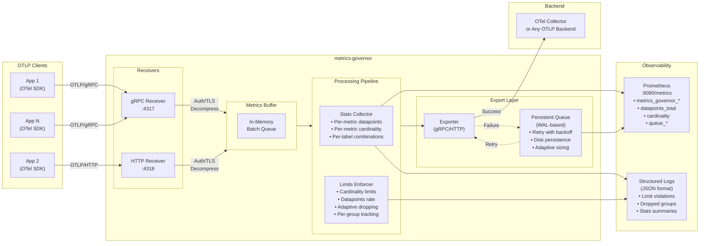
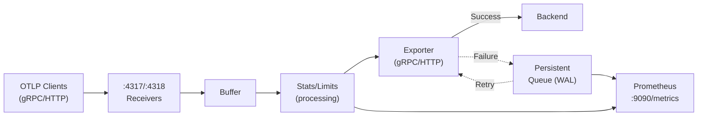
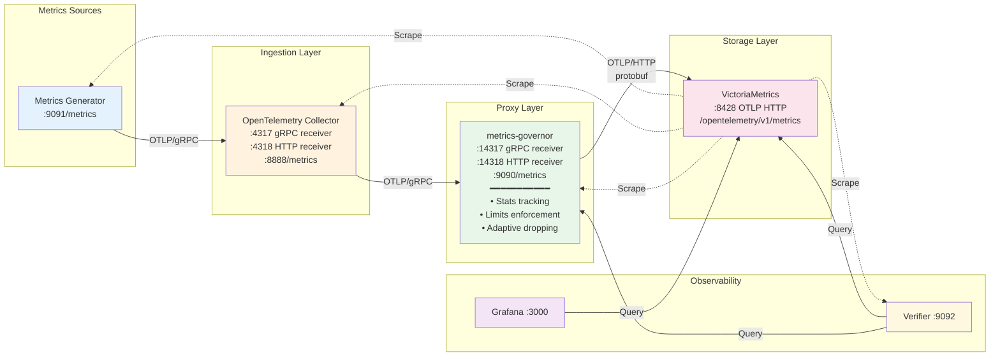

# metrics-governor

[](https://go.dev/)
[](LICENSE)
[](https://github.com/szibis/metrics-governor/actions)
[](https://github.com/szibis/metrics-governor)

---

## Overview

**metrics-governor** is a high-performance OTLP metrics proxy designed to sit between your applications and your metrics backend (like OpenTelemetry Collector, Prometheus, or any OTLP-compatible system). It provides intelligent traffic management, cardinality control, and observability for your metrics pipeline.

### Why metrics-governor?

Modern observability platforms often struggle with:
- **Cardinality explosions** - High-cardinality labels (like user IDs, request IDs) can overwhelm your metrics backend
- **Unpredictable costs** - Cloud metrics services charge by datapoints; runaway metrics mean runaway bills
- **Lack of visibility** - Hard to know which services or metrics are consuming the most resources
- **All-or-nothing limits** - Traditional approaches either drop everything or nothing

metrics-governor solves these problems with **adaptive limiting** - it intelligently identifies and drops only the worst offenders while preserving valuable metrics from well-behaved services.

### Key Capabilities

| Capability | Description |
|------------|-------------|
| **OTLP Protocol Support** | Full gRPC and HTTP receiver/exporter with TLS and authentication |
| **Intelligent Buffering** | Configurable buffer with batching for optimal throughput |
| **Adaptive Limits** | Per-group tracking with smart dropping of top offenders only |
| **Real-time Statistics** | Per-metric cardinality, datapoints, and limit violation tracking |
| **Prometheus Integration** | Native `/metrics` endpoint for monitoring the proxy itself |
| **Production Ready** | Helm chart, multi-arch Docker images, graceful shutdown |

### Architecture Diagram



### Data Flow

1. **Ingestion** - Applications send OTLP metrics via gRPC (`:4317`) or HTTP (`:4318`)
2. **Authentication** - Optional bearer token or basic auth validation
3. **Decompression** - Automatic decompression of gzip, zstd, snappy, lz4 payloads
4. **Buffering** - Metrics are queued in a configurable in-memory buffer
5. **Statistics** - Every metric is analyzed for cardinality and datapoint tracking
6. **Limits Enforcement** - Rules are evaluated; top offenders are adaptively dropped
7. **Batching** - Metrics are batched for efficient export
8. **Export** - Batches are sent to the OTLP backend via gRPC or HTTP
9. **Observability** - Stats exposed via Prometheus endpoint and structured logs

### Quick Example

```bash
# Start metrics-governor with adaptive limits
metrics-governor \
  -exporter-endpoint otel-collector:4317 \
  -limits-config limits.yaml \
  -limits-dry-run=false \
  -stats-labels service,env

# Your apps send metrics to metrics-governor instead of directly to collector
# App: export OTEL_EXPORTER_OTLP_ENDPOINT=http://metrics-governor:4317
```

```yaml
# limits.yaml - Adaptive limiting by service
rules:
  - name: "per-service-limits"
    match:
      labels:
        service: "*"
    max_cardinality: 10000
    max_datapoints_rate: 100000
    action: adaptive
    group_by: ["service"]
```

When cardinality exceeds 10,000, metrics-governor identifies which service is the top contributor and drops only that service's metrics, preserving data from well-behaved services.

## Table of Contents

- [Overview](#overview)
  - [Why metrics-governor?](#why-metrics-governor)
  - [Key Capabilities](#key-capabilities)
  - [Architecture Diagram](#architecture-diagram)
  - [Data Flow](#data-flow)
  - [Quick Example](#quick-example)
- [Features](#features)
- [Installation](#installation)
  - [From source](#from-source)
  - [Build from source](#build-from-source)
  - [Multi-platform builds](#multi-platform-builds)
  - [Docker](#docker)
  - [Helm Chart](#helm-chart)
- [Configuration](#configuration)
  - [YAML Configuration File](#yaml-configuration-file)
  - [CLI Flags](#cli-flags)
  - [Configuration Priority](#configuration-priority)
- [Usage](#usage)
  - [Options](#options)
  - [Examples](#examples)
  - [Docker](#docker-1)
- [TLS Configuration](#tls-configuration)
  - [Receiver TLS (Server-side)](#receiver-tls-server-side)
  - [Exporter TLS (Client-side)](#exporter-tls-client-side)
- [Authentication](#authentication)
  - [Receiver Authentication](#receiver-authentication)
  - [Exporter Authentication](#exporter-authentication)
- [Compression](#compression)
  - [Supported Algorithms](#supported-algorithms)
  - [Compression Levels](#compression-levels)
- [HTTP Settings](#http-settings)
  - [HTTP Client Settings (Exporter)](#http-client-settings-exporter)
  - [HTTP Server Settings (Receiver)](#http-server-settings-receiver)
- [Statistics](#statistics)
  - [Prometheus Metrics Endpoint](#prometheus-metrics-endpoint)
  - [Periodic Logging](#periodic-logging)
- [Logging](#logging)
- [Limits Configuration](#limits-configuration)
  - [Configuration Structure](#configuration-structure)
  - [Actions](#actions)
  - [Adaptive Limiting (Recommended)](#adaptive-limiting-recommended)
  - [Matching Rules](#matching-rules)
  - [Dry Run Mode](#dry-run-mode)
  - [Action Examples](#action-examples)
- [Architecture](#architecture)
- [Development](#development)
  - [Running Tests](#running-tests)
  - [Project Structure](#project-structure)
- [Testing](#testing)
  - [Test Environment Architecture](#test-environment-architecture)
  - [Components](#components)
  - [Quick Start](#quick-start)
  - [Available Endpoints](#available-endpoints)
  - [Grafana Dashboard](#grafana-dashboard)
  - [Running Integration Tests](#running-integration-tests)
  - [Test Scenarios](#test-scenarios)
  - [Useful Commands](#useful-commands)
  - [Verifier Output](#verifier-output)
  - [Troubleshooting](#troubleshooting)
- [License](#license)

## Features

- **OTLP Receivers:**
  - gRPC receiver (default: `:4317`)
  - HTTP receiver (default: `:4318`)
  - TLS/mTLS support for secure connections
  - Bearer token and basic authentication
  - Automatic decompression (gzip, zstd, snappy, zlib, deflate, lz4)
  - Configurable server timeouts
- **OTLP Exporters:**
  - gRPC exporter (default)
  - HTTP exporter (configurable via `-exporter-protocol http`)
  - TLS/mTLS support for secure connections
  - Bearer token, basic auth, and custom headers
  - Compression support (gzip, zstd, snappy, zlib, deflate, lz4)
  - Configurable connection pooling and HTTP/2 settings
- **Metrics Processing:**
  - Configurable metrics buffering
  - Batch export with configurable size
  - Graceful shutdown with final flush
- **Limits enforcement:**
  - Configurable datapoints rate and cardinality limits
  - Per-metric and per-label-combination rules
  - Regex and wildcard matching
  - Actions: log (dry-run), adaptive, drop
  - Prometheus metrics for limit violations
- **Metrics statistics tracking:**
  - Per-metric datapoints and cardinality
  - Per-label-combination stats (configurable labels)
  - Prometheus `/metrics` endpoint for scraping
  - Periodic global stats logging (every 30s)
- **Operations:**
  - JSON structured logging
  - Helm chart for Kubernetes deployment

## Installation

### From source

```bash
go install ./cmd/metrics-governor
```

### Build from source

```bash
git clone <repository-url>
cd metrics-governor
make build
```

### Multi-platform builds

```bash
make all  # Builds darwin-arm64, linux-arm64, linux-amd64
```

Binaries are output to `bin/` directory.

### Docker

```bash
make docker
# or
docker build -t metrics-governor .
```

### Helm Chart

```bash
# Install from local chart
helm install metrics-governor ./helm/metrics-governor

# Install with custom values
helm install metrics-governor ./helm/metrics-governor \
  --set config.exporterEndpoint=otel-collector:4317 \
  --set limits.enabled=true \
  --set serviceMonitor.enabled=true

# Install as StatefulSet with persistence
helm install metrics-governor ./helm/metrics-governor \
  --set kind=statefulset \
  --set persistence.enabled=true \
  --set persistence.size=10Gi

# Install as DaemonSet
helm install metrics-governor ./helm/metrics-governor \
  --set kind=daemonset \
  --set hostNetwork=true
```

See [helm/metrics-governor/values.yaml](helm/metrics-governor/values.yaml) for all available options.

## Configuration

metrics-governor supports two configuration methods:
1. **YAML configuration file** (recommended for complex setups)
2. **CLI flags** (for simple setups or quick overrides)

### YAML Configuration File

Use the `-config` flag to specify a YAML configuration file:

```bash
metrics-governor -config /etc/metrics-governor/config.yaml
```

Example configuration file:

```yaml
receiver:
  grpc:
    address: ":4317"
  http:
    address: ":4318"
    server:
      max_request_body_size: 10485760  # 10MB
      read_header_timeout: 30s
      write_timeout: 1m
  tls:
    enabled: true
    cert_file: "/etc/tls/server.crt"
    key_file: "/etc/tls/server.key"

exporter:
  endpoint: "otel-collector:4317"
  protocol: "grpc"
  insecure: false
  timeout: 60s
  tls:
    enabled: true
    ca_file: "/etc/tls/ca.crt"
  compression:
    type: "gzip"
    level: 6

buffer:
  size: 50000
  batch_size: 2000
  flush_interval: 10s

stats:
  address: ":9090"
  labels:
    - service
    - env

limits:
  dry_run: false
```

See [examples/config.yaml](examples/config.yaml) for a complete example with all options documented.

Additional example configs:
- [examples/config-minimal.yaml](examples/config-minimal.yaml) - Minimal configuration
- [examples/config-production.yaml](examples/config-production.yaml) - Production-ready settings

### CLI Flags

All settings can also be configured via CLI flags. See [Options](#options) below for the complete list.

### Configuration Priority

When both YAML config and CLI flags are used, the priority is:

1. **CLI flags** (highest priority) - explicitly set flags override config file
2. **YAML config file** - values from the config file
3. **Built-in defaults** (lowest priority)

Example combining config file with CLI override:

```bash
# Use config file but override the exporter endpoint
metrics-governor -config config.yaml -exporter-endpoint otel:4317
```

## Usage

```bash
metrics-governor [OPTIONS]
```

### Options

**Configuration:**

| Flag | Default | Description |
|------|---------|-------------|
| `-config` | | Path to YAML configuration file |

**Receiver Options:**

| Flag | Default | Description |
|------|---------|-------------|
| `-grpc-listen` | `:4317` | gRPC receiver listen address |
| `-http-listen` | `:4318` | HTTP receiver listen address |
| `-receiver-tls-enabled` | `false` | Enable TLS for receivers |
| `-receiver-tls-cert` | | Path to server certificate file |
| `-receiver-tls-key` | | Path to server private key file |
| `-receiver-tls-ca` | | Path to CA certificate for client verification (mTLS) |
| `-receiver-tls-client-auth` | `false` | Require client certificates (mTLS) |
| `-receiver-auth-enabled` | `false` | Enable authentication for receivers |
| `-receiver-auth-bearer-token` | | Expected bearer token for authentication |
| `-receiver-auth-basic-username` | | Basic auth username |
| `-receiver-auth-basic-password` | | Basic auth password |

**Exporter Options:**

| Flag | Default | Description |
|------|---------|-------------|
| `-exporter-endpoint` | `localhost:4317` | OTLP exporter endpoint |
| `-exporter-protocol` | `grpc` | Exporter protocol: `grpc` or `http` |
| `-exporter-insecure` | `true` | Use insecure connection for exporter |
| `-exporter-timeout` | `30s` | Exporter request timeout |
| `-exporter-tls-enabled` | `false` | Enable custom TLS config for exporter |
| `-exporter-tls-cert` | | Path to client certificate file (mTLS) |
| `-exporter-tls-key` | | Path to client private key file (mTLS) |
| `-exporter-tls-ca` | | Path to CA certificate for server verification |
| `-exporter-tls-skip-verify` | `false` | Skip TLS certificate verification |
| `-exporter-tls-server-name` | | Override server name for TLS verification |
| `-exporter-auth-bearer-token` | | Bearer token to send with requests |
| `-exporter-auth-basic-username` | | Basic auth username |
| `-exporter-auth-basic-password` | | Basic auth password |
| `-exporter-auth-headers` | | Custom headers (format: `key1=value1,key2=value2`) |

**Exporter Compression Options (HTTP only):**

| Flag | Default | Description |
|------|---------|-------------|
| `-exporter-compression` | `none` | Compression type: `none`, `gzip`, `zstd`, `snappy`, `zlib`, `deflate`, `lz4` |
| `-exporter-compression-level` | `0` | Compression level (algorithm-specific, 0 for default) |

**Exporter HTTP Client Options:**

| Flag | Default | Description |
|------|---------|-------------|
| `-exporter-max-idle-conns` | `100` | Maximum idle connections across all hosts |
| `-exporter-max-idle-conns-per-host` | `100` | Maximum idle connections per host |
| `-exporter-max-conns-per-host` | `0` | Maximum total connections per host (0 = no limit) |
| `-exporter-idle-conn-timeout` | `90s` | Idle connection timeout |
| `-exporter-disable-keep-alives` | `false` | Disable HTTP keep-alives |
| `-exporter-force-http2` | `false` | Force HTTP/2 for non-TLS connections |
| `-exporter-http2-read-idle-timeout` | `0` | HTTP/2 read idle timeout for health checks |
| `-exporter-http2-ping-timeout` | `0` | HTTP/2 ping timeout |

**Receiver HTTP Server Options:**

| Flag | Default | Description |
|------|---------|-------------|
| `-receiver-max-request-body-size` | `0` | Maximum request body size in bytes (0 = no limit) |
| `-receiver-read-timeout` | `0` | HTTP server read timeout (0 = no timeout) |
| `-receiver-read-header-timeout` | `1m` | HTTP server read header timeout |
| `-receiver-write-timeout` | `30s` | HTTP server write timeout |
| `-receiver-idle-timeout` | `1m` | HTTP server idle timeout |
| `-receiver-keep-alives-enabled` | `true` | Enable HTTP keep-alives for receiver |

**Buffer Options:**

| Flag | Default | Description |
|------|---------|-------------|
| `-buffer-size` | `10000` | Maximum number of metrics to buffer |
| `-flush-interval` | `5s` | Buffer flush interval |
| `-batch-size` | `1000` | Maximum batch size for export |

**Stats Options:**

| Flag | Default | Description |
|------|---------|-------------|
| `-stats-addr` | `:9090` | Stats/metrics HTTP endpoint address |
| `-stats-labels` | | Comma-separated labels to track (e.g., `service,env,cluster`) |

**Limits Options:**

| Flag | Default | Description |
|------|---------|-------------|
| `-limits-config` | | Path to limits configuration YAML file |
| `-limits-dry-run` | `true` | Dry run mode: log violations but don't drop/sample |

**General:**

| Flag | Description |
|------|-------------|
| `-h`, `-help` | Show help message |
| `-v`, `-version` | Show version |

### Examples

```bash
# Start with default settings
metrics-governor

# Use YAML configuration file
metrics-governor -config /etc/metrics-governor/config.yaml

# Use config file with CLI overrides
metrics-governor -config config.yaml -exporter-endpoint otel:4317

# Custom receiver ports
metrics-governor -grpc-listen :5317 -http-listen :5318

# Forward to remote gRPC endpoint
metrics-governor -exporter-endpoint otel-collector:4317

# Forward to remote HTTP endpoint
metrics-governor -exporter-endpoint otel-collector:4318 -exporter-protocol http

# Adjust buffering
metrics-governor -buffer-size 50000 -flush-interval 10s -batch-size 2000

# Enable stats tracking by service, environment and cluster
metrics-governor -stats-labels service,env,cluster

# Enable TLS for receivers
metrics-governor -receiver-tls-enabled \
    -receiver-tls-cert /etc/certs/server.crt \
    -receiver-tls-key /etc/certs/server.key

# Enable mTLS for receivers
metrics-governor -receiver-tls-enabled \
    -receiver-tls-cert /etc/certs/server.crt \
    -receiver-tls-key /etc/certs/server.key \
    -receiver-tls-ca /etc/certs/ca.crt \
    -receiver-tls-client-auth

# Enable bearer token authentication for receivers
metrics-governor -receiver-auth-enabled \
    -receiver-auth-bearer-token "secret-token"

# Connect to secure exporter with custom CA
metrics-governor -exporter-insecure=false \
    -exporter-tls-enabled \
    -exporter-tls-ca /etc/certs/ca.crt

# Connect to exporter with bearer token
metrics-governor -exporter-auth-bearer-token "secret-token"

# Enable gzip compression for HTTP exporter
metrics-governor -exporter-protocol http \
    -exporter-endpoint otel-collector:4318 \
    -exporter-compression gzip

# Enable zstd compression with best compression level
metrics-governor -exporter-protocol http \
    -exporter-compression zstd \
    -exporter-compression-level 11

# Configure HTTP client connection pool
metrics-governor -exporter-protocol http \
    -exporter-max-idle-conns 200 \
    -exporter-max-idle-conns-per-host 50 \
    -exporter-idle-conn-timeout 2m

# Configure HTTP receiver server timeouts
metrics-governor -receiver-read-timeout 30s \
    -receiver-write-timeout 1m \
    -receiver-max-request-body-size 10485760

# Enable limits enforcement (dry-run by default)
metrics-governor -limits-config /etc/metrics-governor/limits.yaml

# Enable limits enforcement with actual drop/sample
metrics-governor -limits-config /etc/metrics-governor/limits.yaml -limits-dry-run=false
```

### Docker

```bash
docker run -p 4317:4317 -p 4318:4318 -p 9090:9090 metrics-governor \
  -exporter-endpoint otel-collector:4317 \
  -stats-labels service,env,cluster
```

## TLS Configuration

metrics-governor supports TLS for both receivers (server-side) and exporters (client-side), including mutual TLS (mTLS) for certificate-based authentication.

### Receiver TLS (Server-side)

Enable TLS for incoming connections on both gRPC and HTTP receivers:

```bash
# Basic TLS
metrics-governor -receiver-tls-enabled \
    -receiver-tls-cert /etc/certs/server.crt \
    -receiver-tls-key /etc/certs/server.key

# mTLS (require client certificates)
metrics-governor -receiver-tls-enabled \
    -receiver-tls-cert /etc/certs/server.crt \
    -receiver-tls-key /etc/certs/server.key \
    -receiver-tls-ca /etc/certs/ca.crt \
    -receiver-tls-client-auth
```

### Exporter TLS (Client-side)

Enable TLS for outgoing connections to the OTLP backend:

```bash
# Secure connection with system CA
metrics-governor -exporter-insecure=false

# Custom CA certificate
metrics-governor -exporter-insecure=false \
    -exporter-tls-enabled \
    -exporter-tls-ca /etc/certs/ca.crt

# mTLS (client certificate)
metrics-governor -exporter-insecure=false \
    -exporter-tls-enabled \
    -exporter-tls-cert /etc/certs/client.crt \
    -exporter-tls-key /etc/certs/client.key \
    -exporter-tls-ca /etc/certs/ca.crt

# Skip certificate verification (not recommended for production)
metrics-governor -exporter-insecure=false \
    -exporter-tls-enabled \
    -exporter-tls-skip-verify
```

## Authentication

metrics-governor supports bearer token and basic authentication for both receivers and exporters.

### Receiver Authentication

Require authentication for incoming connections:

```bash
# Bearer token authentication
metrics-governor -receiver-auth-enabled \
    -receiver-auth-bearer-token "your-secret-token"

# Basic authentication
metrics-governor -receiver-auth-enabled \
    -receiver-auth-basic-username "user" \
    -receiver-auth-basic-password "password"
```

Clients must include the appropriate `Authorization` header:
- Bearer token: `Authorization: Bearer your-secret-token`
- Basic auth: `Authorization: Basic <base64(user:password)>`

### Exporter Authentication

Authenticate when connecting to the OTLP backend:

```bash
# Bearer token authentication
metrics-governor -exporter-auth-bearer-token "your-secret-token"

# Basic authentication
metrics-governor -exporter-auth-basic-username "user" \
    -exporter-auth-basic-password "password"

# Custom headers (e.g., API keys)
metrics-governor -exporter-auth-headers "X-API-Key=your-api-key,X-Tenant-ID=tenant123"
```

## Compression

metrics-governor supports compression for HTTP exporters and automatic decompression for HTTP receivers. Compression can significantly reduce network bandwidth, especially for high-volume metrics.

### Supported Algorithms

| Algorithm | Content-Encoding | Description |
|-----------|------------------|-------------|
| `gzip` | `gzip` | Standard gzip compression, widely supported |
| `zstd` | `zstd` | Zstandard compression, excellent ratio and speed |
| `snappy` | `snappy` | Fast compression with moderate ratio |
| `zlib` | `zlib` | Zlib compression (similar to gzip) |
| `deflate` | `deflate` | Raw deflate compression |
| `lz4` | `lz4` | Very fast compression with lower ratio |

### Compression Levels

Each algorithm supports different compression levels:

| Algorithm | Levels | Description |
|-----------|--------|-------------|
| **gzip/zlib/deflate** | 1-9, -1 | 1 = fastest, 9 = best compression, -1 = default |
| **zstd** | 1, 3, 6, 11 | 1 = fastest, 3 = default, 6 = better, 11 = best |
| **snappy** | N/A | No compression levels supported |
| **lz4** | N/A | Uses default compression |

**Usage Examples:**

```bash
# Enable gzip compression (default level)
metrics-governor -exporter-protocol http \
    -exporter-compression gzip

# Enable gzip with best compression
metrics-governor -exporter-protocol http \
    -exporter-compression gzip \
    -exporter-compression-level 9

# Enable zstd with default level
metrics-governor -exporter-protocol http \
    -exporter-compression zstd

# Enable zstd with best compression
metrics-governor -exporter-protocol http \
    -exporter-compression zstd \
    -exporter-compression-level 11

# Enable snappy for fast compression
metrics-governor -exporter-protocol http \
    -exporter-compression snappy
```

**Receiver Decompression:**

The HTTP receiver automatically decompresses incoming requests based on the `Content-Encoding` header. Supported encodings:
- `gzip`, `x-gzip`
- `zstd`
- `snappy`, `x-snappy-framed`
- `zlib`
- `deflate`
- `lz4`

## HTTP Settings

### HTTP Client Settings (Exporter)

Configure the HTTP client connection pool for optimal performance:

```bash
# Increase connection pool for high-throughput scenarios
metrics-governor -exporter-protocol http \
    -exporter-max-idle-conns 200 \
    -exporter-max-idle-conns-per-host 100 \
    -exporter-max-conns-per-host 100 \
    -exporter-idle-conn-timeout 2m

# Disable keep-alives (new connection for each request)
metrics-governor -exporter-protocol http \
    -exporter-disable-keep-alives

# Enable HTTP/2 with health checks
metrics-governor -exporter-protocol http \
    -exporter-force-http2 \
    -exporter-http2-read-idle-timeout 30s \
    -exporter-http2-ping-timeout 10s
```

**Connection Pool Settings:**

| Setting | Default | Description |
|---------|---------|-------------|
| `max-idle-conns` | 100 | Maximum idle connections across all hosts |
| `max-idle-conns-per-host` | 100 | Maximum idle connections per host |
| `max-conns-per-host` | 0 | Maximum total connections per host (0 = unlimited) |
| `idle-conn-timeout` | 90s | Time before idle connections are closed |
| `disable-keep-alives` | false | Force new connection per request |

**HTTP/2 Settings:**

| Setting | Default | Description |
|---------|---------|-------------|
| `force-http2` | false | Enable HTTP/2 for non-TLS connections |
| `http2-read-idle-timeout` | 0 | Idle time before sending health check ping |
| `http2-ping-timeout` | 0 | Timeout waiting for ping response |

### HTTP Server Settings (Receiver)

Configure the HTTP receiver server timeouts for security and resource management:

```bash
# Configure server timeouts
metrics-governor -receiver-read-timeout 30s \
    -receiver-read-header-timeout 10s \
    -receiver-write-timeout 1m \
    -receiver-idle-timeout 2m

# Limit request body size (10MB)
metrics-governor -receiver-max-request-body-size 10485760

# Disable keep-alives for the server
metrics-governor -receiver-keep-alives-enabled=false
```

**Server Timeout Settings:**

| Setting | Default | Description |
|---------|---------|-------------|
| `read-timeout` | 0 | Max time to read entire request (0 = no limit) |
| `read-header-timeout` | 1m | Max time to read request headers |
| `write-timeout` | 30s | Max time to write response |
| `idle-timeout` | 1m | Max time to wait for next request (keep-alive) |
| `max-request-body-size` | 0 | Max request body size in bytes (0 = no limit) |
| `keep-alives-enabled` | true | Enable HTTP keep-alives |

## Statistics

### Prometheus Metrics Endpoint

Stats are exposed on `:9090/metrics` (configurable via `-stats-addr`):

```bash
curl localhost:9090/metrics
```

**Exposed metrics:**

| Metric | Type | Description |
|--------|------|-------------|
| `metrics_governor_datapoints_total` | counter | Total datapoints processed |
| `metrics_governor_metrics_total` | gauge | Total unique metric names |
| `metrics_governor_metric_datapoints_total{metric_name="..."}` | counter | Datapoints per metric name |
| `metrics_governor_metric_cardinality{metric_name="..."}` | gauge | Cardinality (unique series) per metric name |
| `metrics_governor_label_datapoints_total{service="...",env="..."}` | counter | Datapoints per label combination |
| `metrics_governor_label_cardinality{service="...",env="..."}` | gauge | Cardinality per label combination |
| `metrics_governor_limit_datapoints_exceeded_total{rule="..."}` | counter | Times datapoints rate limit was exceeded |
| `metrics_governor_limit_cardinality_exceeded_total{rule="..."}` | counter | Times cardinality limit was exceeded |
| `metrics_governor_limit_datapoints_dropped_total{rule="..."}` | counter | Datapoints dropped due to limits |
| `metrics_governor_limit_datapoints_passed_total{rule="..."}` | counter | Datapoints passed through (within limits) |

### Periodic Logging

Global stats are logged every 30 seconds in JSON format:

```json
{"timestamp":"2024-01-26T12:00:00Z","level":"info","message":"stats","fields":{"datapoints_total":1234567,"unique_metrics":42,"total_cardinality":8901}}
```

This includes:
- **datapoints_total**: Cumulative count of all datapoints processed
- **unique_metrics**: Number of unique metric names seen
- **total_cardinality**: Sum of unique series across all metrics

## Logging

All logs are output in JSON format for easy parsing and integration with log aggregation systems:

```json
{"timestamp":"2024-01-26T12:00:00Z","level":"info","message":"metrics-governor started","fields":{"grpc_addr":":4317","http_addr":":4318","exporter_endpoint":"localhost:4317","stats_addr":":9090"}}
{"timestamp":"2024-01-26T12:00:00Z","level":"info","message":"gRPC receiver started","fields":{"addr":":4317"}}
{"timestamp":"2024-01-26T12:00:00Z","level":"info","message":"HTTP receiver started","fields":{"addr":":4318"}}
{"timestamp":"2024-01-26T12:00:00Z","level":"info","message":"stats endpoint started","fields":{"addr":":9090","path":"/metrics"}}
{"timestamp":"2024-01-26T12:00:30Z","level":"info","message":"stats","fields":{"datapoints_total":1000,"unique_metrics":10,"total_cardinality":150}}
```

**Log levels:**
- `info` - Normal operational messages
- `warn` - Warning conditions
- `error` - Error conditions
- `fatal` - Fatal errors (application exits)

## Limits Configuration

Limits are configured via a YAML file specified with `-limits-config`. See [examples/limits.yaml](examples/limits.yaml) for a complete example.

### Configuration Structure

```yaml
defaults:
  max_datapoints_rate: 1000000  # per minute
  max_cardinality: 100000
  action: log                   # log, adaptive, or drop

rules:
  - name: "rule-name"
    match:
      metric_name: "http_request_.*"  # regex pattern (optional)
      labels:                          # label matching (optional)
        service: "payment-api"         # exact match
        env: "*"                       # wildcard - any value
    max_datapoints_rate: 50000        # per minute, 0 = no limit
    max_cardinality: 2000             # 0 = no limit
    action: adaptive                  # log, adaptive, or drop
    group_by: ["service", "env"]      # labels for adaptive grouping
```

### Actions

| Action | Description |
|--------|-------------|
| `log` | Log violation but pass through all data (default, safe for dry-run) |
| `adaptive` | **Intelligent limiting**: Track per-group stats, drop only top offenders to stay within limits |
| `drop` | Drop all data when limit exceeded (nuclear option) |

### Adaptive Limiting (Recommended)

The `adaptive` action is the key feature of metrics-governor. Instead of dropping all metrics or randomly sampling, it:

1. **Tracks statistics per group** defined by `group_by` labels
2. **Identifies top offenders** when limits are exceeded
3. **Drops only the worst groups** to bring totals within limits
4. **Preserves smaller contributors** that are within reasonable bounds

This ensures you get maximum data delivery while staying within your cardinality and datapoints budgets.

#### How Adaptive Works

```
Example: max_cardinality: 1000, group_by: ["service"]

Current state:
  - service=api-a:     400 series  (40%)
  - service=api-b:     300 series  (30%)
  - service=api-c:     200 series  (20%)
  - service=legacy:    500 series  (50%)  <- TOP OFFENDER
                      -----
  Total:             1400 series (over limit by 400)

Adaptive action:
  1. Sort groups by contribution (descending): legacy(500), api-a(400), api-b(300), api-c(200)
  2. Mark "legacy" for dropping (500 >= 400 excess)
  3. Keep api-a, api-b, api-c (within limit now: 900 series)

Result: Only legacy service metrics are dropped for this window
```

### Matching Rules

- **metric_name**: Exact match or regex pattern (e.g., `http_request_.*`)
- **labels**: Key-value pairs where `*` matches any value
- **group_by**: Labels to use for tracking groups (required for adaptive)
- Rules are evaluated in order; first match wins

### Dry Run Mode

By default, limits run in dry-run mode (`-limits-dry-run=true`). This logs all violations but doesn't actually drop data. Use this to:

1. Understand your metrics cardinality before enforcing limits
2. Tune limit thresholds based on actual traffic
3. Safely test limit configurations in production

To enable actual enforcement:

```bash
metrics-governor -limits-config limits.yaml -limits-dry-run=false
```

### Action Examples

#### Adaptive Action (Intelligent Limiting)

Use `action: adaptive` to intelligently drop only the top offenders while preserving smaller contributors.

```yaml
rules:
  - name: "adaptive-by-service"
    match:
      labels:
        env: "prod"
        service: "*"
    max_datapoints_rate: 100000
    max_cardinality: 5000
    action: adaptive
    group_by: ["service"]  # Track and limit per service
```

**Log output when adaptive limiting kicks in:**
```json
{"timestamp":"2024-01-26T12:00:00Z","level":"warn","message":"limit exceeded","fields":{"rule":"adaptive-by-service","metric":"http_requests_total","group":"service=legacy-app","reason":"cardinality","action":"adaptive","dry_run":false,"datapoints":100}}
{"timestamp":"2024-01-26T12:00:00Z","level":"info","message":"adaptive: marked group for dropping","fields":{"rule":"adaptive-by-service","group":"service=legacy-app","reason":"cardinality","contribution_datapoints":5000,"contribution_cardinality":3000}}
```

**Prometheus metrics exposed:**
```
metrics_governor_limit_cardinality_exceeded_total{rule="adaptive-by-service"} 42
metrics_governor_limit_datapoints_dropped_total{rule="adaptive-by-service"} 5000
metrics_governor_limit_datapoints_passed_total{rule="adaptive-by-service"} 95000
metrics_governor_limit_groups_dropped_total{rule="adaptive-by-service"} 2
metrics_governor_rule_current_cardinality{rule="adaptive-by-service"} 4500
metrics_governor_rule_groups_total{rule="adaptive-by-service"} 15
metrics_governor_rule_dropped_groups_total{rule="adaptive-by-service"} 2
```

#### Log Action (Monitoring Only)

Use `action: log` to monitor limit violations without affecting data flow.

```yaml
rules:
  - name: "monitor-only"
    match:
      metric_name: "http_request_duration_.*"
    max_cardinality: 5000
    action: log
```

#### Drop Action (Hard Limit)

Use `action: drop` when you want to completely block metrics that exceed limits. Use sparingly.

```yaml
rules:
  - name: "block-known-bad"
    match:
      metric_name: "known_problematic_metric"
    max_cardinality: 100
    action: drop
```

#### Combined Example

A complete configuration using adaptive limiting as the primary strategy:

```yaml
defaults:
  max_datapoints_rate: 1000000
  max_cardinality: 100000
  action: log  # Safe default

rules:
  # Production: Adaptive limiting by service
  - name: "prod-service-limits"
    match:
      labels:
        env: "prod"
        service: "*"
    max_datapoints_rate: 100000
    max_cardinality: 5000
    action: adaptive
    group_by: ["service"]

  # HTTP metrics: Adaptive by service+endpoint
  - name: "http-endpoint-limits"
    match:
      metric_name: "http_request_.*"
    max_cardinality: 2000
    action: adaptive
    group_by: ["service", "endpoint"]

  # Legacy apps: Strict adaptive control
  - name: "legacy-limits"
    match:
      metric_name: "legacy_.*"
    max_cardinality: 100
    action: adaptive
    group_by: ["service", "env"]

  # Dev: Just monitor
  - name: "dev-monitor"
    match:
      labels:
        env: "dev"
    max_datapoints_rate: 500000
    max_cardinality: 50000
    action: log
```

## Architecture

See the [detailed architecture diagram](#architecture-diagram) in the Overview section for a comprehensive view of the system.

**Simplified flow:**



**Components:**
- **Receivers** - Accept OTLP metrics via gRPC and HTTP with TLS/auth support
- **Buffer** - In-memory queue with configurable size and batch settings
- **Stats Collector** - Tracks per-metric cardinality and datapoints
- **Limits Enforcer** - Applies adaptive limiting rules
- **Exporter** - Sends batched metrics to OTLP backend
- **Persistent Queue** - WAL-based durable queue for retry on export failures

## Development

### Running Tests

```bash
# Run all tests
make test

# Run tests with verbose output
make test-verbose

# Run tests with coverage report
make test-coverage
```

Coverage report is generated at `bin/coverage.html`.

### Project Structure

```
metrics-governor/
├── cmd/metrics-governor/    # Main application entry point
├── internal/
│   ├── auth/                # Authentication (bearer token, basic auth)
│   ├── buffer/              # Metrics buffering and batching
│   ├── compression/         # Compression support (gzip, zstd, etc.)
│   ├── config/              # Configuration management
│   ├── exporter/            # OTLP gRPC and HTTP exporters
│   ├── limits/              # Limits enforcement (adaptive, drop, log)
│   ├── logging/             # JSON structured logging
│   ├── queue/               # WAL-based persistent queue for retries
│   ├── receiver/            # gRPC and HTTP receivers
│   ├── stats/               # Statistics collection
│   └── tls/                 # TLS configuration utilities
├── helm/metrics-governor/   # Helm chart for Kubernetes
├── examples/                # Example configuration files
├── test/                    # Integration test environment
├── bin/                     # Build output directory
├── Dockerfile
├── docker-compose.yaml
└── Makefile
```

## Testing

A comprehensive test environment is provided using Docker Compose with full observability stack including Grafana dashboards, VictoriaMetrics storage, and automated verification.

### Test Environment Architecture

The test environment demonstrates metrics-governor as a **proxy between OpenTelemetry Collector and VictoriaMetrics**:



**Data Flow:**
```
Generator → OTel Collector → metrics-governor → VictoriaMetrics
   (OTLP/gRPC)      (OTLP/gRPC)         (OTLP/HTTP protobuf)
```

This architecture tests metrics-governor as a transparent proxy that:
- Receives OTLP metrics from upstream collectors
- Tracks statistics and enforces limits
- Forwards to VictoriaMetrics using native OTLP HTTP endpoint

### Components

| Service | Ports | Description |
|---------|-------|-------------|
| **otel-collector** | 4317, 4318, 8888 | Receives metrics from generator, forwards to governor |
| **metrics-governor** | 14317, 14318, 9090 | OTLP proxy between collector and VictoriaMetrics |
| **victoriametrics** | 8428 | Storage with OTLP HTTP endpoint (`/opentelemetry/v1/metrics`) |
| **metrics-generator** | 9091 | Test traffic generator |
| **verifier** | 9092 | Automated data flow verification |
| **grafana** | 3000 | Visualization dashboards |

### Quick Start

```bash
# Start the complete test environment
docker compose up --build -d

# Wait for services to initialize
sleep 30

# Open Grafana dashboard
open http://localhost:3000  # Login: admin/admin

# View metrics-governor stats
curl -s localhost:9090/metrics | grep metrics_governor

# View verification status
curl -s localhost:9092/metrics | grep verifier

# View generator stats
curl -s localhost:9091/metrics | grep generator

# Stop all services
docker compose down
```

### Available Endpoints

| Service | Endpoint | Description |
|---------|----------|-------------|
| OTel Collector gRPC | `localhost:4317` | OTLP gRPC receiver (generator sends here) |
| OTel Collector HTTP | `localhost:4318` | OTLP HTTP receiver |
| OTel Collector metrics | `http://localhost:8888/metrics` | Collector internal metrics |
| metrics-governor gRPC | `localhost:14317` | OTLP gRPC receiver (collector sends here) |
| metrics-governor HTTP | `localhost:14318` | OTLP HTTP receiver |
| metrics-governor stats | `http://localhost:9090/metrics` | Governor Prometheus metrics |
| VictoriaMetrics API | `http://localhost:8428` | Query API, UI, and OTLP HTTP endpoint |
| Generator metrics | `http://localhost:9091/metrics` | Generator stats |
| Verifier metrics | `http://localhost:9092/metrics` | Verification stats |
| Grafana | `http://localhost:3000` | Dashboard UI (admin/admin) |

### Grafana Dashboard

The pre-configured dashboard (`metrics-governor.json`) includes three sections:

**Metrics Governor:**
- Datapoints received vs sent (throughput)
- Batches sent over time
- Export errors
- Queue size
- Cardinality tracking

**Generator:**
- Metrics and datapoints per second
- Batch latency (min/avg/max)
- High cardinality metrics count
- Burst events and burst metrics

**Verifier:**
- Verification pass rate
- Last ingestion rate
- VictoriaMetrics time series count
- Export errors observed
- Check status (pass/fail)

### Running Integration Tests

The project includes automated integration tests that verify the complete data flow:

```bash
# Start the test environment
docker compose up -d

# Wait for services to be ready
sleep 30

# Run integration tests (requires -tags=integration)
go test -tags=integration -v ./test/...

# Stop the environment
docker compose down
```

**Integration test coverage:**
- Service health checks for all components
- Metrics flow from generator to VictoriaMetrics
- Metrics-governor stats tracking
- Ingestion rate validation (>90%)
- High cardinality metrics handling
- Verification pass rate (>80%)
- Export error monitoring

### Test Scenarios

The metrics generator creates various test scenarios:

| Scenario | Description | Configuration |
|----------|-------------|---------------|
| **Normal traffic** | HTTP request metrics for services | `SERVICES=payment-api,order-api,...` |
| **High cardinality** | Unique user/session/request IDs | `ENABLE_HIGH_CARDINALITY=true` |
| **Burst traffic** | Periodic traffic spikes | `BURST_SIZE=2000, BURST_INTERVAL_SEC=15` |
| **Edge cases** | Extreme values (0, ±inf, π, e) | `ENABLE_EDGE_CASES=true` |
| **Many datapoints** | Histograms with 15 buckets | Automatic with histograms |

**Environment variables for generator:**

| Variable | Default | Description |
|----------|---------|-------------|
| `OTLP_ENDPOINT` | `metrics-governor:4317` | Target endpoint |
| `METRICS_INTERVAL` | `100ms` | Generation interval |
| `SERVICES` | `payment-api,order-api,...` | Service names |
| `ENVIRONMENTS` | `prod,staging,dev,qa` | Environment labels |
| `ENABLE_EDGE_CASES` | `true` | Include edge case values |
| `ENABLE_HIGH_CARDINALITY` | `true` | Generate high cardinality |
| `ENABLE_BURST_TRAFFIC` | `true` | Enable burst patterns |
| `HIGH_CARDINALITY_COUNT` | `100` | Unique labels per interval |
| `BURST_SIZE` | `2000` | Metrics per burst |
| `BURST_INTERVAL_SEC` | `15` | Seconds between bursts |
| `TARGET_METRICS_PER_SEC` | `1000` | Target throughput |
| `TARGET_DATAPOINTS_PER_SEC` | `10000` | Target datapoints |

### Useful Commands

```bash
# View metrics-governor stats
curl -s localhost:9090/metrics | grep metrics_governor

# Check limit violations
curl -s localhost:9090/metrics | grep limit

# Query VictoriaMetrics for time series count
curl -s 'localhost:8428/api/v1/query?query=count({__name__=~".+"})'

# Query verification counter
curl -s 'localhost:8428/api/v1/query?query=max(generator_verification_counter_total)'

# View verification results
docker compose logs -f verifier

# View metrics-governor logs
docker compose logs -f metrics-governor

# View generator stats
docker compose logs -f metrics-generator

# Check all service health
docker compose ps

# Restart a specific service
docker compose restart metrics-governor

# Scale generator (if needed)
docker compose up -d --scale metrics-generator=2

# Stop all services
docker compose down

# Stop and remove volumes
docker compose down -v
```

### Verifier Output

The verifier logs verification results every 15 seconds:

```
========================================
  VERIFICATION RESULT - PASS
========================================
Timestamp: 2026-01-30T12:00:00Z

VICTORIAMETRICS:
  Total time series:      5000
  Unique metric names:    50
  High cardinality TS:    100
  Verification counter:   1000

METRICS-GOVERNOR:
  Datapoints received:    100000
  Datapoints sent:        98000
  Batches sent:           1000
  Queue size:             0
  Dropped total:          0
  Export errors:          0

VERIFICATION:
  Ingestion rate:         98.00%
  Pass threshold:         95.00%
  Status:                 PASS
  Message:                Ingestion rate 98.00% meets threshold 95.00%
========================================
Running verification: 10/10 checks passed (100.0%)
```

### Troubleshooting

| Issue | Solution |
|-------|----------|
| No metrics in VictoriaMetrics | Check otel-collector logs for errors; verify DNS resolution |
| High export errors | Check network connectivity; increase timeout |
| Verification failing | Check ingestion rate; may need to adjust limits |
| Grafana no data | Wait 30s for metrics to populate; check datasource |
| Generator not starting | Check OTLP_ENDPOINT; wait for metrics-governor |

## License

See [LICENSE](LICENSE) file.
