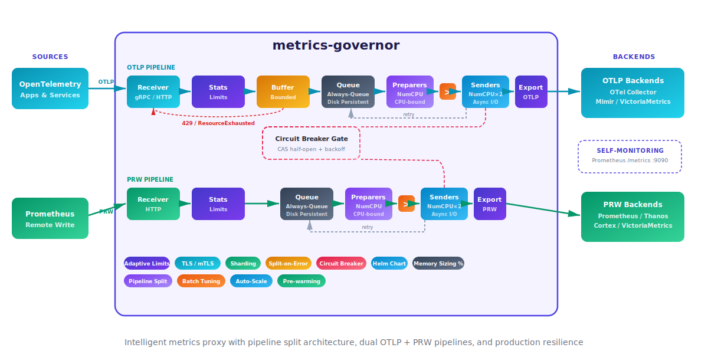
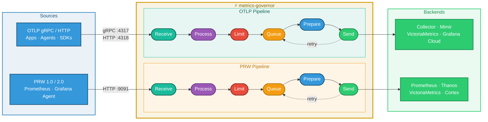
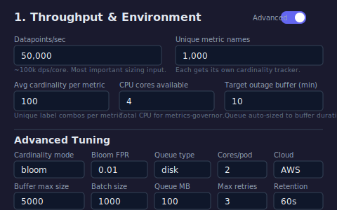
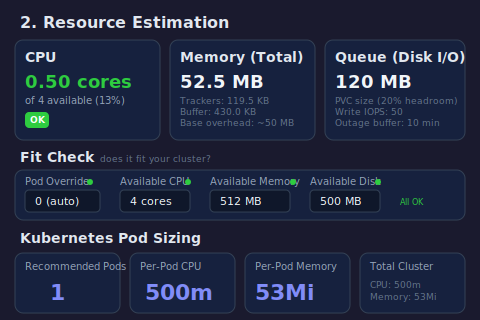
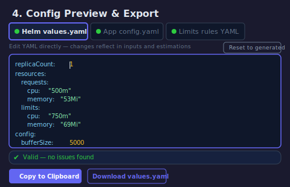
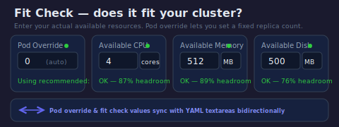

<p align="center">
  
</p>

<h1 align="center">metrics-governor</h1>

<p align="center">

[](https://github.com/szibis/metrics-governor/releases/latest)
[](https://go.dev/)
[](LICENSE)

[](https://github.com/szibis/metrics-governor/actions/workflows/build.yml)
[](https://github.com/szibis/metrics-governor/actions/workflows/security-scan.yml)
[](https://github.com/szibis/metrics-governor/actions/workflows/codeql.yml)

[](docs/testing.md#test-coverage-by-component)
[](https://github.com/szibis/metrics-governor/actions/workflows/build.yml)
[](docs/testing.md)
[](.)
[](docs/)
[](https://github.com/szibis/metrics-governor/actions/workflows/benchmark.yml)

[](docs/receiving.md)
[](docs/receiving.md#prometheus-remote-write-receiver)
[](docs/performance.md)
[](docs/alerting.md)
[](helm/metrics-governor/)
[](dashboards/)
[](https://szibis.github.io/metrics-governor/)

</p>

---

**metrics-governor** is a high-performance metrics governance proxy for **OTLP** and **Prometheus Remote Write**. Drop it between your apps and your backend to control cardinality, transform metrics in-flight, and scale horizontally — with zero data loss.

> **Two native pipelines. Zero conversion. Zero allocation.** OTLP stays OTLP. PRW stays PRW. Each protocol runs its own receive-process-export path with full feature parity, no conversion overhead, and zero-allocation serialization via [vtprotobuf](https://github.com/planetscale/vtprotobuf).

### What's New in v1.0

- **v1.0 stable release** — All 15 deprecated CLI flags, legacy sampling metrics, and backward-compatibility shims removed. Clean, unified API surface with the processing engine handling all operations.
- **vtprotobuf integration** (v0.44) — Zero-allocation protobuf marshal/unmarshal via [PlanetScale vtprotobuf](https://github.com/planetscale/vtprotobuf) with `sync.Pool` message reuse across all OTLP pipelines. Measured **<1% CPU** at 100k dps and **~60 MiB** base memory.
- **sync.Pool memory optimizations** (v0.43) — Pool-based allocation reuse for buffer operations, reducing GC pressure under sustained load.
- **Pipeline stability improvements** (v0.42) — Predictable pipeline behavior under backpressure with improved queue drain ordering.
- **3,100+ tests** — Comprehensive test coverage including vtprotobuf integration, race detector, and parity tests across all packages.

> Migrating from v0.x? All deprecated flags have replacements — see [DEPRECATIONS.md](DEPRECATIONS.md) for the full migration table.

### Universal Governance for Mixed Environments

Whether you're running **legacy Prometheus Remote Write**, migrating to **modern OpenTelemetry**, or operating both in parallel — metrics-governor provides a single governance layer across all your metrics traffic.

- **Bridge old and new** — adopt OTel incrementally while maintaining full control over existing Prometheus infrastructure
- **Same rules, same protection** — cardinality limits, processing rules, and alerting work identically across both protocols
- **Single pane of governance** — one proxy, one config, one set of dashboards for your entire metrics pipeline regardless of protocol mix

## Why metrics-governor?

| Challenge | How metrics-governor Solves It |
|-----------|-------------------------------|
| **Cardinality explosions** crush your backend | [Adaptive limiting](docs/limits.md) identifies and drops only the top offenders — well-behaved services keep flowing |
| **Raw volume** too high for storage budget | [Processing rules](docs/processing-rules.md) sample, downsample, aggregate, classify, transform, or drop metrics before they leave the proxy |
| **Data loss** during backend outages | [Always-queue architecture](docs/resilience.md) with circuit breaker, persistent disk queue, and exponential backoff — zero data loss by default |
| **Single backend** can't keep up | [Consistent sharding](docs/sharding.md) fans out to N backends via K8s DNS discovery with stable hash routing |
| **No visibility** into the metrics pipeline | [Real-time stats](docs/statistics.md), [13 production alerts](docs/alerting.md), [Grafana dashboards](dashboards/), and [dead rule detection](docs/processing-rules.md#dead-rule-detection) |
| **Unpredictable costs** from runaway services | [Per-group tracking](docs/limits.md) with configurable limits, dry-run mode, and ownership labels for team routing |
| **Need team/severity labels** derived from business values | [Transform rules](docs/processing-rules.md) mangle labels — build `severity`, `team`, `env` from product metric names and label values |
| **Elastic-style data reshaping** before storage | [Classify + Transform](docs/processing-rules.md) chain: classify metrics into categories, then transform labels to match your storage schema |
| **Storage explosion** from a single noisy tenant | [Adaptive tenant limits](docs/limits.md) intelligently throttle per-tenant cardinality — protect storage without blanket-dropping good data |
| **Stale rules** pile up unnoticed | [Dead rule detection](docs/processing-rules.md#dead-rule-detection) tracks last-match time for every rule, with alerts for stale cleanup |
| **No team accountability** for metric costs | [Rule ownership labels](docs/processing-rules.md) attach `team`, `slack_channel`, `pagerduty_service` to any rule for alert routing |
| **All-or-nothing** enforcement kills good data | [Tiered escalation](docs/limits.md) with graduated responses: log → sample → strip labels → drop |
| **Complex deployment** planning | [Interactive Playground](https://szibis.github.io/metrics-governor/) generates Helm, app, and limits YAML from your throughput inputs |

---

## Architecture

<p align="center">
  
</p>

<details>
<summary>View as text diagram (Mermaid)</summary>



</details>

Each pipeline runs independently: **Receive** → **Process** → **Limit** → **Queue** → **Prepare** → **Send** → **Backend**. Failed exports retry through the queue with circuit breaker protection.

---

## Features

### Receive — Dual Native Protocols

| Protocol | Ports | Capabilities |
|----------|-------|-------------|
| **OTLP gRPC** | `:4317` | Full `ExportMetricsService`, TLS/mTLS, bearer token, gzip/zstd, vtprotobuf zero-alloc unmarshal |
| **OTLP HTTP** | `:4318` | Protobuf + JSON, gzip/zstd/snappy decompression, content negotiation, vtprotobuf pool reuse |
| **PRW 1.0/2.0** | `:9091` | Auto-detect version, native histograms, VictoriaMetrics mode, exemplars |

Backpressure built in: capacity-bounded buffers return `429` / `ResourceExhausted` when full. [Docs](docs/receiving.md)

**Supported backends:**

| Protocol | Backends |
|----------|----------|
| **OTLP** | OpenTelemetry Collector, Grafana Mimir, Cortex, VictoriaMetrics, ClickHouse, Grafana Cloud |
| **PRW** | Prometheus, VictoriaMetrics, Grafana Mimir, Cortex, Thanos Receive, Amazon Managed Prometheus, GCP Managed Prometheus, Grafana Cloud |

### Process — Unified Rules Engine

Six actions in a single ordered pipeline — first match wins:

| Action | What It Does | Terminal? |
|--------|-------------|:---------:|
| **[Sample](docs/processing-rules.md)** | Stochastic reduction (probabilistic or head-N) | Yes |
| **[Downsample](docs/processing-rules.md)** | Per-series compression — 10 methods incl. adaptive CV-based, LTTB, SDT | Yes |
| **[Aggregate](docs/processing-rules.md)** | Cross-series reduction with `group_by` — avg, sum, p95, stddev, and more | Yes |
| **[Transform](docs/processing-rules.md)** | 12 label operations — rename, regex replace, add, remove, keep, drop | No (chains) |
| **[Classify](docs/processing-rules.md)** | Derive ownership labels (team, severity, priority) from metric metadata | No (chains) |
| **[Drop](docs/processing-rules.md)** | Unconditional removal | Yes |

**Transform → Classify chaining**: non-terminal actions chain — classify metrics into categories, then transform labels to match your storage schema in a single pass. Plus **dead rule detection**: always-on metrics track when rules stop matching, with optional scanner and alert rules for stale rule cleanup. [Docs](docs/processing-rules.md)

### Control — Intelligent Cardinality Governance

- **[Adaptive Limiting](docs/limits.md)** — Drops only the top offenders, not everything. Per-group tracking by service, namespace, or any label combination. Tiered escalation: log → sample → strip labels → drop. Dry-run mode for safe rollouts
- **[Cardinality Tracking](docs/cardinality-tracking.md)** — Three modes: **Bloom filter** (98% less memory — 1.2 MB vs 75 MB @ 1M series), **HyperLogLog** (constant 12 KB), **Hybrid** (auto-switches at threshold)
- **[Bloom Persistence](docs/bloom-persistence.md)** — Save/restore filter state across restarts, eliminating cold-start re-learning
- **[Rule Ownership Labels](docs/processing-rules.md)** — Attach `team`, `slack_channel`, `pagerduty_service` to any rule for Alertmanager routing

### Export — High-Throughput Pipeline

| Optimization | Impact | How |
|-------------|--------|-----|
| **[vtprotobuf](docs/performance.md)** | **Zero-allocation marshal/unmarshal** | PlanetScale vtprotobuf with `sync.Pool` message reuse — near-zero GC pressure |
| **[Pipeline Split](docs/exporting.md)** | **+60-76% throughput** | CPU-bound preparers (NumCPU) compress, I/O-bound senders (NumCPU x 2) send HTTP |
| **[AIMD Batch Tuning](docs/exporting.md)** | Auto-discovers optimal batch size | +25% after 10 successes, -50% on failure, HTTP 413 ceiling discovery |
| **[Adaptive Worker Scaling](docs/exporting.md)** | 1 to NumCPU x 4 workers | EWMA latency tracking, scale up on queue depth, halve on 30s idle |
| **[Async Send](docs/exporting.md)** | Max network utilization | Semaphore-bounded concurrency: 4/sender, NumCPU x 8 global |
| **[Connection Pre-warming](docs/exporting.md)** | Zero cold-start latency | HEAD requests at startup establish connection pools |
| **[String Interning](docs/performance.md)** | **76% fewer allocations** | Label deduplication across the hot path |
| **[Compression Pooling](docs/compression.md)** | 80% fewer allocs | Reusable gzip/zstd/snappy encoder pools |

### Protect — Zero Data Loss Architecture

- **[Always-Queue](docs/resilience.md)** — All data flows through the queue (VMAgent/OTel-inspired), eliminating flush-time blocking
- **[Persistent Queue](docs/resilience.md)** — FastQueue disk-backed with snappy compression, 256 KB buffered I/O, write coalescing — **128x fewer IOPS, 70% less disk I/O**
- **[Circuit Breaker](docs/resilience.md)** — Three-state (closed/open/half-open) with CAS transitions, prevents cascading failures
- **[Split-on-Error](docs/resilience.md)** — Oversized batches auto-split on HTTP 413 from Mimir, Thanos, VictoriaMetrics, Cortex
- **[Backpressure](docs/resilience.md)** — Buffer returns 429/ResourceExhausted; percentage-based memory sizing (15% buffer, 15% queue)
- **[Graceful Shutdown](docs/resilience.md)** — Drains in-flight exports and persists queue state before termination

### Scale — Horizontal and Hierarchical

- **[Consistent Sharding](docs/sharding.md)** — Hash ring with 150 virtual nodes per endpoint, K8s DNS discovery with automatic failover. Same series always routes to same backend (OTLP and PRW)
- **[Two-Tier Architecture](docs/two-tier-architecture.md)** — DaemonSet edge (Tier 1) processes per-node, StatefulSet gateway (Tier 2) aggregates globally — **10-50x traffic reduction** between nodes
- **[Percentage-Based Memory](docs/performance.md)** — Buffer and queue sizes auto-scale with container resources via cgroup detection
- **[Three Queue Modes](docs/queue.md)** — `memory` (fastest), `disk` (durable), `hybrid` (best of both)

### Monitor — Full Observability

- **[Real-Time Statistics](docs/statistics.md)** — Per-metric cardinality, datapoints, and limit violations with three stats levels (none/basic/full)
- **[13 Production Alerts](docs/alerting.md)** — Zero-overlap design: DataLoss, ExportDegraded, QueueSaturated, CircuitOpen, OOMRisk, CardinalityExplosion, and more — each with runbooks
- **[Dead Rule Detection](docs/processing-rules.md)** — Always-on last-match tracking for processing and limits rules, with alert rules for stale rule cleanup
- **[Grafana Dashboards](dashboards/)** — Operations and development dashboards included, auto-imported via provisioning
- **[Health Endpoints](docs/health.md)** — `/live` and `/ready` probes with per-component JSON status for Kubernetes

### Deploy — Production Ready from Day One

- **[Helm Chart](helm/metrics-governor/)** — Full production chart with probes, ConfigMap sidecar, HPA-ready, alert rules integrated
- **[Profiles](docs/profiles.md)** — 6 presets (`minimal`, `balanced`, `safety`, `observable`, `resilient`, `performance`) — one flag to set 30+ parameters, tuned from measured vtprotobuf benchmarks
- **[Hot Reload](docs/reload.md)** — SIGHUP reloads limits and processing rules without restart; ConfigMap sidecar for Kubernetes
- **[Interactive Playground](https://szibis.github.io/metrics-governor/)** — Browser tool estimates resources, generates Helm/YAML/limits configs, recommends cloud storage classes
- **[TLS/mTLS + Auth](docs/tls.md)** — Full TLS, mutual TLS, bearer token, basic auth, custom headers
- **Zero-Config Start** — Works out of the box with sensible defaults; add limits and sharding when needed

---

## Performance at a Glance

| Metric | Value |
|--------|-------|
| Throughput (4-core, OTLP→HTTP) | **~500k datapoints/sec** with pipeline split + async send |
| vtprotobuf marshal/unmarshal | **Zero allocations** — `sync.Pool` message reuse, near-zero GC pressure |
| Measured CPU @ 100k dps | **<1% average** (minimal profile, vtprotobuf) |
| Measured memory @ 15k dps | **~60 MiB** base overhead (1 CPU, 512 MB container) |
| Pipeline split improvement | **+60-76%** vs unified workers |
| Cardinality memory (Bloom) | **1.2 MB** per 1M series (98% less than maps) |
| String interning | **76%** fewer allocations |
| Disk I/O (buffered + coalesced) | **128x fewer IOPS**, 70% less throughput |
| Queue compression (snappy) | **2.5-3x** storage capacity |
| Two-tier traffic reduction | **10-50x** between DaemonSet and StatefulSet tiers |

See [Performance Guide](docs/performance.md) and [Benchmarks](https://github.com/szibis/metrics-governor/actions/workflows/benchmark.yml) for methodology and results.

---

## Flexible Operating Modes

One binary, six profiles — choose durability, observability, cost efficiency, or raw throughput:

| Priority | Queue Mode | Stats Level | Profile | Cost Efficiency | Trade-off |
|----------|-----------|-------------|---------|----------------|-----------|
| **Maximum Safety** | `disk` | `full` | `safety` | High | Full crash recovery + per-metric cost tracking |
| **Durable + Observable** | `hybrid` | `full` | `observable` | High | Disk spillover + full per-metric stats for cost visibility |
| **Resilient** | `hybrid` | `basic` | `resilient` | Medium | Memory-speed normally, disk spillover for spikes |
| **High Throughput** | `hybrid` | `basic` | `performance` | Low | Pipeline split + max throughput + adaptive tuning |
| **Balanced** (default) | `memory` | `basic` | `balanced` | Medium | Best performance with essential metrics |
| **Minimal Footprint** | `memory` | `none` | `minimal` | — | Smallest resource usage, pure proxy |

> Higher proxy resources (disk, CPU) can save 10–100x in backend SaaS costs by identifying and reducing expensive metrics before they reach your storage. See [Cost Efficiency](docs/profiles.md#cost-efficiency).

See [Profiles](docs/profiles.md) and [Performance Tuning](docs/performance.md#performance-tuning-knobs) for details.

---

## Quick Start

```bash
# Start metrics-governor with adaptive limits
metrics-governor \
  -exporter-endpoint otel-collector:4317 \
  -limits-config limits.yaml \
  -limits-dry-run=false \
  -stats-labels service,env

# Point your apps at metrics-governor instead of the collector
# export OTEL_EXPORTER_OTLP_ENDPOINT=http://metrics-governor:4317
```

```yaml
# limits.yaml — adaptive limiting by service
rules:
  - name: "per-service-limits"
    match:
      labels:
        service: "*"
    max_cardinality: 10000
    max_datapoints_rate: 100000
    action: adaptive
    group_by: ["service"]
```

When cardinality exceeds 10,000, metrics-governor identifies which service is the top contributor and drops only that service's excess metrics — everyone else keeps flowing.

---

## Playground

Plan your deployment in seconds. The **interactive Playground** estimates CPU, memory, disk I/O, and K8s pod sizing from your throughput inputs, and generates ready-to-use Helm, app config, and limits YAML — all in a single zero-dependency HTML page.

**[Open Playground](https://szibis.github.io/metrics-governor/)** | [Source](tools/playground/)

<table>
<tr>
<td width="50%" align="center">
<a href="docs/images/config-helper-inputs.svg"></a>
<br><sub><b>Throughput Inputs</b> — Simple &amp; Advanced modes</sub>
</td>
<td width="50%" align="center">
<a href="docs/images/config-helper-estimation.svg"></a>
<br><sub><b>Resource Estimation</b> — CPU, memory, disk, fit check</sub>
</td>
</tr>
<tr>
<td width="50%" align="center">
<a href="docs/images/config-helper-preview.svg"></a>
<br><sub><b>Editable YAML</b> — Bidirectional sync with inputs</sub>
</td>
<td width="50%" align="center">
<a href="docs/images/config-helper-fitcheck.svg"></a>
<br><sub><b>Fit Check</b> — Pod override &amp; resource validation</sub>
</td>
</tr>
</table>

---

## Documentation

| | Guide | Description |
|:---:|-------|-------------|
| 🚀 | [**Installation**](docs/installation.md) | Source, Docker, or Helm chart |
| ⚙️ | [**Configuration**](docs/configuration.md) | YAML config and CLI flags reference |
| 📋 | [**Profiles**](docs/profiles.md) | 6 presets: `minimal`, `balanced`, `safety`, `observable`, `resilient`, `performance` |
| 📡 | [**Receiving**](docs/receiving.md) | OTLP gRPC/HTTP, PRW 1.0/2.0, backpressure |
| 📡 | [**PRW Protocol**](docs/prw.md) | PRW 1.0/2.0, native histograms, VictoriaMetrics mode |
| 🔄 | [**Processing Rules**](docs/processing-rules.md) | Sample, downsample, aggregate, transform, classify, drop, dead rule detection |
| 🏗️ | [**Two-Tier Architecture**](docs/two-tier-architecture.md) | DaemonSet edge + StatefulSet gateway pattern |
| 🎯 | [**Limits**](docs/limits.md) | Adaptive limiting, tiered escalation, per-label limits, rule ownership |
| 🔀 | [**Sharding**](docs/sharding.md) | Consistent hashing, K8s DNS discovery |
| 📊 | [**Statistics**](docs/statistics.md) | Per-metric tracking, three stats levels |
| ⚡ | [**Export Pipeline**](docs/exporting.md) | Pipeline split, batch tuning, adaptive scaling |
| ⚡ | [**Performance**](docs/performance.md) | Bloom filters, string interning, I/O optimization |
| 🛡️ | [**Resilience**](docs/resilience.md) | Circuit breaker, persistent queue, backoff |
| 📦 | [**Queue**](docs/queue.md) | Memory, disk, hybrid queue modes |
| 🔢 | [**Cardinality Tracking**](docs/cardinality-tracking.md) | Bloom, HyperLogLog, Hybrid mode |
| 💾 | [**Bloom Persistence**](docs/bloom-persistence.md) | Save/restore filter state across restarts |
| 🚨 | [**Alerting**](docs/alerting.md) | 13 alerts with runbooks, dead rule detection |
| 📊 | [**Dashboards**](docs/dashboards.md) | Grafana operations and development dashboards |
| 🏭 | [**Production Guide**](docs/production-guide.md) | Sizing, HPA/VPA, DaemonSet, bare metal |
| 🔧 | [**Stability Tuning**](docs/stability-guide.md) | Graduated spillover, load shedding, drain ordering, backpressure tuning |
| 🏥 | [**Health**](docs/health.md) | Kubernetes liveness and readiness probes |
| 🔄 | [**Dynamic Reload**](docs/reload.md) | Hot-reload via SIGHUP with ConfigMap sidecar |
| 🔐 | [**TLS**](docs/tls.md) | Server/client TLS, mTLS |
| 🔑 | [**Auth**](docs/authentication.md) | Bearer token, basic auth, custom headers |
| 📦 | [**Compression**](docs/compression.md) | gzip, zstd, snappy |
| 🌐 | [**HTTP Settings**](docs/http-settings.md) | Connection pools, timeouts, HTTP/2 |
| 📝 | [**Logging**](docs/logging.md) | JSON structured logging |
| 🖥️ | [**Playground**](docs/playground.md) | Interactive deployment planner |
| 🧪 | [**Testing**](docs/testing.md) | Test environment, Docker Compose |
| 🛠️ | [**Development**](docs/development.md) | Building, contributing |
| 📜 | [**Changelog**](CHANGELOG.md) | Release history with breaking changes |
| ⚠️ | [**Deprecations**](DEPRECATIONS.md) | Deprecation lifecycle, migration table |

---

## Contributing

Contributions welcome! See [Development Guide](docs/development.md) for details.

1. Fork the repository
2. Create your feature branch (`git checkout -b feature/amazing-feature`)
3. Commit your changes (`git commit -m 'Add amazing feature'`)
4. Push to the branch (`git push origin feature/amazing-feature`)
5. Open a Pull Request

## License

Apache License 2.0 — see [LICENSE](LICENSE).

## Support

- 📖 [Documentation](docs/)
- 🐛 [Issue Tracker](https://github.com/szibis/metrics-governor/issues)
- 💬 [Discussions](https://github.com/szibis/metrics-governor/discussions)

---

<p align="center">
  <sub>Built with ❤️ for the observability community</sub>
</p>
