<p align="center">
  
</p>

<h1 align="center">metrics-governor</h1>

<p align="center">

[](https://github.com/szibis/metrics-governor/releases/latest)
[](https://go.dev/)
[](LICENSE)
[](https://github.com/szibis/metrics-governor/actions/workflows/build.yml)
[](https://github.com/szibis/metrics-governor/actions/workflows/security-scan.yml)
[](https://github.com/szibis/metrics-governor/actions/workflows/codeql.yml)

[](docs/testing.md#test-coverage-by-component)
[](https://github.com/szibis/metrics-governor/actions/workflows/build.yml)
[](docs/testing.md)
[](.)
[](docs/)
[](https://github.com/szibis/metrics-governor/actions/workflows/benchmark.yml)

[](docs/receiving.md)
[](docs/receiving.md#prometheus-remote-write-receiver)
[](docs/alerting.md)
[](helm/metrics-governor/)
[](dashboards/)
[](https://szibis.github.io/metrics-governor/)

</p>

---

**metrics-governor** is a high-performance metrics proxy supporting both **OTLP** and **Prometheus Remote Write (PRW)** protocols. It sits between your applications and your metrics backend, providing intelligent cardinality control, horizontal scaling via consistent sharding, and full observability for your metrics pipeline.

> **Two Independent Pipelines**: OTLP→OTLP and PRW→PRW. No cross-protocol conversion - each protocol stays native for zero overhead and full feature support.

## Why metrics-governor?

| Challenge | Solution |
|-----------|----------|
| **Cardinality explosions** crushing your backend | **Adaptive limiting** drops only the worst offenders, preserving well-behaved services |
| **Single backend bottleneck** limiting throughput | **Consistent sharding** distributes load across multiple endpoints via K8s DNS discovery |
| **Data loss during outages** | **Always-queue + circuit breaker + persistent queue** with backpressure (429/ResourceExhausted), batch/burst drain, and exponential backoff |
| **No visibility** into metrics pipeline | **Real-time statistics** with per-metric cardinality, datapoints, and Prometheus metrics |
| **Unpredictable costs** from runaway metrics | **Per-group tracking** with configurable limits and dry-run mode for safe testing |
| **Raw metrics volume** too high for storage | **Processing rules** — sample, downsample, aggregate, transform, or drop metrics in-flight before they reach your backend |

## Key Features

- **Dual Protocol Support** - Native OTLP (gRPC/HTTP) and Prometheus Remote Write (PRW 1.0/2.0) pipelines, each running independently with zero conversion overhead
- **Unified Processing Rules** - Five processing actions (sample, downsample, aggregate, transform, drop) handle all metric transformation in-flight: cross-series aggregation reduces cardinality, adaptive downsampling preserves signal fidelity, label transforms normalize naming conventions, and drop rules eliminate noise before storage
- **Intelligent Limiting** - Unlike simple rate limiters that drop everything, metrics-governor identifies and drops only the top offenders while preserving data from well-behaved services
- **Consistent Sharding** - Automatic endpoint discovery from Kubernetes headless services with consistent hashing ensures the same time-series always route to the same backend (works for both OTLP and PRW)
- **Pipeline Parity** - OTLP and PRW pipelines have identical resilience: circuit breaker gate, persistent disk queue, batch and burst drain, split-on-error, exponential backoff, and graceful shutdown drain
- **Production-Ready** - Always-queue architecture with three queue modes (memory/disk/hybrid), pipeline split exports (CPU-bound preparers + I/O-bound senders), AIMD batch auto-tuning, adaptive worker scaling, byte-aware batch splitting, circuit breaker with CAS half-open transitions, FastQueue durable persistence with configurable batch/burst drain, percentage-based memory sizing, TLS/mTLS, authentication, compression (gzip/zstd/snappy), and Helm chart included
- **High-Performance Optimizations** - Pipeline split architecture separates compression from HTTP sends, string interning reduces allocations by 76%, AIMD-based batch sizing and worker scaling prevent goroutine explosion. Three cardinality modes: Bloom filters (98% less memory), HyperLogLog (constant memory), and Hybrid auto-switching (techniques inspired by [VictoriaMetrics articles](https://valyala.medium.com/))
- **Zero Configuration Start** - Works out of the box with sensible defaults; add limits and sharding when needed

## Architecture

<p align="center">
  
</p>

<details>
<summary>Mermaid diagram (click to expand)</summary>



</details>

```mermaid
flowchart LR
    subgraph Sources["📡 Metrics Sources"]
        OTEL["OpenTelemetry<br/>Apps"]
        PROM["Prometheus<br/>Servers"]
    end

    subgraph MG["⚡ metrics-governor"]
        direction TB

        subgraph OTLP["OTLP Pipeline"]
            direction LR
            O_RX["Receiver<br/>gRPC :4317<br/>HTTP :4318"]
            O_PROC["Stats → Limits"]
            O_BUF["Buffer<br/>capacity-bounded"]
            O_Q["Queue<br/>always-queue"]
            O_PREP["Preparers<br/>NumCPU"]
            O_CH["Channel<br/>bounded"]
            O_SEND["Senders<br/>NumCPU×2"]
            O_CB{"Circuit<br/>Breaker"}
            O_RX --> O_PROC --> O_BUF --> O_Q --> O_PREP --> O_CH --> O_SEND --> O_CB
            O_CB -->|"closed"| O_EXP["Export"]
            O_CB -->|"open"| O_Q
            O_SEND -.->|"fail / split-on-error"| O_Q
        end

        subgraph PRW["PRW Pipeline"]
            direction LR
            P_RX["Receiver<br/>HTTP :9091"]
            P_PROC["Stats → Limits"]
            P_Q["Queue<br/>always-queue"]
            P_PREP["Preparers<br/>NumCPU"]
            P_CH["Channel<br/>bounded"]
            P_SEND["Senders<br/>NumCPU×2"]
            P_CB{"Circuit<br/>Breaker"}
            P_RX --> P_PROC --> P_Q --> P_PREP --> P_CH --> P_SEND --> P_CB
            P_CB -->|"closed"| P_EXP["Export"]
            P_CB -->|"open"| P_Q
            P_SEND -.->|"fail / split-on-error"| P_Q
        end
    end

    subgraph Backends["🎯 Backends"]
        OTLP_BE["OTLP Backends<br/>Collector • Mimir • VM"]
        PRW_BE["PRW Backends<br/>Prometheus • Thanos • VM"]
    end

    OTEL -->|OTLP| O_RX
    PROM -->|PRW| P_RX
    O_EXP --> OTLP_BE
    P_EXP --> PRW_BE
    O_BUF -.->|"429 / ResourceExhausted"| O_RX
```

**Pipeline Features:**
- **Stats** - Real-time cardinality and datapoint tracking per metric/service
- **Processing Rules** - Unified metric transformation engine: sample (stochastic reduction), downsample (per-series compression with 10 methods including adaptive CV-based), aggregate (cross-series reduction with group_by), transform (12 label operations), and drop
- **Limits** - Adaptive limiting that drops only top offenders, preserving well-behaved services
- **Always-Queue Architecture** - Data always flows through the queue (VMAgent/OTel-inspired), eliminating flush-time blocking and memory spikes
- **Pipeline Split** - CPU-bound preparers (NumCPU) handle compression, I/O-bound senders (NumCPU×2) handle HTTP sends, connected by a bounded channel for optimal resource utilization
- **Batch Auto-tuning** - AIMD-based dynamic batch sizing: grows 25% after 10 consecutive successes, shrinks 50% on failure, discovers hard ceiling via HTTP 413
- **Adaptive Worker Scaling** - AIMD scaling from 1 to NumCPU×4 workers based on queue depth (EWMA) and export latency; scales up +1 on high water mark, halves on 30s sustained idle
- **Async Send** - Semaphore-bounded concurrent HTTP sends per sender (default 4 per sender, global limit NumCPU×8), maximizing network throughput
- **Connection Pre-warming** - HEAD requests at startup establish HTTP connection pools, eliminating cold-start latency spikes
- **Buffer Backpressure** - Capacity-bounded buffer returns 429/ResourceExhausted when full, preventing unbounded memory growth
- **Circuit Breaker Gate** - When the destination is down, workers pause exports and back off, preventing goroutine pile-up
- **Persistent Queue** - Disk-backed queue with batch drain (10/tick) and burst drain (100 on recovery) catches failed exports instead of dropping data
- **Split-on-Error** - Oversized batches automatically split and retry on HTTP 400/413 responses (depth-limited to prevent unbounded recursion)
- **Percentage-Based Memory Sizing** - Buffer and queue sizes scale automatically with container resources (15% each by default)
- **Configurable Resilience** - 20+ tunable parameters for retry timeouts, drain rates, circuit breaker thresholds, and backoff delays

### Flexible Operating Modes

metrics-governor adapts to your priorities with configurable performance trade-offs:

| Priority | Queue Mode | Stats Level | Trade-off |
|----------|-----------|-------------|-----------|
| **Safety First** | `disk` | `full` | Full crash recovery + cardinality tracking |
| **Balanced** (default) | `memory` | `basic` | Best performance with essential metrics |
| **Performance** | `memory` | `none` | Minimal overhead, pure proxy mode |

One binary, three operating modes — choose durability, observability, or raw throughput.
See [Performance Tuning](docs/performance.md#performance-tuning-knobs) for details.

## Quick Start

```bash
# Start metrics-governor with adaptive limits
metrics-governor \
  -exporter-endpoint otel-collector:4317 \
  -limits-config limits.yaml \
  -limits-dry-run=false \
  -stats-labels service,env

# Your apps send metrics to metrics-governor instead of directly to collector
# App: export OTEL_EXPORTER_OTLP_ENDPOINT=http://metrics-governor:4317
```

```yaml
# limits.yaml - Adaptive limiting by service
rules:
  - name: "per-service-limits"
    match:
      labels:
        service: "*"
    max_cardinality: 10000
    max_datapoints_rate: 100000
    action: adaptive
    group_by: ["service"]
```

When cardinality exceeds 10,000, metrics-governor identifies which service is the top contributor and drops only that service's metrics, preserving data from well-behaved services.

---

## 🖥️ Playground

Plan your deployment in seconds. The **interactive Playground** estimates CPU, memory, disk I/O, and K8s pod sizing from your throughput inputs, builds limits rules visually, and generates ready-to-use Helm, app config, and limits YAML files — all in a single zero-dependency HTML page.

**[Open Playground](https://szibis.github.io/metrics-governor/)** | [View source](tools/playground/)

<table>
<tr>
<td width="50%" align="center">
<a href="docs/images/config-helper-inputs.svg"></a>
<br><sub><b>Throughput Inputs</b> — Simple &amp; Advanced modes with outage buffer</sub>
</td>
<td width="50%" align="center">
<a href="docs/images/config-helper-estimation.svg"></a>
<br><sub><b>Resource Estimation</b> — CPU, memory, disk, fit check &amp; pod override</sub>
</td>
</tr>
<tr>
<td width="50%" align="center">
<a href="docs/images/config-helper-preview.svg"></a>
<br><sub><b>Editable YAML</b> — Edit directly, changes sync to inputs bidirectionally</sub>
</td>
<td width="50%" align="center">
<a href="docs/images/config-helper-fitcheck.svg"></a>
<br><sub><b>Fit Check</b> — Pod override, CPU, memory &amp; disk validation</sub>
</td>
</tr>
</table>

> **No build tools, no server** — open `index.html` directly in your browser or use the [hosted version](https://szibis.github.io/metrics-governor/).

---

## 📚 Documentation

| | Guide | Description |
|:---:|-------|-------------|
| 🚀 | [**Installation**](docs/installation.md) | Install from source, Docker, or Helm chart |
| ⚙️ | [**Configuration**](docs/configuration.md) | YAML config and CLI flags reference |
| 📡 | [**Prometheus Remote Write**](docs/prw.md) | PRW 1.0/2.0 protocol, VictoriaMetrics mode |
| 🔄 | [**Processing Rules**](docs/processing-rules.md) | Sample, downsample, aggregate, transform, drop — unified metric transformation |
| 🏗️ | [**Two-Tier Architecture**](docs/two-tier-architecture.md) | DaemonSet edge + StatefulSet gateway deployment pattern |
| 🎯 | [**Limits**](docs/limits.md) | Adaptive limiting, cardinality control, dry-run mode |
| 🔀 | [**Sharding**](docs/sharding.md) | Consistent hashing, K8s DNS discovery, horizontal scaling |
| 📊 | [**Statistics**](docs/statistics.md) | Prometheus metrics, per-metric tracking, observability |
| 🔐 | [**TLS**](docs/tls.md) | Server and client TLS, mTLS configuration |
| 🔑 | [**Authentication**](docs/authentication.md) | Bearer token, basic auth, custom headers |
| 📦 | [**Compression**](docs/compression.md) | gzip, zstd, snappy compression support |
| 🌐 | [**HTTP Settings**](docs/http-settings.md) | Connection pools, timeouts, HTTP/2 |
| 📝 | [**Logging**](docs/logging.md) | JSON structured logging, log aggregation |
| 🧪 | [**Testing**](docs/testing.md) | Test environment, Docker Compose, verification |
| 🛠️ | [**Development**](docs/development.md) | Building, project structure, contributing |
| ⚡ | [**Export Pipeline**](docs/exporting.md) | Pipeline split, batch tuning, adaptive scaling, async send |
| ⚡ | [**Performance**](docs/performance.md) | Bloom filters, string interning, queue I/O optimization |
| 🛡️ | [**Resilience**](docs/resilience.md) | Circuit breaker, exponential backoff, memory limits |
| 🔢 | [**Cardinality Tracking**](docs/cardinality-tracking.md) | Bloom, HyperLogLog, and Hybrid mode comparison and configuration |
| 💾 | [**Bloom Persistence**](docs/bloom-persistence.md) | Save/restore bloom filter state across restarts |
| 🏥 | [**Health Endpoints**](docs/health.md) | Kubernetes liveness and readiness probes (`/live`, `/ready`) |
| 🔄 | [**Dynamic Reload**](docs/reload.md) | Hot-reload limits config via SIGHUP with ConfigMap sidecar support |
| 🖥️ | [**Playground**](docs/playground.md) | Interactive browser tool for deployment planning |
| 🚨 | [**Alerting**](docs/alerting.md) | 13 production alerts with runbooks, Helm integration, threshold tuning |
| 🏭 | [**Production Guide**](docs/production-guide.md) | Sizing, auto-derivation, HPA/VPA, DaemonSet, bare metal, resilience tuning |
| 📋 | [**Profiles**](docs/profiles.md) | `minimal`, `balanced`, `performance` presets with full parameter tables |

---

## Capabilities Overview

| Capability | Description |
|------------|-------------|
| **OTLP Protocol** | Full gRPC and HTTP receiver/exporter with TLS, mTLS, and authentication (bearer token, basic auth) |
| **[PRW Protocol](docs/prw.md)** | Prometheus Remote Write 1.0/2.0 with native histograms, VictoriaMetrics mode, custom endpoint paths |
| **Intelligent Buffering** | Capacity-bounded buffer with byte-aware batch splitting, always-queue architecture, AIMD batch auto-tuning, pipeline split exports, and backpressure (429/ResourceExhausted) (both OTLP and PRW) |
| **[Processing Rules](docs/processing-rules.md)** | Unified metric transformation engine with 5 actions: sample (head/probabilistic), downsample (10 methods including adaptive/LTTB/SDT), aggregate (cross-series with group_by/drop_labels), transform (12 label operations), drop. Multi-touch routing: transforms chain, other actions are terminal. |
| **[Two-Tier Architecture](docs/two-tier-architecture.md)** | DaemonSet per-node edge processing (Tier 1) feeds StatefulSet global gateway (Tier 2) for cross-node aggregation — 10-50x traffic reduction between nodes |
| **[Adaptive Limits](docs/limits.md)** | Per-group tracking with smart dropping of top offenders only, dry-run mode for safe rollouts |
| **[Real-time Statistics](docs/statistics.md)** | Per-metric cardinality, datapoints, and limit violation tracking with Prometheus metrics |
| **[Consistent Sharding](docs/sharding.md)** | Distribute metrics across multiple backends via K8s DNS discovery with virtual nodes (OTLP and PRW) |
| **[Persistent Queue](docs/resilience.md)** | FastQueue disk-backed queue with snappy compression, 256KB buffered I/O, write coalescing, circuit breaker gate (CAS half-open), batch drain (10/tick), burst drain (100 on recovery), exponential backoff, configurable retry/drain/close timeouts, and split-on-error — identical for both OTLP and PRW pipelines |
| **[Disk I/O Optimizations](docs/performance.md)** | Buffered writer (256KB), write coalescing, per-block snappy compression toggle — reduces syscalls ~128x and disk I/O ~70% |
| **[Failover Queue](docs/resilience.md)** | Memory or disk-backed safety net catches all export failures with automatic drain loop — `ErrExportQueued` sentinel lets callers distinguish exported vs queued data |
| **[Split-on-Error](docs/resilience.md)** | Oversized batches automatically split in half and retry on HTTP 413 and "too big" errors from backends like VictoriaMetrics, Thanos, Mimir, and Cortex |
| **[Cardinality Tracking](docs/cardinality-tracking.md)** | Three modes: **Bloom filter** (98% less memory, 1.2MB vs 75MB per 1M series), **HyperLogLog** (constant ~12KB per tracker, ideal for high-cardinality metrics), and **Hybrid** (auto-switches Bloom→HLL at configurable threshold) |
| **[Bloom Persistence](docs/bloom-persistence.md)** | Save and restore Bloom/HLL filter state across pod restarts — eliminates cold-start re-learning period with configurable save intervals and TTL |
| **[Performance Optimized](docs/performance.md)** | Pipeline split architecture (preparers + senders), string interning (76% fewer allocations), AIMD batch auto-tuning, adaptive worker scaling, async sends, connection pre-warming, percentage-based memory sizing, and configurable cardinality mode selection |
| **[Pipeline Split](docs/exporting.md)** | CPU-bound preparers (NumCPU) handle serialization and compression, I/O-bound senders (NumCPU×2) handle HTTP sends, connected by a bounded channel — separates compute from I/O for optimal throughput |
| **[Batch Auto-tuning](docs/exporting.md)** | AIMD dynamic batch sizing: additive increase (+25% after 10 successes), multiplicative decrease (-50% on failure), with HTTP 413 hard ceiling discovery |
| **[Adaptive Worker Scaling](docs/exporting.md)** | AIMD-based scaling from 1 to NumCPU×4 workers, monitoring queue depth and export latency (EWMA); scales up on high water mark, halves on 30s sustained idle |
| **[Connection Pre-warming](docs/exporting.md)** | HEAD requests at startup establish HTTP connection pools, eliminating cold-start latency spikes on first real export |
| **[Async Send](docs/exporting.md)** | Semaphore-bounded concurrent HTTP sends per sender (default 4 per sender, global limit NumCPU×8), maximizing network utilization |
| **[Human-Readable Config](docs/configuration.md)** | CLI flags and YAML config accept Mi/Gi/Ti notation for all byte-size values (e.g. `--queue-max-bytes 2Gi`) |
| **[Playground](docs/playground.md)** | Interactive browser-based tool for deployment planning — estimates CPU, memory, disk I/O, K8s pod sizing, per-pod traffic splitting, and generates ready-to-use YAML |
| **Cloud Storage Guidance** | Auto-recommends AWS, Azure, and GCP block storage classes based on calculated per-pod IOPS and throughput requirements |
| **Graceful Shutdown** | Configurable timeout drains in-flight exports and persists queue state before termination |
| **Production Ready** | Helm chart, multi-arch Docker images, 2600+ tests including pipeline integrity, durability, and resilience test suites |

---

## Contributing

Contributions are welcome! Please see [Development Guide](docs/development.md) for details.

1. Fork the repository
2. Create your feature branch (`git checkout -b feature/amazing-feature`)
3. Commit your changes (`git commit -m 'Add amazing feature'`)
4. Push to the branch (`git push origin feature/amazing-feature`)
5. Open a Pull Request

## License

This project is licensed under the Apache License 2.0 - see the [LICENSE](LICENSE) file for details.

## Support

- 📖 [Documentation](docs/)
- 🐛 [Issue Tracker](https://github.com/szibis/metrics-governor/issues)
- 💬 [Discussions](https://github.com/szibis/metrics-governor/discussions)

---

<p align="center">
  <sub>Built with ❤️ for the observability community</sub>
</p>
