# metrics-governor

[](https://go.dev/)
[](LICENSE)
[](https://github.com/szibis/metrics-governor/actions/workflows/build.yml)
[](docs/testing.md#test-coverage-by-component)
[](https://github.com/szibis/metrics-governor/actions/workflows/build.yml)

---

**metrics-governor** is a high-performance metrics proxy supporting both **OTLP** and **Prometheus Remote Write (PRW)** protocols. It sits between your applications and your metrics backend, providing intelligent cardinality control, horizontal scaling via consistent sharding, and full observability for your metrics pipeline.

> **Two Independent Pipelines**: OTLP→OTLP and PRW→PRW. No cross-protocol conversion - each protocol stays native for zero overhead and full feature support.

## Why metrics-governor?

| Challenge | Solution |
|-----------|----------|
| **Cardinality explosions** crushing your backend | **Adaptive limiting** drops only the worst offenders, preserving well-behaved services |
| **Single backend bottleneck** limiting throughput | **Consistent sharding** distributes load across multiple endpoints via K8s DNS discovery |
| **Data loss during outages** | **High-performance persistent queue** with automatic retry and exponential backoff |
| **No visibility** into metrics pipeline | **Real-time statistics** with per-metric cardinality, datapoints, and Prometheus metrics |
| **Unpredictable costs** from runaway metrics | **Per-group tracking** with configurable limits and dry-run mode for safe testing |

## Key Features

- **Dual Protocol Support** - Native OTLP (gRPC/HTTP) and Prometheus Remote Write (PRW 1.0/2.0) pipelines, each running independently with zero conversion overhead
- **Intelligent Limiting** - Unlike simple rate limiters that drop everything, metrics-governor identifies and drops only the top offenders while preserving data from well-behaved services
- **Consistent Sharding** - Automatic endpoint discovery from Kubernetes headless services with consistent hashing ensures the same time-series always route to the same backend (works for both OTLP and PRW)
- **Production-Ready** - FastQueue durable persistence with circuit breaker and exponential backoff, auto memory limits, TLS/mTLS, authentication, compression (gzip/zstd/snappy/lz4), and Helm chart included
- **High-Performance Optimizations** - String interning reduces allocations by 76%, concurrency limiting prevents goroutine explosion, Bloom filters reduce cardinality tracking memory by 98% (techniques inspired by [VictoriaMetrics articles](https://valyala.medium.com/))
- **Zero Configuration Start** - Works out of the box with sensible defaults; add limits and sharding when needed

## Architecture

```mermaid
flowchart LR
    subgraph Clients["Metrics Sources"]
        App1["App 1<br/>(OTel SDK)"]
        App2["App 2<br/>(OTel SDK)"]
        Prom["Prometheus<br/>(remote_write)"]
    end

    subgraph MG["metrics-governor"]
        subgraph Receivers["Receivers<br/>(configurable paths)"]
            GRPC["gRPC :4317"]
            HTTP["HTTP :4318"]
            PRW["PRW :9091"]
        end

        subgraph Pipelines["Independent Pipelines"]
            subgraph OTLP_Pipeline["OTLP Pipeline"]
                OBuf["Buffer"]
                OStats["Stats"]
                OLimits["Limits"]
                OExp["Exporter"]
            end
            subgraph PRW_Pipeline["PRW Pipeline"]
                PBuf["Buffer"]
                PStats["Stats"]
                PLimits["Limits"]
                PExp["Exporter"]
            end
        end

        subgraph Resilience["Queue & Resilience"]
            OQueue["OTLP FastQueue"]
            PQueue["PRW FastQueue"]
            CB["Circuit Breaker"]
            BO["Exp. Backoff"]
        end
    end

    subgraph Backends["Any Compatible Backend"]
        OTLP_BE["OTLP (gRPC/HTTP)<br/>OTel Collector • Mimir<br/>VictoriaMetrics • etc."]
        PRW_BE["PRW (HTTP)<br/>Prometheus • Thanos<br/>VictoriaMetrics • etc."]
    end

    App1 -->|"OTLP/gRPC"| GRPC
    App2 -->|"OTLP/HTTP"| HTTP
    Prom -->|"PRW"| PRW

    GRPC --> OBuf --> OStats --> OLimits --> OExp
    HTTP --> OBuf
    PRW --> PBuf --> PStats --> PLimits --> PExp

    OExp -->|"Success"| OTLP_BE
    OExp -.->|"Failure"| CB
    CB -.-> OQueue
    OQueue -.-> BO -.->|"Retry"| OExp

    PExp -->|"Success"| PRW_BE
    PExp -.->|"Failure"| CB
    PQueue -.-> BO -.->|"Retry"| PExp
```



## Quick Start

```bash
# Start metrics-governor with adaptive limits
metrics-governor \
  -exporter-endpoint otel-collector:4317 \
  -limits-config limits.yaml \
  -limits-dry-run=false \
  -stats-labels service,env

# Your apps send metrics to metrics-governor instead of directly to collector
# App: export OTEL_EXPORTER_OTLP_ENDPOINT=http://metrics-governor:4317
```

```yaml
# limits.yaml - Adaptive limiting by service
rules:
  - name: "per-service-limits"
    match:
      labels:
        service: "*"
    max_cardinality: 10000
    max_datapoints_rate: 100000
    action: adaptive
    group_by: ["service"]
```

When cardinality exceeds 10,000, metrics-governor identifies which service is the top contributor and drops only that service's metrics, preserving data from well-behaved services.

---

## 📚 Documentation

| | Guide | Description |
|:---:|-------|-------------|
| 🚀 | [**Installation**](docs/installation.md) | Install from source, Docker, or Helm chart |
| ⚙️ | [**Configuration**](docs/configuration.md) | YAML config and CLI flags reference |
| 📡 | [**Prometheus Remote Write**](docs/prw.md) | PRW 1.0/2.0 protocol, VictoriaMetrics mode |
| 🎯 | [**Limits**](docs/limits.md) | Adaptive limiting, cardinality control, dry-run mode |
| 🔀 | [**Sharding**](docs/sharding.md) | Consistent hashing, K8s DNS discovery, horizontal scaling |
| 📊 | [**Statistics**](docs/statistics.md) | Prometheus metrics, per-metric tracking, observability |
| 🔐 | [**TLS**](docs/tls.md) | Server and client TLS, mTLS configuration |
| 🔑 | [**Authentication**](docs/authentication.md) | Bearer token, basic auth, custom headers |
| 📦 | [**Compression**](docs/compression.md) | gzip, zstd, snappy, lz4 compression support |
| 🌐 | [**HTTP Settings**](docs/http-settings.md) | Connection pools, timeouts, HTTP/2 |
| 📝 | [**Logging**](docs/logging.md) | JSON structured logging, log aggregation |
| 🧪 | [**Testing**](docs/testing.md) | Test environment, Docker Compose, verification |
| 🛠️ | [**Development**](docs/development.md) | Building, project structure, contributing |
| ⚡ | [**Performance**](docs/performance.md) | Bloom filters, string interning, queue optimization |
| 🛡️ | [**Resilience**](docs/resilience.md) | Circuit breaker, exponential backoff, memory limits |

---

## Capabilities Overview

| Capability | Description |
|------------|-------------|
| **OTLP Protocol** | Full gRPC and HTTP receiver/exporter with TLS and authentication |
| **PRW Protocol** | Prometheus Remote Write 1.0/2.0 with native histograms, VictoriaMetrics mode |
| **Intelligent Buffering** | Configurable buffer with batching for optimal throughput (both OTLP and PRW) |
| **Adaptive Limits** | Per-group tracking with smart dropping of top offenders only |
| **Real-time Statistics** | Per-metric cardinality, datapoints, and limit violation tracking |
| **Prometheus Integration** | Native `/metrics` endpoint for monitoring the proxy itself |
| **Consistent Sharding** | Distribute metrics across multiple backends via DNS discovery (OTLP and PRW) |
| **Persistent Queue** | FastQueue with circuit breaker, exponential backoff, and automatic retry (OTLP and PRW) |
| **Memory Optimized** | Bloom filter cardinality tracking uses 98% less memory (1.2MB vs 75MB per 1M series) |
| **Performance Optimized** | String interning and concurrency limiting for high-throughput workloads |
| **Production Ready** | Helm chart, multi-arch Docker images, graceful shutdown |

---

## Contributing

Contributions are welcome! Please see [Development Guide](docs/development.md) for details.

1. Fork the repository
2. Create your feature branch (`git checkout -b feature/amazing-feature`)
3. Commit your changes (`git commit -m 'Add amazing feature'`)
4. Push to the branch (`git push origin feature/amazing-feature`)
5. Open a Pull Request

## License

This project is licensed under the Apache License 2.0 - see the [LICENSE](LICENSE) file for details.

## Support

- 📖 [Documentation](docs/)
- 🐛 [Issue Tracker](https://github.com/szibis/metrics-governor/issues)
- 💬 [Discussions](https://github.com/szibis/metrics-governor/discussions)

---

<p align="center">
  <sub>Built with ❤️ for the observability community</sub>
</p>
