<p align="center">
  
</p>

<h1 align="center">metrics-governor</h1>

[](https://go.dev/)
[](LICENSE)
[](https://github.com/szibis/metrics-governor/actions/workflows/build.yml)
[](docs/testing.md#test-coverage-by-component)
[](https://github.com/szibis/metrics-governor/actions/workflows/build.yml)

---

**metrics-governor** is a high-performance metrics proxy supporting both **OTLP** and **Prometheus Remote Write (PRW)** protocols. It sits between your applications and your metrics backend, providing intelligent cardinality control, horizontal scaling via consistent sharding, and full observability for your metrics pipeline.

> **Two Independent Pipelines**: OTLP→OTLP and PRW→PRW. No cross-protocol conversion - each protocol stays native for zero overhead and full feature support.

## Why metrics-governor?

| Challenge | Solution |
|-----------|----------|
| **Cardinality explosions** crushing your backend | **Adaptive limiting** drops only the worst offenders, preserving well-behaved services |
| **Single backend bottleneck** limiting throughput | **Consistent sharding** distributes load across multiple endpoints via K8s DNS discovery |
| **Data loss during outages** | **High-performance persistent queue** with automatic retry and exponential backoff |
| **No visibility** into metrics pipeline | **Real-time statistics** with per-metric cardinality, datapoints, and Prometheus metrics |
| **Unpredictable costs** from runaway metrics | **Per-group tracking** with configurable limits and dry-run mode for safe testing |

## Key Features

- **Dual Protocol Support** - Native OTLP (gRPC/HTTP) and Prometheus Remote Write (PRW 1.0/2.0) pipelines, each running independently with zero conversion overhead
- **Intelligent Limiting** - Unlike simple rate limiters that drop everything, metrics-governor identifies and drops only the top offenders while preserving data from well-behaved services
- **Consistent Sharding** - Automatic endpoint discovery from Kubernetes headless services with consistent hashing ensures the same time-series always route to the same backend (works for both OTLP and PRW)
- **Pipeline Parity** - OTLP and PRW pipelines have identical resilience: persistent disk queue, split-on-error, circuit breaker, exponential backoff, and failover drain
- **Production-Ready** - Byte-aware batch splitting, concurrent exports, failover queue, FastQueue durable persistence with circuit breaker and exponential backoff, auto memory limits, TLS/mTLS, authentication, compression (gzip/zstd/snappy), and Helm chart included
- **High-Performance Optimizations** - String interning reduces allocations by 76%, concurrency limiting prevents goroutine explosion, Bloom filters reduce cardinality tracking memory by 98% (techniques inspired by [VictoriaMetrics articles](https://valyala.medium.com/))
- **Zero Configuration Start** - Works out of the box with sensible defaults; add limits and sharding when needed

## Architecture

```mermaid
flowchart LR
    subgraph Sources["📡 Metrics Sources"]
        OTEL["OpenTelemetry<br/>Apps"]
        PROM["Prometheus<br/>Servers"]
    end

    subgraph MG["⚡ metrics-governor"]
        direction TB

        subgraph OTLP["OTLP Pipeline"]
            direction LR
            O_RX["Receiver<br/>gRPC :4317<br/>HTTP :4318"]
            O_PROC["Stats → Limits"]
            O_SPLIT["Byte-Aware<br/>Splitting"]
            O_EXP["Concurrent<br/>Export Workers"]
            O_Q["Failover Queue<br/>memory / disk"]
            O_RX --> O_PROC --> O_SPLIT --> O_EXP
            O_EXP -.->|"retry / split-on-error"| O_Q -.-> O_EXP
        end

        subgraph PRW["PRW Pipeline"]
            direction LR
            P_RX["Receiver<br/>HTTP :9091"]
            P_PROC["Stats → Limits"]
            P_EXP["Exporter"]
            P_Q["Persistent Queue<br/>disk-backed"]
            P_RX --> P_PROC --> P_EXP
            P_EXP -.->|"retry / split-on-error"| P_Q -.-> P_EXP
        end
    end

    subgraph Backends["🎯 Backends"]
        OTLP_BE["OTLP Backends<br/>Collector • Mimir • VM"]
        PRW_BE["PRW Backends<br/>Prometheus • Thanos • VM"]
    end

    OTEL -->|OTLP| O_RX
    PROM -->|PRW| P_RX
    O_EXP --> OTLP_BE
    P_EXP --> PRW_BE
```



**Pipeline Features:**
- **Stats** - Real-time cardinality and datapoint tracking per metric/service
- **Limits** - Adaptive limiting that drops only top offenders, preserving well-behaved services
- **Byte-Aware Splitting** - Recursive binary split ensures batches stay under backend size limits (default 8MB)
- **Concurrent Export** - Parallel export workers maximize throughput during flush cycles
- **Failover Queue** - Memory or disk-backed queue catches failed exports instead of dropping data
- **Split-on-Error** - Oversized batches automatically split and retry on HTTP 400/413 responses

## Quick Start

```bash
# Start metrics-governor with adaptive limits
metrics-governor \
  -exporter-endpoint otel-collector:4317 \
  -limits-config limits.yaml \
  -limits-dry-run=false \
  -stats-labels service,env

# Your apps send metrics to metrics-governor instead of directly to collector
# App: export OTEL_EXPORTER_OTLP_ENDPOINT=http://metrics-governor:4317
```

```yaml
# limits.yaml - Adaptive limiting by service
rules:
  - name: "per-service-limits"
    match:
      labels:
        service: "*"
    max_cardinality: 10000
    max_datapoints_rate: 100000
    action: adaptive
    group_by: ["service"]
```

When cardinality exceeds 10,000, metrics-governor identifies which service is the top contributor and drops only that service's metrics, preserving data from well-behaved services.

---

## 🖥️ Configuration Helper

Plan your deployment in seconds. The **interactive Configuration Helper** estimates CPU, memory, disk I/O, and K8s pod sizing from your throughput inputs, builds limits rules visually, and generates ready-to-use Helm, app config, and limits YAML files — all in a single zero-dependency HTML page.

**[Open Configuration Helper](https://szibis.github.io/metrics-governor/)** | [View source](tools/config-helper/)

<table>
<tr>
<td width="50%" align="center">
<a href="docs/images/config-helper-inputs.svg"></a>
<br><sub><b>Throughput Inputs</b> — Simple &amp; Advanced modes with outage buffer</sub>
</td>
<td width="50%" align="center">
<a href="docs/images/config-helper-estimation.svg"></a>
<br><sub><b>Resource Estimation</b> — CPU, memory, disk, fit check &amp; pod override</sub>
</td>
</tr>
<tr>
<td width="50%" align="center">
<a href="docs/images/config-helper-preview.svg"></a>
<br><sub><b>Editable YAML</b> — Edit directly, changes sync to inputs bidirectionally</sub>
</td>
<td width="50%" align="center">
<a href="docs/images/config-helper-fitcheck.svg"></a>
<br><sub><b>Fit Check</b> — Pod override, CPU, memory &amp; disk validation</sub>
</td>
</tr>
</table>

> **No build tools, no server** — open `index.html` directly in your browser or use the [hosted version](https://szibis.github.io/metrics-governor/).

---

## 📚 Documentation

| | Guide | Description |
|:---:|-------|-------------|
| 🚀 | [**Installation**](docs/installation.md) | Install from source, Docker, or Helm chart |
| ⚙️ | [**Configuration**](docs/configuration.md) | YAML config and CLI flags reference |
| 📡 | [**Prometheus Remote Write**](docs/prw.md) | PRW 1.0/2.0 protocol, VictoriaMetrics mode |
| 🎯 | [**Limits**](docs/limits.md) | Adaptive limiting, cardinality control, dry-run mode |
| 🔀 | [**Sharding**](docs/sharding.md) | Consistent hashing, K8s DNS discovery, horizontal scaling |
| 📊 | [**Statistics**](docs/statistics.md) | Prometheus metrics, per-metric tracking, observability |
| 🔐 | [**TLS**](docs/tls.md) | Server and client TLS, mTLS configuration |
| 🔑 | [**Authentication**](docs/authentication.md) | Bearer token, basic auth, custom headers |
| 📦 | [**Compression**](docs/compression.md) | gzip, zstd, snappy compression support |
| 🌐 | [**HTTP Settings**](docs/http-settings.md) | Connection pools, timeouts, HTTP/2 |
| 📝 | [**Logging**](docs/logging.md) | JSON structured logging, log aggregation |
| 🧪 | [**Testing**](docs/testing.md) | Test environment, Docker Compose, verification |
| 🛠️ | [**Development**](docs/development.md) | Building, project structure, contributing |
| ⚡ | [**Performance**](docs/performance.md) | Bloom filters, string interning, queue I/O optimization |
| 🛡️ | [**Resilience**](docs/resilience.md) | Circuit breaker, exponential backoff, memory limits |
| 💾 | [**Bloom Persistence**](docs/bloom-persistence.md) | Save/restore bloom filter state across restarts |
| 🖥️ | [**Configuration Helper**](docs/config-helper.md) | Interactive browser tool for deployment planning |

---

## Capabilities Overview

| Capability | Description |
|------------|-------------|
| **OTLP Protocol** | Full gRPC and HTTP receiver/exporter with TLS, mTLS, and authentication (bearer token, basic auth) |
| **PRW Protocol** | Prometheus Remote Write 1.0/2.0 with native histograms, VictoriaMetrics mode, custom endpoint paths |
| **Intelligent Buffering** | Configurable buffer with byte-aware batch splitting, concurrent export workers, and failover queue (both OTLP and PRW) |
| **Adaptive Limits** | Per-group tracking with smart dropping of top offenders only, dry-run mode for safe rollouts |
| **Real-time Statistics** | Per-metric cardinality, datapoints, and limit violation tracking with Prometheus metrics |
| **Consistent Sharding** | Distribute metrics across multiple backends via K8s DNS discovery with virtual nodes (OTLP and PRW) |
| **Persistent Queue** | FastQueue disk-backed queue with snappy compression, 256KB buffered I/O, write coalescing, circuit breaker, exponential backoff, automatic retry, and split-on-error — identical for both OTLP and PRW pipelines |
| **Disk I/O Optimizations** | Buffered writer (256KB), write coalescing, per-block snappy compression toggle — reduces syscalls ~128x and disk I/O ~70% |
| **Failover Queue** | Memory or disk-backed safety net catches all export failures with automatic drain loop — data is never silently dropped |
| **Split-on-Error** | Oversized batches automatically split in half and retry on HTTP 413 and "too big" errors from backends like VictoriaMetrics, Thanos, Mimir, and Cortex |
| **Memory Optimized** | Bloom filter cardinality tracking uses 98% less memory (1.2MB vs 75MB per 1M series), with optional persistence across restarts |
| **Bloom Persistence** | Save and restore bloom filter state across pod restarts — eliminates cold-start re-learning period with configurable save intervals and TTL |
| **Performance Optimized** | String interning (76% fewer allocations), concurrency limiting, and Bloom/HLL hybrid cardinality tracking |
| **Human-Readable Config** | CLI flags and YAML config accept Mi/Gi/Ti notation for all byte-size values (e.g. `--queue-max-bytes 2Gi`) |
| **Configuration Helper** | Interactive browser-based tool for deployment planning — estimates CPU, memory, disk I/O, K8s pod sizing, per-pod traffic splitting, and generates ready-to-use YAML |
| **Cloud Storage Guidance** | Auto-recommends AWS, Azure, and GCP block storage classes based on calculated per-pod IOPS and throughput requirements |
| **Graceful Shutdown** | Configurable timeout drains in-flight exports and persists queue state before termination |
| **Production Ready** | Helm chart, multi-arch Docker images, 880+ tests including pipeline integrity, durability, and resilience test suites |

---

## Contributing

Contributions are welcome! Please see [Development Guide](docs/development.md) for details.

1. Fork the repository
2. Create your feature branch (`git checkout -b feature/amazing-feature`)
3. Commit your changes (`git commit -m 'Add amazing feature'`)
4. Push to the branch (`git push origin feature/amazing-feature`)
5. Open a Pull Request

## License

This project is licensed under the Apache License 2.0 - see the [LICENSE](LICENSE) file for details.

## Support

- 📖 [Documentation](docs/)
- 🐛 [Issue Tracker](https://github.com/szibis/metrics-governor/issues)
- 💬 [Discussions](https://github.com/szibis/metrics-governor/discussions)

---

<p align="center">
  <sub>Built with ❤️ for the observability community</sub>
</p>
