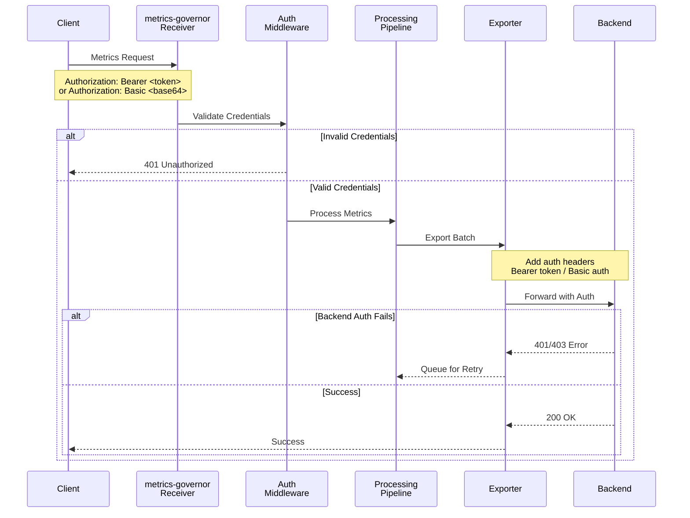

# Authentication

metrics-governor supports bearer token and basic authentication for both receivers and exporters.

> **Dual Pipeline Support**: Authentication works identically for both OTLP and PRW pipelines. The only difference is that they are completely separate - use `-receiver-*` flags for OTLP and `-prw-receiver-*` flags for PRW.

## Authentication Flow



## Receiver Authentication

Require authentication for incoming connections:

### Bearer Token Authentication

```bash
metrics-governor -receiver-auth-enabled \
    -receiver-auth-bearer-token "your-secret-token"
```

Clients must include the header:
```
Authorization: Bearer your-secret-token
```

### Basic Authentication

```bash
metrics-governor -receiver-auth-enabled \
    -receiver-auth-basic-username "user" \
    -receiver-auth-basic-password "password"
```

Clients must include the header:
```
Authorization: Basic <base64(user:password)>
```

### YAML Configuration

```yaml
receiver:
  auth:
    enabled: true
    bearer_token: "your-secret-token"
    # OR
    basic:
      username: "user"
      password: "password"
```

## Exporter Authentication

Authenticate when connecting to the backend:

### Bearer Token Authentication

```bash
metrics-governor -exporter-auth-bearer-token "your-secret-token"
```

### Basic Authentication

```bash
metrics-governor -exporter-auth-basic-username "user" \
    -exporter-auth-basic-password "password"
```

### Custom Headers

Use custom headers for API keys or tenant identification:

```bash
metrics-governor -exporter-auth-headers "X-API-Key=your-api-key,X-Tenant-ID=tenant123"
```

### YAML Configuration

```yaml
exporter:
  auth:
    bearer_token: "your-secret-token"
    # OR
    basic:
      username: "user"
      password: "password"
    # Additional headers
    headers:
      X-API-Key: "your-api-key"
      X-Tenant-ID: "tenant123"
```

## Authentication Options Reference

### OTLP Receiver Authentication Flags

| Flag | Default | Description |
|------|---------|-------------|
| `-receiver-auth-enabled` | `false` | Enable authentication for receivers |
| `-receiver-auth-bearer-token` | | Expected bearer token |
| `-receiver-auth-basic-username` | | Basic auth username |
| `-receiver-auth-basic-password` | | Basic auth password |

### OTLP Exporter Authentication Flags

| Flag | Default | Description |
|------|---------|-------------|
| `-exporter-auth-bearer-token` | | Bearer token to send with requests |
| `-exporter-auth-basic-username` | | Basic auth username |
| `-exporter-auth-basic-password` | | Basic auth password |
| `-exporter-auth-headers` | | Custom headers (format: `key1=value1,key2=value2`) |

### PRW Authentication Flags

| Flag | Default | Description |
|------|---------|-------------|
| `-prw-receiver-auth-enabled` | `false` | Enable authentication for PRW receiver |
| `-prw-receiver-auth-bearer-token` | | Expected bearer token |
| `-prw-exporter-auth-bearer-token` | | Bearer token to send with requests |
