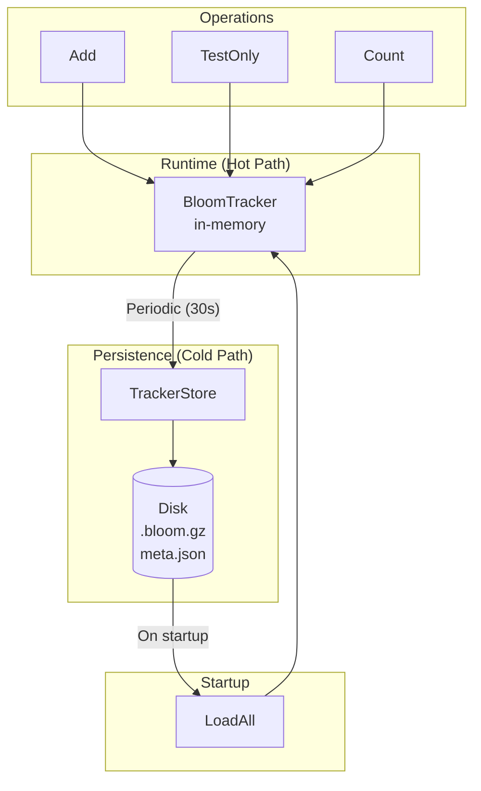

# Bloom Filter State Persistence

metrics-governor supports periodic persistence of bloom filter state to disk with automatic restore on restart and cleanup of outdated entries.

## Overview

Bloom filters are used for efficient cardinality tracking. By default, this state is only held in memory and is lost on restart. With persistence enabled, the state is periodically saved to disk and automatically restored on startup.



### Architecture Principles

- **No disk I/O on hot path** - `Add()`, `TestOnly()`, and `Count()` operations are pure memory
- **Background saves** - Periodic goroutine writes to disk (non-blocking to request handling)
- **Startup restore** - One-time load from disk to memory when the application starts

## Configuration

### Command Line

```bash
# Enable persistence with defaults
metrics-governor -bloom-persistence-enabled=true

# Full configuration
metrics-governor \
  -bloom-persistence-enabled=true \
  -bloom-persistence-path=./bloom-state \
  -bloom-persistence-save-interval=30s \
  -bloom-persistence-state-ttl=1h \
  -bloom-persistence-cleanup-interval=5m \
  -bloom-persistence-max-size=524288000 \
  -bloom-persistence-max-memory=268435456 \
  -bloom-persistence-compression=true \
  -bloom-persistence-compression-level=1
```

### YAML Configuration

```yaml
bloom_persistence:
  enabled: true
  path: ./bloom-state
  save_interval: 30s
  state_ttl: 1h
  cleanup_interval: 5m
  max_size: 524288000      # 500MB
  max_memory: 268435456    # 256MB
  compression: true
  compression_level: 1
```

### Configuration Options

| Option | Default | Description |
|--------|---------|-------------|
| `enabled` | `false` | Enable bloom filter state persistence |
| `path` | `./bloom-state` | Directory for persistence files |
| `save_interval` | `30s` | Interval between periodic saves |
| `state_ttl` | `1h` | Time after which unused trackers are cleaned up |
| `cleanup_interval` | `5m` | Interval between cleanup runs |
| `max_size` | `500MB` | Maximum disk space for bloom state |
| `max_memory` | `256MB` | Maximum memory for in-memory bloom filters |
| `compression` | `true` | Enable gzip compression for state files |
| `compression_level` | `1` | Gzip compression level (1=fast, 9=best) |

## Storage Layout

```
bloom-state/
├── meta.json                    # Index with all tracker metadata
└── trackers/
    ├── {sha256_hash}.bloom.gz   # Compressed bloom filter data
    ├── {sha256_hash}.bloom.gz
    └── ...
```

### meta.json Structure

```json
{
  "version": 1,
  "trackers": {
    "stats:metric:http_requests": {
      "key": "stats:metric:http_requests",
      "hash": "a1b2c3d4e5f6...",
      "count": 15234,
      "last_updated": "2024-01-15T10:30:00Z",
      "last_saved": "2024-01-15T10:30:30Z",
      "created_at": "2024-01-15T08:00:00Z",
      "checksum": 3847283947,
      "size_bytes": 28672
    }
  }
}
```

## Memory Management

Bloom filters can consume significant memory. The persistence system includes OOM protection:

### Memory Thresholds

| Threshold | Action |
|-----------|--------|
| 80% of max | Warning logged, early cleanup triggered |
| 95% of max | Error logged, LRU eviction until under 80% |

### Memory Sizing Guide

Memory per bloom filter at 1% false positive rate:

| Items | Memory |
|-------|--------|
| 100K | ~120KB |
| 1M | ~1.2MB |
| 10M | ~12MB |

With 256MB limit, you can have approximately:
- ~200 trackers at 1M items each
- ~2000 trackers at 100K items each

## Disk Space Management

### Compression

Bloom filters compress well, typically achieving 3-5x reduction:

| Items | Uncompressed | Compressed (level 1) |
|-------|--------------|----------------------|
| 100K | ~120KB | ~30KB |
| 1M | ~1.2MB | ~300KB |
| 10M | ~12MB | ~3MB |

### Compression Levels

| Level | Speed | Ratio |
|-------|-------|-------|
| 1 (default) | ~5ms/MB | 2-3x |
| 6 | ~20ms/MB | 3-5x |

### Eviction Policy

When disk usage approaches `max_size`:

1. Stale entries (past TTL) are removed first
2. If still over limit, oldest entries (by `last_updated`) are evicted

## Prometheus Metrics

### Counters

| Metric | Labels | Description |
|--------|--------|-------------|
| `bloom_persistence_saves_total` | `status` | Total save operations (success/error) |
| `bloom_persistence_loads_total` | `status` | Total load operations (success/error) |
| `bloom_persistence_cleanups_total` | - | Total cleanup runs |
| `bloom_persistence_evictions_total` | `reason` | Trackers removed (ttl/size/memory) |

### Gauges

| Metric | Description |
|--------|-------------|
| `bloom_persistence_trackers_total` | Current tracker count |
| `bloom_persistence_dirty_trackers` | Trackers pending save |
| `bloom_persistence_disk_usage_bytes` | Current disk usage |
| `bloom_persistence_disk_limit_bytes` | Configured max disk size |
| `bloom_persistence_memory_usage_bytes` | Current in-memory usage |
| `bloom_persistence_memory_limit_bytes` | Configured max memory |

### Histograms

| Metric | Description |
|--------|-------------|
| `bloom_persistence_save_duration_seconds` | Save operation latency |
| `bloom_persistence_load_duration_seconds` | Load operation latency |
| `bloom_persistence_compression_ratio` | Compressed/uncompressed size |
| `bloom_persistence_tracker_size_bytes` | Individual tracker sizes |

## Hardening Features

### File Safety

1. **Atomic Writes** - Data is written to temp file, then renamed (atomic on POSIX)
2. **Checksum Validation** - CRC32 stored in metadata, validated on load
3. **Max File Size** - Files larger than 50MB are rejected on load

### Startup Safety

4. **Index Validation** - Version check and structural validation of meta.json
5. **Graceful Degradation** - If persistence fails, continues with in-memory only
6. **Orphan Cleanup** - Files not in index are removed on startup

### Runtime Safety

7. **Disk Space Pre-check** - Verifies available space before writing
8. **Shutdown Timeout** - 30-second timeout prevents hanging on slow disk
9. **Panic Recovery** - Background goroutines wrapped with recover()

### Security

10. **Path Validation** - Keys with `..` are rejected to prevent traversal
11. **File Permissions** - State files created with 0600, directories with 0700

## Logging

### Startup

```json
{"level":"info","msg":"bloom persistence initialized","path":"./bloom-state","save_interval":"30s","state_ttl":"1h","max_size":"500MB","compression":true}
{"level":"info","msg":"loading bloom state from disk","path":"./bloom-state"}
{"level":"info","msg":"loaded tracker","key":"stats:metric:http_requests","count":15234,"age":"5m"}
{"level":"info","msg":"bloom state restore complete","loaded":42,"skipped_stale":3,"errors":1,"duration_ms":125}
```

### Periodic Saves

```json
{"level":"info","msg":"bloom state saved","saved":5,"duration_ms":45,"disk_usage_bytes":12582912,"disk_limit_bytes":524288000}
```

### Cleanup

```json
{"level":"info","msg":"evicted tracker","key":"stats:metric:old_one","reason":"ttl","age":"1h5m"}
{"level":"info","msg":"bloom state cleanup complete","evicted_ttl":2,"evicted_size":0,"remaining":148,"disk_usage_bytes":11534336}
```

### Shutdown

```json
{"level":"info","msg":"bloom persistence shutting down","dirty_trackers":3}
{"level":"info","msg":"final bloom state saved","saved":3,"total":148,"duration_ms":35}
{"level":"info","msg":"bloom persistence stopped"}
```

## Usage Examples

### Basic Usage

```bash
# Start with persistence
metrics-governor \
  -bloom-persistence-enabled=true \
  -bloom-persistence-path=/var/lib/metrics-governor/bloom-state
```

### Production Configuration

```bash
metrics-governor \
  -bloom-persistence-enabled=true \
  -bloom-persistence-path=/data/bloom-state \
  -bloom-persistence-save-interval=30s \
  -bloom-persistence-state-ttl=2h \
  -bloom-persistence-cleanup-interval=5m \
  -bloom-persistence-max-size=1073741824 \
  -bloom-persistence-max-memory=536870912 \
  -bloom-persistence-compression=true \
  -bloom-persistence-compression-level=1
```

### Docker with Volume

```yaml
services:
  metrics-governor:
    image: metrics-governor:latest
    command:
      - "-bloom-persistence-enabled=true"
      - "-bloom-persistence-path=/data/bloom-state"
    volumes:
      - bloom-data:/data/bloom-state

volumes:
  bloom-data:
```

## Testing Persistence

### Verify State Saved

```bash
# Check meta.json exists and has content
cat ./bloom-state/meta.json | jq '.trackers | keys | length'

# List tracker files
ls -la ./bloom-state/trackers/
```

### Verify Metrics

```bash
# Check persistence metrics
curl -s localhost:9090/metrics | grep bloom_persistence

# Expected output:
# bloom_persistence_trackers_total 42
# bloom_persistence_disk_usage_bytes 12582912
# bloom_persistence_saves_total{status="success"} 15
```

### Verify Restart Recovery

```bash
# 1. Start with persistence, send metrics
metrics-governor -bloom-persistence-enabled=true &
# ... send metrics through proxy ...

# 2. Check cardinality count
curl -s localhost:9090/metrics | grep cardinality

# 3. Restart
kill %1
metrics-governor -bloom-persistence-enabled=true &

# 4. Verify cardinality continues from saved state
curl -s localhost:9090/metrics | grep cardinality
```

## Troubleshooting

### State Not Persisting

**Symptoms:** Cardinality resets to 0 after restart

**Check:**
1. Verify persistence is enabled: `-bloom-persistence-enabled=true`
2. Check path is writable: `ls -la ./bloom-state/`
3. Check logs for errors: `grep "bloom persistence" logs`

### High Memory Usage

**Symptoms:** OOM or high memory warnings

**Solutions:**
1. Lower `max_memory` to trigger earlier eviction
2. Reduce `state_ttl` to clean up old trackers faster
3. Reduce `cardinality-expected-items` to use smaller bloom filters

### Slow Startup

**Symptoms:** Application takes long to start

**Causes:**
- Loading many large tracker files
- Slow disk I/O

**Solutions:**
1. Use faster storage (SSD)
2. Enable compression to reduce file sizes
3. Lower `state_ttl` to reduce number of trackers

## See Also

- [Configuration](./configuration.md)
- [Statistics](./statistics.md)
- [Resilience](./resilience.md)
