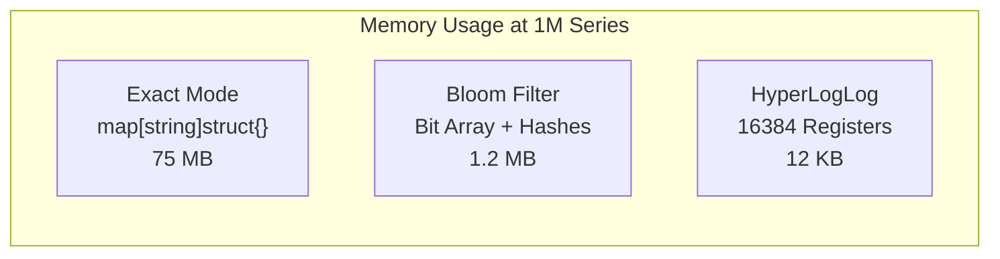
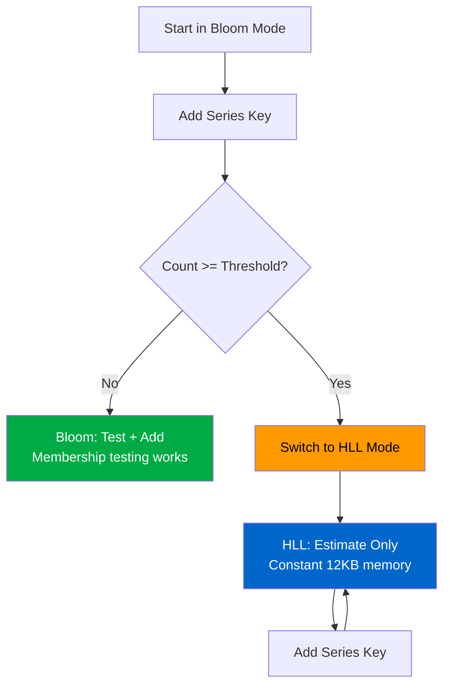

# Cardinality Tracking Modes

metrics-governor supports three cardinality tracking modes for efficient metric series counting: **Bloom filter** (default), **HyperLogLog**, and **Hybrid** (auto-switching). Each mode trades off between memory usage, accuracy, and feature support.

## Mode Comparison

| Aspect | Bloom (default) | HyperLogLog | Hybrid |
|--------|-----------------|-------------|--------|
| **Memory @ 1M series** | ~1.2 MB | ~12 KB (constant) | Bloom initially, then ~12 KB |
| **Accuracy** | ~99% (configurable FPR) | ~97-99% (estimator) | Bloom accuracy then HLL estimate |
| **Membership test** | Yes (with false positives) | No (always returns false) | Yes in Bloom phase, no after switch |
| **Add returns new?** | Yes | Always returns true | Yes in Bloom phase, always true after |
| **Best for** | High cardinality, memory-constrained | Very high cardinality, constant memory | Unknown or variable cardinality |



## Bloom Filter Mode

The default mode. Uses a probabilistic bit-array data structure for memory-efficient cardinality counting with configurable false positive rate.

### How It Works

1. Each series key is hashed through multiple hash functions
2. The corresponding bits are set in a bit array
3. To check membership: if all bits are set, the key *probably* exists (false positive possible); if any bit is unset, the key is *definitely* new

### Memory Sizing

| Unique Series | map (exact) | Bloom (1% FPR) | Savings |
|---------------|-------------|-----------------|---------|
| 10,000 | 750 KB | 12 KB | 98% |
| 100,000 | 7.5 MB | 120 KB | 98% |
| 1,000,000 | 75 MB | 1.2 MB | 98% |
| 10,000,000 | 750 MB | 12 MB | 98% |

### Configuration

```bash
metrics-governor \
  -cardinality-mode bloom \
  -cardinality-expected-items 100000 \
  -cardinality-fp-rate 0.01
```

```yaml
cardinality:
  mode: bloom
  expected_items: 100000
  fp_rate: 0.01
```

### When to Use

- Default choice for most deployments
- Memory-constrained environments (Kubernetes pods)
- When you need membership testing (`TestOnly`)
- When false positive rate of 1% is acceptable

---

## HyperLogLog Mode

Uses the HyperLogLog probabilistic algorithm for constant-memory cardinality estimation. Memory usage is fixed at ~12 KB regardless of the number of unique series.

### How It Works

1. Each series key is hashed to a uniformly distributed value
2. The hash is split into a register index (14 bits = 16,384 registers) and a rank value
3. Each register stores the maximum rank seen
4. Cardinality is estimated from the harmonic mean of register values

### Key Characteristics

- **Constant memory**: Always ~12 KB (precision 14, 16,384 registers)
- **No membership testing**: `TestOnly()` always returns `false` — HLL can only estimate count, not test membership
- **Add always returns true**: Cannot determine if a key was already seen
- **Accuracy**: Typically within 2-5% for large cardinalities

### Configuration

```bash
metrics-governor \
  -cardinality-mode hll \
  -cardinality-hll-precision 14
```

```yaml
cardinality:
  mode: hll
  hll_precision: 14
```

| Precision | Registers | Memory | Typical Error |
|-----------|-----------|--------|---------------|
| 10 | 1,024 | ~1 KB | ~3.25% |
| 14 (default) | 16,384 | ~12 KB | ~0.81% |
| 16 | 65,536 | ~48 KB | ~0.41% |

### When to Use

- Very high cardinality metrics (10M+ series) where Bloom filters would use too much memory
- When you only need cardinality counts, not membership testing
- Environments where constant memory usage is critical
- Monitoring dashboards that only display cardinality numbers

### Limitations

- Cannot answer "has this series been seen before?" — limits enforcement that relies on membership testing will not work in pure HLL mode
- Slight estimation error (~1-5%) compared to exact counting
- No persistence support for HLL-only mode (use Hybrid or Bloom with persistence)

---

## Hybrid Mode

Starts in Bloom filter mode and automatically switches to HyperLogLog when cardinality exceeds a configurable threshold. This gives you the best of both worlds: accurate membership testing at low cardinality, and constant memory at high cardinality.

### How It Works



1. **Phase 1 (Bloom)**: Both Bloom filter and HLL sketch receive all inserts in parallel
2. **Threshold check**: After each Bloom `Add()`, if `count >= hll_threshold`, mode switches
3. **Phase 2 (HLL)**: Bloom filter is released, only HLL sketch remains (~12 KB)
4. **One-way switch**: Once switched to HLL, the tracker stays in HLL mode until reset

### Switch Behavior

- The switch is **one-way** (Bloom to HLL only) within a tracking window
- On `Reset()`, the tracker returns to Bloom mode for the next window
- During switch, HLL does **not** receive historical data from Bloom — it starts fresh but catches up quickly since both receive inserts in parallel before the switch
- A brief cardinality undercount may occur immediately after switch (typically <1 window)

### Configuration

```bash
metrics-governor \
  -cardinality-mode hybrid \
  -cardinality-hll-threshold 10000 \
  -cardinality-expected-items 100000 \
  -cardinality-fp-rate 0.01
```

```yaml
cardinality:
  mode: hybrid
  hll_threshold: 10000
  expected_items: 100000
  fp_rate: 0.01
```

| Option | Default | Description |
|--------|---------|-------------|
| `hll_threshold` | `10000` | Cardinality count that triggers Bloom to HLL switch |
| `expected_items` | `100000` | Bloom filter sizing (used in Bloom phase) |
| `fp_rate` | `0.01` | Bloom false positive rate (used in Bloom phase) |

### Threshold Tuning

| Threshold | Bloom Memory at Switch | Use Case |
|-----------|------------------------|----------|
| 1,000 | ~1.2 KB | Switch early, save memory aggressively |
| 10,000 (default) | ~12 KB | Balanced — membership testing for moderate cardinality |
| 100,000 | ~120 KB | Keep Bloom longer for better membership testing |
| 0 | Never switches | Disable switching (stays in Bloom mode) |

### When to Use

- Workloads with unpredictable cardinality (some metrics low, some explode)
- When you want membership testing for most metrics but need protection against cardinality explosions
- Mixed environments where some services have 100 series and others have 10M+
- Default choice when you're unsure which mode to pick

---

## Configuration Reference

### CLI Flags

| Flag | Default | Description |
|------|---------|-------------|
| `-cardinality-mode` | `bloom` | Tracking mode: `bloom`, `hll`, `exact`, or `hybrid` |
| `-cardinality-expected-items` | `100000` | Expected unique items per tracker (Bloom sizing) |
| `-cardinality-fp-rate` | `0.01` | Bloom filter false positive rate (1% = 0.01) |
| `-cardinality-hll-threshold` | `10000` | Hybrid mode: cardinality at which Bloom switches to HLL |
| `-cardinality-hll-precision` | `14` | HLL precision (registers = 2^precision, 14 = ~12 KB) |

### YAML Configuration

```yaml
cardinality:
  mode: "hybrid"          # bloom, hll, exact, or hybrid
  expected_items: 100000  # Bloom filter sizing
  fp_rate: 0.01           # Bloom false positive rate
  hll_threshold: 10000    # Hybrid switch point
  hll_precision: 14       # HLL precision (14 = ~12KB)
```

---

## Prometheus Metrics

| Metric | Type | Description |
|--------|------|-------------|
| `metrics_governor_cardinality_mode{mode}` | gauge | Active tracking mode (bloom, hll, exact, or hybrid) |
| `metrics_governor_cardinality_memory_bytes` | gauge | Total memory used by all stats trackers |
| `metrics_governor_cardinality_trackers_total` | gauge | Number of active trackers |
| `metrics_governor_cardinality_config_expected_items` | gauge | Configured expected items per tracker |
| `metrics_governor_cardinality_config_fp_rate` | gauge | Configured false positive rate |
| `metrics_governor_rule_cardinality_memory_bytes{rule}` | gauge | Memory used per limits rule |
| `metrics_governor_limits_cardinality_memory_bytes` | gauge | Total memory used by limits trackers |
| `metrics_governor_limits_cardinality_trackers_total` | gauge | Number of trackers in limits enforcer |

### Monitoring Queries

**Track mode switches (Hybrid)**:
```promql
# Alert when trackers switch to HLL (may indicate cardinality explosion)
changes(metrics_governor_cardinality_mode{mode="hll"}[5m]) > 0
```

**Memory efficiency**:
```promql
# Actual vs estimated map-based memory
1 - (metrics_governor_cardinality_memory_bytes / (sum(metrics_governor_metric_cardinality) * 75))
```

**Detect undersized Bloom filters**:
```promql
# Cardinality exceeds expected items — FP rate may be higher than configured
max(metrics_governor_metric_cardinality) > metrics_governor_cardinality_config_expected_items * 2
```

---

## Production Recommendations

| Scenario | Recommended Mode | Configuration |
|----------|------------------|---------------|
| Standard Kubernetes deployment | `bloom` | Default settings |
| High-cardinality (>1M series) | `hll` | `-cardinality-mode hll` |
| Mixed workloads, unknown patterns | `hybrid` | `-cardinality-mode hybrid -cardinality-hll-threshold 10000` |
| Development / testing | `exact` | `-cardinality-mode exact` |
| Memory-constrained (<256 MB) | `hll` or `hybrid` | Low threshold to switch early |

### With Bloom Persistence

Bloom persistence (`-bloom-persistence-enabled=true`) works with all three modes. When using Hybrid mode, the Bloom filter state is persisted during the Bloom phase. After a restart, the tracker restores from the persisted Bloom state and may switch to HLL again if cardinality re-exceeds the threshold.

See [Bloom Persistence](./bloom-persistence.md) for persistence configuration.

## See Also

- [Performance](./performance.md) - String interning, queue I/O optimizations
- [Bloom Persistence](./bloom-persistence.md) - Save/restore filter state across restarts
- [Configuration](./configuration.md) - Full YAML config and CLI flags reference
- [Statistics](./statistics.md) - Per-metric cardinality and observability
