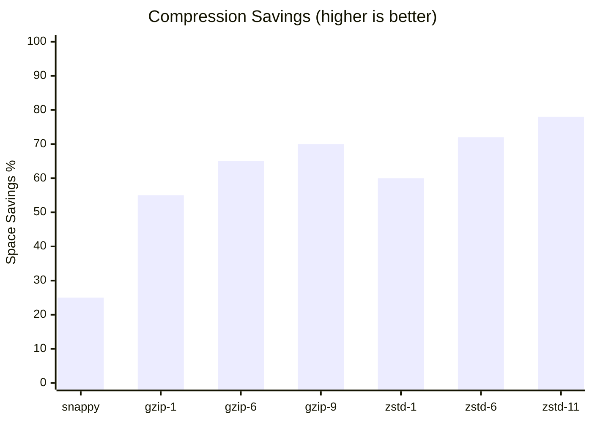

# Compression

## Table of Contents

- [Compression Pipeline](#compression-pipeline)
- [Compression Ratio Comparison](#compression-ratio-comparison)
- [Supported Algorithms](#supported-algorithms)
- [Compression Levels](#compression-levels)
- [Exporter Compression](#exporter-compression)
  - [Enable gzip Compression (Default Level)](#enable-gzip-compression-default-level)
  - [Enable gzip with Best Compression](#enable-gzip-with-best-compression)
  - [Enable zstd with Default Level](#enable-zstd-with-default-level)
  - [Enable zstd with Best Compression](#enable-zstd-with-best-compression)
  - [Enable snappy for Fast Compression](#enable-snappy-for-fast-compression)
  - [YAML Configuration](#yaml-configuration)
- [Receiver Decompression](#receiver-decompression)
- [Compression Options Reference](#compression-options-reference)
  - [OTLP Compression Flags](#otlp-compression-flags)
  - [PRW Compression Flags](#prw-compression-flags)
- [Performance Considerations](#performance-considerations)
- [Encoder Pooling](#encoder-pooling)
  - [How It Works](#how-it-works)
  - [Reset() Safety and Cross-Contamination Prevention](#reset-safety-and-cross-contamination-prevention)
  - [Pool Metrics](#pool-metrics)
  - [Configuration](#configuration)

metrics-governor supports compression for HTTP exporters and automatic decompression for HTTP receivers. Compression can significantly reduce network bandwidth, especially for high-volume metrics.

> **Dual Pipeline Support**: Compression works for both OTLP and PRW pipelines. OTLP supports multiple algorithms (gzip, zstd, snappy, etc.), while PRW uses snappy (required) or zstd (PRW 2.0 optional).

## Compression Pipeline


## Compression Ratio Comparison



## Supported Algorithms

| Algorithm | Content-Encoding | OTLP | PRW | Description |
|-----------|------------------|------|-----|-------------|
| `gzip` | `gzip` | Yes | No | Standard gzip compression, widely supported |
| `zstd` | `zstd` | Yes | Yes (2.0) | Zstandard compression, excellent ratio and speed |
| `snappy` | `snappy` | Yes | Yes | Fast compression with moderate ratio (PRW default) |
| `zlib` | `zlib` | Yes | No | Zlib compression (similar to gzip) |
| `deflate` | `deflate` | Yes | No | Raw deflate compression |

## Compression Levels

Each algorithm supports different compression levels:

| Algorithm | Levels | Description |
|-----------|--------|-------------|
| **gzip/zlib/deflate** | 1-9, -1 | 1 = fastest, 9 = best compression, -1 = default |
| **zstd** | 1, 3, 6, 11 | 1 = fastest, 3 = default, 6 = better, 11 = best |
| **snappy** | N/A | No compression levels supported |

## Exporter Compression

### Enable gzip Compression (Default Level)

```bash
metrics-governor -exporter-protocol http \
    -exporter-compression gzip
```

### Enable gzip with Best Compression

```bash
metrics-governor -exporter-protocol http \
    -exporter-compression gzip \
    -exporter-compression-level 9
```

### Enable zstd with Default Level

```bash
metrics-governor -exporter-protocol http \
    -exporter-compression zstd
```

### Enable zstd with Best Compression

```bash
metrics-governor -exporter-protocol http \
    -exporter-compression zstd \
    -exporter-compression-level 11
```

### Enable snappy for Fast Compression

```bash
metrics-governor -exporter-protocol http \
    -exporter-compression snappy
```

### YAML Configuration

```yaml
exporter:
  protocol: "http"
  compression:
    type: "zstd"
    level: 6
```

## Receiver Decompression

The HTTP receiver automatically decompresses incoming requests based on the `Content-Encoding` header.

**Supported encodings:**
- `gzip`, `x-gzip`
- `zstd`
- `snappy`, `x-snappy-framed`
- `zlib`
- `deflate`
No configuration is required - decompression is automatic.

## Compression Options Reference

### OTLP Compression Flags

| Flag | Default | Description |
|------|---------|-------------|
| `-exporter-compression` | `none` | Compression type: `none`, `gzip`, `zstd`, `snappy`, `zlib`, `deflate` |
| `-exporter-compression-level` | `0` | Compression level (algorithm-specific, 0 for default) |

### PRW Compression Flags

| Flag | Default | Description |
|------|---------|-------------|
| `-prw-exporter-vm-compression` | `snappy` | Compression: `snappy` or `zstd` (VictoriaMetrics mode) |

## Performance Considerations

| Algorithm | Speed | Compression Ratio | Use Case |
|-----------|-------|-------------------|----------|
| **snappy** | Very Fast | Low-Medium | Balanced speed/ratio, PRW default |
| **gzip** | Medium | Good | Compatibility |
| **zstd** | Fast | Excellent | Best overall choice |

**Recommendation**: Use `zstd` for the best balance of compression ratio and speed. Use `snappy` when latency is critical.

---

## Encoder Pooling

Compression encoders are expensive to allocate and initialize. metrics-governor uses `sync.Pool` to reuse encoders across requests, eliminating approximately 80% of encoder-related allocations.

### How It Works

A separate `sync.Pool` is maintained for each compression type (gzip, zstd, snappy, zlib, deflate). When an export request needs to compress data:

1. An encoder is retrieved from the pool for the configured compression type.
2. The encoder is used to compress the payload.
3. The encoder is `Reset()` to clear all internal buffers and state.
4. The encoder is returned to the pool for reuse.

### Reset() Safety and Cross-Contamination Prevention

Each encoder is explicitly `Reset()` before being returned to the pool. This ensures:

- **No data leakage**: Internal buffers from the previous request are cleared, so no partial data from one request can appear in another.
- **No cross-contamination**: Even if encoders maintain internal dictionaries or state (as zstd does), the reset ensures a clean slate for the next caller.
- **Deterministic output**: The compressed output for a given input is identical regardless of whether the encoder was freshly allocated or retrieved from the pool.

### Pool Metrics

| Metric | Type | Description |
|--------|------|-------------|
| `metrics_governor_compression_pool_gets_total` | counter | Number of encoder acquisitions from the pool |
| `metrics_governor_compression_pool_puts_total` | counter | Number of encoder returns to the pool |
| `metrics_governor_compression_pool_misses_total` | counter | Number of pool misses (new encoder allocated) |

**Monitoring pool reuse:**

```promql
# Pool hit ratio (higher is better, indicates good reuse)
1 - (rate(metrics_governor_compression_pool_misses_total[5m]) / rate(metrics_governor_compression_pool_gets_total[5m]))
```

### Configuration

Encoder pooling is always enabled and requires no configuration. The pool is managed by Go's `sync.Pool`, which automatically sizes itself based on GC pressure and usage patterns.

## Compression Decision Matrix

Choose compression based on the path and requirements:

| Path | Recommended | Why |
|---|---|---|
| **Export** (observable, safety, performance) | zstd | Best compression ratio (60-78%), pooled encoders via `sync.Pool` |
| **Export** (balanced, resilient) | snappy | High throughput, lower ratio acceptable |
| **Export** (compatibility) | gzip | Widest backend support |
| **Disk queue** (all profiles) | snappy | Fast, allocation-free via `s2.EncodeSnappy`, controls queue size |
| **Receiver** (decompression) | auto-detect | Supports gzip, zstd, snappy, zlib, deflate |

### Stability Impact

During spillover (memory queue → disk), **disk queue compression** becomes critical: every batch spilled to disk goes through protobuf marshal + snappy compress. Snappy is chosen for this path specifically because it's allocation-free and fast — minimizing the CPU cost of spillover, which helps prevent the spillover cascade feedback loop.

**Export compression** (zstd) is the right choice for bandwidth savings even though it costs more CPU than snappy. The CPU optimization comes from code-level improvements (merged attribute extraction, reduced lock scope, sync.Pool), not from downgrading the compression algorithm.
