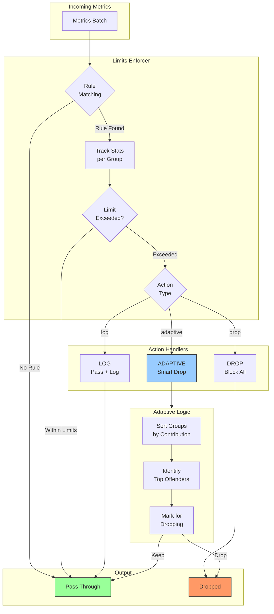

# Limits Configuration

Limits are configured via a YAML file specified with `-limits-config`. See [examples/limits.yaml](../examples/limits.yaml) for a complete example.

> **Dual Pipeline Support**: Limits work identically for both OTLP and PRW pipelines. The same configuration file applies to both - they are completely separate pipelines using the same rules.

## Architecture Overview



## Configuration Structure

```yaml
defaults:
  max_datapoints_rate: 1000000  # per minute
  max_cardinality: 100000
  action: log                   # log, adaptive, or drop

rules:
  - name: "rule-name"
    match:
      metric_name: "http_request_.*"  # regex pattern (optional)
      labels:                          # label matching (optional)
        service: "payment-api"         # exact match
        env: "*"                       # wildcard - any value
    max_datapoints_rate: 50000        # per minute, 0 = no limit
    max_cardinality: 2000             # 0 = no limit
    action: adaptive                  # log, adaptive, or drop
    group_by: ["service", "env"]      # labels for adaptive grouping
```

## Actions

| Action | Description |
|--------|-------------|
| `log` | Log violation but pass through all data (default, safe for dry-run) |
| `adaptive` | **Intelligent limiting**: Track per-group stats, drop only top offenders to stay within limits |
| `drop` | Drop all data when limit exceeded (nuclear option) |

## Adaptive Limiting (Recommended)

The `adaptive` action is the key feature of metrics-governor. Instead of dropping all metrics or randomly sampling, it:

1. **Tracks statistics per group** defined by `group_by` labels
2. **Identifies top offenders** when limits are exceeded
3. **Drops only the worst groups** to bring totals within limits
4. **Preserves smaller contributors** that are within reasonable bounds

This ensures you get maximum data delivery while staying within your cardinality and datapoints budgets.

### How Adaptive Works

```
Example: max_cardinality: 1000, group_by: ["service"]

Current state:
  - service=api-a:     400 series  (40%)
  - service=api-b:     300 series  (30%)
  - service=api-c:     200 series  (20%)
  - service=legacy:    500 series  (50%)  <- TOP OFFENDER
                      -----
  Total:             1400 series (over limit by 400)

Adaptive action:
  1. Sort groups by contribution (descending): legacy(500), api-a(400), api-b(300), api-c(200)
  2. Mark "legacy" for dropping (500 >= 400 excess)
  3. Keep api-a, api-b, api-c (within limit now: 900 series)

Result: Only legacy service metrics are dropped for this window
```

### Adaptive Configuration Example

```yaml
rules:
  - name: "adaptive-by-service"
    match:
      labels:
        env: "prod"
        service: "*"
    max_datapoints_rate: 100000
    max_cardinality: 5000
    action: adaptive
    group_by: ["service"]  # Track and limit per service
```

## Matching Rules

- **metric_name**: Exact match or regex pattern (e.g., `http_request_.*`)
- **labels**: Key-value pairs where `*` matches any value
- **group_by**: Labels to use for tracking groups (required for adaptive)
- Rules are evaluated in order; first match wins

## Dry Run Mode

By default, limits run in dry-run mode (`-limits-dry-run=true`). This logs all violations but doesn't actually drop data.

Use this to:
1. Understand your metrics cardinality before enforcing limits
2. Tune limit thresholds based on actual traffic
3. Safely test limit configurations in production

To enable actual enforcement:

```bash
metrics-governor -limits-config limits.yaml -limits-dry-run=false
```

## Metadata Labels

When a limiting rule matches a metric, two labels are injected at the DataPoint level:

| Label | Description |
|-------|-------------|
| `metrics.governor.action` | The action taken: `passed`, `log`, `drop`, or `adaptive` |
| `metrics.governor.rule` | The name of the matching rule |

This enables downstream systems to identify which metrics were affected by limiting rules.

## Action Examples

### Adaptive Action (Intelligent Limiting)

```yaml
rules:
  - name: "adaptive-by-service"
    match:
      labels:
        env: "prod"
        service: "*"
    max_datapoints_rate: 100000
    max_cardinality: 5000
    action: adaptive
    group_by: ["service"]
```

**Log output:**
```json
{"level":"warn","message":"limit exceeded","fields":{"rule":"adaptive-by-service","metric":"http_requests_total","group":"service=legacy-app","reason":"cardinality","action":"adaptive"}}
{"level":"info","message":"adaptive: marked group for dropping","fields":{"rule":"adaptive-by-service","group":"service=legacy-app","contribution_cardinality":3000}}
```

### Log Action (Monitoring Only)

```yaml
rules:
  - name: "monitor-only"
    match:
      metric_name: "http_request_duration_.*"
    max_cardinality: 5000
    action: log
```

### Drop Action (Hard Limit)

```yaml
rules:
  - name: "block-known-bad"
    match:
      metric_name: "known_problematic_metric"
    max_cardinality: 100
    action: drop
```

## Complete Configuration Example

```yaml
defaults:
  max_datapoints_rate: 1000000
  max_cardinality: 100000
  action: log  # Safe default

rules:
  # Production: Adaptive limiting by service
  - name: "prod-service-limits"
    match:
      labels:
        env: "prod"
        service: "*"
    max_datapoints_rate: 100000
    max_cardinality: 5000
    action: adaptive
    group_by: ["service"]

  # HTTP metrics: Adaptive by service+endpoint
  - name: "http-endpoint-limits"
    match:
      metric_name: "http_request_.*"
    max_cardinality: 2000
    action: adaptive
    group_by: ["service", "endpoint"]

  # Legacy apps: Strict adaptive control
  - name: "legacy-limits"
    match:
      metric_name: "legacy_.*"
    max_cardinality: 100
    action: adaptive
    group_by: ["service", "env"]

  # Dev: Just monitor
  - name: "dev-monitor"
    match:
      labels:
        env: "dev"
    max_datapoints_rate: 500000
    max_cardinality: 50000
    action: log
```

## Rule Matching Cache

The limits enforcer evaluates every incoming metric against the configured rules, which may involve regex matching on metric names and label comparisons. To avoid repeated regex evaluation for the same metric identity, a rule matching cache is used.

### How It Works

When a metric is evaluated, its name and label set are used to form a cache key. The cache stores the index of the matched rule (or a sentinel for "no match"). On subsequent evaluations of the same metric identity, the cached result is returned immediately, bypassing all regex and label matching logic.

The cache uses an **LRU (Least Recently Used)** eviction policy. When the cache reaches its maximum size, the least-recently-accessed entry is evicted to make room for new entries. This ensures that frequently seen metrics stay cached while rare or one-off series do not consume cache space indefinitely.

For rules that only use label matchers (no regex `metric_name` pattern), the cache bypasses regex entirely and uses direct map lookups on the label set, which is even faster than a cache hit on a regex result.

### Configuration

| Flag | Default | Description |
|------|---------|-------------|
| `-rule-cache-max-size` | `10000` | Maximum number of entries in the rule matching LRU cache. Each entry is approximately 100 bytes, so the default uses roughly 1MB. |

```bash
# Increase cache size for high-cardinality workloads
metrics-governor -limits-config limits.yaml -rule-cache-max-size=50000

# Disable cache (not recommended)
metrics-governor -limits-config limits.yaml -rule-cache-max-size=0
```

### Cache Metrics

| Metric | Type | Description |
|--------|------|-------------|
| `metrics_governor_rule_cache_hits_total` | counter | Number of rule match lookups served from cache |
| `metrics_governor_rule_cache_misses_total` | counter | Number of rule match lookups that required full evaluation |
| `metrics_governor_rule_cache_size` | gauge | Current number of entries in the cache |
| `metrics_governor_rule_cache_evictions_total` | counter | Number of entries evicted due to LRU policy |

**Monitoring cache effectiveness:**

```promql
# Cache hit ratio (should be > 90% for stable workloads)
rate(metrics_governor_rule_cache_hits_total[5m]) /
(rate(metrics_governor_rule_cache_hits_total[5m]) + rate(metrics_governor_rule_cache_misses_total[5m]))
```

---

## Prometheus Metrics

When limits are enabled, additional metrics are exposed:

```
metrics_governor_limit_cardinality_exceeded_total{rule="adaptive-by-service"} 42
metrics_governor_limit_datapoints_dropped_total{rule="adaptive-by-service"} 5000
metrics_governor_limit_datapoints_passed_total{rule="adaptive-by-service"} 95000
metrics_governor_limit_groups_dropped_total{rule="adaptive-by-service"} 2
metrics_governor_rule_current_cardinality{rule="adaptive-by-service"} 4500
metrics_governor_rule_groups_total{rule="adaptive-by-service"} 15
metrics_governor_rule_dropped_groups_total{rule="adaptive-by-service"} 2
```
