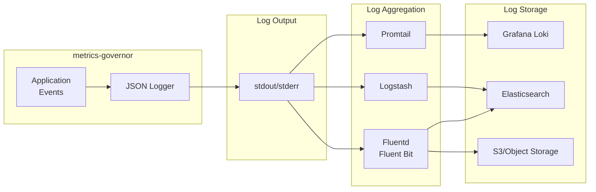
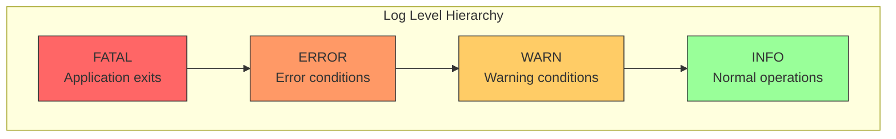

# Logging

All logs are output in JSON format for easy parsing and integration with log aggregation systems.

## Log Pipeline



## Log Levels



## Log Format

```json
{
  "timestamp": "2024-01-26T12:00:00Z",
  "level": "info",
  "message": "metrics-governor started",
  "fields": {
    "grpc_addr": ":4317",
    "http_addr": ":4318",
    "exporter_endpoint": "localhost:4317",
    "stats_addr": ":9090"
  }
}
```

## Log Levels

| Level | Description |
|-------|-------------|
| `info` | Normal operational messages |
| `warn` | Warning conditions |
| `error` | Error conditions |
| `fatal` | Fatal errors (application exits) |

## Common Log Messages

### Startup Messages

```json
{"timestamp":"2024-01-26T12:00:00Z","level":"info","message":"metrics-governor started","fields":{"grpc_addr":":4317","http_addr":":4318","exporter_endpoint":"localhost:4317","stats_addr":":9090"}}
{"timestamp":"2024-01-26T12:00:00Z","level":"info","message":"gRPC receiver started","fields":{"addr":":4317"}}
{"timestamp":"2024-01-26T12:00:00Z","level":"info","message":"HTTP receiver started","fields":{"addr":":4318"}}
{"timestamp":"2024-01-26T12:00:00Z","level":"info","message":"stats endpoint started","fields":{"addr":":9090","path":"/metrics"}}
```

### Stats Messages

```json
{"timestamp":"2024-01-26T12:00:30Z","level":"info","message":"stats","fields":{"datapoints_total":1000,"unique_metrics":10,"total_cardinality":150}}
```

### Limit Violation Messages

```json
{"timestamp":"2024-01-26T12:00:00Z","level":"warn","message":"limit exceeded","fields":{"rule":"adaptive-by-service","metric":"http_requests_total","group":"service=legacy-app","reason":"cardinality","action":"adaptive","dry_run":false,"datapoints":100}}
```

### Adaptive Limiting Messages

```json
{"timestamp":"2024-01-26T12:00:00Z","level":"info","message":"adaptive: marked group for dropping","fields":{"rule":"adaptive-by-service","group":"service=legacy-app","reason":"cardinality","contribution_datapoints":5000,"contribution_cardinality":3000}}
```

### Export Error Messages

```json
{"timestamp":"2024-01-26T12:00:00Z","level":"error","message":"export failed","fields":{"error":"connection refused","endpoint":"otel-collector:4317","retry_in":"5s"}}
```

## Log Aggregation

### Fluentd/Fluent Bit

```yaml
[INPUT]
    Name              tail
    Path              /var/log/metrics-governor/*.log
    Parser            json
    Tag               metrics-governor.*

[FILTER]
    Name              modify
    Match             metrics-governor.*
    Add               application metrics-governor
```

### Loki/Promtail

```yaml
scrape_configs:
  - job_name: metrics-governor
    static_configs:
      - targets:
          - localhost
        labels:
          job: metrics-governor
          __path__: /var/log/metrics-governor/*.log
    pipeline_stages:
      - json:
          expressions:
            level: level
            message: message
      - labels:
          level:
```

### Elasticsearch/Logstash

```ruby
input {
  file {
    path => "/var/log/metrics-governor/*.log"
    codec => json
  }
}

filter {
  date {
    match => ["timestamp", "ISO8601"]
  }
}

output {
  elasticsearch {
    hosts => ["localhost:9200"]
    index => "metrics-governor-%{+YYYY.MM.dd}"
  }
}
```

## Useful Log Queries

### Find Limit Violations

```bash
# All limit violations
cat logs.json | jq 'select(.message == "limit exceeded")'

# Violations by rule
cat logs.json | jq 'select(.message == "limit exceeded") | .fields.rule' | sort | uniq -c

# Violations by reason
cat logs.json | jq 'select(.message == "limit exceeded") | .fields.reason' | sort | uniq -c
```

### Find Errors

```bash
# All errors
cat logs.json | jq 'select(.level == "error")'

# Export errors
cat logs.json | jq 'select(.message == "export failed")'
```

### Analyze Stats

```bash
# Latest stats
cat logs.json | jq 'select(.message == "stats")' | tail -1

# Datapoints over time
cat logs.json | jq 'select(.message == "stats") | [.timestamp, .fields.datapoints_total]'
```
