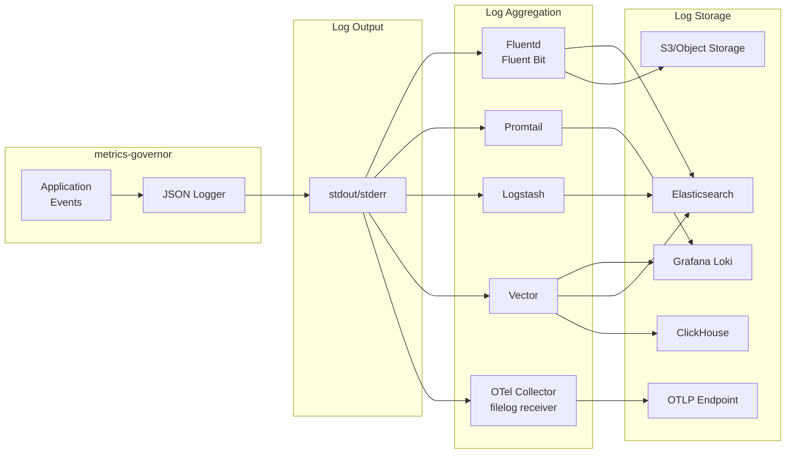
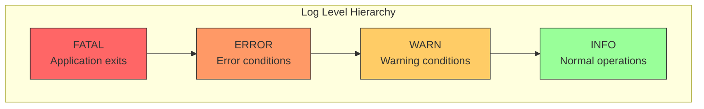

# Logging

## Table of Contents

- [Log Pipeline](#log-pipeline)
- [Log Levels](#log-levels)
- [Log Format (OTEL-Compatible)](#log-format-otel-compatible)
  - [Field Mapping](#field-mapping)
- [Log Levels](#log-levels-1)
- [Common Log Messages](#common-log-messages)
  - [Startup Messages](#startup-messages)
  - [Stats Messages](#stats-messages)
  - [Limit Violation Messages](#limit-violation-messages)
  - [Adaptive Limiting Messages](#adaptive-limiting-messages)
  - [Export Error Messages](#export-error-messages)
  - [Config Reload Messages](#config-reload-messages)
  - [Buffer Backpressure Messages](#buffer-backpressure-messages)
  - [Worker Pool Messages](#worker-pool-messages)
  - [Shutdown Messages](#shutdown-messages)
- [Log Aggregation](#log-aggregation)
  - [Fluentd/Fluent Bit](#fluentdfluent-bit)
  - [Loki/Promtail](#lokipromtail)
  - [Elasticsearch/Logstash](#elasticsearchlogstash)
  - [Vector](#vector)
  - [OpenTelemetry Collector (Log Delivery)](#opentelemetry-collector-log-delivery)
- [Useful Log Queries](#useful-log-queries)
  - [Find Limit Violations](#find-limit-violations)
  - [Find Errors](#find-errors)
  - [Analyze Stats](#analyze-stats)
- [OTLP Telemetry Export](#otlp-telemetry-export)

All logs are output in **OTEL-compatible** JSON format for easy parsing, integration with log aggregation systems, and native support for OpenTelemetry log pipelines.

## Log Pipeline



## Log Levels



## Log Format (OTEL-Compatible)

Logs follow the [OpenTelemetry Log Data Model](https://opentelemetry.io/docs/specs/otel/logs/data-model/):

```json
{
  "Timestamp": "2024-01-26T12:00:00Z",
  "SeverityText": "INFO",
  "SeverityNumber": 9,
  "Body": "metrics-governor started",
  "Attributes": {
    "grpc_addr": ":4317",
    "http_addr": ":4318",
    "exporter_endpoint": "localhost:4317",
    "stats_addr": ":9090"
  },
  "Resource": {
    "service.name": "metrics-governor",
    "service.version": "0.17.0"
  }
}
```

### Field Mapping

| OTEL Field | Type | Description |
|------------|------|-------------|
| `Timestamp` | string | RFC3339 UTC timestamp |
| `SeverityText` | string | Log level: `INFO`, `WARN`, `ERROR`, `FATAL` |
| `SeverityNumber` | int | OTEL severity number (see below) |
| `Body` | string | Log message |
| `Attributes` | object | Structured key-value data (omitted if empty) |
| `Resource` | object | Service identity (omitted if not configured) |

## Log Levels

| Level | SeverityNumber | Description |
|-------|---------------|-------------|
| `INFO` | 9 | Normal operational messages |
| `WARN` | 13 | Warning conditions |
| `ERROR` | 17 | Error conditions |
| `FATAL` | 21 | Fatal errors (application exits) |

## Common Log Messages

### Startup Messages

```json
{"Timestamp":"2024-01-26T12:00:00Z","SeverityText":"INFO","SeverityNumber":9,"Body":"metrics-governor started","Attributes":{"grpc_addr":":4317","http_addr":":4318","exporter_endpoint":"localhost:4317","stats_addr":":9090"},"Resource":{"service.name":"metrics-governor","service.version":"0.17.0"}}
{"Timestamp":"2024-01-26T12:00:00Z","SeverityText":"INFO","SeverityNumber":9,"Body":"gRPC receiver started","Attributes":{"addr":":4317"},"Resource":{"service.name":"metrics-governor","service.version":"0.17.0"}}
{"Timestamp":"2024-01-26T12:00:00Z","SeverityText":"INFO","SeverityNumber":9,"Body":"HTTP receiver started","Attributes":{"addr":":4318"},"Resource":{"service.name":"metrics-governor","service.version":"0.17.0"}}
{"Timestamp":"2024-01-26T12:00:00Z","SeverityText":"INFO","SeverityNumber":9,"Body":"stats endpoint started","Attributes":{"addr":":9090","path":"/metrics"},"Resource":{"service.name":"metrics-governor","service.version":"0.17.0"}}
```

### Stats Messages

```json
{"Timestamp":"2024-01-26T12:00:30Z","SeverityText":"INFO","SeverityNumber":9,"Body":"stats","Attributes":{"datapoints_total":1000,"unique_metrics":10,"total_cardinality":150},"Resource":{"service.name":"metrics-governor","service.version":"0.17.0"}}
```

### Limit Violation Messages

```json
{"Timestamp":"2024-01-26T12:00:00Z","SeverityText":"WARN","SeverityNumber":13,"Body":"limit exceeded","Attributes":{"rule":"adaptive-by-service","metric":"http_requests_total","group":"service=legacy-app","reason":"cardinality","action":"adaptive","dry_run":false,"datapoints":100},"Resource":{"service.name":"metrics-governor","service.version":"0.17.0"}}
```

### Adaptive Limiting Messages

```json
{"Timestamp":"2024-01-26T12:00:00Z","SeverityText":"INFO","SeverityNumber":9,"Body":"adaptive: marked group for dropping","Attributes":{"rule":"adaptive-by-service","group":"service=legacy-app","reason":"cardinality","contribution_datapoints":5000,"contribution_cardinality":3000},"Resource":{"service.name":"metrics-governor","service.version":"0.17.0"}}
```

### Export Error Messages

```json
{"Timestamp":"2024-01-26T12:00:00Z","SeverityText":"ERROR","SeverityNumber":17,"Body":"export failed","Attributes":{"error":"connection refused","endpoint":"otel-collector:4317","retry_in":"5s"},"Resource":{"service.name":"metrics-governor","service.version":"0.17.0"}}
```

### Config Reload Messages

```json
{"Timestamp":"2024-01-26T12:00:00Z","SeverityText":"INFO","SeverityNumber":9,"Body":"limits config reloaded successfully","Attributes":{"rules_count":3},"Resource":{"service.name":"metrics-governor","service.version":"0.17.0"}}
```

### Buffer Backpressure Messages

```json
{"Timestamp":"2024-01-26T12:00:00Z","SeverityText":"WARN","SeverityNumber":13,"Body":"buffer capacity exceeded, rejecting batch","Attributes":{"current_bytes":157286400,"max_bytes":157286400,"policy":"reject"},"Resource":{"service.name":"metrics-governor","service.version":"0.27.0"}}
```

### Worker Pool Messages

```json
{"Timestamp":"2024-01-26T12:00:00Z","SeverityText":"INFO","SeverityNumber":9,"Body":"worker pool started","Attributes":{"workers":16,"queue":"otlp"},"Resource":{"service.name":"metrics-governor","service.version":"0.27.0"}}
{"Timestamp":"2024-01-26T12:00:00Z","SeverityText":"INFO","SeverityNumber":9,"Body":"worker pool stopped","Attributes":{"workers":16,"queue":"otlp","drained":42},"Resource":{"service.name":"metrics-governor","service.version":"0.27.0"}}
```

### Shutdown Messages

```json
{"Timestamp":"2024-01-26T12:00:00Z","SeverityText":"INFO","SeverityNumber":9,"Body":"shutting down","Attributes":{"reason":"SIGTERM","timeout":"30s","buffer_pending":42},"Resource":{"service.name":"metrics-governor","service.version":"0.17.0"}}
```

## Log Aggregation

### Fluentd/Fluent Bit

```yaml
[INPUT]
    Name              tail
    Path              /var/log/metrics-governor/*.log
    Parser            json
    Tag               metrics-governor.*

[FILTER]
    Name              modify
    Match             metrics-governor.*
    Add               application metrics-governor
```

### Loki/Promtail

```yaml
scrape_configs:
  - job_name: metrics-governor
    static_configs:
      - targets:
          - localhost
        labels:
          job: metrics-governor
          __path__: /var/log/metrics-governor/*.log
    pipeline_stages:
      - json:
          expressions:
            level: SeverityText
            message: Body
      - labels:
          level:
```

### Elasticsearch/Logstash

```ruby
input {
  file {
    path => "/var/log/metrics-governor/*.log"
    codec => json
  }
}

filter {
  date {
    match => ["Timestamp", "ISO8601"]
  }
}

output {
  elasticsearch {
    hosts => ["localhost:9200"]
    index => "metrics-governor-%{+YYYY.MM.dd}"
  }
}
```

### Vector

[Vector](https://vector.dev/) is a high-performance observability data pipeline that can collect, transform, and route logs.

```toml
# vector.toml
[sources.metrics_governor]
type = "file"
include = ["/var/log/metrics-governor/*.log"]
read_from = "beginning"

[transforms.parse_json]
type = "remap"
inputs = ["metrics_governor"]
source = '''
. = parse_json!(.message)
.application = "metrics-governor"
'''

[transforms.filter_errors]
type = "filter"
inputs = ["parse_json"]
condition = '.level == "error" || .level == "warn"'

# Sink: Loki
[sinks.loki]
type = "loki"
inputs = ["parse_json"]
endpoint = "http://loki:3100"
labels.application = "metrics-governor"
labels.level = "{{ level }}"
encoding.codec = "json"

# Sink: Elasticsearch
[sinks.elasticsearch]
type = "elasticsearch"
inputs = ["parse_json"]
endpoints = ["http://elasticsearch:9200"]
bulk.index = "metrics-governor-%Y-%m-%d"

# Sink: ClickHouse
[sinks.clickhouse]
type = "clickhouse"
inputs = ["parse_json"]
endpoint = "http://clickhouse:8123"
database = "logs"
table = "metrics_governor"
```

### OpenTelemetry Collector (Log Delivery)

The [OpenTelemetry Collector](https://opentelemetry.io/docs/collector/) can collect metrics-governor logs via the `filelog` receiver and forward them as OTLP logs to any OTLP-compatible backend.

```yaml
# otel-collector-config.yaml
receivers:
  filelog:
    include:
      - /var/log/metrics-governor/*.log
    operators:
      - type: json_parser
        timestamp:
          parse_from: attributes.timestamp
          layout: '%Y-%m-%dT%H:%M:%SZ'
        severity:
          parse_from: attributes.level
          mapping:
            info: info
            warn: warn
            error: error
            fatal: fatal

  # Also scrape Prometheus metrics and convert to OTLP
  prometheus:
    config:
      scrape_configs:
        - job_name: 'metrics-governor'
          scrape_interval: 15s
          static_configs:
            - targets: ['metrics-governor:9090']

exporters:
  otlp:
    endpoint: "your-otlp-backend:4317"
    tls:
      insecure: true

service:
  pipelines:
    logs:
      receivers: [filelog]
      exporters: [otlp]
    metrics:
      receivers: [prometheus]
      exporters: [otlp]
```

> **Note**: The OTel Collector can also scrape the Prometheus `/metrics` endpoint and convert metrics-governor's self-monitoring metrics to OTEL semantic format. This gives you OTLP-formatted telemetry without any code changes to metrics-governor.

## Useful Log Queries

### Find Limit Violations

```bash
# All limit violations
cat logs.json | jq 'select(.Body == "limit exceeded")'

# Violations by rule
cat logs.json | jq 'select(.Body == "limit exceeded") | .Attributes.rule' | sort | uniq -c

# Violations by reason
cat logs.json | jq 'select(.Body == "limit exceeded") | .Attributes.reason' | sort | uniq -c
```

### Find Errors

```bash
# All errors
cat logs.json | jq 'select(.SeverityText == "ERROR")'

# Export errors
cat logs.json | jq 'select(.Body == "export failed")'
```

### Analyze Stats

```bash
# Latest stats
cat logs.json | jq 'select(.Body == "stats")' | tail -1

# Datapoints over time
cat logs.json | jq 'select(.Body == "stats") | [.Timestamp, .Attributes.datapoints_total]'
```

## OTLP Telemetry Export

When `-telemetry-endpoint` is configured, metrics-governor exports its own logs and metrics via OTLP:

```bash
# Enable OTLP self-monitoring (gRPC)
metrics-governor -telemetry-endpoint localhost:4317 -telemetry-insecure

# Enable OTLP self-monitoring (HTTP)
metrics-governor -telemetry-endpoint localhost:4318 -telemetry-protocol http -telemetry-insecure
```

```yaml
# YAML configuration
telemetry:
  endpoint: "otel-collector:4317"
  protocol: "grpc"    # or "http"
  insecure: true
```

When enabled:
- **Logs**: All log entries are also exported as OTLP log records via the configured endpoint
- **Metrics**: All Prometheus metrics are bridged to OTLP format and exported every 30 seconds
- **Resource**: Each record includes `service.name=metrics-governor` and `service.version`
