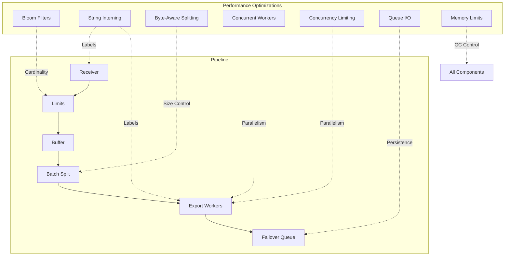
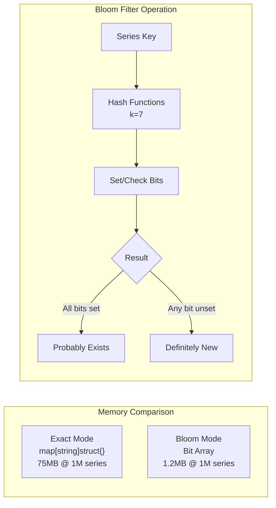
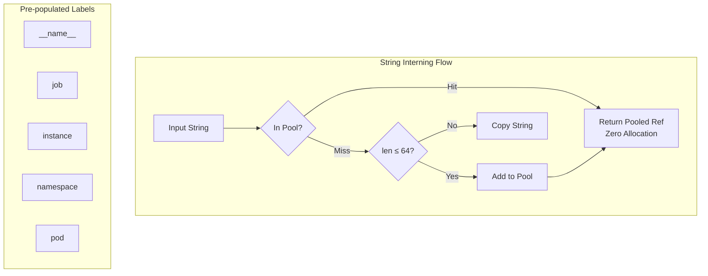
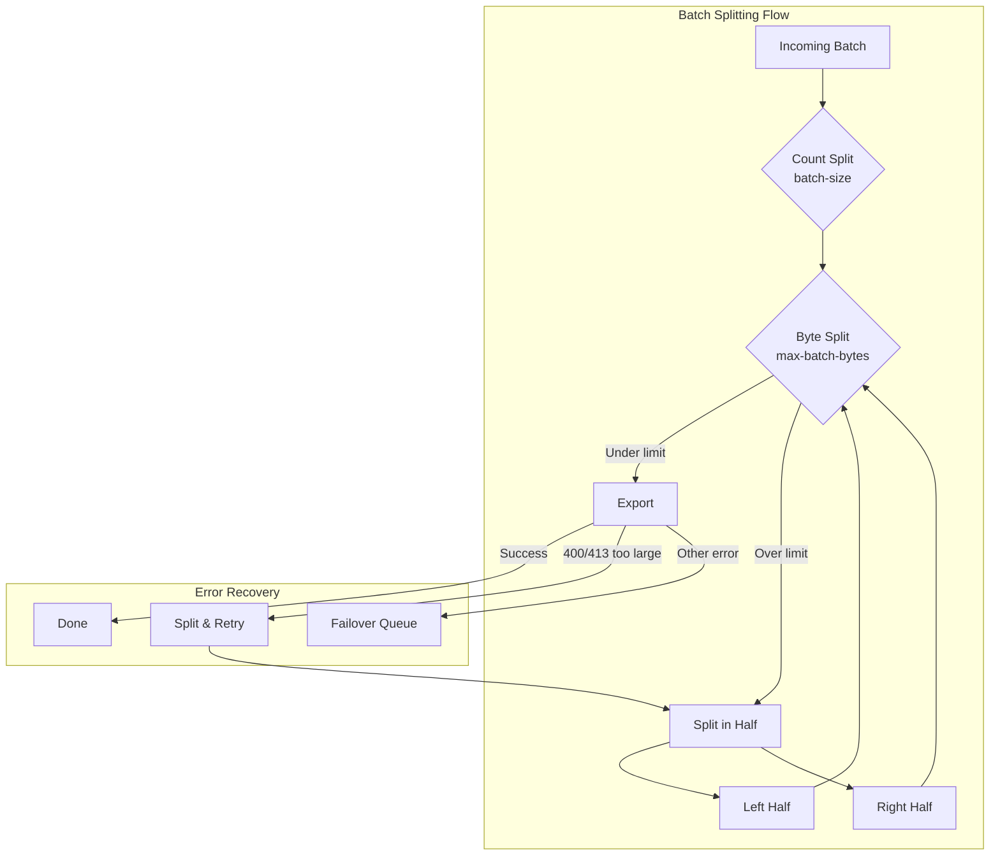
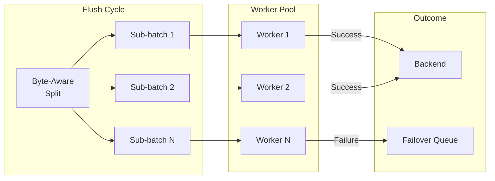
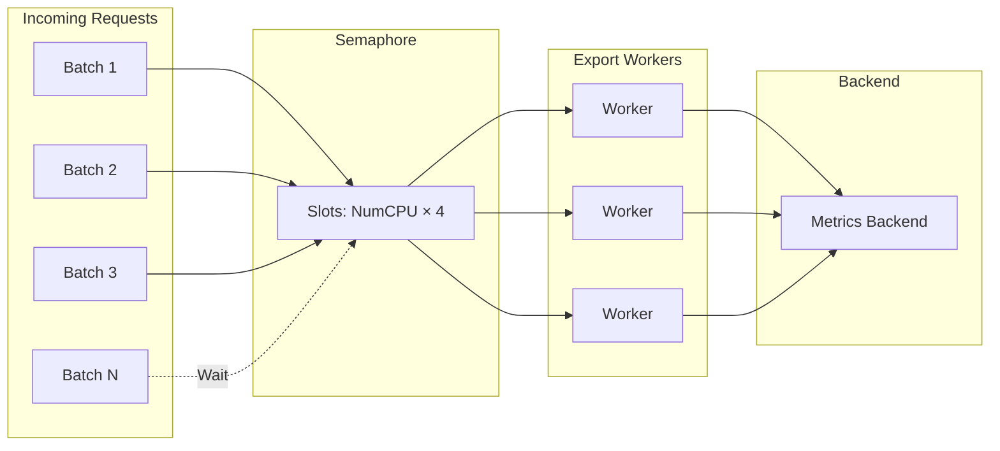
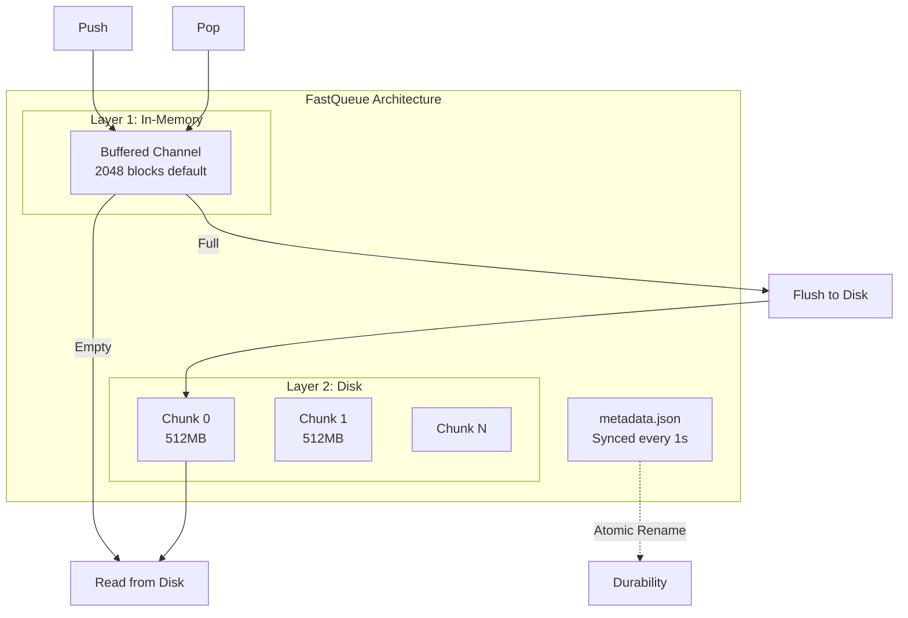
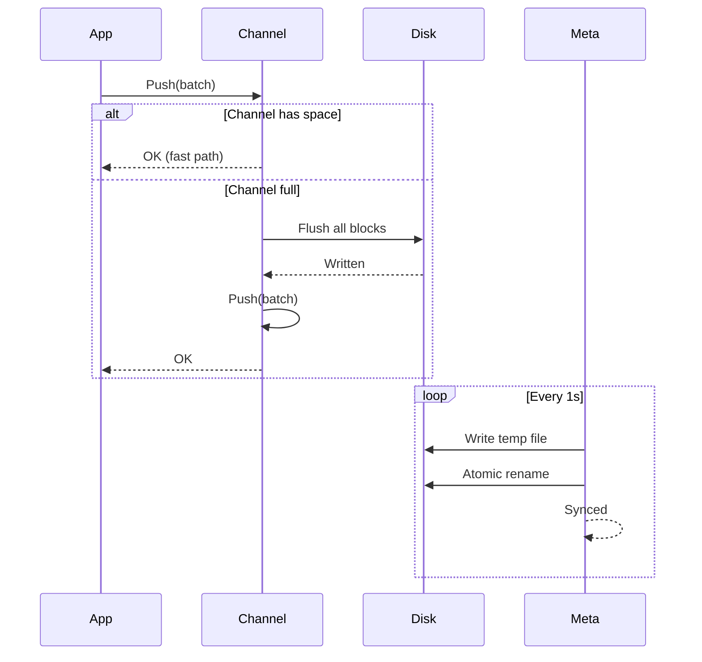
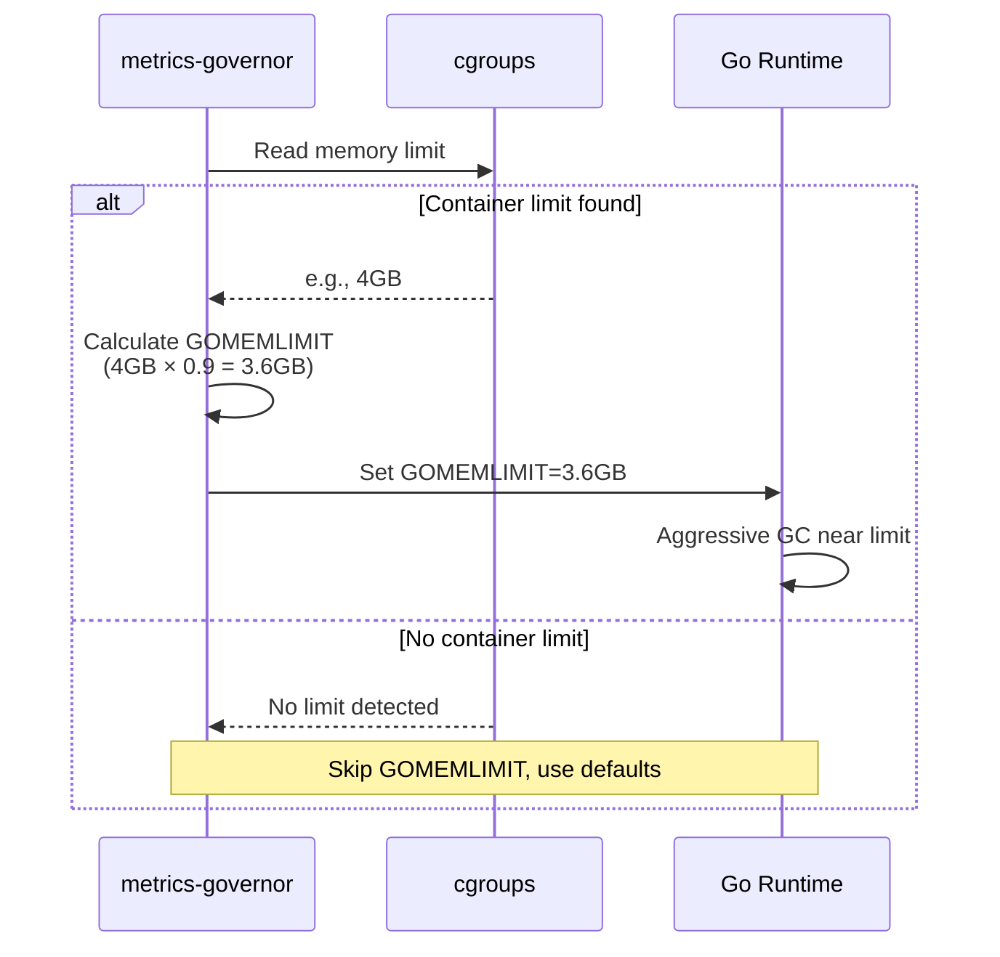
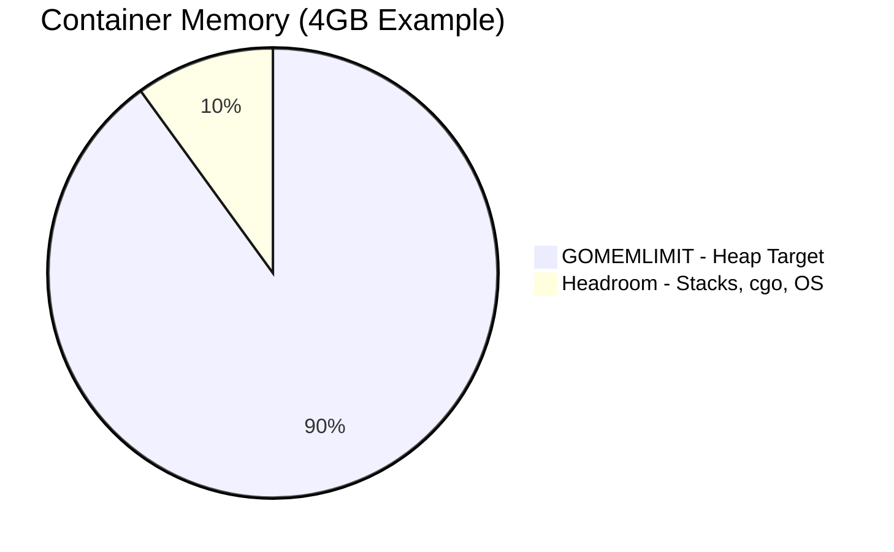

# Performance Optimizations

metrics-governor includes several high-performance optimizations for production workloads. **All optimizations apply to both OTLP and PRW pipelines.**

> **Note**: These optimizations are protocol-agnostic and work identically for both pipelines. The same memory savings, allocation reductions, and concurrency controls apply whether you're processing OTLP or Prometheus Remote Write metrics.

## Summary

| Optimization | OTLP | PRW | Memory Impact | CPU Impact |
|--------------|:----:|:---:|---------------|------------|
| Bloom Filters | Yes | Yes | -98% for cardinality tracking | Minimal |
| String Interning | Yes | Yes | -76% allocations | -12% CPU |
| Byte-Aware Batch Splitting | Yes | No | Minimal | Minimal |
| Split-on-Error | Yes | Yes | Minimal | Minimal |
| Concurrent Export Workers | Yes | No | Bounded goroutines | Controlled parallelism |
| Concurrency Limiting | Yes | Yes | Bounded goroutines | Controlled parallelism |
| Queue I/O Optimization | Yes | Yes | -40-60% disk (compression) | 10x throughput |
| Persistent Disk Queue | Yes | Yes | Bounded by max_bytes | Disk I/O |
| Memory Limit Auto-Detection | Yes | Yes | Prevents OOM kills | More predictable GC |
| Stats Threshold Filtering | Yes | Yes | -49% scrape bytes | -44% scrape latency |

### Architecture Overview



---

## Bloom Filter Cardinality Tracking

Cardinality tracking uses Bloom filters instead of maps for 98% memory reduction:

| Unique Series | map[string]struct{} | Bloom Filter (1% FPR) | Memory Savings |
|---------------|---------------------|------------------------|----------------|
| 10,000        | 750 KB              | 12 KB                  | **98%**        |
| 100,000       | 7.5 MB              | 120 KB                 | **98%**        |
| 1,000,000     | 75 MB               | 1.2 MB                 | **98%**        |
| 10,000,000    | 750 MB              | 12 MB                  | **98%**        |

**Applies to:** OTLP limits enforcer, OTLP stats collector, PRW limits enforcer, PRW stats collector

### How It Works



### Configuration

```bash
# Use Bloom filter mode (default, memory-efficient)
metrics-governor -cardinality-mode bloom -cardinality-expected-items 100000 -cardinality-fp-rate 0.01

# Use exact mode (100% accurate, higher memory)
metrics-governor -cardinality-mode exact
```

### Observability Metrics

| Metric | Type | Description |
|--------|------|-------------|
| `metrics_governor_cardinality_mode{mode}` | gauge | Active tracking mode (bloom=1 or exact=1) |
| `metrics_governor_cardinality_memory_bytes` | gauge | Total memory used by all stats trackers |
| `metrics_governor_cardinality_trackers_total` | gauge | Number of active trackers in stats collector |
| `metrics_governor_cardinality_config_expected_items` | gauge | Configured expected items per tracker |
| `metrics_governor_cardinality_config_fp_rate` | gauge | Configured false positive rate |
| `metrics_governor_rule_cardinality_memory_bytes{rule}` | gauge | Memory used per limits rule |
| `metrics_governor_limits_cardinality_memory_bytes` | gauge | Total memory used by limits trackers |
| `metrics_governor_limits_cardinality_trackers_total` | gauge | Number of trackers in limits enforcer |

### Monitoring Examples

**1. Monitor memory savings** - Compare actual vs expected map-based memory:

```promql
# Actual Bloom filter memory usage
metrics_governor_cardinality_memory_bytes + metrics_governor_limits_cardinality_memory_bytes

# Estimated map-based memory (75 bytes per series)
(sum(metrics_governor_metric_cardinality) + sum(metrics_governor_rule_group_cardinality)) * 75

# Memory savings ratio
1 - (metrics_governor_cardinality_memory_bytes / (sum(metrics_governor_metric_cardinality) * 75))
```

**2. Detect undersized trackers** - Alert when cardinality exceeds expected items:

```promql
# If any metric has cardinality >> expected_items, Bloom filter may have higher FP rate
max(metrics_governor_metric_cardinality) > metrics_governor_cardinality_config_expected_items * 2

# Recommendation: increase -cardinality-expected-items if this fires frequently
```

**3. Track memory by rule** - Identify which limits rules use most memory:

```promql
# Top 5 rules by memory usage
topk(5, metrics_governor_rule_cardinality_memory_bytes)

# Memory per tracker (avg bytes per group)
metrics_governor_rule_cardinality_memory_bytes / metrics_governor_rule_groups_total
```

**4. Verify Bloom mode is active** - Confirm memory-efficient mode:

```promql
# Should return 1 for bloom mode
metrics_governor_cardinality_mode{mode="bloom"}

# Alert if accidentally in exact mode (high memory)
metrics_governor_cardinality_mode{mode="exact"} == 1
```

**5. Capacity planning** - Project memory needs:

```promql
# Current bytes per tracker
metrics_governor_cardinality_memory_bytes / metrics_governor_cardinality_trackers_total

# Projected memory for 10x more trackers
(metrics_governor_cardinality_memory_bytes / metrics_governor_cardinality_trackers_total) * 10
```

---

## String Interning

Label string deduplication reduces allocations by 76%:

- Pre-populated pool for common Prometheus labels (`__name__`, `job`, `instance`, etc.)
- Zero-allocation cache hits using `sync.Map`
- Configurable max value length to balance memory vs deduplication

**Applies to:** OTLP shard key building, PRW label parsing, PRW shard key building

### How It Works



### Configuration

```bash
# Enable string interning (default: true)
metrics-governor -string-interning=true -intern-max-value-length=64
```

---

## Byte-Aware Batch Splitting

Batches are split by serialized byte size before export, preventing backend rejections due to oversized payloads:

- **Recursive binary split** - VMAgent-inspired pattern: if batch exceeds `max-batch-bytes`, split in half and check again
- **Default 8MB limit** - Safely under typical backend limits (e.g., VictoriaMetrics 16MB `opentelemetry.maxRequestSize`)
- **Split-on-error** - If backend returns HTTP 400/413 "too large", the batch is split in half and both halves retried automatically
- **Zero data loss** - Failed batches go to failover queue instead of being dropped

**Applies to:** OTLP buffer flush, PRW retry queue

> **Pipeline Parity**: Split-on-error works identically for both OTLP and PRW pipelines. OTLP splits at the ResourceMetrics level, PRW splits at the Timeseries level. Both detect HTTP 413 and "too big"/"too large"/"exceeding" patterns in response bodies.

### How It Works



### Configuration

```bash
# Set maximum batch size in bytes (default: 8MB)
metrics-governor -max-batch-bytes=8388608

# Disable byte splitting (count-only batching)
metrics-governor -max-batch-bytes=0
```

### Observability Metrics

| Metric | Type | Description |
|--------|------|-------------|
| `metrics_governor_batch_splits_total` | Counter | Number of byte-size-triggered batch splits |
| `metrics_governor_batch_bytes` | Histogram | Batch sizes in bytes before export |
| `metrics_governor_batch_too_large_total` | Counter | Batches that exceeded max-batch-bytes |
| `metrics_governor_export_retry_split_total` | Counter | Split-on-error retries (backend said too large) |

### Recommended Settings

| Backend | max-batch-bytes | Rationale |
|---------|-----------------|-----------|
| VictoriaMetrics (16MB limit) | `8388608` (8MB) | 50% headroom under default maxRequestSize |
| Grafana Mimir | `4194304` (4MB) | Conservative for multi-tenant ingestion |
| OTel Collector | `8388608` (8MB) | Standard default |
| Low-memory environments | `4194304` (4MB) | Smaller batches reduce peak memory |

---

## Concurrent Export Workers

Parallel export workers within each flush cycle maximize throughput:

- Controlled by `-export-concurrency` (default: `NumCPU * 4`)
- Each flush cycle dispatches sub-batches to concurrent workers via `sync.WaitGroup`
- Workers share a semaphore-based concurrency limiter
- Failed batches are pushed to the failover queue, not dropped

**Applies to:** OTLP buffer flush

### How It Works



### Observability Metrics

| Metric | Type | Description |
|--------|------|-------------|
| `metrics_governor_export_concurrent_workers` | Gauge | Active export worker goroutines |
| `metrics_governor_failover_queue_push_total` | Counter | Batches saved to failover queue on export failure |

---

## Concurrency Limiting

Semaphore-based limiting prevents goroutine explosion:

- Bounded at `NumCPU * 4` by default
- 88% reduction in concurrent goroutines under load
- Prevents memory exhaustion during traffic spikes

**Applies to:** OTLP buffer flush (concurrent export workers), OTLP sharded exporter, PRW sharded exporter

### How It Works



### Configuration

```bash
# Limit concurrent exports (default: NumCPU * 4)
metrics-governor -export-concurrency=32
```

---

## Queue I/O Optimization

FastQueue persistent queue with VictoriaMetrics-inspired design:

- **Two-layer architecture** - In-memory buffered channel (2048 blocks) + disk chunk files
- **Buffered I/O** - 256KB bufio.Writer coalesces small writes into fewer OS syscalls (~128x IOPS reduction)
- **Snappy compression** - Queue blocks compressed on disk (~65% throughput reduction, ~2.5-3x storage capacity)
- **Write coalescing** - Batch flush drains all in-memory blocks before writing, single bufio flush per batch
- **Metadata-only persistence** - Atomic JSON sync (default: 1s) for fast recovery
- **Automatic chunk rotation** - Configurable size boundaries for efficient disk usage
- **Adaptive sizing** - Automatically adjusts queue limits based on available disk space

**Applies to:** OTLP persistent queue, PRW persistent queue

### FastQueue Architecture



### Write Path



### I/O Optimizations

| Optimization | Impact | Cost |
|-------------|--------|------|
| In-memory buffer (2048 blocks) | Eliminates disk writes for short outages (~20-40s buffering) | +~2 MB memory per queue |
| Buffered writer (256KB) | ~128x IOPS reduction for sequential writes | +256 KB memory per queue |
| Write coalescing | Single flush per batch instead of per-block | Negligible |
| Snappy compression | ~65% disk throughput reduction, ~2.5-3x storage capacity | <1% CPU |

### Configuration

```bash
# Enable persistent queue
metrics-governor -queue-enabled=true -queue-path=/data/queue

# Configure in-memory buffer (default: 2048 blocks)
metrics-governor -queue-inmemory-blocks=2048

# Configure chunk size (default: 512MB)
metrics-governor -queue-chunk-size=536870912

# Configure metadata sync interval (default: 1s, max data loss window)
metrics-governor -queue-meta-sync=1s

# Configure stale flush interval (default: 30s)
metrics-governor -queue-stale-flush=30s

# Configure queue compression (default: snappy)
metrics-governor -queue-compression=snappy

# Configure write buffer size (default: 256KB)
metrics-governor -queue-write-buffer-size=262144
```

### Observability Metrics

| Metric | Type | Description |
|--------|------|-------------|
| `metrics_governor_fastqueue_inmemory_blocks` | gauge | Current in-memory block count |
| `metrics_governor_fastqueue_disk_bytes` | gauge | Bytes stored on disk |
| `metrics_governor_fastqueue_meta_sync_total` | counter | Metadata sync operations |
| `metrics_governor_fastqueue_chunk_rotations` | counter | Chunk file rotations |
| `metrics_governor_fastqueue_inmemory_flushes` | counter | Stale flushes to disk |
| `metrics_governor_queue_size` | gauge | Current number of batches in queue |
| `metrics_governor_queue_bytes` | gauge | Current queue size in bytes |
| `metrics_governor_queue_utilization_ratio` | gauge | Queue utilization (0.0-1.0) |

---

## Memory Limit Auto-Detection

Automatically detects container memory limits and sets GOMEMLIMIT for optimal GC behavior:

- **Container-aware** - Reads cgroups v1/v2 limits (Docker, Kubernetes)
- **OOM prevention** - GC becomes more aggressive as memory approaches limit
- **Configurable headroom** - Default 90% leaves 10% for non-heap memory

**Applies to:** All pipelines (global setting)

### How It Works





When heap approaches GOMEMLIMIT, Go's GC runs more frequently to avoid exceeding the limit.

### Configuration

```bash
# Enable memory limit auto-detection (default)
metrics-governor -memory-limit-ratio=0.9

# Use 85% for larger containers (more headroom)
metrics-governor -memory-limit-ratio=0.85

# Disable auto-detection
metrics-governor -memory-limit-ratio=0
```

### YAML Configuration

```yaml
memory:
  limit_ratio: 0.9    # Ratio of container memory for GOMEMLIMIT
```

### Recommended Settings

| Container Size | Ratio | GOMEMLIMIT | Headroom |
|----------------|-------|------------|----------|
| < 2GB | 0.90 | 1.8GB | 200MB |
| 2-4GB | 0.90 | 3.6GB | 400MB |
| 4-8GB | 0.85 | 6.8GB | 1.2GB |
| > 8GB | 0.85 | 85% | 15% |

> **Note**: For memory-constrained environments, consider reducing buffer sizes (`-buffer-size`, `-queue-inmemory-blocks`) in addition to setting memory limits.

See [resilience.md](./resilience.md) for detailed memory limit documentation.

---

## Caching Optimizations

The following table summarizes all caching and pooling optimizations applied across the hot path:

| Optimization | Memory Impact | CPU Impact | Hot Path |
|---|---|---|---|
| Compression Encoder Pooling | -80% encoder allocs | -15% compression CPU | Every export |
| Rule Matching Cache (LRU) | +~1MB cache | -90% regex CPU | Every metric |
| Series Key Slice Pooling | -70% slice allocs | Minimal | Every datapoint |
| Auth Pre-compute | Negligible | -100% base64 per-req | Every request |
| Dedup countDatapoints | None | -50% traversal CPU | Every batch |

### Compression Encoder Pooling

Compression encoders (gzip, zstd, snappy, etc.) are expensive to allocate. A `sync.Pool` is maintained per compression type so that encoders are reused across export requests rather than created and garbage-collected on every call. Each encoder is `Reset()` before being returned to the pool, which clears internal buffers and prevents cross-contamination between requests. This eliminates roughly 80% of encoder-related allocations and reduces compression CPU overhead by approximately 15%.

**Configuration**: Encoder pooling is always enabled and requires no configuration. Monitor pool effectiveness with the compression-related metrics exposed on the `/metrics` endpoint.

### Rule Matching Cache (LRU)

Every incoming metric must be matched against the configured limits rules, which can involve regex evaluation. The rule matching cache stores the result of recent match operations in an LRU cache, keyed by the metric name and label set. Subsequent metrics with the same identity skip regex evaluation entirely, reducing regex CPU usage by up to 90%.

**Configuration**: Control the maximum cache size with `-rule-cache-max-size` (default: 10000 entries, approximately 1MB). The cache uses LRU eviction so the least-recently-used entries are discarded when the cache is full. For label matchers, the cache bypasses regex and uses direct map lookups when possible.

**Monitoring**: Cache hit/miss rates are exposed via `metrics_governor_rule_cache_hits_total` and `metrics_governor_rule_cache_misses_total`.

### Series Key Slice Pooling

Building series keys requires assembling label names and values into a temporary byte slice. A `sync.Pool` of reusable slices is maintained so that each datapoint does not trigger a new heap allocation. Slices are returned to the pool after use, cutting slice allocations by approximately 70% with minimal CPU impact.

**Configuration**: Slice pooling is always enabled and requires no configuration.

### Auth Pre-compute

When basic authentication is configured, the Base64-encoded `Authorization` header value is computed once at startup and reused for every outbound request. This avoids repeated Base64 encoding on the hot path, eliminating 100% of per-request Base64 CPU cost.

**Configuration**: Pre-computation is automatic when `-exporter-basic-auth-user` and `-exporter-basic-auth-password` are set.

### Dedup countDatapoints

The `countDatapoints` function, used to calculate batch sizes for metrics and statistics, previously traversed nested data structures multiple times. The deduplicated implementation merges traversal passes into a single walk, reducing traversal CPU by approximately 50% per batch with no additional memory overhead.

**Configuration**: This optimization is always active and requires no configuration.

---

## Production Tuning Guide

This section provides concrete tuning recommendations for large-scale production deployments handling **millions of datapoints per minute** and **tens of thousands of unique series**.

### Limits Enforcer — Stats Threshold

The per-group stats reporting on the `/metrics` endpoint scales linearly with the number of tracked groups. In high-cardinality environments (10K+ groups), this can produce **megabytes of scrape output** and dominate Prometheus scrape time.

**Benchmark results** (1,000 groups, ~50% filtered):

| Metric | No threshold | threshold=5 | Reduction |
|--------|:-----------:|:-----------:|:---------:|
| Latency | 345 µs/op | 192 µs/op | **44%** |
| Memory | 312 KB/op | 159 KB/op | **49%** |
| Allocations | 2,756/op | 1,403/op | **49%** |

Savings scale linearly — with 10K groups and threshold filtering 90% of them, expect ~90% reduction in scrape output.

```yaml
limits:
  stats_threshold: 100  # Only report groups with >= 100 datapoints or cardinality
```

See [limits.md](./limits.md#per-group-stats-threshold) for full configuration details.

### Rule Cache Sizing

The rule matching LRU cache avoids regex evaluation for previously seen metric identities. In production, the default 10K entries may be insufficient for high-cardinality workloads:

```bash
# High-cardinality workloads (100K+ unique metric names)
metrics-governor -rule-cache-max-size=100000

# Monitor effectiveness — hit ratio should be > 95%
# rate(metrics_governor_rule_cache_hits_total[5m]) / (rate(metrics_governor_rule_cache_hits_total[5m]) + rate(metrics_governor_rule_cache_misses_total[5m]))
```

Each cache entry is ~100 bytes, so 100K entries ≈ 10 MB — a worthwhile trade-off for eliminating regex evaluation on the hot path.

### Cardinality Tracker Mode

For production deployments with unknown or highly variable cardinality, use **hybrid mode**:

```yaml
cardinality:
  mode: hybrid
  expected_items: 100000
  fp_rate: 0.01
  hll_threshold: 50000
```

This starts with memory-efficient Bloom filters and automatically switches to HLL when cardinality exceeds the threshold. The switch preserves the approximate count without resetting statistics.

**Memory planning by mode:**

| Cardinality | Bloom (1% FPR) | HLL (p=14) | Exact (map) |
|-------------|:--------------:|:----------:|:-----------:|
| 10K series | 12 KB | 12 KB | 750 KB |
| 100K series | 120 KB | 12 KB | 7.5 MB |
| 1M series | 1.2 MB | 12 KB | 75 MB |
| 10M series | 12 MB | 12 KB | 750 MB |

### Export Pipeline Tuning

| Setting | Small (<1M dps/min) | Medium (1-10M dps/min) | Large (10M+ dps/min) |
|---------|:-------------------:|:----------------------:|:--------------------:|
| `-batch-size` | 500 | 1000 | 2000 |
| `-max-batch-bytes` | 4 MB | 8 MB | 8 MB |
| `-export-concurrency` | 4 | `NumCPU * 2` | `NumCPU * 4` |
| `-buffer-size` | 100 | 500 | 1000 |
| `-string-interning` | true | true | true |
| `-intern-max-value-length` | 64 | 64 | 128 |

### Memory Configuration

```yaml
memory:
  limit_ratio: 0.9    # Leave 10% for non-heap

# For large containers (> 4GB), use 0.85 to leave more headroom
memory:
  limit_ratio: 0.85
```

**Container sizing guidelines:**

| Throughput | Recommended Memory | GOMEMLIMIT | Queue Disk |
|------------|:-----------------:|:----------:|:----------:|
| < 1M dps/min | 512 MB | 460 MB | 1 GB |
| 1-5M dps/min | 1 GB | 900 MB | 5 GB |
| 5-20M dps/min | 2 GB | 1.7 GB | 10 GB |
| 20-100M dps/min | 4 GB | 3.4 GB | 20 GB |
| 100M+ dps/min | 8 GB | 6.8 GB | 50 GB |

### Persistent Queue Tuning

For production resilience during backend outages:

```yaml
queue:
  enabled: true
  path: /data/queue
  max_bytes: 10737418240  # 10 GB
  inmemory_blocks: 4096   # ~40s buffer for 100K dps/min
  chunk_size: 536870912   # 512 MB chunks
  compression: snappy     # ~65% size reduction
  write_buffer_size: 262144  # 256 KB
  stale_flush: 30s
  meta_sync: 1s           # Max 1s data loss window
```

**Queue sizing formula:**

```
Required disk = (datapoints/min × avg_bytes_per_dp × desired_minutes) / compression_ratio

Example: 10M dps/min × 50 bytes × 30 min / 3 ≈ 5 GB
```

### Prometheus Scrape Optimization

When metrics-governor itself produces high-cardinality output (many rules × many groups), optimize the scrape:

```yaml
# prometheus.yml
scrape_configs:
  - job_name: metrics-governor
    scrape_interval: 30s     # Don't scrape too frequently
    scrape_timeout: 15s      # Allow time for large responses
    metrics_path: /metrics
    params:
      # Use stats threshold to reduce output
      # (configured on metrics-governor side)
```

Combine the stats threshold with Prometheus `metric_relabel_configs` to further reduce stored series if needed:

```yaml
    metric_relabel_configs:
      # Drop per-group metrics if you only need rule-level aggregates
      - source_labels: [__name__]
        regex: 'metrics_governor_rule_group_(datapoints|cardinality)'
        action: drop
```

### Complete Production Configuration

```bash
metrics-governor \
  # Pipeline
  -receiver-addr :4317 \
  -exporter-endpoint https://vm.example.com/api/v1/import/prometheus \
  -exporter-compression snappy \
  \
  # Limits
  -limits-config /etc/limits/limits.yaml \
  -limits-dry-run=false \
  -limits-stats-threshold=100 \
  -rule-cache-max-size=50000 \
  \
  # Cardinality
  -cardinality-mode hybrid \
  -cardinality-expected-items 100000 \
  -cardinality-hll-threshold 50000 \
  \
  # Performance
  -batch-size 1000 \
  -max-batch-bytes 8388608 \
  -export-concurrency 32 \
  -buffer-size 500 \
  -string-interning=true \
  \
  # Resilience
  -queue-enabled=true \
  -queue-path /data/queue \
  -queue-max-bytes 10737418240 \
  -queue-compression snappy \
  -memory-limit-ratio 0.9
```

---

## VictoriaMetrics Inspiration

Many of these optimizations are inspired by techniques described in [VictoriaMetrics articles](https://valyala.medium.com/), including:

- String interning for label deduplication
- Bloom filters for cardinality tracking
- Efficient queue design with metadata-only persistence
- Memory-aware resource management
