# Performance Optimizations

## Table of Contents

- [Summary](#summary)
  - [Architecture Overview](#architecture-overview)
- [Bloom Filter Cardinality Tracking](#bloom-filter-cardinality-tracking)
  - [How It Works](#how-it-works)
  - [Configuration](#configuration)
  - [Observability Metrics](#observability-metrics)
  - [Monitoring Examples](#monitoring-examples)
- [String Interning](#string-interning)
  - [How It Works](#how-it-works-1)
  - [Configuration](#configuration-1)
- [Byte-Aware Batch Splitting](#byte-aware-batch-splitting)
  - [How It Works](#how-it-works-2)
  - [Configuration](#configuration-2)
  - [Observability Metrics](#observability-metrics-1)
  - [Recommended Settings](#recommended-settings)
- [Worker Pool Architecture](#worker-pool-architecture)
  - [How It Works](#how-it-works-3)
  - [Why Always-Queue?](#why-always-queue)
  - [Observability Metrics](#observability-metrics-2)
  - [Configuration](#configuration-3)
- [Pipeline Split Architecture](#pipeline-split-architecture)
  - [How It Works](#how-it-works-4)
  - [Why Pipeline Split?](#why-pipeline-split)
  - [Observability Metrics](#observability-metrics-3)
  - [Configuration](#configuration-4)
  - [Recommended Settings](#recommended-settings-1)
  - [Monitoring Examples](#monitoring-examples-1)
- [Batch Size Auto-tuning (AIMD)](#batch-size-auto-tuning-aimd)
  - [How It Works](#how-it-works-5)
  - [AIMD Convergence](#aimd-convergence)
  - [Observability Metrics](#observability-metrics-4)
  - [Configuration](#configuration-5)
  - [Recommended Settings](#recommended-settings-2)
  - [Monitoring Examples](#monitoring-examples-2)
- [Adaptive Worker Scaling (AIMD)](#adaptive-worker-scaling-aimd)
  - [Scaling Decision Flow](#scaling-decision-flow)
  - [EWMA Latency Tracking](#ewma-latency-tracking)
  - [Observability Metrics](#observability-metrics-5)
  - [Configuration](#configuration-6)
  - [Recommended Settings](#recommended-settings-3)
  - [Monitoring Examples](#monitoring-examples-3)
- [Async Send (Semaphore-Bounded Concurrency)](#async-send-semaphore-bounded-concurrency)
  - [How It Works](#how-it-works-6)
  - [Observability Metrics](#observability-metrics-6)
  - [Configuration](#configuration-7)
  - [Recommended Settings](#recommended-settings-4)
- [Connection Pre-warming](#connection-pre-warming)
  - [How It Works](#how-it-works-7)
  - [Observability Metrics](#observability-metrics-7)
  - [Configuration](#configuration-8)
- [Percentage-Based Memory Sizing](#percentage-based-memory-sizing)
  - [Memory Budget](#memory-budget)
  - [Buffer Full Policies](#buffer-full-policies)
  - [Configuration](#configuration-9)
- [Queue I/O Optimization](#queue-io-optimization)
  - [FastQueue Architecture](#fastqueue-architecture)
  - [Write Path](#write-path)
  - [I/O Optimizations](#io-optimizations)
  - [Configuration](#configuration-10)
  - [Observability Metrics](#observability-metrics-8)
- [Memory Limit Auto-Detection](#memory-limit-auto-detection)
  - [How It Works](#how-it-works-8)
  - [Configuration](#configuration-11)
  - [YAML Configuration](#yaml-configuration)
  - [Recommended Settings](#recommended-settings-5)
- [Caching Optimizations](#caching-optimizations)
  - [Compression Encoder Pooling](#compression-encoder-pooling)
  - [Rule Matching Cache (LRU)](#rule-matching-cache-lru)
  - [Series Key Slice Pooling](#series-key-slice-pooling)
  - [Auth Pre-compute](#auth-pre-compute)
  - [Dedup countDatapoints](#dedup-countdatapoints)
- [Production Tuning Guide](#production-tuning-guide)
  - [Limits Enforcer — Stats Threshold](#limits-enforcer--stats-threshold)
  - [Rule Cache Sizing](#rule-cache-sizing)
  - [Cardinality Tracker Mode](#cardinality-tracker-mode)
  - [Export Pipeline Tuning](#export-pipeline-tuning)
  - [Memory Configuration](#memory-configuration)
  - [Persistent Queue Tuning](#persistent-queue-tuning)
  - [Prometheus Scrape Optimization](#prometheus-scrape-optimization)
  - [Complete Production Configuration](#complete-production-configuration)
- [New Feature Cost Reference](#new-feature-cost-reference)
- [Performance Tuning Knobs](#performance-tuning-knobs)
  - [Three Performance Axes](#three-performance-axes)
  - [Configuration Profiles](#configuration-profiles)
  - [Micro-optimizations](#micro-optimizations)
  - [Runtime Flexibility](#runtime-flexibility)
- [VictoriaMetrics Inspiration](#victoriametrics-inspiration)

metrics-governor includes several high-performance optimizations for production workloads. **All optimizations apply to both OTLP and PRW pipelines.**

> **Note**: These optimizations are protocol-agnostic and work identically for both pipelines. The same memory savings, allocation reductions, and concurrency controls apply whether you're processing OTLP or Prometheus Remote Write metrics.

## Summary

| Optimization | OTLP | PRW | Memory Impact | CPU Impact |
|--------------|:----:|:---:|---------------|------------|
| Bloom Filters | Yes | Yes | -98% for cardinality tracking | Minimal |
| String Interning | Yes | Yes | -76% allocations | -12% CPU |
| Byte-Aware Batch Splitting | Yes | No | Minimal | Minimal |
| Split-on-Error | Yes | Yes | Minimal | Minimal |
| Worker Pool (Always-Queue) | Yes | Yes | Bounded goroutines | Pull-based parallelism |
| Percentage Memory Sizing | Yes | Yes | Scales with container | Minimal |
| Queue I/O Optimization | Yes | Yes | -40-60% disk (compression) | 10x throughput |
| Persistent Disk Queue | Yes | Yes | Bounded by max_bytes | Disk I/O |
| Memory Limit Auto-Detection | Yes | Yes | Prevents OOM kills | More predictable GC |
| Stats Threshold Filtering | Yes | Yes | -49% scrape bytes | -44% scrape latency |
| Pipeline Split | Yes | Yes | Bounded goroutines | +50-80% throughput |
| Batch Auto-tuning | Yes | Yes | Minimal | AIMD batch sizing |
| Adaptive Scaling | Yes | Yes | Dynamic goroutines | Queue-driven scaling |
| Async Send | Yes | Yes | Minimal | +20-30% throughput |
| Connection Pre-warming | Yes | Yes | Minimal | Eliminates cold-start |

### Architecture Overview

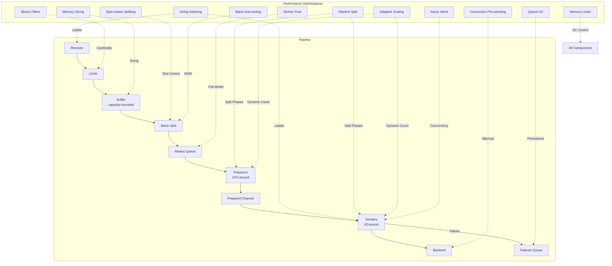
```mermaid
graph TB
    subgraph "Performance Optimizations"
        BF[Bloom Filters]
        SI[String Interning]
        BS[Byte-Aware Splitting]
        WP[Worker Pool]
        PS[Pipeline Split]
        BAT[Batch Auto-tuning]
        AS[Adaptive Scaling]
        ASYNC[Async Send]
        CW[Connection Pre-warming]
        MS[Memory Sizing]
        QIO[Queue I/O]
        ML[Memory Limits]
    end

    subgraph "Pipeline"
        RX[Receiver] --> LIM[Limits]
        LIM --> BUF[Buffer\ncapacity-bounded]
        BUF --> SPLIT[Batch Split]
        SPLIT --> Q[Always Queue]
        Q --> PREP[Preparers\nCPU-bound]
        PREP --> CH[Prepared Channel]
        CH --> SND[Senders\nI/O-bound]
        SND --> BE[Backend]
        SND -->|Failure| FQ[Failover Queue]
    end

    BF -.->|Cardinality| LIM
    SI -.->|Labels| RX
    SI -.->|Labels| SND
    BS -.->|Size Control| SPLIT
    WP -.->|Pull Model| Q
    PS -.->|Split Phases| PREP
    PS -.->|Split Phases| SND
    BAT -.->|AIMD| SPLIT
    AS -.->|Dynamic Count| PREP
    AS -.->|Dynamic Count| SND
    ASYNC -.->|Concurrency| SND
    CW -.->|Warmup| BE
    MS -.->|Sizing| BUF
    QIO -.->|Persistence| FQ
    ML -.->|GC Control| ALL[All Components]
```

---

## Bloom Filter Cardinality Tracking

Cardinality tracking uses Bloom filters instead of maps for 98% memory reduction:

| Unique Series | map[string]struct{} | Bloom Filter (1% FPR) | Memory Savings |
|---------------|---------------------|------------------------|----------------|
| 10,000        | 750 KB              | 12 KB                  | **98%**        |
| 100,000       | 7.5 MB              | 120 KB                 | **98%**        |
| 1,000,000     | 75 MB               | 1.2 MB                 | **98%**        |
| 10,000,000    | 750 MB              | 12 MB                  | **98%**        |

**Applies to:** OTLP limits enforcer, OTLP stats collector, PRW limits enforcer, PRW stats collector

### How It Works

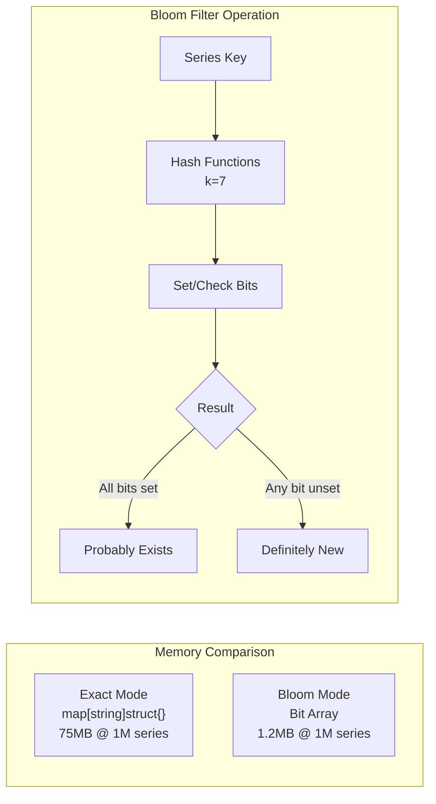
```mermaid
graph LR
    subgraph "Memory Comparison"
        direction TB
        EXACT["Exact Mode<br/>map[string]struct{}<br/>75MB @ 1M series"]
        BLOOM["Bloom Mode<br/>Bit Array<br/>1.2MB @ 1M series"]
    end

    subgraph "Bloom Filter Operation"
        KEY[Series Key] --> HASH[Hash Functions<br/>k=7]
        HASH --> BITS[Set/Check Bits]
        BITS --> RESULT{Result}
        RESULT -->|All bits set| MAYBE[Probably Exists]
        RESULT -->|Any bit unset| NO[Definitely New]
    end
```

### Configuration

```bash
# Use Bloom filter mode (default, memory-efficient)
metrics-governor -cardinality-mode bloom -cardinality-expected-items 100000 -cardinality-fp-rate 0.01

# Use exact mode (100% accurate, higher memory)
metrics-governor -cardinality-mode exact
```

### Observability Metrics

| Metric | Type | Description |
|--------|------|-------------|
| `metrics_governor_cardinality_mode{mode}` | gauge | Active tracking mode (bloom=1 or exact=1) |
| `metrics_governor_cardinality_memory_bytes` | gauge | Total memory used by all stats trackers |
| `metrics_governor_cardinality_trackers_total` | gauge | Number of active trackers in stats collector |
| `metrics_governor_cardinality_config_expected_items` | gauge | Configured expected items per tracker |
| `metrics_governor_cardinality_config_fp_rate` | gauge | Configured false positive rate |
| `metrics_governor_rule_cardinality_memory_bytes{rule}` | gauge | Memory used per limits rule |
| `metrics_governor_limits_cardinality_memory_bytes` | gauge | Total memory used by limits trackers |
| `metrics_governor_limits_cardinality_trackers_total` | gauge | Number of trackers in limits enforcer |

### Monitoring Examples

**1. Monitor memory savings** - Compare actual vs expected map-based memory:

```promql
# Actual Bloom filter memory usage
metrics_governor_cardinality_memory_bytes + metrics_governor_limits_cardinality_memory_bytes

# Estimated map-based memory (75 bytes per series)
(sum(metrics_governor_metric_cardinality) + sum(metrics_governor_rule_group_cardinality)) * 75

# Memory savings ratio
1 - (metrics_governor_cardinality_memory_bytes / (sum(metrics_governor_metric_cardinality) * 75))
```

**2. Detect undersized trackers** - Alert when cardinality exceeds expected items:

```promql
# If any metric has cardinality >> expected_items, Bloom filter may have higher FP rate
max(metrics_governor_metric_cardinality) > metrics_governor_cardinality_config_expected_items * 2

# Recommendation: increase -cardinality-expected-items if this fires frequently
```

**3. Track memory by rule** - Identify which limits rules use most memory:

```promql
# Top 5 rules by memory usage
topk(5, metrics_governor_rule_cardinality_memory_bytes)

# Memory per tracker (avg bytes per group)
metrics_governor_rule_cardinality_memory_bytes / metrics_governor_rule_groups_total
```

**4. Verify Bloom mode is active** - Confirm memory-efficient mode:

```promql
# Should return 1 for bloom mode
metrics_governor_cardinality_mode{mode="bloom"}

# Alert if accidentally in exact mode (high memory)
metrics_governor_cardinality_mode{mode="exact"} == 1
```

**5. Capacity planning** - Project memory needs:

```promql
# Current bytes per tracker
metrics_governor_cardinality_memory_bytes / metrics_governor_cardinality_trackers_total

# Projected memory for 10x more trackers
(metrics_governor_cardinality_memory_bytes / metrics_governor_cardinality_trackers_total) * 10
```

---

## String Interning

Label string deduplication reduces allocations by 76%:

- Pre-populated pool for common Prometheus labels (`__name__`, `job`, `instance`, etc.)
- Zero-allocation cache hits using `sync.Map`
- Configurable max value length to balance memory vs deduplication

**Applies to:** OTLP shard key building, PRW label parsing, PRW shard key building

### How It Works

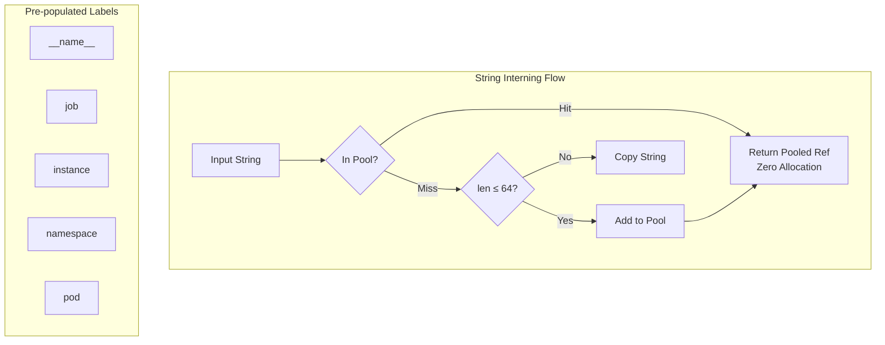
```mermaid
flowchart TB
    subgraph "String Interning Flow"
        IN[Input String] --> CHECK{In Pool?}
        CHECK -->|Hit| RET[Return Pooled Ref<br/>Zero Allocation]
        CHECK -->|Miss| LEN{len ≤ 64?}
        LEN -->|Yes| ADD[Add to Pool]
        LEN -->|No| COPY[Copy String]
        ADD --> RET
    end

    subgraph "Pre-populated Labels"
        L1["__name__"]
        L2["job"]
        L3["instance"]
        L4["namespace"]
        L5["pod"]
    end
```

### Configuration

```bash
# Enable string interning (default: true)
metrics-governor -string-interning=true -intern-max-value-length=64
```

---

## Byte-Aware Batch Splitting

Batches are split by serialized byte size before export, preventing backend rejections due to oversized payloads:

- **Recursive binary split** - VMAgent-inspired pattern: if batch exceeds `max-batch-bytes`, split in half and check again
- **Default 8MB limit** - Safely under typical backend limits (e.g., VictoriaMetrics 16MB `opentelemetry.maxRequestSize`)
- **Split-on-error** - If backend returns HTTP 400/413 "too large", the batch is split in half and both halves retried automatically
- **Zero data loss** - Failed batches go to failover queue instead of being dropped
- **Depth-limited** - Maximum split depth of 4 (produces at most 16 sub-batches) prevents unbounded recursion

**Applies to:** OTLP buffer flush, PRW retry queue

> **Pipeline Parity**: Split-on-error works identically for both OTLP and PRW pipelines. OTLP splits at the ResourceMetrics level, PRW splits at the Timeseries level. Both detect HTTP 413 and "too big"/"too large"/"exceeding" patterns in response bodies.

### How It Works

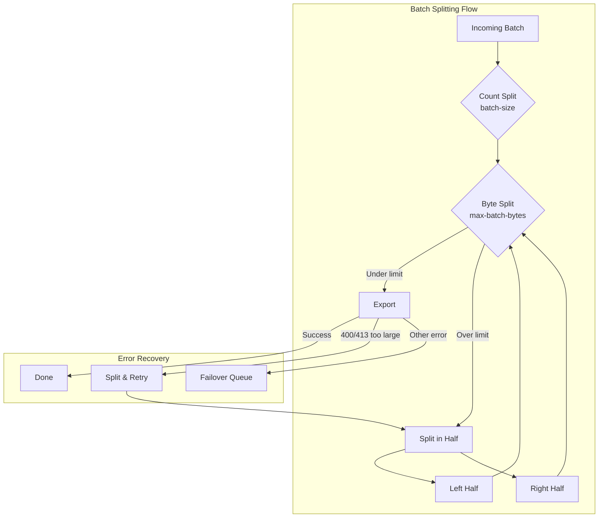
```mermaid
flowchart TB
    subgraph "Batch Splitting Flow"
        BATCH[Incoming Batch] --> COUNT{Count Split<br/>batch-size}
        COUNT --> BYTES{Byte Split<br/>max-batch-bytes}
        BYTES -->|Under limit| EXPORT[Export]
        BYTES -->|Over limit| HALF[Split in Half]
        HALF --> L[Left Half]
        HALF --> R[Right Half]
        L --> BYTES
        R --> BYTES
    end

    subgraph "Error Recovery"
        EXPORT -->|Success| DONE[Done]
        EXPORT -->|"400/413 too large"| SPLIT_RETRY[Split & Retry]
        EXPORT -->|Other error| FAILOVER[Failover Queue]
        SPLIT_RETRY --> HALF
    end
```

### Configuration

```bash
# Set maximum batch size in bytes (default: 8MB)
metrics-governor -max-batch-bytes=8388608

# Disable byte splitting (count-only batching)
metrics-governor -max-batch-bytes=0
```

### Observability Metrics

| Metric | Type | Description |
|--------|------|-------------|
| `metrics_governor_batch_splits_total` | Counter | Number of byte-size-triggered batch splits |
| `metrics_governor_batch_bytes` | Histogram | Batch sizes in bytes before export |
| `metrics_governor_batch_too_large_total` | Counter | Batches that exceeded max-batch-bytes |
| `metrics_governor_export_retry_split_total` | Counter | Split-on-error retries (backend said too large) |

### Recommended Settings

| Backend | max-batch-bytes | Rationale |
|---------|-----------------|-----------|
| VictoriaMetrics (16MB limit) | `8388608` (8MB) | 50% headroom under default maxRequestSize |
| Grafana Mimir | `4194304` (4MB) | Conservative for multi-tenant ingestion |
| OTel Collector | `8388608` (8MB) | Standard default |
| Low-memory environments | `4194304` (4MB) | Smaller batches reduce peak memory |

---

## Worker Pool Architecture

Pull-based worker pool drains the queue concurrently, replacing the previous per-flush concurrent worker model:

- **Always-queue model** - `Export()` always pushes to queue (returns instantly), workers pull from queue
- **Worker count** - Default `2 × NumCPU` (I/O-bound workers benefit from exceeding CPU count, matching VMAgent's approach)
- **Self-regulating rate** - Workers only pull next item after current export completes (no prefetch)
- **Per-worker backoff** - Each worker manages its own exponential backoff independently
- **Graceful shutdown** - Workers finish in-flight exports before stopping; remaining queue items drained

**Applies to:** OTLP pipeline, PRW pipeline (identical behavior)

### How It Works

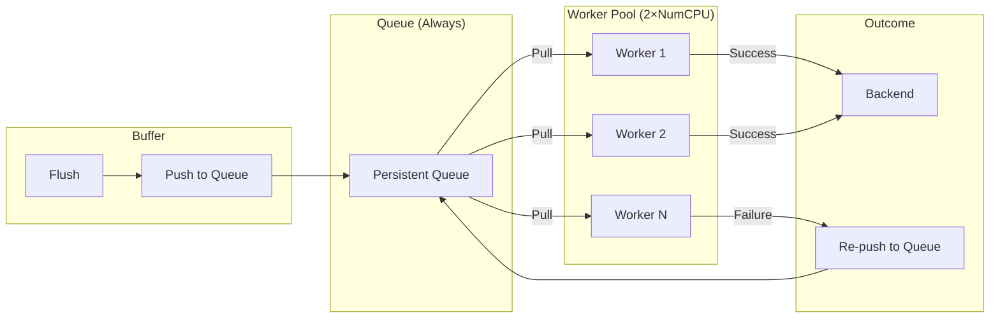
```mermaid
flowchart LR
    subgraph "Buffer"
        FLUSH[Flush] --> PUSH[Push to Queue]
    end

    subgraph "Queue (Always)"
        Q[Persistent Queue]
    end

    subgraph "Worker Pool (2×NumCPU)"
        W1[Worker 1]
        W2[Worker 2]
        WN[Worker N]
    end

    subgraph "Outcome"
        BE[Backend]
        RETRY[Re-push to Queue]
    end

    PUSH --> Q
    Q -->|Pull| W1 -->|Success| BE
    Q -->|Pull| W2 -->|Success| BE
    Q -->|Pull| WN -->|Failure| RETRY
    RETRY --> Q
```

### Why Always-Queue?

| Aspect | Previous (try-direct) | Always-Queue |
|--------|----------------------|--------------|
| Flush blocking | `wg.Wait()` blocks until all exports complete | Instant return (push to queue) |
| Memory under slow destinations | Unbounded growth (buffer keeps accumulating) | Bounded by buffer capacity + queue size |
| Concurrency control | Semaphore in buffer flush path | N workers pull at their own pace |
| Failure handling | Queue on failure only | Queue always; workers handle retries |

### Observability Metrics

| Metric | Type | Description |
|--------|------|-------------|
| `metrics_governor_queue_workers_active` | Gauge | Active worker goroutines |
| `metrics_governor_queue_workers_total` | Gauge | Configured worker count |
| `metrics_governor_queue_push_total` | Counter | Batches pushed to queue |
| `metrics_governor_queue_retry_total` | Counter | Retry attempts by workers |

### Configuration

```bash
# Worker count (default: 2 × NumCPU, auto-scales with hardware)
metrics-governor -queue-workers=0

# Explicit worker count
metrics-governor -queue-workers=16
```

---

## Pipeline Split Architecture

The pipeline split separates CPU-bound work (compression) from I/O-bound work (HTTP send) for higher throughput. Instead of a single pool of workers that both serialize and send, the pipeline is divided into two specialized stages connected by a bounded channel.

- **Preparers** (default: NumCPU) -- Pop from queue, serialize and compress data using sync.Pool encoders
- **Bounded Channel** -- PreparedEntry channel (default: 256 entries) connects preparers to senders
- **Senders** (default: NumCPU x 2) -- Pop from channel, HTTP send to backend with connection reuse

**Applies to:** OTLP pipeline, PRW pipeline (identical behavior)

### How It Works

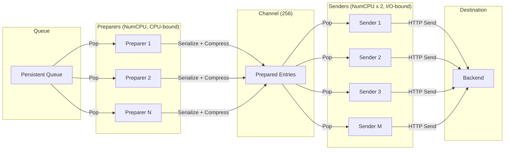
```mermaid
flowchart LR
    subgraph "Queue"
        Q[Persistent Queue]
    end

    subgraph "Preparers (NumCPU, CPU-bound)"
        P1[Preparer 1]
        P2[Preparer 2]
        PN[Preparer N]
    end

    subgraph "Channel (256)"
        CH[Prepared Entries]
    end

    subgraph "Senders (NumCPU x 2, I/O-bound)"
        S1[Sender 1]
        S2[Sender 2]
        S3[Sender 3]
        SM[Sender M]
    end

    subgraph "Destination"
        BE[Backend]
    end

    Q -->|Pop| P1
    Q -->|Pop| P2
    Q -->|Pop| PN
    P1 -->|Serialize + Compress| CH
    P2 -->|Serialize + Compress| CH
    PN -->|Serialize + Compress| CH
    CH -->|Pop| S1
    CH -->|Pop| S2
    CH -->|Pop| S3
    CH -->|Pop| SM
    S1 -->|HTTP Send| BE
    S2 -->|HTTP Send| BE
    S3 -->|HTTP Send| BE
    SM -->|HTTP Send| BE
```

### Why Pipeline Split?

| Aspect | Unified Workers | Pipeline Split |
|--------|---------------|----------------|
| Throughput | Limited by slower phase (HTTP I/O) | Each phase runs at its own pace |
| CPU utilization | Workers idle during HTTP wait | Preparers fully utilize CPU |
| Scalability | Single pool size | Independent preparer/sender counts |
| Typical throughput | ~250k dp/s | ~400-450k dp/s |

With unified workers, every worker must wait for the HTTP round-trip before it can begin compressing the next batch. Pipeline split decouples these phases so that preparers can continuously saturate CPU while senders independently saturate network I/O. The bounded channel provides natural backpressure: if senders fall behind, the channel fills and preparers block, preventing unbounded memory growth.

### Observability Metrics

| Metric | Type | Description |
|--------|------|-------------|
| `metrics_governor_queue_preparers_active` | Gauge | Active preparer goroutines |
| `metrics_governor_queue_senders_active` | Gauge | Active sender goroutines |
| `metrics_governor_queue_preparers_total` | Gauge | Configured preparer count |
| `metrics_governor_queue_senders_total` | Gauge | Configured sender count |
| `metrics_governor_queue_prepared_channel_length` | Gauge | Items in prepared channel |

### Configuration

```bash
# Enable pipeline split (default: false for backward compatibility)
metrics-governor -queue-pipeline-split-enabled=true

# Customize preparer and sender counts (0 = auto-detect based on NumCPU)
metrics-governor -queue-preparer-count=8 -queue-sender-count=16 -queue-pipeline-channel-size=256
```

### Recommended Settings

| Deployment | Preparers | Senders | Channel Size |
|------------|:---------:|:-------:|:------------:|
| Small (<1M dps/min) | 0 (auto) | 0 (auto) | 256 |
| Medium (1-10M dps/min) | 0 (auto) | 0 (auto) | 256 |
| Large (10M+ dps/min) | 0 (auto) | 0 (auto) | 512 |
| High-latency backend | 0 (auto) | NumCPU x 4 | 512 |

### Monitoring Examples

**1. Pipeline balance** -- Preparers and senders should both be active:

```promql
# If preparers_active >> senders_active, senders are the bottleneck
metrics_governor_queue_preparers_active / metrics_governor_queue_senders_active

# If channel is consistently full, add more senders
metrics_governor_queue_prepared_channel_length / 256
```

**2. Throughput comparison** -- Before/after enabling pipeline split:

```promql
# Export rate (should increase 50-80% with pipeline split)
rate(metrics_governor_export_total[5m])
```

---

## Batch Size Auto-tuning (AIMD)

Dynamic batch size adjustment using Additive Increase / Multiplicative Decrease (AIMD), the same algorithm that powers TCP congestion control. The batch size automatically converges to the optimal value for your backend without manual tuning.

- **Additive Increase**: After SuccessStreak consecutive successful exports (default: 10), grow max batch bytes by GrowFactor (default: 1.25 = 25%)
- **Multiplicative Decrease**: On any export failure, shrink max batch bytes by ShrinkFactor (default: 0.5 = 50%)
- **Hard Ceiling Discovery**: If backend returns HTTP 413, set hard ceiling at 80% of current max -- future growth never exceeds this

**Applies to:** OTLP pipeline, PRW pipeline (identical behavior)

### How It Works

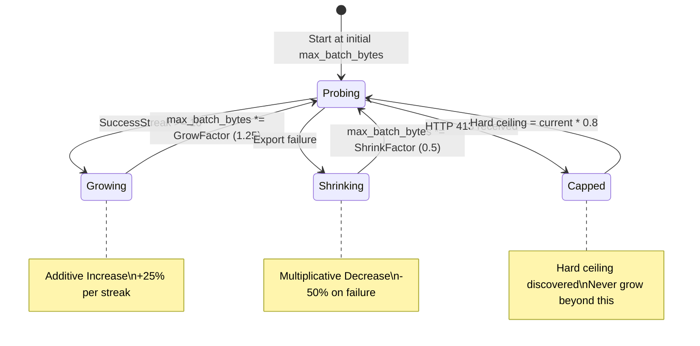
```mermaid
stateDiagram-v2
    [*] --> Probing: Start at initial max_batch_bytes

    Probing --> Growing: SuccessStreak >= 10
    Growing --> Probing: max_batch_bytes *= GrowFactor (1.25)

    Probing --> Shrinking: Export failure
    Shrinking --> Probing: max_batch_bytes *= ShrinkFactor (0.5)

    Probing --> Capped: HTTP 413 received
    Capped --> Probing: Hard ceiling = current * 0.8

    note right of Growing: Additive Increase\n+25% per streak
    note right of Shrinking: Multiplicative Decrease\n-50% on failure
    note right of Capped: Hard ceiling discovered\nNever grow beyond this
```

### AIMD Convergence

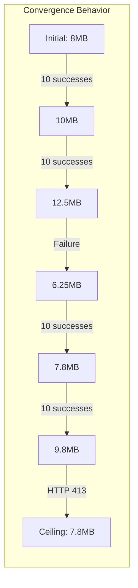
```mermaid
graph LR
    subgraph "Convergence Behavior"
        direction TB
        START[Initial: 8MB] -->|10 successes| G1[10MB]
        G1 -->|10 successes| G2[12.5MB]
        G2 -->|Failure| S1[6.25MB]
        S1 -->|10 successes| G3[7.8MB]
        G3 -->|10 successes| G4[9.8MB]
        G4 -->|HTTP 413| C1[Ceiling: 7.8MB]
    end
```

The algorithm stabilizes around the maximum batch size that the backend can reliably accept. After discovering a hard ceiling via HTTP 413, the batch size oscillates within the safe zone below the ceiling.

### Observability Metrics

| Metric | Type | Description |
|--------|------|-------------|
| `metrics_governor_batch_current_max_bytes` | Gauge | Current dynamically-adjusted max batch bytes |
| `metrics_governor_batch_hard_ceiling_bytes` | Gauge | Discovered hard ceiling (0 = no ceiling found) |
| `metrics_governor_batch_tuning_adjustments_total{direction}` | Counter | Tuning adjustments (direction: "increase" or "decrease") |
| `metrics_governor_batch_success_streak` | Gauge | Current consecutive success count |

### Configuration

```bash
# Enable batch auto-tuning (default: false for backward compatibility)
metrics-governor -batch-auto-tune-enabled=true

# Customize AIMD parameters
metrics-governor \
  -batch-auto-tune-enabled=true \
  -batch-auto-tune-grow-factor=1.25 \
  -batch-auto-tune-shrink-factor=0.5 \
  -batch-auto-tune-success-streak=10
```

### Recommended Settings

| Scenario | GrowFactor | ShrinkFactor | SuccessStreak |
|----------|:----------:|:------------:|:-------------:|
| Conservative (stable backends) | 1.1 | 0.5 | 20 |
| Default (balanced) | 1.25 | 0.5 | 10 |
| Aggressive (fast convergence) | 1.5 | 0.5 | 5 |

### Monitoring Examples

**1. Track batch size convergence:**

```promql
# Current batch size vs initial setting
metrics_governor_batch_current_max_bytes

# Rate of adjustments (should decrease as system converges)
rate(metrics_governor_batch_tuning_adjustments_total[5m])
```

**2. Detect hard ceiling discovery:**

```promql
# Alert when hard ceiling is discovered (non-zero means backend limit found)
metrics_governor_batch_hard_ceiling_bytes > 0
```

**3. Health check -- success streak should stay high after convergence:**

```promql
# Low streak = frequent failures, may need lower initial batch size
metrics_governor_batch_success_streak < 3
```

---

## Adaptive Worker Scaling (AIMD)

Dynamic worker count adjustment based on queue depth and export latency, using the same AIMD principles as batch auto-tuning. Workers are added when the queue is backing up and removed when the queue is consistently idle.

- **Scale Up**: Queue depth > HighWaterMark (default: 100) AND latency EWMA < MaxLatency (default: 500ms) -- add 1 worker
- **Scale Down**: Queue depth < LowWaterMark (default: 10) for SustainedIdleSecs (default: 30) -- halve workers
- **Bounds**: MinWorkers (default: 1) to MaxWorkers (default: NumCPU x 4)
- **Latency tracking**: EWMA with alpha=0.3 for smooth latency estimation

**Applies to:** OTLP pipeline, PRW pipeline (identical behavior)

### Scaling Decision Flow

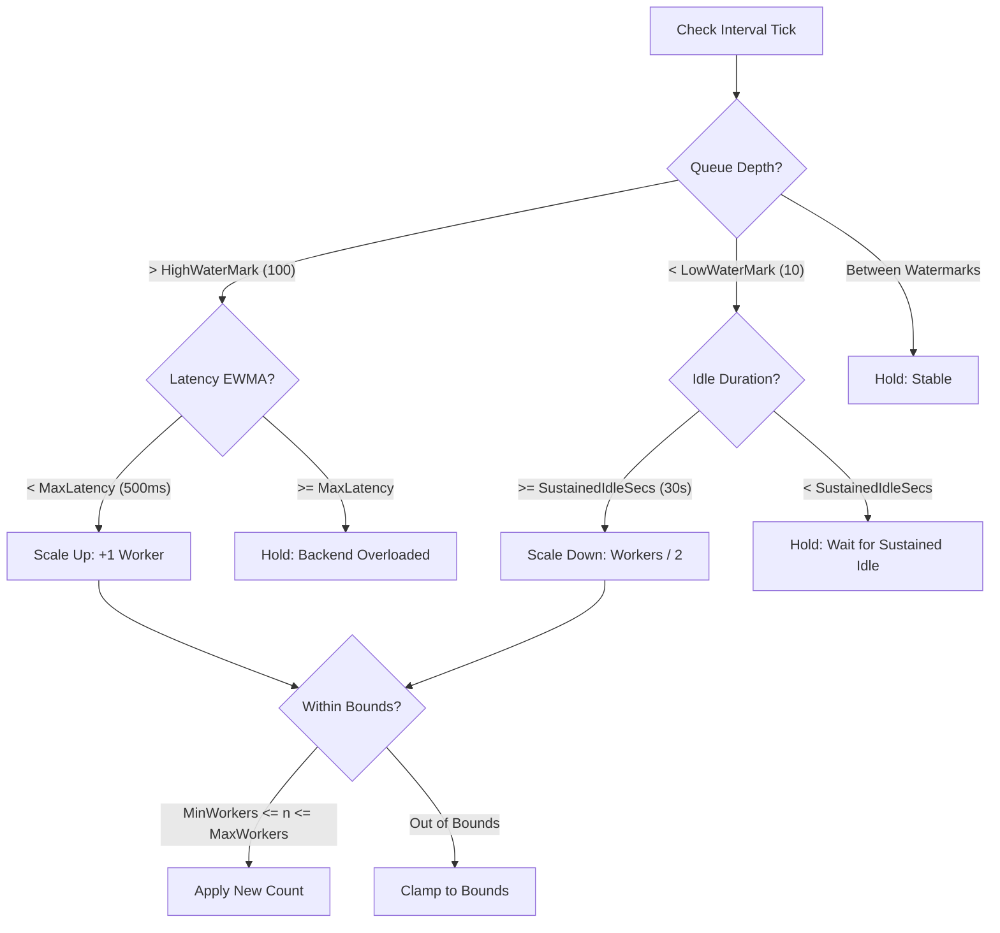
```mermaid
flowchart TB
    START[Check Interval Tick] --> DEPTH{Queue Depth?}

    DEPTH -->|"> HighWaterMark (100)"| LAT{Latency EWMA?}
    LAT -->|"< MaxLatency (500ms)"| UP[Scale Up: +1 Worker]
    LAT -->|">= MaxLatency"| HOLD1[Hold: Backend Overloaded]

    DEPTH -->|"< LowWaterMark (10)"| IDLE{Idle Duration?}
    IDLE -->|">= SustainedIdleSecs (30s)"| DOWN[Scale Down: Workers / 2]
    IDLE -->|"< SustainedIdleSecs"| HOLD2[Hold: Wait for Sustained Idle]

    DEPTH -->|"Between Watermarks"| HOLD3[Hold: Stable]

    UP --> BOUNDS{Within Bounds?}
    DOWN --> BOUNDS
    BOUNDS -->|"MinWorkers <= n <= MaxWorkers"| APPLY[Apply New Count]
    BOUNDS -->|"Out of Bounds"| CLAMP[Clamp to Bounds]
```

### EWMA Latency Tracking

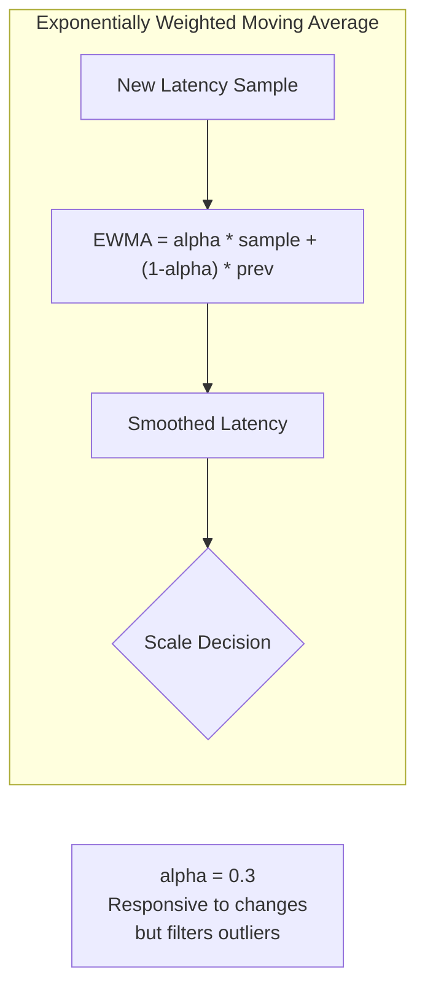
```mermaid
graph LR
    subgraph "Exponentially Weighted Moving Average"
        direction TB
        NEW[New Latency Sample] --> CALC["EWMA = alpha * sample + (1-alpha) * prev"]
        CALC --> SMOOTH[Smoothed Latency]
        SMOOTH --> DECISION{Scale Decision}
    end

    NOTE["alpha = 0.3\nResponsive to changes\nbut filters outliers"]
```

The latency guard prevents scaling up when the backend is already struggling. If export latency exceeds MaxLatency, adding more workers would only worsen the situation.

### Observability Metrics

| Metric | Type | Description |
|--------|------|-------------|
| `metrics_governor_queue_workers_active` | Gauge | Current active worker count |
| `metrics_governor_queue_workers_total` | Gauge | Configured (or current target) worker count |
| `metrics_governor_queue_adaptive_scale_total{direction}` | Counter | Scale events (direction: "up" or "down") |
| `metrics_governor_queue_adaptive_latency_ewma_seconds` | Gauge | Current EWMA latency estimate |

### Configuration

```bash
# Enable adaptive worker scaling (default: false for backward compatibility)
metrics-governor -queue-adaptive-workers-enabled=true

# Customize scaling parameters
metrics-governor \
  -queue-adaptive-workers-enabled=true \
  -queue-adaptive-high-watermark=100 \
  -queue-adaptive-low-watermark=10 \
  -queue-adaptive-max-latency=500ms \
  -queue-adaptive-sustained-idle=30s \
  -queue-adaptive-min-workers=1 \
  -queue-adaptive-max-workers=0  # 0 = NumCPU x 4
```

### Recommended Settings

| Scenario | HighWaterMark | LowWaterMark | MaxLatency | SustainedIdle |
|----------|:------------:|:------------:|:----------:|:-------------:|
| Low-latency backend | 50 | 5 | 200ms | 30s |
| Default (balanced) | 100 | 10 | 500ms | 30s |
| High-latency backend | 200 | 20 | 2s | 60s |
| Cost-sensitive | 200 | 5 | 500ms | 15s |

### Monitoring Examples

**1. Track scaling behavior:**

```promql
# Worker count over time (should stabilize after initial scaling)
metrics_governor_queue_workers_active

# Scale event rate
rate(metrics_governor_queue_adaptive_scale_total[5m])
```

**2. Verify latency guard is working:**

```promql
# If latency is high AND workers are not increasing, the guard is protecting the backend
metrics_governor_queue_adaptive_latency_ewma_seconds > 0.5
  and metrics_governor_queue_workers_active == metrics_governor_queue_workers_active offset 5m
```

**3. Capacity planning:**

```promql
# If workers frequently hit MaxWorkers, consider increasing -queue-adaptive-max-workers
metrics_governor_queue_workers_active == metrics_governor_queue_workers_total
```

---

## Async Send (Semaphore-Bounded Concurrency)

Each sender (or worker, when pipeline split is disabled) can issue multiple concurrent HTTP sends using semaphore-bounded concurrency. This fills the network pipe more effectively, especially when export latency is high.

- **MaxConcurrentSends** per sender (default: 4) -- Each sender can have up to 4 in-flight HTTP requests
- **GlobalSendLimit** caps total in-flight sends across all senders (default: NumCPU x 8) -- Prevents overwhelming the backend
- **Non-blocking acquire** -- If both limits are reached, the sender blocks until a slot opens

**Applies to:** OTLP pipeline, PRW pipeline (identical behavior)

### How It Works

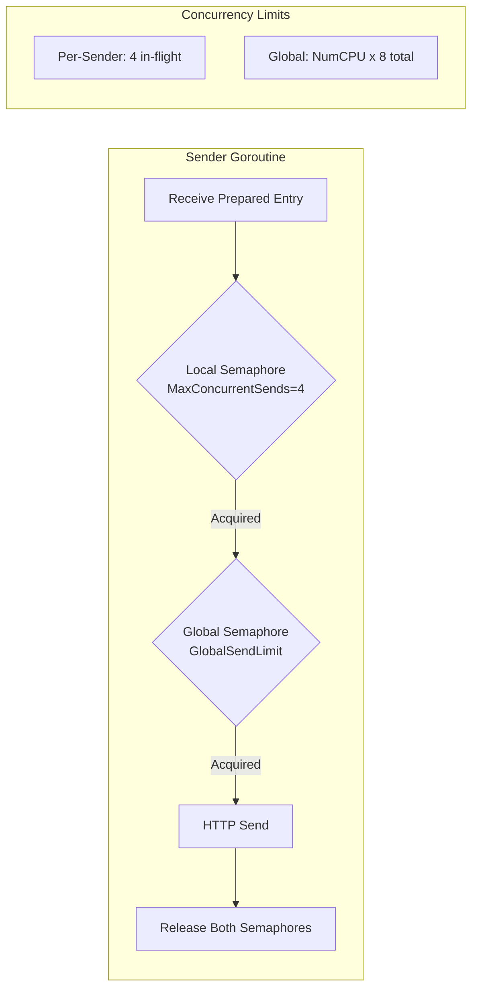
```mermaid
flowchart LR
    subgraph "Sender Goroutine"
        RECV[Receive Prepared Entry] --> LOCAL{Local Semaphore\nMaxConcurrentSends=4}
        LOCAL -->|Acquired| GLOBAL{Global Semaphore\nGlobalSendLimit}
        GLOBAL -->|Acquired| SEND[HTTP Send]
        SEND --> RELEASE[Release Both Semaphores]
    end

    subgraph "Concurrency Limits"
        direction TB
        PER["Per-Sender: 4 in-flight"]
        TOTAL["Global: NumCPU x 8 total"]
    end
```

### Observability Metrics

| Metric | Type | Description |
|--------|------|-------------|
| `metrics_governor_queue_sends_inflight` | Gauge | Current number of in-flight HTTP sends |
| `metrics_governor_queue_sends_inflight_max` | Gauge | Configured maximum in-flight sends (GlobalSendLimit) |

### Configuration

```bash
# Customize concurrent send limits
metrics-governor \
  -queue-max-concurrent-sends=4 \
  -queue-global-send-limit=0  # 0 = NumCPU x 8
```

### Recommended Settings

| Scenario | MaxConcurrentSends | GlobalSendLimit |
|----------|:------------------:|:---------------:|
| Default | 4 | 0 (auto) |
| High-latency backend (>200ms) | 8 | NumCPU x 12 |
| Low-resource environment | 2 | NumCPU x 4 |

---

## Connection Pre-warming

At startup, metrics-governor fires a lightweight HEAD request to the configured backend endpoint to establish TCP connections and complete TLS handshakes before the first real export. This eliminates the cold-start latency penalty on the first batch.

- **Fire-and-forget** -- The warmup request is non-blocking and does not delay startup
- **Timeout-bounded** -- Warmup has a short timeout (default: 5s) to avoid hanging on unreachable backends
- **Idempotent** -- HEAD requests have no side effects on the backend

**Applies to:** OTLP pipeline, PRW pipeline (identical behavior)

### How It Works

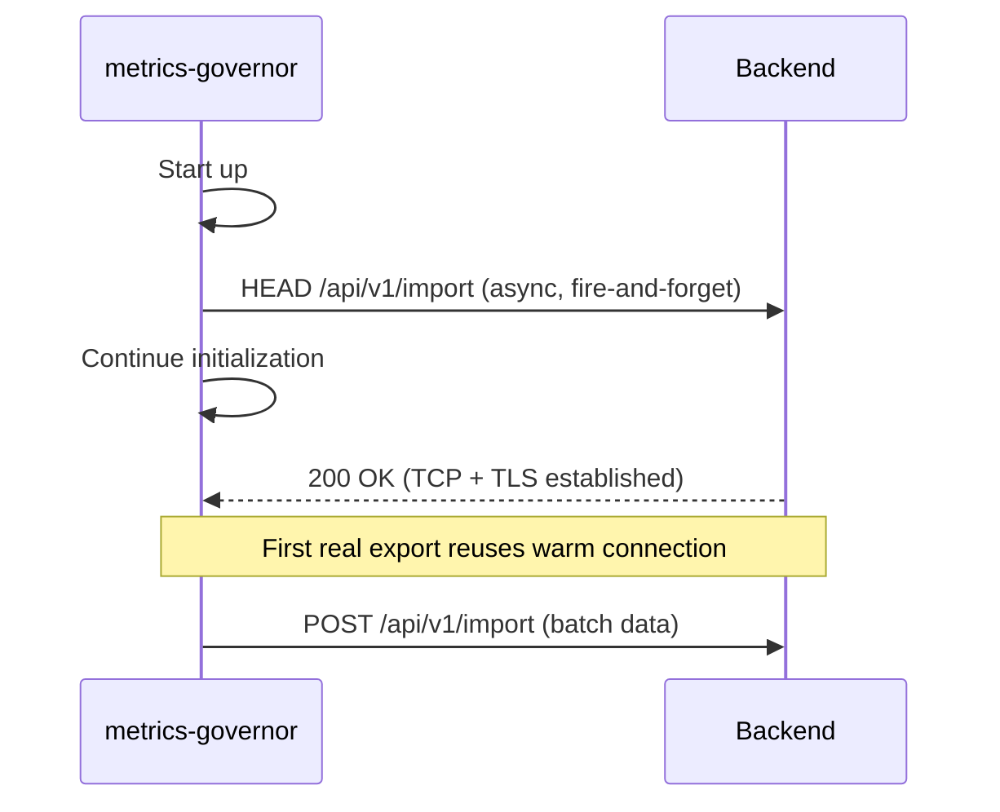
```mermaid
sequenceDiagram
    participant MG as metrics-governor
    participant BE as Backend

    MG->>MG: Start up
    MG->>BE: HEAD /api/v1/import (async, fire-and-forget)
    MG->>MG: Continue initialization
    BE-->>MG: 200 OK (TCP + TLS established)
    Note over MG,BE: First real export reuses warm connection
    MG->>BE: POST /api/v1/import (batch data)
```

### Observability Metrics

| Metric | Type | Description |
|--------|------|-------------|
| `metrics_governor_connection_warmup_total{status}` | Counter | Warmup attempts by status ("success", "error", "timeout") |

### Configuration

```bash
# Enable connection pre-warming (default: false)
metrics-governor -exporter-prewarm-connections=true
```

---

## Percentage-Based Memory Sizing

Buffer and queue sizes are derived from the detected container memory limit, ensuring they scale with available resources:

- **Buffer capacity** - Default 15% of detected memory limit
- **Queue in-memory** - Default 15% of detected memory limit
- **Runtime overhead** - Remaining ~60% for Go runtime, goroutines, processing
- **Static override** - Explicit byte values override percentage-based sizing

**Applies to:** OTLP buffer, PRW buffer, OTLP queue, PRW queue

### Memory Budget

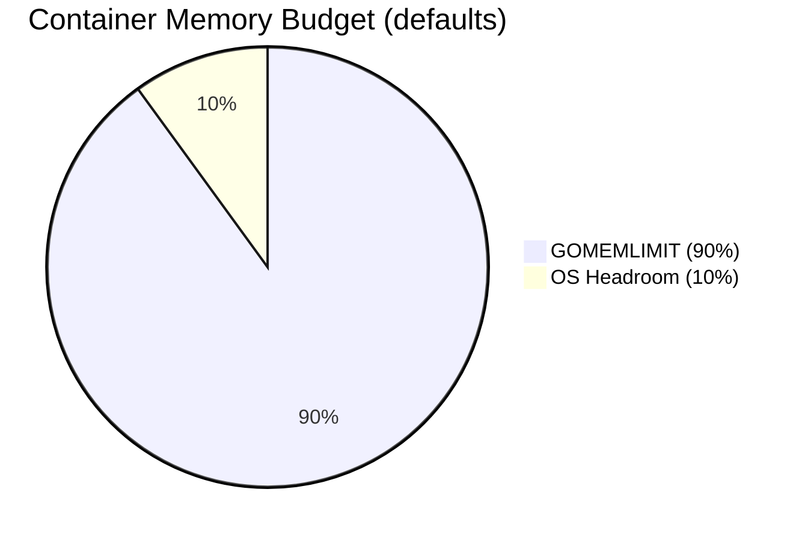
```mermaid
pie title Container Memory Budget (defaults)
    "GOMEMLIMIT (90%)" : 90
    "OS Headroom (10%)" : 10
```

Within the 90% GOMEMLIMIT:
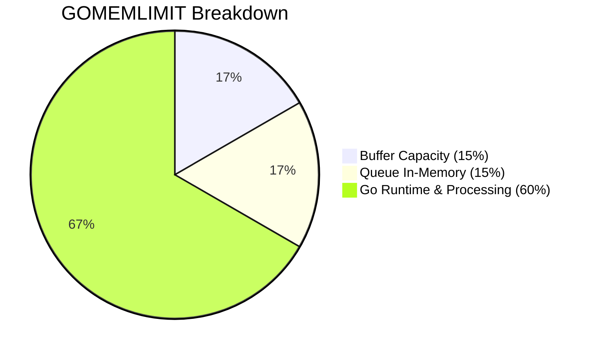
```mermaid
pie title GOMEMLIMIT Breakdown
    "Buffer Capacity (15%)" : 15
    "Queue In-Memory (15%)" : 15
    "Go Runtime & Processing (60%)" : 60
```

### Buffer Full Policies

When the buffer reaches its capacity limit, one of three policies applies:

| Policy | Behavior | Use Case |
|--------|----------|----------|
| `reject` (default) | Returns `ErrBufferFull` → 429/ResourceExhausted to sender | Production: senders retry with backoff |
| `drop_oldest` | Evicts oldest buffered data to make room | Best-effort: prefer fresh data |
| `block` | Blocks receiver goroutine until space available | True backpressure (like OTel `block_on_overflow`) |

### Configuration

```bash
# Percentage-based sizing (default)
metrics-governor -buffer-memory-percent=0.15 -queue-memory-percent=0.15

# Static override (takes precedence)
metrics-governor -buffer-max-bytes=157286400

# Buffer full policy
metrics-governor -buffer-full-policy=reject
```

---

## Queue I/O Optimization

FastQueue persistent queue with VictoriaMetrics-inspired design:

- **Two-layer architecture** - In-memory buffered channel (2048 blocks) + disk chunk files
- **Buffered I/O** - 256KB bufio.Writer coalesces small writes into fewer OS syscalls (~128x IOPS reduction)
- **Snappy compression** - Queue blocks compressed on disk (~65% throughput reduction, ~2.5-3x storage capacity)
- **Write coalescing** - Batch flush drains all in-memory blocks before writing, single bufio flush per batch
- **Metadata-only persistence** - Atomic JSON sync (default: 1s) for fast recovery
- **Automatic chunk rotation** - Configurable size boundaries for efficient disk usage
- **Adaptive sizing** - Automatically adjusts queue limits based on available disk space

**Applies to:** OTLP persistent queue, PRW persistent queue

### FastQueue Architecture

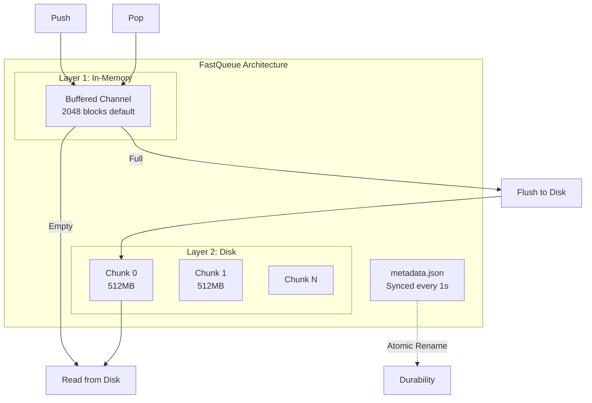
```mermaid
flowchart TB
    subgraph "FastQueue Architecture"
        subgraph "Layer 1: In-Memory"
            CH[Buffered Channel<br/>2048 blocks default]
        end

        subgraph "Layer 2: Disk"
            C1[Chunk 0<br/>512MB]
            C2[Chunk 1<br/>512MB]
            CN[Chunk N]
        end

        META[metadata.json<br/>Synced every 1s]
    end

    PUSH[Push] --> CH
    CH -->|Full| FLUSH[Flush to Disk]
    FLUSH --> C1
    POP[Pop] --> CH
    CH -->|Empty| READ[Read from Disk]
    C1 --> READ
    META -.->|Atomic Rename| DURABLE[Durability]
```

### Write Path

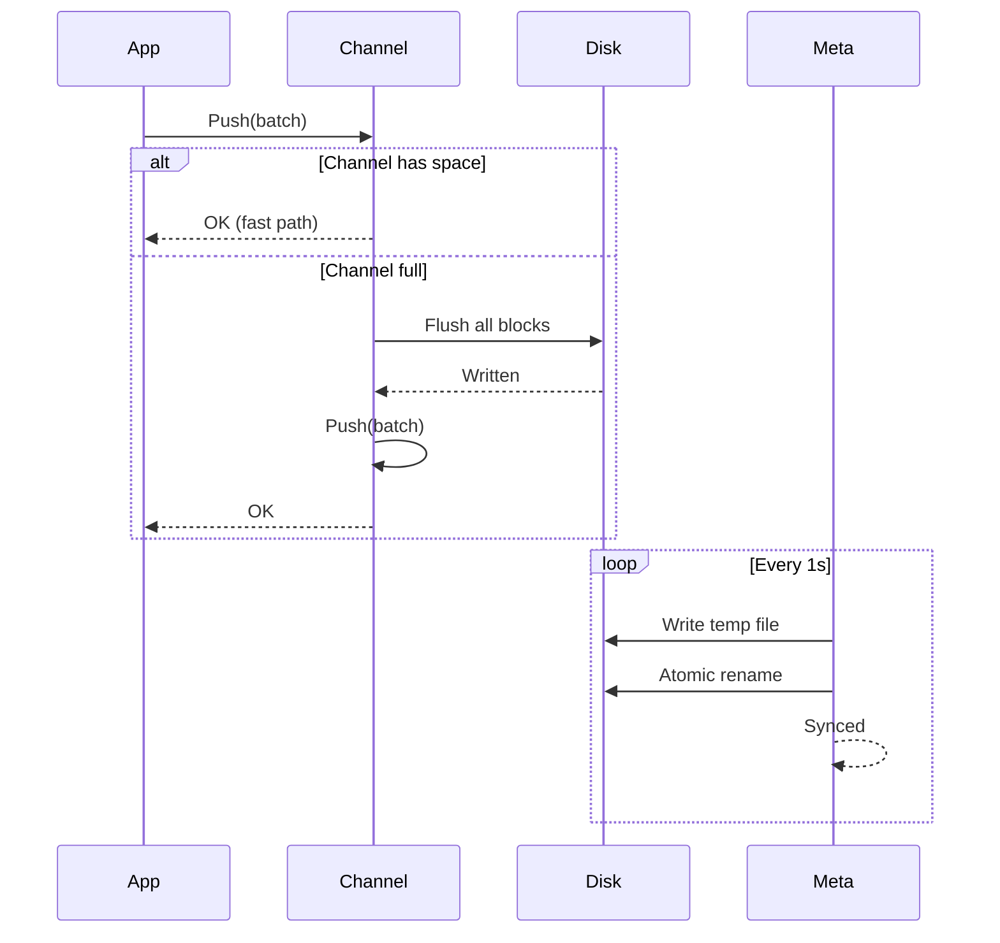
```mermaid
sequenceDiagram
    participant App
    participant Channel
    participant Disk
    participant Meta

    App->>Channel: Push(batch)
    alt Channel has space
        Channel-->>App: OK (fast path)
    else Channel full
        Channel->>Disk: Flush all blocks
        Disk-->>Channel: Written
        Channel->>Channel: Push(batch)
        Channel-->>App: OK
    end

    loop Every 1s
        Meta->>Disk: Write temp file
        Meta->>Disk: Atomic rename
        Meta-->>Meta: Synced
    end
```

### I/O Optimizations

| Optimization | Impact | Cost |
|-------------|--------|------|
| In-memory buffer (2048 blocks) | Eliminates disk writes for short outages (~20-40s buffering) | +~2 MB memory per queue |
| Buffered writer (256KB) | ~128x IOPS reduction for sequential writes | +256 KB memory per queue |
| Write coalescing | Single flush per batch instead of per-block | Negligible |
| Snappy compression | ~65% disk throughput reduction, ~2.5-3x storage capacity | <1% CPU |

### Configuration

```bash
# Enable persistent queue
metrics-governor -queue-enabled=true -queue-path=/data/queue

# Configure in-memory buffer (default: 2048 blocks)
metrics-governor -queue-inmemory-blocks=2048

# Configure chunk size (default: 512MB)
metrics-governor -queue-chunk-size=536870912

# Configure metadata sync interval (default: 1s, max data loss window)
metrics-governor -queue-meta-sync=1s

# Configure stale flush interval (default: 30s)
metrics-governor -queue-stale-flush=30s

# Configure queue compression (default: snappy)
metrics-governor -queue-compression=snappy

# Configure write buffer size (default: 256KB)
metrics-governor -queue-write-buffer-size=262144
```

### Observability Metrics

| Metric | Type | Description |
|--------|------|-------------|
| `metrics_governor_fastqueue_inmemory_blocks` | gauge | Current in-memory block count |
| `metrics_governor_fastqueue_disk_bytes` | gauge | Bytes stored on disk |
| `metrics_governor_fastqueue_meta_sync_total` | counter | Metadata sync operations |
| `metrics_governor_fastqueue_chunk_rotations` | counter | Chunk file rotations |
| `metrics_governor_fastqueue_inmemory_flushes` | counter | Stale flushes to disk |
| `metrics_governor_queue_size` | gauge | Current number of batches in queue |
| `metrics_governor_queue_bytes` | gauge | Current queue size in bytes |
| `metrics_governor_queue_utilization_ratio` | gauge | Queue utilization (0.0-1.0) |

---

## Memory Limit Auto-Detection

Automatically detects container memory limits and sets GOMEMLIMIT for optimal GC behavior:

- **Container-aware** - Reads cgroups v1/v2 limits (Docker, Kubernetes)
- **OOM prevention** - GC becomes more aggressive as memory approaches limit
- **Configurable headroom** - Default 90% leaves 10% for non-heap memory

**Applies to:** All pipelines (global setting)

### How It Works

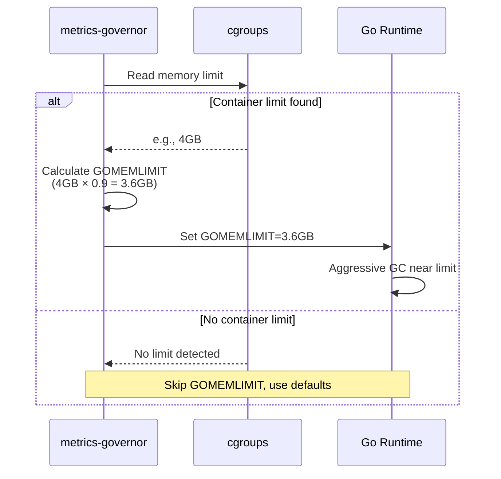
```mermaid
sequenceDiagram
    participant MG as metrics-governor
    participant CG as cgroups
    participant GO as Go Runtime

    MG->>CG: Read memory limit
    alt Container limit found
        CG-->>MG: e.g., 4GB
        MG->>MG: Calculate GOMEMLIMIT<br/>(4GB × 0.9 = 3.6GB)
        MG->>GO: Set GOMEMLIMIT=3.6GB
        GO->>GO: Aggressive GC near limit
    else No container limit
        CG-->>MG: No limit detected
        Note over MG,GO: Skip GOMEMLIMIT, use defaults
    end
```

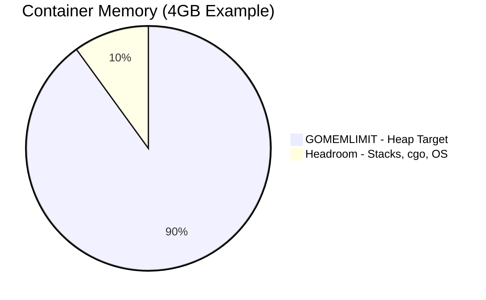
```mermaid
pie title Container Memory (4GB Example)
    "GOMEMLIMIT - Heap Target" : 3600
    "Headroom - Stacks, cgo, OS" : 400
```

When heap approaches GOMEMLIMIT, Go's GC runs more frequently to avoid exceeding the limit.

### Configuration

```bash
# Enable memory limit auto-detection (default)
metrics-governor -memory-limit-ratio=0.9

# Use 85% for larger containers (more headroom)
metrics-governor -memory-limit-ratio=0.85

# Disable auto-detection
metrics-governor -memory-limit-ratio=0
```

### YAML Configuration

```yaml
memory:
  limit_ratio: 0.9    # Ratio of container memory for GOMEMLIMIT
```

### Recommended Settings

| Container Size | Ratio | GOMEMLIMIT | Headroom |
|----------------|-------|------------|----------|
| < 2GB | 0.90 | 1.8GB | 200MB |
| 2-4GB | 0.90 | 3.6GB | 400MB |
| 4-8GB | 0.85 | 6.8GB | 1.2GB |
| > 8GB | 0.85 | 85% | 15% |

> **Note**: For memory-constrained environments, consider reducing buffer sizes (`-buffer-size`, `-queue-inmemory-blocks`) in addition to setting memory limits.

See [resilience.md](./resilience.md) for detailed memory limit documentation.

---

## Caching Optimizations

The following table summarizes all caching and pooling optimizations applied across the hot path:

| Optimization | Memory Impact | CPU Impact | Hot Path |
|---|---|---|---|
| Compression Encoder Pooling | -80% encoder allocs | -15% compression CPU | Every export |
| Rule Matching Cache (LRU) | +~1MB cache | -90% regex CPU | Every metric |
| Series Key Slice Pooling | -70% slice allocs | Minimal | Every datapoint |
| Auth Pre-compute | Negligible | -100% base64 per-req | Every request |
| Dedup countDatapoints | None | -50% traversal CPU | Every batch |

### Compression Encoder Pooling

Compression encoders (gzip, zstd, snappy, etc.) are expensive to allocate. A `sync.Pool` is maintained per compression type so that encoders are reused across export requests rather than created and garbage-collected on every call. Each encoder is `Reset()` before being returned to the pool, which clears internal buffers and prevents cross-contamination between requests. This eliminates roughly 80% of encoder-related allocations and reduces compression CPU overhead by approximately 15%.

**Configuration**: Encoder pooling is always enabled and requires no configuration. Monitor pool effectiveness with the compression-related metrics exposed on the `/metrics` endpoint.

### Rule Matching Cache (LRU)

Every incoming metric must be matched against the configured limits rules, which can involve regex evaluation. The rule matching cache stores the result of recent match operations in an LRU cache, keyed by the metric name and label set. Subsequent metrics with the same identity skip regex evaluation entirely, reducing regex CPU usage by up to 90%.

**Configuration**: Control the maximum cache size with `-rule-cache-max-size` (default: 10000 entries, approximately 1MB). The cache uses LRU eviction so the least-recently-used entries are discarded when the cache is full. For label matchers, the cache bypasses regex and uses direct map lookups when possible.

**Monitoring**: Cache hit/miss rates are exposed via `metrics_governor_rule_cache_hits_total` and `metrics_governor_rule_cache_misses_total`.

### Series Key Slice Pooling

Building series keys requires assembling label names and values into a temporary byte slice. A `sync.Pool` of reusable slices is maintained so that each datapoint does not trigger a new heap allocation. Slices are returned to the pool after use, cutting slice allocations by approximately 70% with minimal CPU impact.

**Configuration**: Slice pooling is always enabled and requires no configuration.

### Auth Pre-compute

When basic authentication is configured, the Base64-encoded `Authorization` header value is computed once at startup and reused for every outbound request. This avoids repeated Base64 encoding on the hot path, eliminating 100% of per-request Base64 CPU cost.

**Configuration**: Pre-computation is automatic when `-exporter-basic-auth-user` and `-exporter-basic-auth-password` are set.

### Dedup countDatapoints

The `countDatapoints` function, used to calculate batch sizes for metrics and statistics, previously traversed nested data structures multiple times. The deduplicated implementation merges traversal passes into a single walk, reducing traversal CPU by approximately 50% per batch with no additional memory overhead.

**Configuration**: This optimization is always active and requires no configuration.

---

## Production Tuning Guide

This section provides concrete tuning recommendations for large-scale production deployments handling **millions of datapoints per minute** and **tens of thousands of unique series**.

### Limits Enforcer — Stats Threshold

The per-group stats reporting on the `/metrics` endpoint scales linearly with the number of tracked groups. In high-cardinality environments (10K+ groups), this can produce **megabytes of scrape output** and dominate Prometheus scrape time.

**Benchmark results** (1,000 groups, ~50% filtered):

| Metric | No threshold | threshold=5 | Reduction |
|--------|:-----------:|:-----------:|:---------:|
| Latency | 345 µs/op | 192 µs/op | **44%** |
| Memory | 312 KB/op | 159 KB/op | **49%** |
| Allocations | 2,756/op | 1,403/op | **49%** |

Savings scale linearly — with 10K groups and threshold filtering 90% of them, expect ~90% reduction in scrape output.

```yaml
limits:
  stats_threshold: 100  # Only report groups with >= 100 datapoints or cardinality
```

See [limits.md](./limits.md#per-group-stats-threshold) for full configuration details.

### Rule Cache Sizing

The rule matching LRU cache avoids regex evaluation for previously seen metric identities. In production, the default 10K entries may be insufficient for high-cardinality workloads:

```bash
# High-cardinality workloads (100K+ unique metric names)
metrics-governor -rule-cache-max-size=100000

# Monitor effectiveness — hit ratio should be > 95%
# rate(metrics_governor_rule_cache_hits_total[5m]) / (rate(metrics_governor_rule_cache_hits_total[5m]) + rate(metrics_governor_rule_cache_misses_total[5m]))
```

Each cache entry is ~100 bytes, so 100K entries ≈ 10 MB — a worthwhile trade-off for eliminating regex evaluation on the hot path.

### Cardinality Tracker Mode

For production deployments with unknown or highly variable cardinality, use **hybrid mode**:

```yaml
cardinality:
  mode: hybrid
  expected_items: 100000
  fp_rate: 0.01
  hll_threshold: 50000
```

This starts with memory-efficient Bloom filters and automatically switches to HLL when cardinality exceeds the threshold. The switch preserves the approximate count without resetting statistics.

**Memory planning by mode:**

| Cardinality | Bloom (1% FPR) | HLL (p=14) | Exact (map) |
|-------------|:--------------:|:----------:|:-----------:|
| 10K series | 12 KB | 12 KB | 750 KB |
| 100K series | 120 KB | 12 KB | 7.5 MB |
| 1M series | 1.2 MB | 12 KB | 75 MB |
| 10M series | 12 MB | 12 KB | 750 MB |

### Export Pipeline Tuning

| Setting | Small (<1M dps/min) | Medium (1-10M dps/min) | Large (10M+ dps/min) |
|---------|:-------------------:|:----------------------:|:--------------------:|
| `-batch-size` | 500 | 1000 | 2000 |
| `-max-batch-bytes` | 4 MB | 8 MB | 8 MB |
| `-queue-workers` | 0 (auto) | 0 (auto) | 0 (auto) |
| `-buffer-size` | 100 | 500 | 1000 |
| `-string-interning` | true | true | true |
| `-intern-max-value-length` | 64 | 64 | 128 |
| `-queue-pipeline-split-enabled` | false | true | true |
| `-queue-preparer-count` | 0 (auto) | 0 (auto) | 0 (auto) |
| `-queue-sender-count` | 0 (auto) | 0 (auto) | 0 (auto) |
| `-queue-adaptive-workers-enabled` | false | true | true |
| `-batch-auto-tune-enabled` | false | true | true |

### Memory Configuration

```yaml
memory:
  limit_ratio: 0.9    # Leave 10% for non-heap

# For large containers (> 4GB), use 0.85 to leave more headroom
memory:
  limit_ratio: 0.85
```

**Container sizing guidelines:**

| Throughput | Recommended Memory | GOMEMLIMIT | Queue Disk |
|------------|:-----------------:|:----------:|:----------:|
| < 1M dps/min | 256 MB | 230 MB | 1 GB |
| 1-5M dps/min | 512 MB | 460 MB | 5 GB |
| 5-20M dps/min | 1 GB | 900 MB | 10 GB |
| 20-100M dps/min | 2 GB | 1.7 GB | 20 GB |
| 100M+ dps/min | 4 GB | 3.4 GB | 50 GB |

### Persistent Queue Tuning

For production resilience during backend outages:

```yaml
queue:
  enabled: true
  path: /data/queue
  max_bytes: 10737418240  # 10 GB
  inmemory_blocks: 4096   # ~40s buffer for 100K dps/min
  chunk_size: 536870912   # 512 MB chunks
  compression: snappy     # ~65% size reduction
  write_buffer_size: 262144  # 256 KB
  stale_flush: 30s
  meta_sync: 1s           # Max 1s data loss window
```

**Queue sizing formula:**

```
Required disk = (datapoints/min × avg_bytes_per_dp × desired_minutes) / compression_ratio

Example: 10M dps/min × 50 bytes × 30 min / 3 ≈ 5 GB
```

### Prometheus Scrape Optimization

When metrics-governor itself produces high-cardinality output (many rules × many groups), optimize the scrape:

```yaml
# prometheus.yml
scrape_configs:
  - job_name: metrics-governor
    scrape_interval: 30s     # Don't scrape too frequently
    scrape_timeout: 15s      # Allow time for large responses
    metrics_path: /metrics
    params:
      # Use stats threshold to reduce output
      # (configured on metrics-governor side)
```

Combine the stats threshold with Prometheus `metric_relabel_configs` to further reduce stored series if needed:

```yaml
    metric_relabel_configs:
      # Drop per-group metrics if you only need rule-level aggregates
      - source_labels: [__name__]
        regex: 'metrics_governor_rule_group_(datapoints|cardinality)'
        action: drop
```

### Complete Production Configuration

```bash
metrics-governor \
  # Pipeline
  -receiver-addr :4317 \
  -exporter-endpoint https://vm.example.com/api/v1/import/prometheus \
  -exporter-compression snappy \
  \
  # Limits
  -limits-config /etc/limits/limits.yaml \
  -limits-dry-run=false \
  -limits-stats-threshold=100 \
  -rule-cache-max-size=50000 \
  \
  # Cardinality
  -cardinality-mode hybrid \
  -cardinality-expected-items 100000 \
  -cardinality-hll-threshold 50000 \
  \
  # Performance
  -batch-size 1000 \
  -max-batch-bytes 8388608 \
  -queue-workers 0 \
  -buffer-size 500 \
  -string-interning=true \
  \
  # Pipeline optimizations
  -queue-pipeline-split-enabled=true \
  -batch-auto-tune-enabled=true \
  -queue-adaptive-workers-enabled=true \
  -exporter-prewarm-connections=true \
  \
  # Resilience
  -queue-enabled=true \
  -queue-path /data/queue \
  -queue-max-bytes 10737418240 \
  -queue-compression snappy \
  -memory-limit-ratio 0.9
```

---

## Performance Tuning Knobs

metrics-governor exposes three main performance axes that let you trade between durability, observability, and raw throughput. Every knob can be changed between deployments — no code changes required.

### Three Performance Axes

**Axis 1: Durability** (`--queue-mode`) — Controls how export batches are queued between the pipeline and the backend. `memory` mode uses a zero-copy in-memory ring buffer for maximum throughput and lowest latency. `disk` mode writes every batch to the persistent FastQueue for full crash recovery at the cost of disk I/O. A hybrid mode is also available via `--queue-hybrid-spillover-pct`, which keeps batches in memory until queue utilization reaches the configured percentage (e.g., 80%), then spills to disk — giving you low-latency operation under normal load with disk-backed safety during backpressure.

**Axis 2: Observability** (`--stats-level`) — Controls how much per-metric accounting the limits enforcer performs. `full` enables complete cardinality tracking with per-label-set Bloom filters, giving you full visibility into which label combinations drive cardinality. `basic` (the default) tracks per-metric datapoint counts and rule-level cardinality without per-label-set breakdowns. `none` disables all stats collection, eliminating the accounting overhead entirely — the limits enforcer still enforces rules, but no counters or cardinality trackers are maintained.

**Pipeline fusion** — The tenant identification and limits enforcement stages run as a single timed step rather than two sequential passes over the data. This fusion is automatic and always enabled; there is no flag to control it. It eliminates one full traversal of each incoming batch, which is particularly impactful at high datapoint rates.

### Configuration Profiles

| Configuration | Safety First | Balanced (default) | Performance First |
|--------------|-------------|-------------------|------------|
| `--queue-mode` | `disk` | `memory` | `memory` |
| `--queue-max-bytes` | 512MB | 256MB | 128MB |
| `--stats-level` | `full` | `basic` | `none` |
| Pipeline fusion | enabled | enabled | enabled |
| Expected CPU (100k dps) | ~120% | ~40-60% | ~25-35% |
| Expected memory | ~1 GB | ~500 MB | ~350 MB |
| Durability | Full crash recovery | No persistence | No persistence |
| Visibility | Full cardinality tracking | Per-metric counts | Global totals only |

**Safety First** is appropriate for financial or compliance workloads where no datapoint may be lost during a backend outage. Every batch is persisted to disk before acknowledgement, and full cardinality tracking gives complete observability into metric growth. The trade-off is higher CPU (disk I/O + Bloom filter maintenance) and memory (tracking structures).

**Balanced** is the default and suits most production deployments. Memory-mode queuing avoids disk I/O, and basic stats give enough visibility to understand per-metric throughput and enforce limits effectively. This profile handles 100k datapoints per second at roughly 60-80% CPU on a 2-core container.

**Performance First** is designed for high-throughput relay scenarios where metrics-governor acts as a stateless proxy. With stats disabled, the limits enforcer becomes a simple pass/drop gate with negligible overhead. This profile is ideal for staging environments or edge proxies that forward to a central governor instance that handles full accounting.

### Micro-optimizations

In addition to the three main axes, several micro-optimizations contribute to overall throughput:

- **Doubled downsample shards (32)** — The downsampling stage distributes work across 32 shards (up from 16), reducing lock contention under high concurrency. Sharding is by metric name hash, so the improvement scales with the number of distinct metric names in each batch.
- **In-place label sorting** — Labels are sorted in-place using the existing slice rather than allocating a new sorted copy. This eliminates one allocation per series on the hot path.
- **Reduced allocations** — Several hot-path functions have been refactored to reuse buffers from `sync.Pool` rather than allocating on each call, reducing GC pressure at high throughput.

### Runtime Flexibility

All three axes can be changed at runtime (between deployments) without any code changes. A common pattern is to run different profiles in different environments:

- **Staging**: `memory` queue + `full` stats — maximum observability for debugging, no need for crash recovery
- **Production**: `memory` queue + `basic` stats — the default balanced profile for most workloads
- **Edge proxy**: `memory` queue + `none` stats — minimum overhead, forwarding to a central instance
- **Regulated / financial**: `disk` queue + `full` stats — full durability and visibility

The `--queue-hybrid-spillover-pct` flag provides a middle ground for production deployments that want low-latency memory queuing under normal operation but automatic disk spillover during backend outages. For example, `--queue-hybrid-spillover-pct=80` keeps batches in memory until the queue is 80% full, then begins writing to disk.

---

## New Feature Cost Reference

The following table summarizes the CPU overhead of recently added limits features. All costs are per-event on the hot path and measured on a typical production workload.

| Feature | Trigger | CPU per Event | Max CPU/s at 100K DPs/s |
|---------|---------|:-------------:|:-----------------------:|
| Sample action | On violation | 50ns/DP | 5ms (at 100% violation rate) |
| Label stripping | On violation | 50ns/DP/label | 15ms (3 labels, 100% violation) |
| Tiered escalation | On violation | 5ns/tier | negligible |
| Per-label cardinality | Always (tracked DPs) | 200ns/DP/label | 60ms (3 labels, all DPs) |
| Priority adaptive | On adaptive violation | 100ns/group | 0.1ms |

**Key observations:**

- **Sample** and **strip_labels** actions only run when a violation is detected, so their cost is proportional to the violation rate. At typical violation rates (<5%), overhead is negligible.
- **Per-label cardinality** tracking runs on every datapoint for rules that configure `label_limits`, making it the most expensive feature. Size `label_limits` maps conservatively.
- **Tiered escalation** adds only a linear scan over the (small) tier list per violation — effectively free.
- **Priority adaptive** sorting is per-group (not per-datapoint), so even with thousands of groups the cost is minimal.

---

## Stability & Memory Tuning

### Per-Profile GOGC

Each profile sets `GOGC` to balance GC overhead vs memory usage. Lower GOGC = more GC cycles but lower peak heap:

| Profile | GOGC | Rationale |
|---|---|---|
| minimal | 50 | Tighter GC for stable memory in containers |
| balanced | 50 | Tighter GC for stable memory and predictable CPU |
| safety / observable | 50 | Aggressive — high allocation (full stats) |
| resilient | 50 | Tighter GC for stable memory and predictable CPU |
| performance | 25 | Very aggressive — maximize memory reuse |

Override with the `GOGC` environment variable: `GOGC=100 ./metrics-governor --profile observable`.

### GOMEMLIMIT

Auto-configured from container memory limits (or system memory on bare metal). Uses `memory_limit_ratio` (default 0.85) to set the soft limit, leaving headroom for transient spikes and kernel buffers. When GOMEMLIMIT is approached, the GC runs more aggressively, and stats degradation may activate to shed memory.

### Pipeline Health & Load Shedding

A unified health score (0.0–1.0) computed from queue pressure (35%), buffer pressure (30%), export latency (20%), and circuit breaker state (15%) drives admission control. When the score exceeds the profile threshold, receivers return backpressure (gRPC `ResourceExhausted` / HTTP `429`). This prevents the pipeline from being pushed past its recovery point — the single most important long-term stability mechanism.

See [stability-guide.md](stability-guide.md) for full details.

## VictoriaMetrics Inspiration

Many of these optimizations are inspired by techniques described in [VictoriaMetrics articles](https://valyala.medium.com/), including:

- String interning for label deduplication
- Bloom filters for cardinality tracking
- Efficient queue design with metadata-only persistence
- Memory-aware resource management
