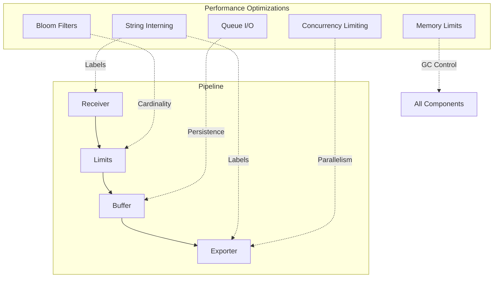
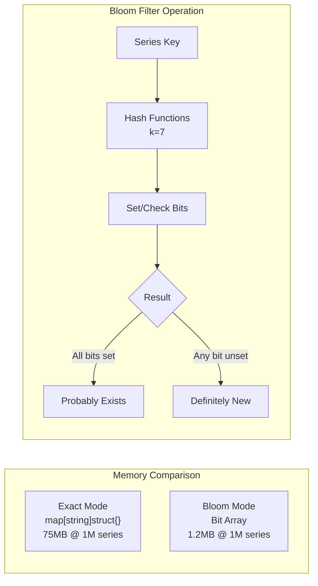
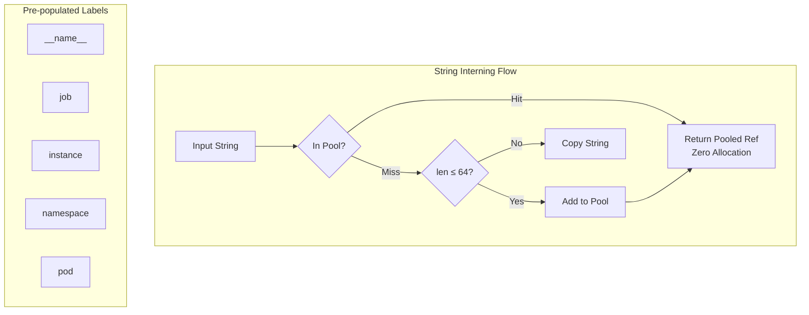
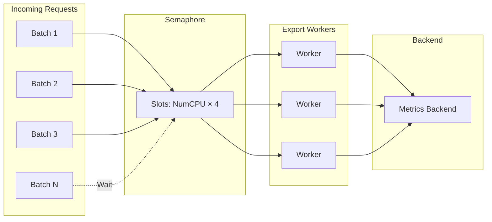
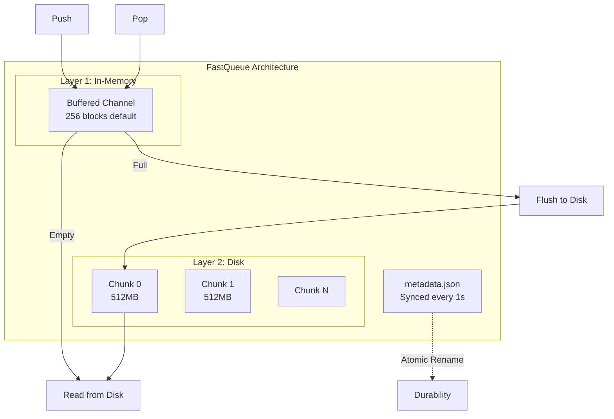
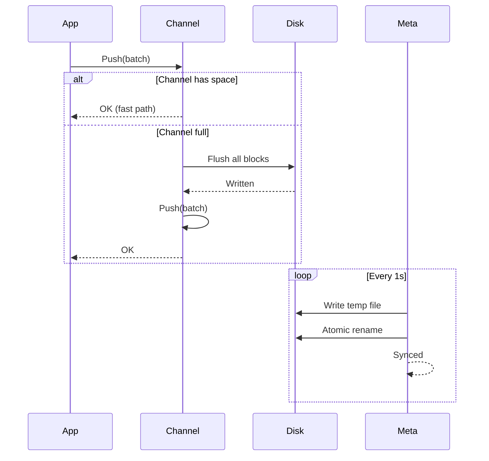
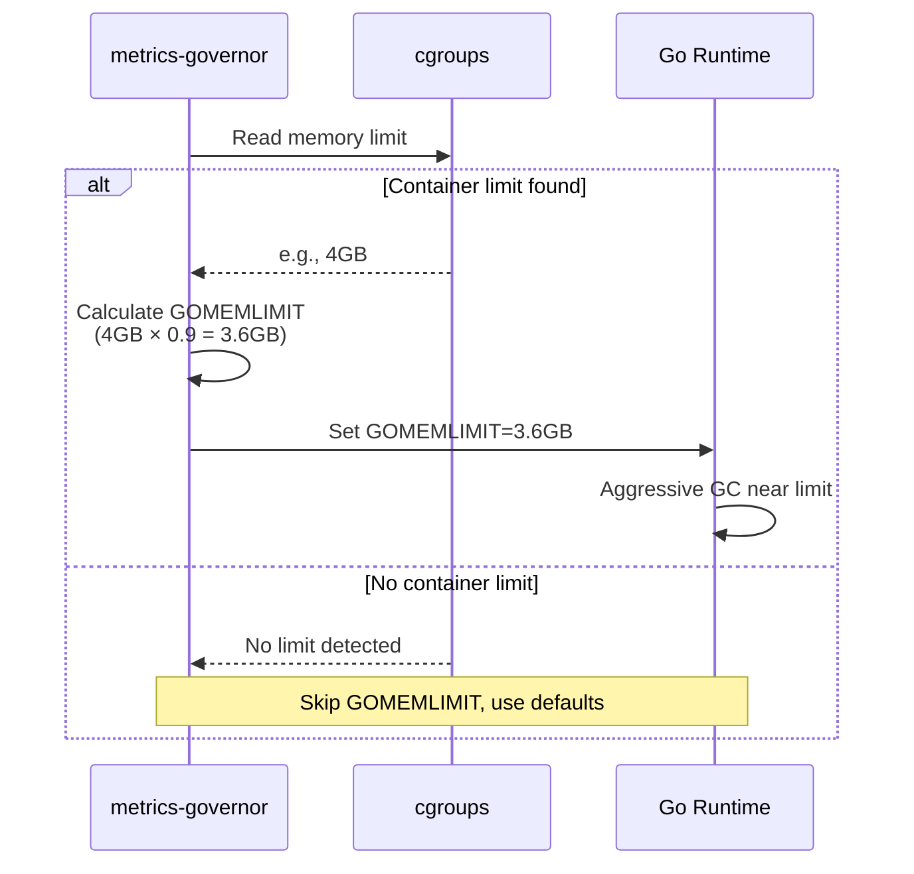
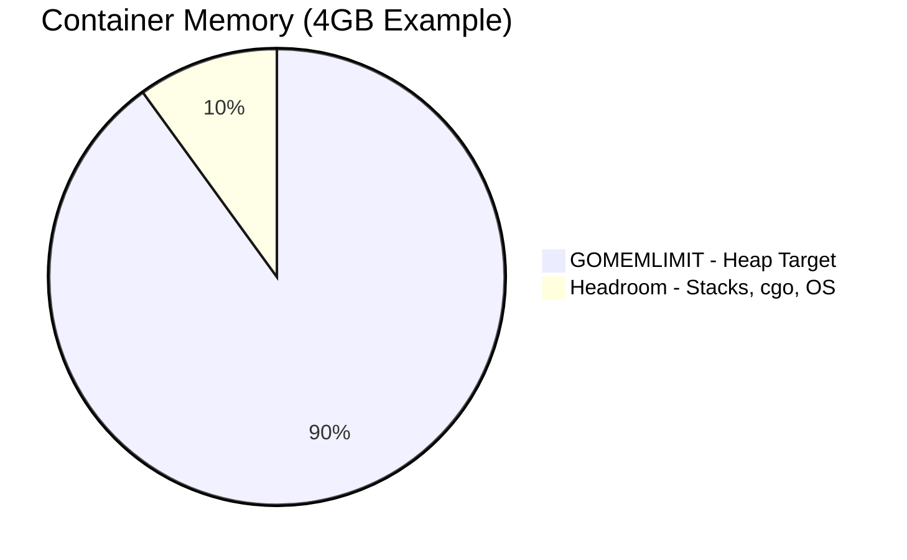

# Performance Optimizations

metrics-governor includes several high-performance optimizations for production workloads. **All optimizations apply to both OTLP and PRW pipelines.**

> **Note**: These optimizations are protocol-agnostic and work identically for both pipelines. The same memory savings, allocation reductions, and concurrency controls apply whether you're processing OTLP or Prometheus Remote Write metrics.

## Summary

| Optimization | OTLP | PRW | Memory Impact | CPU Impact |
|--------------|:----:|:---:|---------------|------------|
| Bloom Filters | Yes | Yes | -98% for cardinality tracking | Minimal |
| String Interning | Yes | Yes | -76% allocations | -12% CPU |
| Concurrency Limiting | Yes | Yes | Bounded goroutines | Controlled parallelism |
| Queue I/O Optimization | Yes | Yes | -40-60% disk (compression) | 10x throughput |
| Memory Limit Auto-Detection | Yes | Yes | Prevents OOM kills | More predictable GC |

### Architecture Overview



---

## Bloom Filter Cardinality Tracking

Cardinality tracking uses Bloom filters instead of maps for 98% memory reduction:

| Unique Series | map[string]struct{} | Bloom Filter (1% FPR) | Memory Savings |
|---------------|---------------------|------------------------|----------------|
| 10,000        | 750 KB              | 12 KB                  | **98%**        |
| 100,000       | 7.5 MB              | 120 KB                 | **98%**        |
| 1,000,000     | 75 MB               | 1.2 MB                 | **98%**        |
| 10,000,000    | 750 MB              | 12 MB                  | **98%**        |

**Applies to:** OTLP limits enforcer, OTLP stats collector, PRW limits enforcer, PRW stats collector

### How It Works



### Configuration

```bash
# Use Bloom filter mode (default, memory-efficient)
metrics-governor -cardinality-mode bloom -cardinality-expected-items 100000 -cardinality-fp-rate 0.01

# Use exact mode (100% accurate, higher memory)
metrics-governor -cardinality-mode exact
```

### Observability Metrics

| Metric | Type | Description |
|--------|------|-------------|
| `metrics_governor_cardinality_mode{mode}` | gauge | Active tracking mode (bloom=1 or exact=1) |
| `metrics_governor_cardinality_memory_bytes` | gauge | Total memory used by all stats trackers |
| `metrics_governor_cardinality_trackers_total` | gauge | Number of active trackers in stats collector |
| `metrics_governor_cardinality_config_expected_items` | gauge | Configured expected items per tracker |
| `metrics_governor_cardinality_config_fp_rate` | gauge | Configured false positive rate |
| `metrics_governor_rule_cardinality_memory_bytes{rule}` | gauge | Memory used per limits rule |
| `metrics_governor_limits_cardinality_memory_bytes` | gauge | Total memory used by limits trackers |
| `metrics_governor_limits_cardinality_trackers_total` | gauge | Number of trackers in limits enforcer |

### Monitoring Examples

**1. Monitor memory savings** - Compare actual vs expected map-based memory:

```promql
# Actual Bloom filter memory usage
metrics_governor_cardinality_memory_bytes + metrics_governor_limits_cardinality_memory_bytes

# Estimated map-based memory (75 bytes per series)
(sum(metrics_governor_metric_cardinality) + sum(metrics_governor_rule_group_cardinality)) * 75

# Memory savings ratio
1 - (metrics_governor_cardinality_memory_bytes / (sum(metrics_governor_metric_cardinality) * 75))
```

**2. Detect undersized trackers** - Alert when cardinality exceeds expected items:

```promql
# If any metric has cardinality >> expected_items, Bloom filter may have higher FP rate
max(metrics_governor_metric_cardinality) > metrics_governor_cardinality_config_expected_items * 2

# Recommendation: increase -cardinality-expected-items if this fires frequently
```

**3. Track memory by rule** - Identify which limits rules use most memory:

```promql
# Top 5 rules by memory usage
topk(5, metrics_governor_rule_cardinality_memory_bytes)

# Memory per tracker (avg bytes per group)
metrics_governor_rule_cardinality_memory_bytes / metrics_governor_rule_groups_total
```

**4. Verify Bloom mode is active** - Confirm memory-efficient mode:

```promql
# Should return 1 for bloom mode
metrics_governor_cardinality_mode{mode="bloom"}

# Alert if accidentally in exact mode (high memory)
metrics_governor_cardinality_mode{mode="exact"} == 1
```

**5. Capacity planning** - Project memory needs:

```promql
# Current bytes per tracker
metrics_governor_cardinality_memory_bytes / metrics_governor_cardinality_trackers_total

# Projected memory for 10x more trackers
(metrics_governor_cardinality_memory_bytes / metrics_governor_cardinality_trackers_total) * 10
```

---

## String Interning

Label string deduplication reduces allocations by 76%:

- Pre-populated pool for common Prometheus labels (`__name__`, `job`, `instance`, etc.)
- Zero-allocation cache hits using `sync.Map`
- Configurable max value length to balance memory vs deduplication

**Applies to:** OTLP shard key building, PRW label parsing, PRW shard key building

### How It Works



### Configuration

```bash
# Enable string interning (default: true)
metrics-governor -string-interning=true -intern-max-value-length=64
```

---

## Concurrency Limiting

Semaphore-based limiting prevents goroutine explosion:

- Bounded at `NumCPU * 4` by default
- 88% reduction in concurrent goroutines under load
- Prevents memory exhaustion during traffic spikes

**Applies to:** OTLP sharded exporter, PRW sharded exporter

### How It Works



### Configuration

```bash
# Limit concurrent exports (default: NumCPU * 4)
metrics-governor -export-concurrency=32
```

---

## Queue I/O Optimization

FastQueue persistent queue with VictoriaMetrics-inspired design:

- **Two-layer architecture** - In-memory buffered channel + disk chunk files
- **Metadata-only persistence** - Atomic JSON sync (default: 1s) for fast recovery
- **Automatic chunk rotation** - Configurable size boundaries for efficient disk usage
- **Adaptive sizing** - Automatically adjusts queue limits based on available disk space

**Applies to:** OTLP persistent queue, PRW persistent queue

### FastQueue Architecture



### Write Path



### Configuration

```bash
# Enable persistent queue
metrics-governor -queue-enabled=true -queue-path=/data/queue

# Configure in-memory buffer (default: 256 blocks)
metrics-governor -queue-inmemory-blocks=256

# Configure chunk size (default: 512MB)
metrics-governor -queue-chunk-size=536870912

# Configure metadata sync interval (default: 1s, max data loss window)
metrics-governor -queue-meta-sync=1s

# Configure stale flush interval (default: 5s)
metrics-governor -queue-stale-flush=5s
```

### Observability Metrics

| Metric | Type | Description |
|--------|------|-------------|
| `metrics_governor_fastqueue_inmemory_blocks` | gauge | Current in-memory block count |
| `metrics_governor_fastqueue_disk_bytes` | gauge | Bytes stored on disk |
| `metrics_governor_fastqueue_meta_sync_total` | counter | Metadata sync operations |
| `metrics_governor_fastqueue_chunk_rotations` | counter | Chunk file rotations |
| `metrics_governor_fastqueue_inmemory_flushes` | counter | Stale flushes to disk |
| `metrics_governor_queue_size` | gauge | Current number of batches in queue |
| `metrics_governor_queue_bytes` | gauge | Current queue size in bytes |
| `metrics_governor_queue_utilization_ratio` | gauge | Queue utilization (0.0-1.0) |

---

## Memory Limit Auto-Detection

Automatically detects container memory limits and sets GOMEMLIMIT for optimal GC behavior:

- **Container-aware** - Reads cgroups v1/v2 limits (Docker, Kubernetes)
- **OOM prevention** - GC becomes more aggressive as memory approaches limit
- **Configurable headroom** - Default 90% leaves 10% for non-heap memory

**Applies to:** All pipelines (global setting)

### How It Works





When heap approaches GOMEMLIMIT, Go's GC runs more frequently to avoid exceeding the limit.

### Configuration

```bash
# Enable memory limit auto-detection (default)
metrics-governor -memory-limit-ratio=0.9

# Use 85% for larger containers (more headroom)
metrics-governor -memory-limit-ratio=0.85

# Disable auto-detection
metrics-governor -memory-limit-ratio=0
```

### YAML Configuration

```yaml
memory:
  limit_ratio: 0.9    # Ratio of container memory for GOMEMLIMIT
```

### Recommended Settings

| Container Size | Ratio | GOMEMLIMIT | Headroom |
|----------------|-------|------------|----------|
| < 2GB | 0.90 | 1.8GB | 200MB |
| 2-4GB | 0.90 | 3.6GB | 400MB |
| 4-8GB | 0.85 | 6.8GB | 1.2GB |
| > 8GB | 0.85 | 85% | 15% |

> **Note**: For memory-constrained environments, consider reducing buffer sizes (`-buffer-size`, `-queue-inmemory-blocks`) in addition to setting memory limits.

See [resilience.md](./resilience.md) for detailed memory limit documentation.

---

## VictoriaMetrics Inspiration

Many of these optimizations are inspired by techniques described in [VictoriaMetrics articles](https://valyala.medium.com/), including:

- String interning for label deduplication
- Bloom filters for cardinality tracking
- Efficient queue design with metadata-only persistence
- Memory-aware resource management
