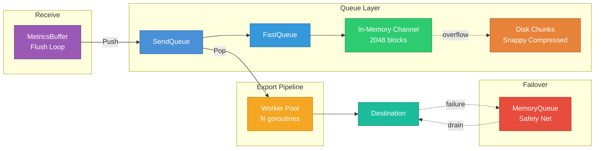
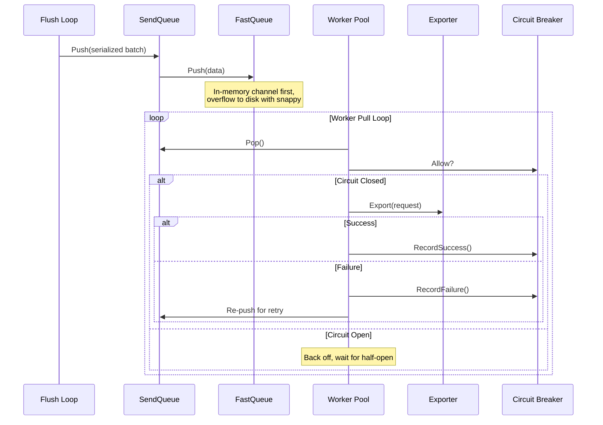
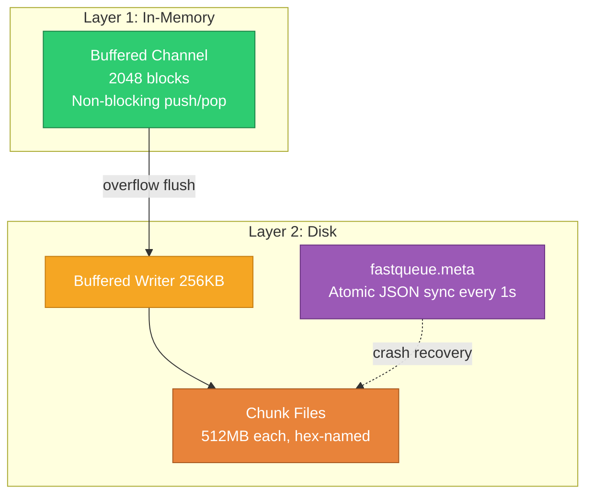
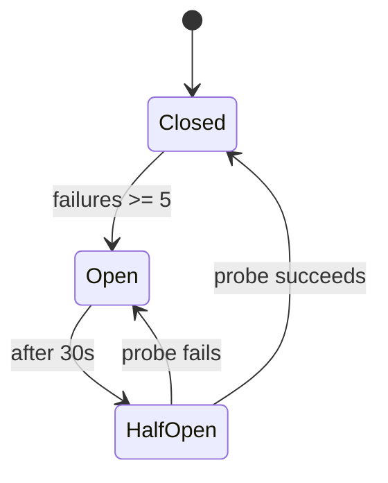

# Queue System

## Table of Contents

- [Architecture Overview](#architecture-overview)
- [Queue Modes](#queue-modes)
  - [Mode Comparison](#mode-comparison)
  - [Configuration Examples](#configuration-examples)
  - [Memory Sizing Guidance](#memory-sizing-guidance)
  - [When to Use Each Mode](#when-to-use-each-mode)
  - [Profile Defaults](#profile-defaults)
  - [Queue Mode Metrics](#queue-mode-metrics)
- [Always-Queue Model](#always-queue-model)
  - [Why Always-Queue?](#why-always-queue)
  - [Data Flow](#data-flow)
- [FastQueue (Persistent Disk Queue)](#fastqueue-persistent-disk-queue)
  - [Two-Layer Architecture](#two-layer-architecture)
  - [Write Path](#write-path)
  - [Block Format](#block-format)
  - [Read Path](#read-path)
  - [Metadata Persistence](#metadata-persistence)
  - [Disk I/O Optimizations](#disk-io-optimizations)
- [Memory Queue (Failover)](#memory-queue-failover)
- [Queue Policies](#queue-policies)
- [Worker Pool and Pipeline Split](#worker-pool-and-pipeline-split)
  - [Workers](#workers)
  - [Pipeline Split (High Throughput)](#pipeline-split-high-throughput)
  - [Adaptive Worker Scaling](#adaptive-worker-scaling)
- [Circuit Breaker](#circuit-breaker)
- [Backoff](#backoff)
- [Queue Sizing](#queue-sizing)
  - [Percentage-Based (Recommended)](#percentage-based-recommended)
  - [Manual Sizing](#manual-sizing)
  - [Sizing Formula](#sizing-formula)
- [Metrics](#metrics)
  - [Queue State](#queue-state)
  - [Queue Operations](#queue-operations)
  - [FastQueue](#fastqueue)
  - [Workers and Pipeline](#workers-and-pipeline)
  - [Circuit Breaker](#circuit-breaker-1)
- [Configuration Reference](#configuration-reference)
  - [CLI Flags](#cli-flags)
  - [YAML Configuration](#yaml-configuration)
- [Troubleshooting](#troubleshooting)
  - [Queue growing unboundedly](#queue-growing-unboundedly)
  - [Data loss occurring](#data-loss-occurring)
  - [Slow recovery after outage](#slow-recovery-after-outage)
  - [Crash recovery is slow](#crash-recovery-is-slow)

metrics-governor uses an always-queue architecture where all data flows through the queue before export. The queue provides persistence, retry semantics, backpressure, and circuit breaker protection against downstream failures.

## Architecture Overview



## Queue Modes

The `--queue-mode` flag selects how batches are buffered between the receiver and export workers. Three modes are available, each with different trade-offs between throughput, durability, and resource usage.

### memory (default)

Zero-serialization mode. Typed `ExportBatch` structs pass directly through a buffered Go channel with no `proto.Marshal`/`Unmarshal` and no disk I/O. Backpressure is enforced via `--queue-max-size` (batch count) and `--queue-max-bytes` (memory limit, default 256 MB). This is the fastest mode but provides no crash recovery -- all in-flight batches are lost on process restart.

### disk

Full serialization mode. Every batch is serialized with `proto.Marshal`, compressed with Snappy, and written to disk via FastQueue. The two-layer architecture uses a buffered channel (2048 blocks) in front of disk segment files. This mode provides full crash recovery at the cost of serialization and I/O overhead. This is the original always-queue behavior.

### hybrid

Dual-layer mode that combines the speed of memory with the safety net of disk. The primary path is the memory channel (zero serialization). When the memory queue exceeds `--queue-hybrid-spillover-pct` (default 80%) of capacity, new batches spill over to the disk queue. Workers drain L1 (memory) first, then L2 (disk). This delivers near-memory throughput under normal load with disk persistence for overflow and traffic spikes.

### Mode Comparison

| Property | memory | disk | hybrid |
|----------|--------|------|--------|
| Serialization cost | None | `proto.Marshal` + Snappy per batch | None (L1), `proto.Marshal` + Snappy (L2 spillover) |
| Persistence | None -- lost on crash | Full -- survives crash and restart | Partial -- L1 lost on crash, L2 survives |
| Throughput | Highest | Lower (I/O bound) | Near-memory under normal load |
| Memory usage | Bounded by `--queue-max-bytes` | Low (channel buffer only) | Bounded by `--queue-max-bytes` + disk spillover |
| Backpressure | `--queue-max-size` + `--queue-max-bytes` | `--queue-max-size` + `--queue-max-bytes` + disk capacity | Memory limits + spillover threshold + disk capacity |
| CPU overhead | Minimal | Serialization + compression per batch | Minimal (L1), serialization on spillover (L2) |
| Crash recovery | None | Full (FastQueue metadata) | L2 only (disk portion recovered) |
| Default in profile | `minimal`, `balanced` | -- | `performance` |

### Configuration Examples

**Memory mode (CLI):**

```bash
metrics-governor \
  --queue-mode memory \
  --queue-max-size 10000 \
  --queue-max-bytes 256Mi
```

**Memory mode (YAML):**

```yaml
exporter:
  queue:
    mode: memory
    max_size: 10000
    max_bytes: 256Mi
```

**Disk mode (CLI):**

```bash
metrics-governor \
  --queue-mode disk \
  --queue-path ./queue \
  --queue-max-size 50000 \
  --queue-max-bytes 1Gi \
  --queue-inmemory-blocks 2048 \
  --queue-chunk-size 512Mi
```

**Disk mode (YAML):**

```yaml
exporter:
  queue:
    mode: disk
    path: ./queue
    max_size: 50000
    max_bytes: 1Gi
    inmemory_blocks: 2048
    chunk_size: 512Mi
```

**Hybrid mode (CLI):**

```bash
metrics-governor \
  --queue-mode hybrid \
  --queue-max-size 10000 \
  --queue-max-bytes 512Mi \
  --queue-hybrid-spillover-pct 80 \
  --queue-path ./queue
```

**Hybrid mode (YAML):**

```yaml
exporter:
  queue:
    mode: hybrid
    max_size: 10000
    max_bytes: 512Mi
    hybrid_spillover_pct: 80
    path: ./queue
```

### Memory Sizing Guidance

The table below provides recommended `--queue-max-bytes` values for `memory` and `hybrid` modes based on expected ingestion rate. These assume an average batch size of ~50 KB (typical OTLP export batch after aggregation) and a 60-second drain buffer.

| Ingestion Rate (datapoints/sec) | Approx. Batch Rate | Recommended `--queue-max-bytes` | Notes |
|---------------------------------|--------------------|---------------------------------|-------|
| 10,000 | ~10 batches/sec | 64Mi | Light workload, minimal buffering needed |
| 50,000 | ~50 batches/sec | 128Mi | Moderate workload |
| 100,000 | ~100 batches/sec | 256Mi (default) | Standard production workload |
| 500,000 | ~500 batches/sec | 1Gi | High-throughput pipeline |
| 1,000,000+ | ~1000+ batches/sec | 2Gi+ | Consider `hybrid` mode for spillover safety |

For `hybrid` mode, the memory portion is sized by `--queue-max-bytes` and the disk spillover is bounded by the FastQueue `--queue-max-bytes` disk limit. Size the memory portion for normal-case throughput and let disk absorb spikes.

### When to Use Each Mode

**memory** -- Development, benchmarking, and low-latency pipelines where crash recovery is not required. Best when downstream is reliable and restarts are fast (container orchestrators with quick reschedule).

**disk** -- Regulated environments, audit pipelines, or any deployment where no data loss is acceptable, even across process crashes. Suitable when the serialization overhead is acceptable relative to export latency.

**hybrid** -- General production deployments. Provides the throughput of memory mode under normal conditions with automatic disk spillover during traffic spikes or downstream slowdowns. Recommended when you want both speed and a safety net.

### Profile Defaults

| Profile | Queue Mode | Rationale |
|---------|-----------|-----------|
| `minimal` | `memory` | Lowest resource footprint, no disk dependency |
| `balanced` | `memory` | Good throughput with simple configuration |
| `performance` | `hybrid` | Maximum throughput with spillover protection |

### Queue Mode Metrics

The following metrics are specific to the memory and hybrid queue modes:

| Metric | Type | Description |
|--------|------|-------------|
| `metrics_governor_queue_memory_bytes` | Gauge | Current memory usage of the in-memory queue (bytes) |
| `metrics_governor_queue_memory_utilization` | Gauge | Memory queue utilization ratio (0.0-1.0), computed as current bytes / `--queue-max-bytes` |
| `metrics_governor_queue_spillover_total` | Counter | Total number of batches spilled from memory (L1) to disk (L2) in `hybrid` mode |

These complement the existing queue metrics. In `hybrid` mode, monitor `metrics_governor_queue_memory_utilization` against the `--queue-hybrid-spillover-pct` threshold to understand how often spillover is triggered. A sustained spillover rate indicates the memory tier should be sized larger or downstream export capacity should be increased.

## Always-Queue Model

### Why Always-Queue?

The always-queue model (enabled by default) routes every batch through the queue. Workers pull and export asynchronously.

| Aspect | Try-Direct (legacy) | Always-Queue (default) |
|--------|---------------------|----------------------|
| Latency on success | Lower (no queue overhead) | Slightly higher (~1us push) |
| Latency on failure | High (blocks on timeout) | Constant (push is instant) |
| Backpressure | Blocks flush goroutine | Never blocks flush |
| Memory pressure | Failures accumulate in buffer | Queue absorbs spikes to disk |
| Parallelism | Limited by export concurrency | Full worker pool parallelism |
| Recovery speed | Sequential retry loop | Burst drain on circuit recovery |

### Data Flow



## FastQueue (Persistent Disk Queue)

FastQueue is a high-performance persistent queue inspired by VictoriaMetrics. It uses a two-layer architecture: an in-memory buffered channel for fast access and disk-backed chunk files for overflow and persistence.

### Two-Layer Architecture



### Write Path

1. **Check limits** -- reject with `ErrQueueFull` if MaxSize or MaxBytes exceeded
2. **Try in-memory channel** -- non-blocking send, O(1) with no I/O
3. **Channel full? Flush to disk** -- drain ALL channel blocks (write coalescing), compress each with Snappy, write through 256KB `bufio.Writer`, flush once
4. **Chunk rotation** -- if write would exceed chunk boundary (512MB), sync and close current chunk, open new chunk file

### Block Format

Each block on disk: 8-byte length-prefixed header + compressed data.

```
Bits 0-61: data length (up to 4 EiB)
Bit 62:    reserved
Bit 63:    snappy compression flag (1=compressed)
```

### Read Path

1. **Disk first** (preserves FIFO) -- flush buffered writer, read 8-byte header, extract length + compression flag, read data, decompress if Snappy
2. **Then in-memory channel** -- non-blocking receive
3. **Both empty** -- return nil (empty queue)
4. **Cleanup** -- fully consumed chunk files are deleted automatically

### Metadata Persistence

FastQueue persists state to `fastqueue.meta` (JSON) for crash recovery:

```json
{
  "name": "fastqueue",
  "reader_offset": 1048576,
  "writer_offset": 2097152,
  "version": 2,
  "entry_count": 150,
  "total_bytes": 524288
}
```

- **Sync interval:** Atomic JSON write every 1 second (temp file + `os.Rename`)
- **Max data loss window:** 1 second
- **V2 metadata:** Includes `entry_count` and `total_bytes` for O(1) recovery
- **V1 fallback:** Legacy metadata triggers disk scan at startup (10-second timeout, then discard)

### Disk I/O Optimizations

| Optimization | Impact | Details |
|-------------|--------|---------|
| Buffered writer (256KB) | ~128x IOPS reduction | `bufio.Writer` coalesces writes into sequential I/O |
| Write coalescing | Single flush per batch | Drains ALL channel blocks before flushing once |
| Snappy compression | ~60-70% size reduction | Per-block `s2.EncodeSnappy` (faster than standard Snappy) |
| Chunk rotation | Efficient cleanup | Consumed chunks deleted, no in-place compaction |
| Length-prefixed blocks | Zero-overhead framing | 8-byte header with compression flag in unused bits |
| Stale flush | Prevents data loss | In-memory blocks flushed to disk after 30s inactivity |
| Separate reader/writer | No contention | Reader and writer operate on different chunk files |

## Memory Queue (Failover)

The `MemoryQueue` is a bounded in-memory queue used as a failover safety net. When all export attempts fail (including split-on-error retries), batches are pushed here instead of being dropped.

| Aspect | Description |
|--------|-------------|
| Storage | In-memory only (lost on restart) |
| Bounding | By count (default: 1000) and bytes (default: 256 MB) |
| Overflow | Oldest entries evicted to make room |
| Drain | Every 5 seconds, up to 10 entries re-exported |
| GC-friendly | Compacts slice when cap >> len |

## Queue Policies

The `full_behavior` setting controls what happens at capacity:

| Policy | Flag Value | Behavior | Data Loss? |
|--------|-----------|----------|------------|
| Drop Oldest | `drop_oldest` (default) | Pop oldest to make room | Yes (oldest) |
| Drop Newest | `drop_newest` | Discard incoming entry | Yes (newest) |
| Block | `block` | Wait until space or timeout (30s) | On timeout |

## Worker Pool and Pipeline Split

### Workers

In always-queue mode, workers continuously pop entries and export them:

| Setting | Flag | Default | Description |
|---------|------|---------|-------------|
| Workers | `-queue-workers` | `0` (= 2 x NumCPU) | Worker goroutine count |
| Always Queue | `-queue-always-queue` | `true` | Route all data through queue |

### Pipeline Split (High Throughput)

Separates CPU-bound work (compression) from I/O-bound work (HTTP sends):


| Setting | YAML | Default |
|---------|------|---------|
| `pipeline_split.enabled` | `false` | Activate pipeline split |
| `pipeline_split.preparer_count` | NumCPU | CPU-bound goroutines |
| `pipeline_split.sender_count` | NumCPU x 2 | I/O-bound goroutines |
| `pipeline_split.channel_size` | 256 | Bounded channel buffer |
| `max_concurrent_sends` | 4 | Max concurrent HTTP sends per sender |
| `global_send_limit` | NumCPU x 8 | Global in-flight sends |

### Adaptive Worker Scaling

| Setting | YAML | Default |
|---------|------|---------|
| `adaptive_workers.enabled` | `false` | Activate adaptive scaling |
| `adaptive_workers.min_workers` | 1 | Minimum worker count |
| `adaptive_workers.max_workers` | NumCPU x 4 | Maximum worker count |

## Circuit Breaker



| Setting | Flag | Default |
|---------|------|---------|
| `-queue-circuit-breaker-enabled` | `true` | Enable circuit breaker |
| `-queue-circuit-breaker-threshold` | `5` | Consecutive failures before opening |
| `-queue-circuit-breaker-reset-timeout` | `30s` | Time before half-open probe |

## Backoff

| Setting | Flag | Default |
|---------|------|---------|
| `-queue-backoff-enabled` | `true` | Enable exponential backoff |
| `-queue-backoff-multiplier` | `2.0` | Delay multiplier per failure |
| `-queue-max-retry-delay` | `5m` | Maximum backoff cap |

## Queue Sizing

### Percentage-Based (Recommended)

```bash
metrics-governor -queue-memory-percent 0.10 -memory-limit-ratio 0.85
```

### Manual Sizing

```bash
metrics-governor \
  -queue-max-size 10000 -queue-max-bytes 1Gi \
  -queue-inmemory-blocks 2048 -queue-chunk-size 512Mi
```

### Sizing Formula

```
In-memory capacity = inmemory_blocks x avg_batch_size  (default: ~100MB)
Disk capacity      = queue_max_bytes                    (default: 1 GiB)
Drain throughput   = workers x (1 / avg_export_latency)
Drain time         = queue_size / drain_throughput
```

Example: 8 workers, 50ms latency, 10K entries = 160 entries/sec = 62.5s drain time.

## Metrics

### Queue State

| Metric | Type | Description |
|--------|------|-------------|
| `metrics_governor_queue_size` | Gauge | Current batches in queue |
| `metrics_governor_queue_bytes` | Gauge | Current queue bytes |
| `metrics_governor_queue_max_size` | Gauge | Configured max batch count |
| `metrics_governor_queue_max_bytes` | Gauge | Configured max bytes |
| `metrics_governor_queue_utilization_ratio` | Gauge | Utilization (0.0-1.0) |
| `metrics_governor_queue_disk_available_bytes` | Gauge | Available disk space |

### Queue Operations

| Metric | Type | Labels | Description |
|--------|------|--------|-------------|
| `metrics_governor_queue_push_total` | Counter | -- | Batches pushed |
| `metrics_governor_queue_dropped_total` | Counter | `reason` | Batches dropped |
| `metrics_governor_queue_retry_total` | Counter | -- | Retry attempts |
| `metrics_governor_queue_retry_success_total` | Counter | -- | Successful retries |
| `metrics_governor_queue_retry_failure_total` | Counter | `error_type` | Failed retries |
| `metrics_governor_queue_disk_full_total` | Counter | -- | Disk full events |

### FastQueue

| Metric | Type | Description |
|--------|------|-------------|
| `metrics_governor_fastqueue_inmemory_blocks` | Gauge | Blocks in channel |
| `metrics_governor_fastqueue_disk_bytes` | Gauge | Bytes on disk |
| `metrics_governor_fastqueue_meta_sync_total` | Counter | Metadata syncs |
| `metrics_governor_fastqueue_chunk_rotations` | Counter | Chunk rotations |
| `metrics_governor_fastqueue_inmemory_flushes` | Counter | Flushes to disk |

### Workers and Pipeline

| Metric | Type | Description |
|--------|------|-------------|
| `metrics_governor_queue_workers_active` | Gauge | Active workers |
| `metrics_governor_queue_workers_total` | Gauge | Configured workers |
| `metrics_governor_queue_preparers_active` | Gauge | Active preparers |
| `metrics_governor_queue_senders_active` | Gauge | Active senders |
| `metrics_governor_queue_sends_inflight` | Gauge | In-flight HTTP sends |
| `metrics_governor_queue_export_latency_ewma_seconds` | Gauge | Export latency EWMA |

### Circuit Breaker

| Metric | Type | Description |
|--------|------|-------------|
| `metrics_governor_circuit_breaker_state` | Gauge (labels: `state`) | `closed`, `open`, `half_open` |
| `metrics_governor_circuit_breaker_open_total` | Counter | Times opened |
| `metrics_governor_circuit_breaker_rejected_total` | Counter | Requests rejected |
| `metrics_governor_queue_backoff_seconds` | Gauge | Current backoff delay |

## Configuration Reference

### CLI Flags

```bash
# Core queue
-queue-enabled true                         -queue-type memory|disk
-queue-path ./queue                         -queue-max-size 10000
-queue-max-bytes 1Gi                        -queue-full-behavior drop_oldest
-queue-always-queue true                    -queue-workers 0

# FastQueue tuning
-queue-inmemory-blocks 2048                 -queue-chunk-size 512Mi
-queue-meta-sync 1s                         -queue-stale-flush 30s
-queue-write-buffer-size 256Ki              -queue-compression snappy

# Retry and backoff
-queue-retry-interval 5s                    -queue-max-retry-delay 5m
-queue-backoff-enabled true                 -queue-backoff-multiplier 2.0

# Circuit breaker
-queue-circuit-breaker-enabled true
-queue-circuit-breaker-threshold 5
-queue-circuit-breaker-reset-timeout 30s

# Memory sizing
-queue-memory-percent 0.10                  -memory-limit-ratio 0.85
-queue-adaptive-enabled true                -queue-target-utilization 0.85
```

### YAML Configuration

```yaml
exporter:
  queue:
    type: disk
    enabled: true
    path: ./queue
    max_size: 10000
    max_bytes: 1Gi
    full_behavior: drop_oldest
    inmemory_blocks: 2048
    chunk_size: 512Mi
    meta_sync_interval: 1s
    write_buffer_size: 256Ki
    compression: snappy
    always_queue: true
    workers: 0
    backoff:
      enabled: true
      multiplier: 2.0
    circuit_breaker:
      enabled: true
      threshold: 5
      reset_timeout: 30s
    pipeline_split:
      enabled: false
      preparer_count: 0
      sender_count: 0
      channel_size: 256
    adaptive_workers:
      enabled: false
      min_workers: 1
      max_workers: 0
```

## Troubleshooting

### Queue growing unboundedly

**Symptom:** `metrics_governor_queue_utilization_ratio` approaching 1.0.

1. Check `metrics_governor_circuit_breaker_state{state="open"}` -- backend may be down
2. Check `rate(metrics_governor_queue_retry_failure_total[5m])` by `error_type`
3. If `rate_limit`: destination is rejecting -- reduce send rate or increase backend capacity
4. If `timeout`: increase exporter timeout or check network connectivity
5. Increase workers: `-queue-workers 16`

### Data loss occurring

**Symptom:** `metrics_governor_queue_dropped_total` incrementing.

1. `reason="oldest"/"newest"`: queue full -- increase `-queue-max-bytes`
2. `reason="disk_full"`: disk exhausted -- increase disk or reduce chunk size
3. `export_data_loss_total` incrementing: both export AND failover failed -- check downstream health

### Slow recovery after outage

1. Circuit breaker may still be `open` -- waiting for `reset_timeout` (30s)
2. Increase workers for faster drain: `-queue-workers 32`
3. Enable pipeline split for high-throughput recovery
4. Check `metrics_governor_queue_backoff_seconds` -- high values mean long delays

### Crash recovery is slow

1. Ensure metadata is V2 (includes entry counts, O(1) recovery)
2. V1 metadata triggers disk scan (10s timeout, then queue discarded)
3. Verify `fastqueue.meta` is present and not corrupted
