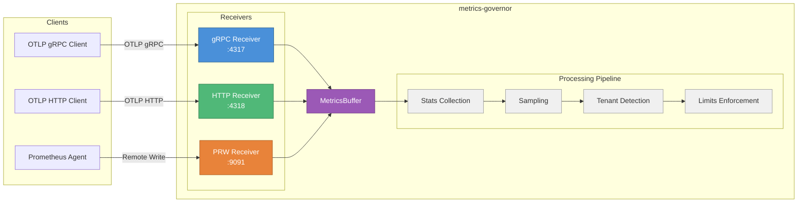
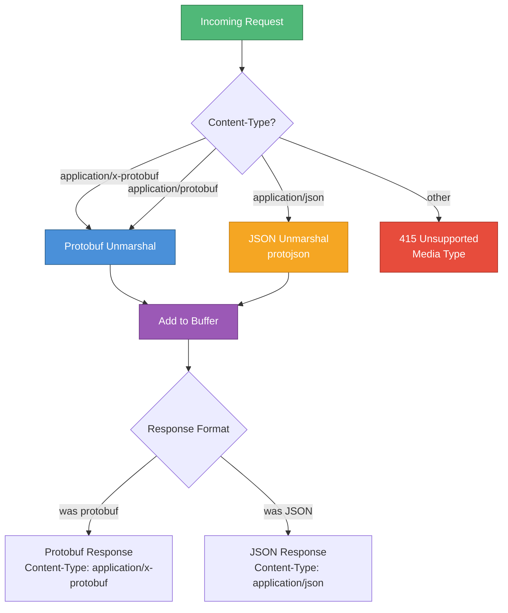
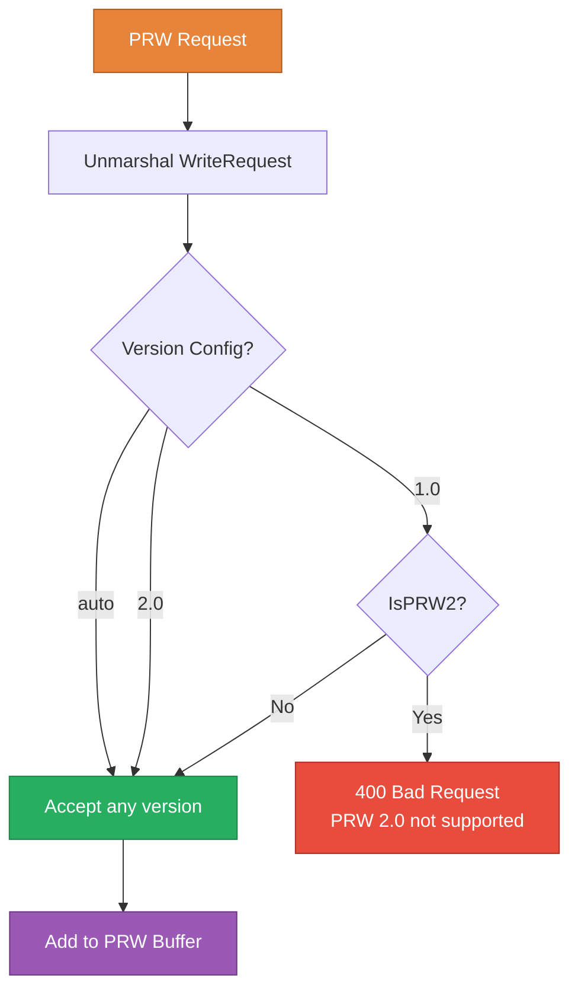
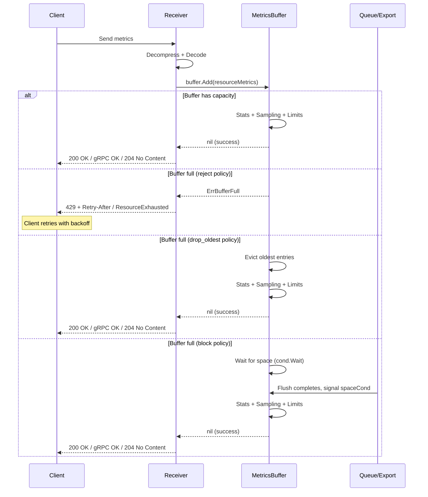
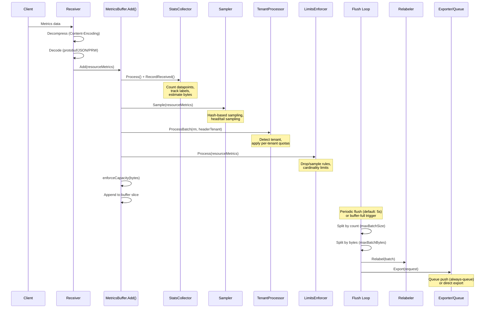

# Receiving Metrics

metrics-governor receives metrics via three protocols, each running its own receiver goroutine. All receivers validate, decompress, and decode incoming data before pushing it into a shared buffer for processing and export.

## Architecture Overview



## OTLP gRPC Receiver

The gRPC receiver implements the full OpenTelemetry Collector `MetricsService/Export` RPC, accepting `ExportMetricsServiceRequest` messages over gRPC.

### Protocol Support

- Full OTLP gRPC `ExportMetricsService` implementation
- `ExportMetricsServiceRequest` / `ExportMetricsServiceResponse` message types
- TLS and mTLS (mutual TLS with client certificate verification)
- Authentication via bearer token or basic auth (gRPC unary interceptor)
- Compression: gzip (built-in), zstd (registered at init with pooled encoders/decoders)
- Max message size: 64 MB (configurable via `grpc.MaxRecvMsgSize`)
- Wire-level compression metrics via `grpc.StatsHandler` (tracks compressed vs. uncompressed bytes)
- Backpressure via `codes.ResourceExhausted` when buffer is full

### Configuration

**CLI Flags:**

```bash
metrics-governor \
  -grpc-listen :4317 \
  -receiver-tls-enabled \
  -receiver-tls-cert /path/to/cert.pem \
  -receiver-tls-key /path/to/key.pem \
  -receiver-tls-ca /path/to/ca.pem \
  -receiver-tls-client-auth \
  -receiver-auth-enabled \
  -receiver-auth-bearer-token "my-secret-token"
```

**YAML Configuration:**

```yaml
receiver:
  grpc:
    address: ":4317"
  tls:
    enabled: true
    cert_file: /path/to/cert.pem
    key_file: /path/to/key.pem
    ca_file: /path/to/ca.pem
    client_auth: true
  auth:
    enabled: true
    bearer_token: "my-secret-token"
```

| Flag | Default | Description |
|------|---------|-------------|
| `-grpc-listen` | `:4317` | gRPC receiver listen address |
| `-receiver-tls-enabled` | `false` | Enable TLS for receivers |
| `-receiver-tls-cert` | `""` | Path to TLS certificate file |
| `-receiver-tls-key` | `""` | Path to TLS private key file |
| `-receiver-tls-ca` | `""` | Path to CA certificate for client verification (mTLS) |
| `-receiver-tls-client-auth` | `false` | Require client certificates (mTLS) |
| `-receiver-auth-enabled` | `false` | Enable authentication for receivers |
| `-receiver-auth-bearer-token` | `""` | Bearer token for authentication |
| `-receiver-auth-basic-username` | `""` | Basic auth username |
| `-receiver-auth-basic-password` | `""` | Basic auth password |

### gRPC Compression

The gRPC receiver registers two compressors at init time:

| Compressor | Registration | Notes |
|-----------|-------------|-------|
| gzip | Built-in (`google.golang.org/grpc/encoding/gzip`) | Standard gRPC compression |
| zstd | Custom (`zstdCompressor`) | Uses sync.Pool for encoder/decoder reuse |

Compression is transparent: gRPC clients set the encoding in the request header, and the server automatically decompresses.

### Metrics

| Metric | Type | Labels | Description |
|--------|------|--------|-------------|
| `metrics_governor_grpc_received_bytes_total` | Counter | `compression` | Total gRPC bytes received by compression state |
| `metrics_governor_receiver_requests_total` | Counter | `protocol=grpc` | Total gRPC requests received |

## OTLP HTTP Receiver

The HTTP receiver accepts OTLP metrics over HTTP, supporting both Protobuf and JSON content types with configurable server timeouts.

### Protocol Support

- POST `/v1/metrics` endpoint (configurable path)
- Content types: `application/x-protobuf`, `application/protobuf`, `application/json`
- Content-Encoding support: gzip, zstd, snappy, zlib, deflate
- Response format matches request format (protobuf request gets protobuf response)
- Configurable request body size limits
- HTTP server timeouts (read, write, idle, header)
- Keep-alive control
- TLS/mTLS support (shared with gRPC receiver config)
- Authentication via bearer token or basic auth (HTTP middleware)
- Backpressure via HTTP 429 + `Retry-After: 5` header when buffer is full

### Configuration

**CLI Flags:**

```bash
metrics-governor \
  -http-listen :4318 \
  -http-receiver-path /v1/metrics \
  -receiver-max-request-body-size 10Mi \
  -receiver-read-header-timeout 1m \
  -receiver-write-timeout 30s \
  -receiver-idle-timeout 1m \
  -receiver-keep-alives-enabled
```

**YAML Configuration:**

```yaml
receiver:
  http:
    address: ":4318"
    server:
      max_request_body_size: 10Mi
      read_timeout: 0s
      read_header_timeout: 1m
      write_timeout: 30s
      idle_timeout: 1m
      keep_alives_enabled: true
```

| Flag | Default | Description |
|------|---------|-------------|
| `-http-listen` | `:4318` | HTTP receiver listen address |
| `-http-receiver-path` | `/v1/metrics` | HTTP endpoint path for OTLP metrics |
| `-receiver-max-request-body-size` | `0` (no limit) | Maximum request body size (accepts: `10Mi`, `1Gi`, bytes) |
| `-receiver-read-timeout` | `0` (no timeout) | Max duration for reading the entire request |
| `-receiver-read-header-timeout` | `1m` | Max duration for reading request headers |
| `-receiver-write-timeout` | `30s` | Max duration before timing out writes |
| `-receiver-idle-timeout` | `1m` | Max time to wait for next request (keep-alive) |
| `-receiver-keep-alives-enabled` | `true` | Enable HTTP keep-alives |

### Content-Type Negotiation



### Content-Encoding Decompression

The HTTP receiver supports transparent decompression based on the `Content-Encoding` header:

| Content-Encoding | Compression Type | Notes |
|-----------------|------------------|-------|
| `gzip`, `x-gzip` | gzip | Standard HTTP compression |
| `zstd` | zstd | High performance |
| `snappy`, `x-snappy-framed` | snappy | Low CPU overhead |
| `zlib` | zlib | Legacy |
| `deflate` | deflate | Legacy |
| (empty) | none | No decompression |

## Prometheus Remote Write Receiver

The PRW receiver accepts Prometheus Remote Write data, supporting both PRW 1.0 and 2.0 protocols with VictoriaMetrics compatibility.

### Protocol Support

- PRW 1.0 (classic protobuf `WriteRequest`)
- PRW 2.0 (with reduced labels, symbol tables, native histograms)
- Auto-detection mode (accepts both versions)
- Snappy decompression (standard PRW encoding)
- Additional Content-Encoding support: gzip, zstd
- Endpoints: `/api/v1/write` (standard) and `/write` (VictoriaMetrics shorthand)
- PRW compliance headers: `X-Prometheus-Remote-Write-Samples-Written`, `X-Prometheus-Remote-Write-Histograms-Written`
- Response: 204 No Content on success
- Separate TLS, auth, and timeout configuration from OTLP receivers
- Backpressure: not directly applied at PRW receiver level (buffer is managed separately for PRW pipeline)

### Configuration

**CLI Flags:**

```bash
metrics-governor \
  -prw-listen :9091 \
  -prw-receiver-path /api/v1/write \
  -prw-receiver-version auto \
  -prw-receiver-max-body-size 10485760 \
  -prw-receiver-read-timeout 1m \
  -prw-receiver-write-timeout 30s \
  -prw-receiver-tls-enabled \
  -prw-receiver-tls-cert /path/to/cert.pem \
  -prw-receiver-tls-key /path/to/key.pem \
  -prw-receiver-auth-enabled \
  -prw-receiver-auth-bearer-token "my-prw-token"
```

**YAML Configuration:**

```yaml
# PRW receiver is configured at the top level, not under receiver:
prw:
  receiver:
    address: ":9091"
    path: /api/v1/write
    version: auto        # "1.0", "2.0", or "auto"
    tls:
      enabled: true
      cert_file: /path/to/cert.pem
      key_file: /path/to/key.pem
    auth:
      enabled: true
      bearer_token: "my-prw-token"
    server:
      max_request_body_size: 10Mi
      read_timeout: 1m
      write_timeout: 30s
```

| Flag | Default | Description |
|------|---------|-------------|
| `-prw-listen` | `""` (disabled) | PRW receiver listen address |
| `-prw-receiver-path` | `/api/v1/write` | PRW endpoint path |
| `-prw-receiver-version` | `auto` | Protocol version: `1.0`, `2.0`, or `auto` |
| `-prw-receiver-max-body-size` | `0` (no limit) | Maximum request body size in bytes |
| `-prw-receiver-read-timeout` | `1m` | Read timeout |
| `-prw-receiver-write-timeout` | `30s` | Write timeout |
| `-prw-receiver-tls-enabled` | `false` | Enable TLS for PRW receiver |
| `-prw-receiver-tls-cert` | `""` | PRW TLS certificate file |
| `-prw-receiver-tls-key` | `""` | PRW TLS private key file |
| `-prw-receiver-tls-ca` | `""` | CA cert for client verification (mTLS) |
| `-prw-receiver-tls-client-auth` | `false` | Require client certificates |
| `-prw-receiver-auth-enabled` | `false` | Enable authentication for PRW |
| `-prw-receiver-auth-bearer-token` | `""` | Bearer token for PRW authentication |

### PRW Version Handling



### Endpoint Registration

When no custom path is configured, both endpoints are registered simultaneously:

| Endpoint | Usage |
|----------|-------|
| `/api/v1/write` | Standard Prometheus Remote Write path |
| `/write` | VictoriaMetrics shorthand path |

When a custom path is configured via `-prw-receiver-path`, only that path is registered.

## Backpressure

### How Backpressure Works

All receivers implement backpressure to prevent unbounded memory growth when the buffer is full. The behavior depends on the buffer's `full_policy` setting.



### Response Codes by Protocol

| Protocol | Normal | Buffer Full (reject) | Auth Failure |
|----------|--------|---------------------|--------------|
| gRPC | `OK` (0) | `ResourceExhausted` (8) | `Unauthenticated` (16) |
| OTLP HTTP | `200 OK` | `429 Too Many Requests` + `Retry-After: 5` | `401 Unauthorized` |
| PRW | `204 No Content` | (PRW uses separate buffer) | `401 Unauthorized` |

### Buffer Full Policies

| Policy | Flag Value | Behavior | Data Loss? |
|--------|-----------|----------|------------|
| Reject | `reject` (default) | Return error to client, client retries | No (client retains data) |
| Drop Oldest | `drop_oldest` | Evict oldest buffered entries to make room | Yes (oldest data) |
| Block | `block` | Block until flush creates space | No (but increases latency) |

Configure via CLI: `-buffer-full-policy reject` or YAML: `buffer.full_policy: reject`

## Data Flow

The complete data flow from receiver through the processing pipeline:



### Pipeline Stage Timing

Each pipeline stage is instrumented with `pipeline.Record()` for latency tracking:

| Stage | Metric Key | Description |
|-------|-----------|-------------|
| Decompression | `receive_decompress` | Content-Encoding decompression time and bytes |
| Unmarshal | `receive_unmarshal` | Protobuf/JSON decode time and bytes |
| Stats | `stats` | Stats collection processing time |
| Sampling | `sampling` | Sampling filter processing time |
| Tenant | `tenant` | Tenant detection and quota enforcement time |
| Limits | `limits` | Limits enforcement processing time |
| Batch Split | `batch_split` | Batch splitting by count and bytes |
| Relabel | `relabel` | Metric relabeling before export |

## Receiver Metrics

All receivers share a common set of Prometheus metrics:

| Metric | Type | Labels | Description |
|--------|------|--------|-------------|
| `metrics_governor_receiver_requests_total` | Counter | `protocol` | Total requests received (`grpc`, `http`, `prw`) |
| `metrics_governor_receiver_errors_total` | Counter | `type` | Total receiver errors (`decode`, `auth`, `decompress`, `read`) |
| `metrics_governor_receiver_datapoints_total` | Counter | -- | Total datapoints received across all protocols |
| `metrics_governor_grpc_received_bytes_total` | Counter | `compression` | gRPC bytes by compression state (`compressed`, `uncompressed`) |
| `metrics_governor_buffer_bytes` | Gauge | -- | Current buffer memory usage in bytes |
| `metrics_governor_buffer_max_bytes` | Gauge | -- | Configured buffer capacity limit |
| `metrics_governor_buffer_rejected_total` | Counter | -- | Batches rejected due to buffer capacity |
| `metrics_governor_buffer_evictions_total` | Counter | -- | Entries evicted (drop_oldest policy) |

## Health Checks

Each receiver exposes a `HealthCheck()` method used by the `/ready` endpoint:

| Receiver | Health Check Method |
|----------|-------------------|
| gRPC | Checks `running` atomic.Bool flag |
| HTTP | TCP dial to listen address (1s timeout) |
| PRW | TCP dial to listen address (1s timeout) |

## Troubleshooting

### Receiver not accepting connections

**Symptom:** Clients get `connection refused` errors.

**Checks:**
1. Verify the listen address is correct: `-grpc-listen :4317`, `-http-listen :4318`
2. For PRW, ensure it is explicitly enabled: `-prw-listen :9091` (disabled by default)
3. Check for port conflicts with `lsof -i :4317`
4. Verify TLS certificates are valid if TLS is enabled

### 429 Too Many Requests / ResourceExhausted

**Symptom:** Receivers return backpressure responses.

**Checks:**
1. Check `metrics_governor_buffer_bytes` vs `metrics_governor_buffer_max_bytes`
2. If buffer is consistently full, increase buffer size: `-buffer-size 20000`
3. Increase flush frequency: `-flush-interval 1s`
4. Check downstream export health -- if exports are failing, the buffer fills up
5. Consider changing buffer policy: `-buffer-full-policy drop_oldest`

### 415 Unsupported Media Type

**Symptom:** HTTP receiver rejects requests.

**Checks:**
1. Ensure `Content-Type` header is set: `application/x-protobuf` or `application/json`
2. For PRW, the Content-Type must be `application/x-protobuf`

### High decode error rate

**Symptom:** `metrics_governor_receiver_errors_total{type="decode"}` is increasing.

**Checks:**
1. Verify client is sending valid OTLP protobuf or JSON
2. Check `Content-Encoding` matches actual compression
3. For PRW, verify the version configuration matches the client: `-prw-receiver-version auto`

### gRPC message too large

**Symptom:** gRPC clients get `ResourceExhausted` with "message too large" error.

**Checks:**
1. The max gRPC message size is 64 MB. If clients send larger batches, they need to split them
2. Reduce client batch sizes to stay under 64 MB

### TLS handshake failures

**Symptom:** Clients get TLS-related errors.

**Checks:**
1. Verify certificate and key files exist and are readable
2. For mTLS (`-receiver-tls-client-auth`), ensure clients have valid client certificates
3. Verify the CA file includes the CA that signed the client certificates
4. Check certificate expiration dates
