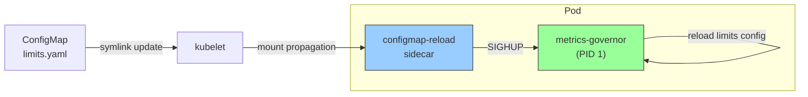

# Dynamic Configuration Reload

metrics-governor supports hot-reloading its limits configuration at runtime without restarting the process. This avoids traffic interruption and preserves in-flight buffer state.

## Architecture



## How It Works

1. **SIGHUP signal**: The main process listens for `SIGHUP`. On receipt, it re-reads the limits configuration file, validates it, and atomically swaps the active config.
2. **Sidecar watcher** (Kubernetes): A lightweight sidecar container polls the mounted ConfigMap files for changes. When a change is detected, it sends `SIGHUP` to the main process via the shared PID namespace.

## Reload Trigger: SIGHUP

Send `SIGHUP` to reload the limits configuration:

```bash
# Local / VM
kill -HUP $(pidof metrics-governor)

# Kubernetes (without sidecar)
kubectl exec <pod> -- kill -HUP 1

# Kubernetes (with sidecar)
# Automatic — the sidecar handles this
```

### What happens on SIGHUP

1. The limits YAML file (specified by `-limits-config`) is re-read and parsed
2. If parsing succeeds, the new config atomically replaces the old one
3. Per-rule tracking stats are preserved for rules that still exist
4. Stats for removed rules are cleaned up
5. The rule matching cache is cleared to reflect the new rules
6. A log entry confirms the reload with the new rule count

### Error handling

If the new config file is invalid (parse error, missing file, invalid YAML), the reload is **rejected** and the current config remains active:

```json
{"level":"error","message":"limits config reload failed, keeping current config","fields":{"error":"...","path":"..."}}
```

## What Reloads vs What Requires Restart

| Setting | Hot-Reloadable | Notes |
|---------|:--------------:|-------|
| Limits rules (limits.yaml) | Yes | Full reload on SIGHUP |
| Limits defaults | Yes | Part of limits.yaml |
| Limits dry-run mode (main config) | Yes | Toggled via `limits.dry_run` in config.yaml |
| Receiver configuration | No | Listen addresses, TLS, auth |
| Exporter configuration | No | Endpoint, protocol, TLS |
| Buffer settings | No | Size, flush interval, batch size |
| Queue settings | No | Path, max size, compression |
| Sharding settings | No | Headless service, labels |
| Cardinality tracking mode | No | Bloom, exact, hybrid |
| Stats labels | No | Requires stats collector recreation |
| Memory limit ratio | No | Set at startup via GOMEMLIMIT |

The sidecar watches **both** the main config file (`config.yaml`) and the limits config file (`limits.yaml`). When either changes, SIGHUP is sent and all hot-reloadable settings are applied.

## Kubernetes: ConfigMap Reload Sidecar

### Why a sidecar?

Kubernetes updates ConfigMap-mounted volumes via symlink rotation. This mechanism has known issues with `fsnotify`-based file watchers because:
- The symlink swap is atomic but the inotify events may not fire reliably
- Some inotify implementations miss the rename/create on the symlink target
- The timing of kubelet propagation varies (up to 1 minute by default)

A polling-based sidecar avoids all these issues by simply checksumming the file contents periodically.

### Helm chart setup

Enable the sidecar in your values:

```yaml
configReload:
  enabled: true
  watchInterval: 10  # poll every 10 seconds
  image:
    repository: busybox
    tag: "1.37"
  resources:
    requests:
      cpu: 10m
      memory: 16Mi
    limits:
      cpu: 50m
      memory: 32Mi

limits:
  enabled: true
  config: |
    defaults:
      max_datapoints_rate: 1000000
      action: log
    rules:
      - name: "prod-limits"
        match:
          labels:
            env: "prod"
        max_cardinality: 5000
        action: adaptive
        group_by: ["service"]
```

### What the Helm chart does when `configReload.enabled: true`

1. **`shareProcessNamespace: true`** — Enables cross-container signal delivery within the pod
2. **Directory volume mount** — Mounts the limits ConfigMap as a directory (not `subPath`) so kubelet can update it via symlink rotation
3. **Sidecar container** — Runs a shell script that:
   - Computes SHA-256 of watched config files every N seconds
   - When hash changes, finds the `metrics-governor` process and sends `SIGHUP`
4. **SYS_PTRACE capability** — Required for the sidecar to send signals to processes in other containers

### Volume mount detail

Without the sidecar (default):
```yaml
# Uses subPath — ConfigMap changes are NOT propagated
- name: limits-config
  mountPath: /etc/metrics-governor/limits.yaml
  subPath: limits.yaml
```

With the sidecar enabled:
```yaml
# Directory mount — ConfigMap changes ARE propagated via symlink rotation
- name: limits-config
  mountPath: /etc/metrics-governor/limits/
```

The `-limits-config` argument is automatically adjusted to point to the directory-based path.

### Standalone sidecar script

For non-Helm deployments, you can use the script at [`deploy/configmap-reload.sh`](../deploy/configmap-reload.sh) directly:

```yaml
# Pod spec snippet
spec:
  shareProcessNamespace: true
  containers:
    - name: metrics-governor
      image: metrics-governor:latest
      args:
        - -limits-config=/etc/metrics-governor/limits/limits.yaml
      volumeMounts:
        - name: limits
          mountPath: /etc/metrics-governor/limits
    - name: configmap-reload
      image: busybox:1.37
      command: ["sh", "/scripts/reload.sh"]
      env:
        - name: WATCH_FILES
          value: "/etc/metrics-governor/limits/limits.yaml"
        - name: WATCH_INTERVAL
          value: "10"
      securityContext:
        capabilities:
          add: ["SYS_PTRACE"]
      volumeMounts:
        - name: limits
          mountPath: /etc/metrics-governor/limits
        - name: reload-script
          mountPath: /scripts
  volumes:
    - name: limits
      configMap:
        name: metrics-governor-limits
    - name: reload-script
      configMap:
        name: configmap-reload-script
```

## Monitoring Reloads

### Prometheus metrics

| Metric | Type | Description |
|--------|------|-------------|
| `metrics_governor_config_reloads_total` | counter | Successful limits config reloads |
| `metrics_governor_config_reload_last_success_timestamp_seconds` | gauge | Unix timestamp of last successful reload |

### Useful queries

```promql
# Reload rate (should be low, spikes indicate frequent config changes)
rate(metrics_governor_config_reloads_total[5m])

# Time since last successful reload
time() - metrics_governor_config_reload_last_success_timestamp_seconds

# Alert if no reload has happened in 24h when sidecar is running
metrics_governor_config_reload_last_success_timestamp_seconds > 0
  and time() - metrics_governor_config_reload_last_success_timestamp_seconds > 86400
```

### Log messages

Successful reload:
```json
{"level":"info","message":"received SIGHUP, reloading limits config","fields":{"path":"/etc/metrics-governor/limits/limits.yaml"}}
{"level":"info","message":"limits config reloaded successfully","fields":{"rules_count":3}}
```

Failed reload (current config preserved):
```json
{"level":"error","message":"limits config reload failed, keeping current config","fields":{"error":"yaml: line 5: did not find expected key","path":"..."}}
```

## Operational Tips

- **Test changes first**: Use `-limits-dry-run=true` in staging before applying to production
- **Watch logs after ConfigMap update**: Look for the `"limits config reloaded successfully"` message
- **ConfigMap propagation delay**: kubelet may take up to 1 minute to propagate ConfigMap changes to the pod volume. The sidecar poll interval is additive on top of this
- **Rolling updates vs reload**: For settings that require restart (see table above), use a standard rolling deployment instead of SIGHUP
- **Multiple replicas**: Each pod has its own sidecar, so all replicas will pick up the change independently (within propagation + poll interval)
