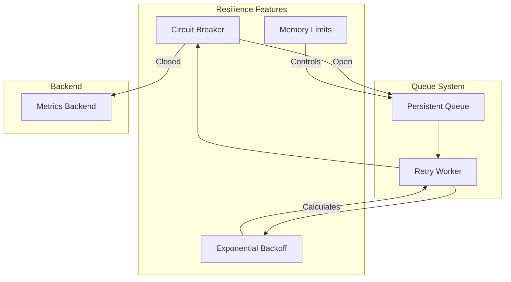
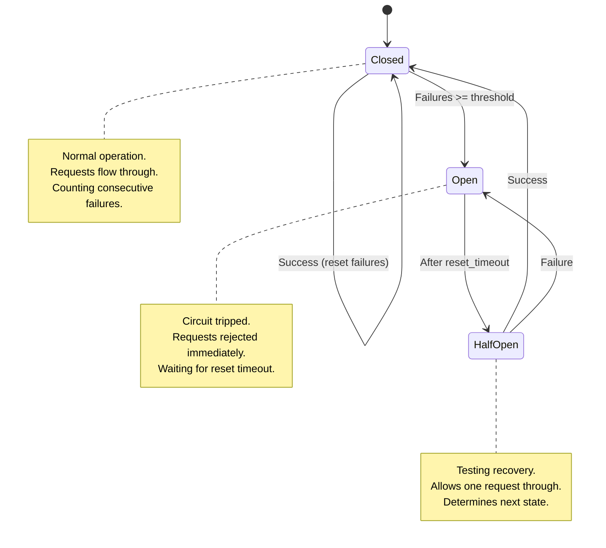
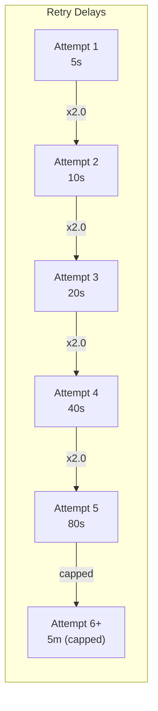
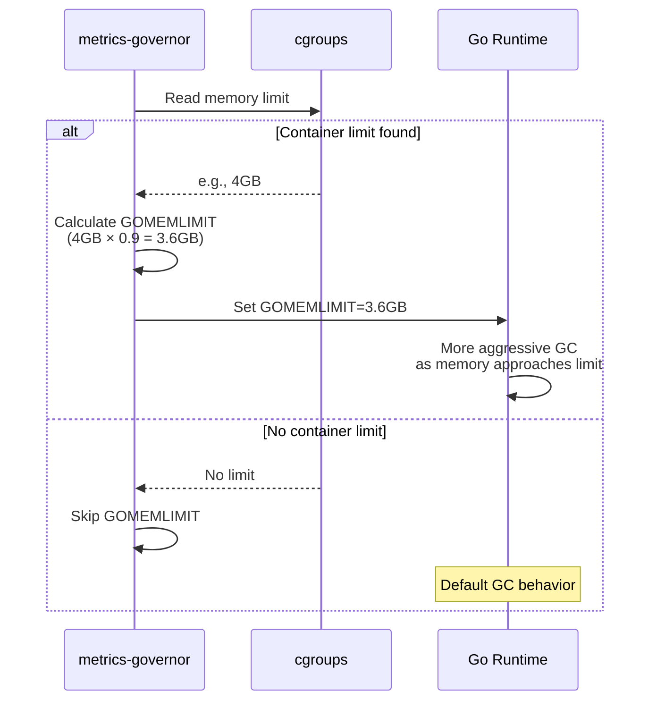
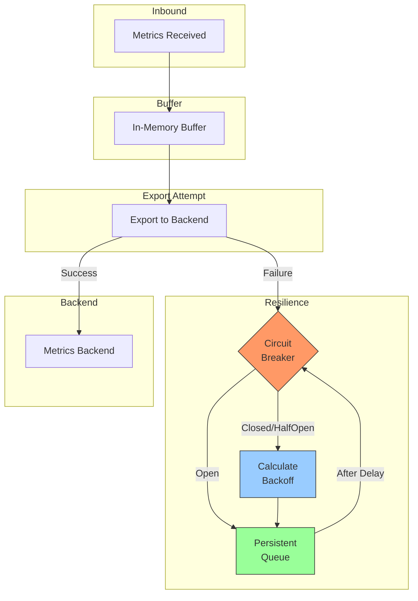

# Queue Resilience

metrics-governor includes resilience features to handle backend failures gracefully. These features prevent resource exhaustion, reduce unnecessary load on struggling backends, and ensure reliable metrics delivery.

## Overview

The resilience system consists of three main components:



## Circuit Breaker

The circuit breaker pattern prevents overwhelming an unavailable backend with retry attempts. It automatically detects failures and stops sending requests until the backend recovers.

### State Machine



### States Explained

| State | Behavior | Transition |
|-------|----------|------------|
| **Closed** | Normal operation - all requests pass through | Opens after `threshold` consecutive failures |
| **Open** | All requests immediately rejected | Transitions to Half-Open after `reset_timeout` |
| **Half-Open** | Single test request allowed | Closes on success, re-opens on failure |

### Configuration

```yaml
exporter:
  queue:
    circuit_breaker:
      enabled: true            # Enable circuit breaker (default: true)
      threshold: 10            # Consecutive failures to trip (default: 10)
      reset_timeout: 30s       # Time before testing recovery (default: 30s)
```

CLI flags:
```bash
-queue-circuit-breaker-enabled=true
-queue-circuit-breaker-threshold=10
-queue-circuit-breaker-reset-timeout=30s
```

### Metrics

| Metric | Type | Description |
|--------|------|-------------|
| `metrics_governor_queue_circuit_breaker_state` | Gauge | Current state (0=closed, 1=open, 2=half-open) |
| `metrics_governor_queue_circuit_breaker_opens_total` | Counter | Total times circuit opened |
| `metrics_governor_queue_circuit_breaker_rejections_total` | Counter | Requests rejected by open circuit |

### Tuning Guidelines

| Scenario | Threshold | Reset Timeout |
|----------|-----------|---------------|
| **Stable backend** | 10-20 | 30s-60s |
| **Flaky network** | 5-10 | 15s-30s |
| **High availability** | 3-5 | 10s-15s |
| **Batch processing** | 20-50 | 60s-120s |

## Exponential Backoff

Exponential backoff increases the delay between retry attempts after each failure. This prevents rapid-fire retries that can overwhelm a recovering backend.

### Backoff Calculation



The delay formula is:
```
delay = min(retry_interval * (multiplier ^ failures), max_retry_delay)
```

### Example with Default Settings

| Failures | Calculation | Actual Delay |
|----------|-------------|--------------|
| 0 | 5s | 5s |
| 1 | 5s × 2.0 = 10s | 10s |
| 2 | 5s × 4.0 = 20s | 20s |
| 3 | 5s × 8.0 = 40s | 40s |
| 4 | 5s × 16.0 = 80s | 80s |
| 5 | 5s × 32.0 = 160s | 160s |
| 6 | 5s × 64.0 = 320s | **300s (capped)** |

### Configuration

```yaml
exporter:
  queue:
    retry_interval: 5s         # Initial retry delay (default: 5s)
    max_retry_delay: 5m        # Maximum retry delay (default: 5m)
    backoff:
      enabled: true            # Enable exponential backoff (default: true)
      multiplier: 2.0          # Delay multiplier per failure (default: 2.0)
```

CLI flags:
```bash
-queue-retry-interval=5s
-queue-max-retry-delay=5m
-queue-backoff-enabled=true
-queue-backoff-multiplier=2.0
```

### Metrics

| Metric | Type | Description |
|--------|------|-------------|
| `metrics_governor_queue_current_backoff_seconds` | Gauge | Current calculated backoff delay |
| `metrics_governor_queue_retry_attempts_total` | Counter | Total retry attempts |

### Tuning Guidelines

| Scenario | Multiplier | Initial Interval | Max Delay |
|----------|------------|------------------|-----------|
| **Fast recovery** | 1.5 | 2s | 1m |
| **Standard** | 2.0 | 5s | 5m |
| **Conservative** | 2.5 | 10s | 10m |
| **Aggressive retry** | 1.2 | 1s | 30s |

## Memory Limits

metrics-governor automatically detects container memory limits and configures Go's garbage collector to prevent OOM kills.

### How It Works



### Benefits

1. **OOM Prevention**: GC becomes more aggressive as memory usage approaches the limit
2. **Better Headroom**: Leaves 10% (configurable) for non-heap memory (goroutine stacks, cgo, etc.)
3. **Auto-Detection**: Works with Docker, Kubernetes, and cgroups v1/v2

### Configuration

```yaml
memory:
  limit_ratio: 0.9             # Ratio of container limit for GOMEMLIMIT (default: 0.9)
                               # Set to 0 to disable auto-detection
```

CLI flags:
```bash
-memory-limit-ratio=0.9
```

### Recommended Ratios

| Memory Limit | Ratio | Effective GOMEMLIMIT | Headroom |
|--------------|-------|---------------------|----------|
| 1GB | 0.9 | 922MB | 102MB |
| 2GB | 0.9 | 1.8GB | 200MB |
| 4GB | 0.85 | 3.4GB | 600MB |
| 8GB+ | 0.85 | 6.8GB | 1.2GB |

> **Tip**: For large memory limits (8GB+), consider using 0.85 ratio to leave more headroom for spikes.

## Combined Resilience Flow



### Timeline Example

```mermaid
gantt
    title Backend Outage Recovery Timeline
    dateFormat HH:mm:ss
    axisFormat %H:%M:%S

    section Backend
    Healthy           :done, b1, 00:00:00, 30s
    Outage            :crit, b2, after b1, 5m
    Recovered         :done, b3, after b2, 30s

    section Circuit
    Closed            :done, c1, 00:00:00, 35s
    Open              :crit, c2, after c1, 4m25s
    Half-Open Test    :active, c3, after c2, 5s
    Closed            :done, c4, after c3, 25s

    section Backoff
    5s retry          :r1, 00:00:35, 5s
    10s retry         :r2, after r1, 10s
    20s retry         :r3, after r2, 20s
    40s retry         :r4, after r3, 40s
    80s retry         :r5, after r4, 80s
    Circuit open      :crit, r6, after r5, 2m

    section Queue
    Queuing           :active, q1, 00:00:35, 5m
    Draining          :done, q2, after q1, 30s
```



## Monitoring and Alerting

### Grafana Dashboard

The operations dashboard includes a "Circuit Breaker & Backoff" section with:

1. **Circuit State** - Current state indicator (Closed/Open/Half-Open)
2. **Current Backoff** - Current delay between retries
3. **Circuit Opens** - Rate of circuit breaker trips
4. **Rejected by Circuit** - Requests rejected by open circuit
5. **State Over Time** - Circuit state timeline
6. **Backoff Delay Over Time** - Backoff delay changes
7. **Circuit Events** - Opens and rejections correlation
8. **Retry Success Rate** - Success vs failure ratio

### Recommended Alerts

```yaml
# Circuit breaker opened
- alert: MetricsGovernorCircuitOpen
  expr: metrics_governor_queue_circuit_breaker_state > 0
  for: 1m
  labels:
    severity: warning
  annotations:
    summary: "Circuit breaker open"
    description: "Queue circuit breaker is {{ if eq $value 1 }}OPEN{{ else }}HALF-OPEN{{ end }}"

# High rejection rate
- alert: MetricsGovernorHighRejectionRate
  expr: rate(metrics_governor_queue_circuit_breaker_rejections_total[5m]) > 10
  for: 5m
  labels:
    severity: critical
  annotations:
    summary: "High circuit breaker rejection rate"
    description: "{{ $value | humanize }} rejections per second"

# Backoff delay climbing
- alert: MetricsGovernorHighBackoff
  expr: metrics_governor_queue_current_backoff_seconds > 120
  for: 5m
  labels:
    severity: warning
  annotations:
    summary: "High queue backoff delay"
    description: "Current backoff delay is {{ $value | humanize }}s"
```

## Best Practices

### Production Recommendations

1. **Enable all resilience features** (they're enabled by default)
2. **Monitor circuit breaker state** - Frequent opens indicate backend issues
3. **Set appropriate thresholds** - Too low causes unnecessary circuit trips
4. **Configure memory limits** - Prevents OOM kills in containers
5. **Review backoff delays** - High delays indicate prolonged backend issues

### Development/Testing

For testing resilience behavior, use aggressive settings:

```yaml
exporter:
  queue:
    retry_interval: 2s
    max_retry_delay: 30s
    backoff:
      enabled: true
      multiplier: 1.5
    circuit_breaker:
      enabled: true
      threshold: 5
      reset_timeout: 10s
```

### High-Availability

For critical metrics pipelines requiring fast recovery:

```yaml
exporter:
  queue:
    retry_interval: 1s
    max_retry_delay: 1m
    backoff:
      enabled: true
      multiplier: 1.5
    circuit_breaker:
      enabled: true
      threshold: 3
      reset_timeout: 10s
```

## Troubleshooting

### Circuit Breaker Keeps Opening

**Symptoms**: Circuit trips frequently, metrics not being delivered

**Causes**:
- Backend truly unavailable
- Network connectivity issues
- Timeout too short for backend latency

**Solutions**:
1. Check backend health and logs
2. Increase `-exporter-timeout`
3. Increase `-queue-circuit-breaker-threshold`
4. Check network connectivity

### Backoff Delay Too Long

**Symptoms**: Queue draining slowly after backend recovery

**Causes**:
- High multiplier with many failures accumulated
- Circuit breaker not resetting

**Solutions**:
1. Reduce `-queue-backoff-multiplier` to 1.5
2. Reduce `-queue-max-retry-delay`
3. Ensure circuit breaker resets properly

### OOM Kills Despite Memory Limits

**Symptoms**: Container killed despite GOMEMLIMIT

**Causes**:
- Non-heap memory exceeding headroom
- Too high `limit_ratio`

**Solutions**:
1. Reduce `-memory-limit-ratio` to 0.8 or 0.85
2. Increase container memory limit
3. Profile application memory usage
