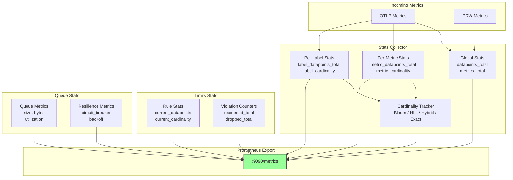
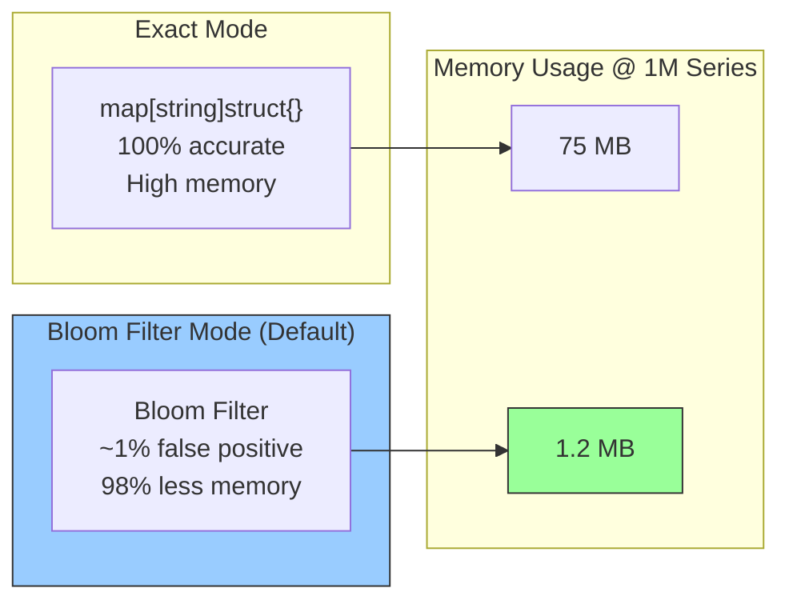

# Statistics & Observability

> **Dual Pipeline Support**: Statistics are collected separately for OTLP and PRW pipelines. OTLP metrics use the `metrics_governor_*` prefix, while PRW metrics use `metrics_governor_prw_*` prefix.

## Stats Levels

metrics-governor supports three stats levels via the `--stats-level` flag, allowing you to trade observability depth for resource efficiency. Stats collection runs **before filtering**, so you always see all incoming metrics regardless of what limits or rules drop downstream.

The current stats level is exposed as a metric:

```
metrics_governor_stats_level{level="basic"} 1
```

### Level Overview

| Level | Description |
|-------|-------------|
| **none** | No stats collector is created (nil). Zero CPU/memory overhead from stats processing. Global counters still work because they are atomic counters in the buffer, not in the stats collector. |
| **basic** (default) | Per-metric datapoint counts and pipeline stage timings. Skips Bloom filters, series key extraction, and per-label cardinality tracking. |
| **full** | Everything including Bloom-based cardinality tracking, per-label statistics, series key pool metrics, and memory accounting. |

### Metrics Availability by Level

| Metric | none | basic | full |
|--------|:----:|:-----:|:----:|
| **Global Counters** | | | |
| `metrics_governor_datapoints_received_total` | &#10003; | &#10003; | &#10003; |
| `metrics_governor_datapoints_sent_total` | &#10003; | &#10003; | &#10003; |
| `metrics_governor_batches_sent_total` | &#10003; | &#10003; | &#10003; |
| `metrics_governor_export_errors_total` | &#10003; | &#10003; | &#10003; |
| `metrics_governor_otlp_export_bytes_total` | &#10003; | &#10003; | &#10003; |
| `metrics_governor_prw_export_bytes_total` | &#10003; | &#10003; | &#10003; |
| `metrics_governor_buffer_size` | &#10003; | &#10003; | &#10003; |
| `metrics_governor_stats_level{level}` | &#10003; | &#10003; | &#10003; |
| **Per-Metric Stats** | | | |
| `metrics_governor_metric_datapoints_total{metric_name}` | | &#10003; | &#10003; |
| `metrics_governor_metrics_total` | | &#10003; | &#10003; |
| Pipeline stage timings | | &#10003; | &#10003; |
| **Cardinality Tracking** | | | |
| `metrics_governor_metric_cardinality{metric_name}` | | | &#10003; |
| `metrics_governor_label_datapoints_total{...}` | | | &#10003; |
| `metrics_governor_label_cardinality{...}` | | | &#10003; |
| `metrics_governor_cardinality_trackers_total` | | | &#10003; |
| `metrics_governor_cardinality_memory_bytes` | | | &#10003; |
| `metrics_governor_cardinality_mode{mode}` | | | &#10003; |
| `metrics_governor_serieskey_pool_*` | | | &#10003; |

### Performance Impact

Measured at 100,000 datapoints per second:

| Level | CPU Overhead | Memory Overhead | P99 Latency Impact |
|-------|:------------:|:---------------:|:-------------------:|
| **none** | ~0% | ~0 MB | none |
| **basic** | ~3-5% | ~1-5 MB | negligible |
| **full** | ~12-18% | ~50-200 MB | low (optimized dual-map keys, atomic counters) |

### What You Lose at Each Downgrade

**full -> basic:**
- No per-metric cardinality numbers (`metric_cardinality`)
- No per-label statistics (`label_datapoints_total`, `label_cardinality`)
- No Bloom filter / cardinality tracker metrics (`cardinality_trackers_total`, `cardinality_memory_bytes`, `cardinality_mode`)
- No series key pool metrics (`serieskey_pool_*`)
- Limits rules that use cardinality thresholds will not have cardinality data from the stats collector

**basic -> none:**
- No per-metric datapoint counts (`metric_datapoints_total`)
- No unique metric name count (`metrics_total`)
- No pipeline stage timings
- You retain only the global atomic counters from the buffer (received, sent, errors, bytes, buffer size)

### Choosing the Right Level

| Use Case | Recommended Level |
|----------|:-----------------:|
| High-throughput production relay (>500k dps), observability not critical | **none** |
| Standard production deployment, need per-metric visibility | **basic** |
| Production with cardinality governance (up to ~100k dps) | **full** |
| Development, testing, debugging cardinality issues | **full** |
| Capacity planning and cardinality audits | **full** |
| Cost-sensitive environments with tight resource budgets | **none** or **basic** |
| First deployment (understand your traffic) | **full**, then downgrade |

> **Changed in v1.1**: The `full` level is now recommended for production cardinality governance workloads. Prior versions consumed 30-40% CPU at 100k dps, limiting `full` to dev/test. With dual-map key building, atomic counters, and per-metric locking, the overhead is now 12-18% — comparable to running a Prometheus sidecar for cardinality tracking.

### Configuration

```bash
# No stats processing (global counters only)
metrics-governor --stats-level none

# Per-metric counts and timings (default)
metrics-governor --stats-level basic

# Full cardinality tracking with Bloom filters
metrics-governor --stats-level full

# Combine with other flags
metrics-governor --stats-level full --stats-labels service,env --stats-addr :9090
```

> **Note:** `--stats-labels` is only effective at the `full` level. At `none` or `basic`, label tracking is skipped regardless of the flag value.

### Full-Mode Tuning Knobs

When running at `full` level, two additional knobs help control resource usage in high-cardinality environments:

**Cardinality Threshold** (`--stats-cardinality-threshold`, default: 0 = track all)

Only create per-metric Bloom filter trackers for metrics that exceed the specified datapoint count. Metrics below the threshold get datapoint counting only (like `basic` level), but per-metric. This reduces Bloom filter memory by 10-100x for deployments with many low-volume metrics.

```bash
# Only track cardinality for metrics with > 100 datapoints per window
metrics-governor --stats-level full --stats-cardinality-threshold 100
```

```yaml
stats:
  level: full
  cardinality_threshold: 100
```

**Max Label Combinations** (`--stats-max-label-combinations`, default: 0 = unlimited)

Caps the number of tracked label combinations in the stats collector. When exceeded, new label combination entries are not created. This prevents memory explosion from high-cardinality label tracking.

```bash
# Cap label combination tracking at 5000 entries
metrics-governor --stats-level full --stats-max-label-combinations 5000
```

```yaml
stats:
  level: full
  max_label_combinations: 5000
```

## Metrics Collection Flow



## Cardinality Tracking Modes



## Prometheus Metrics Endpoint

Stats are exposed on `:9090/metrics` (configurable via `-stats-addr`):

```bash
curl localhost:9090/metrics
```

## Exposed Metrics

### Core Metrics

| Metric | Type | Description |
|--------|------|-------------|
| `metrics_governor_datapoints_total` | counter | Total datapoints processed |
| `metrics_governor_metrics_total` | gauge | Total unique metric names |

### Per-Metric Statistics

| Metric | Type | Description |
|--------|------|-------------|
| `metrics_governor_metric_datapoints_total{metric_name="..."}` | counter | Datapoints per metric name |
| `metrics_governor_metric_cardinality{metric_name="..."}` | gauge | Cardinality (unique series) per metric name |

### Per-Label Statistics

| Metric | Type | Description |
|--------|------|-------------|
| `metrics_governor_label_datapoints_total{service="...",env="..."}` | counter | Datapoints per label combination |
| `metrics_governor_label_cardinality{service="...",env="..."}` | gauge | Cardinality per label combination |

### Limits Metrics

| Metric | Type | Description |
|--------|------|-------------|
| `metrics_governor_limit_datapoints_exceeded_total{rule="..."}` | counter | Times datapoints rate limit was exceeded |
| `metrics_governor_limit_cardinality_exceeded_total{rule="..."}` | counter | Times cardinality limit was exceeded |
| `metrics_governor_limit_datapoints_dropped_total{rule="..."}` | counter | Datapoints dropped due to limits |
| `metrics_governor_limit_datapoints_passed_total{rule="..."}` | counter | Datapoints passed through (within limits) |
| `metrics_governor_limit_groups_dropped_total{rule="..."}` | counter | Groups dropped by adaptive limiting |

### Rule Statistics

| Metric | Type | Description |
|--------|------|-------------|
| `metrics_governor_rule_current_datapoints{rule="..."}` | gauge | Current datapoints in window per rule |
| `metrics_governor_rule_current_cardinality{rule="..."}` | gauge | Current cardinality in window per rule |
| `metrics_governor_rule_groups_total{rule="..."}` | gauge | Number of tracked groups per rule |
| `metrics_governor_rule_dropped_groups_total{rule="..."}` | gauge | Currently dropped groups per rule |

### PRW Pipeline Statistics

These metrics track the Prometheus Remote Write (PRW) pipeline:

| Metric | Type | Description |
|--------|------|-------------|
| `metrics_governor_prw_datapoints_received_total` | counter | Total PRW datapoints received |
| `metrics_governor_prw_timeseries_received_total` | counter | Total PRW timeseries received |
| `metrics_governor_prw_datapoints_sent_total` | counter | Total PRW datapoints sent to backend |
| `metrics_governor_prw_timeseries_sent_total` | counter | Total PRW timeseries sent to backend |
| `metrics_governor_prw_batches_sent_total` | counter | Total PRW batches exported |
| `metrics_governor_prw_export_errors_total` | counter | Total PRW export errors |

### Config Reload Metrics

These metrics track dynamic configuration reloads via SIGHUP (see [reload.md](reload.md)):

| Metric | Type | Description |
|--------|------|-------------|
| `metrics_governor_config_reloads_total` | counter | Successful limits config reloads via SIGHUP |
| `metrics_governor_config_reload_last_success_timestamp_seconds` | gauge | Unix timestamp of last successful config reload |

### Cardinality Tracking Metrics

| Metric | Type | Description |
|--------|------|-------------|
| `metrics_governor_cardinality_mode{mode}` | gauge | Active tracking mode (bloom, hll, exact, hybrid) |
| `metrics_governor_cardinality_memory_bytes` | gauge | Total memory used by all stats trackers |
| `metrics_governor_cardinality_trackers_total` | gauge | Number of active trackers |
| `metrics_governor_cardinality_config_expected_items` | gauge | Configured expected items per tracker |
| `metrics_governor_cardinality_config_fp_rate` | gauge | Configured false positive rate |
| `metrics_governor_rule_cardinality_memory_bytes{rule}` | gauge | Memory used per limits rule |
| `metrics_governor_limits_cardinality_memory_bytes` | gauge | Total memory used by limits trackers |
| `metrics_governor_limits_cardinality_trackers_total` | gauge | Number of trackers in limits enforcer |

### OTLP Export Metrics

| Metric | Type | Description |
|--------|------|-------------|
| `metrics_governor_otlp_export_bytes_total{compression}` | counter | Total bytes exported to OTLP backend |
| `metrics_governor_otlp_export_requests_total` | counter | Total OTLP export requests |
| `metrics_governor_otlp_export_errors_total{error_type}` | counter | Total OTLP export errors |
| `metrics_governor_otlp_export_datapoints_total` | counter | Total datapoints exported |
| `metrics_governor_receiver_requests_total{protocol}` | counter | Total requests received |
| `metrics_governor_receiver_datapoints_total` | counter | Total datapoints received |
| `metrics_governor_receiver_errors_total{type}` | counter | Total receiver errors |
| `metrics_governor_grpc_received_bytes_total` | counter | gRPC bytes received |

### Buffer Metrics

| Metric | Type | Description |
|--------|------|-------------|
| `metrics_governor_buffer_size{protocol}` | gauge | Current buffer size by protocol |
| `metrics_governor_buffer_bytes` | gauge | Current buffer memory usage in bytes |
| `metrics_governor_buffer_max_bytes` | gauge | Configured buffer capacity limit in bytes |
| `metrics_governor_buffer_rejected_total` | counter | Batches rejected by buffer full policy |
| `metrics_governor_buffer_evictions_total` | counter | Data evicted by drop_oldest full policy |

### Byte Tracking Metrics

| Metric | Type | Description |
|--------|------|-------------|
| `metrics_governor_otlp_export_bytes_total{compression}` | counter | OTLP bytes exported |
| `metrics_governor_prw_export_bytes_total{compression}` | counter | PRW bytes exported |
| `metrics_governor_grpc_received_bytes_total` | counter | gRPC bytes received |

### Pool Metrics (String Interning)

| Metric | Type | Description |
|--------|------|-------------|
| `metrics_governor_intern_hits_total{pool}` | counter | Intern pool cache hits |
| `metrics_governor_intern_misses_total{pool}` | counter | Intern pool cache misses |
| `metrics_governor_intern_pool_size{pool}` | gauge | Number of interned strings in pool |

### Compression Pool Metrics

| Metric | Type | Description |
|--------|------|-------------|
| `metrics_governor_compression_pool_gets_total` | counter | Pool.Get() calls |
| `metrics_governor_compression_pool_puts_total` | counter | Pool.Put() calls |
| `metrics_governor_compression_pool_discards_total` | counter | Encoders discarded |
| `metrics_governor_compression_pool_new_total` | counter | New encoders created (pool miss) |
| `metrics_governor_compression_buffer_pool_gets_total` | counter | Buffer pool Get() calls |
| `metrics_governor_compression_buffer_pool_puts_total` | counter | Buffer pool Put() calls |

### Worker Pool Metrics

| Metric | Type | Description |
|--------|------|-------------|
| `metrics_governor_queue_workers_active` | gauge | Active worker goroutines |
| `metrics_governor_queue_workers_total` | gauge | Configured worker count |

### Queue & Resilience Metrics

| Metric | Type | Description |
|--------|------|-------------|
| `metrics_governor_queue_size` | gauge | Current entries in failover queue |
| `metrics_governor_queue_bytes` | gauge | Current bytes in failover queue |
| `metrics_governor_queue_max_size` | gauge | Maximum queue entries allowed |
| `metrics_governor_queue_max_bytes` | gauge | Maximum queue bytes allowed |
| `metrics_governor_queue_utilization_ratio` | gauge | Current queue utilization (0.0-1.0) |
| `metrics_governor_queue_push_total` | counter | Batches pushed to queue |
| `metrics_governor_queue_dropped_total{reason}` | counter | Batches dropped |
| `metrics_governor_queue_retry_total` | counter | Retry attempts |
| `metrics_governor_queue_retry_success_total` | counter | Successful retries |
| `metrics_governor_queue_retry_failure_total{error_type}` | counter | Failed retries |
| `metrics_governor_circuit_breaker_state{state}` | gauge | Current circuit breaker state |
| `metrics_governor_circuit_breaker_open_total` | counter | Times circuit breaker opened |
| `metrics_governor_circuit_breaker_rejected_total` | counter | Requests rejected by open circuit |
| `metrics_governor_queue_backoff_seconds` | gauge | Current exponential backoff delay |
| `metrics_governor_batch_split_depth_exceeded_total` | counter | Batch split depth limit reached |

### FastQueue Metrics (Disk Mode)

| Metric | Type | Description |
|--------|------|-------------|
| `metrics_governor_fastqueue_inmemory_blocks` | gauge | Blocks in in-memory channel |
| `metrics_governor_fastqueue_disk_bytes` | gauge | Bytes stored on disk |
| `metrics_governor_fastqueue_meta_sync_total` | counter | Metadata sync operations |
| `metrics_governor_fastqueue_chunk_rotations` | counter | Chunk file rotations |
| `metrics_governor_fastqueue_inmemory_flushes` | counter | In-memory flushes to disk |
| `metrics_governor_queue_disk_available_bytes` | gauge | Available disk space |
| `metrics_governor_queue_effective_max_size` | gauge | Effective max batches (adaptive) |
| `metrics_governor_queue_effective_max_bytes` | gauge | Effective max bytes (adaptive) |

### Sharding Metrics

| Metric | Type | Description |
|--------|------|-------------|
| `metrics_governor_sharding_endpoints_total` | gauge | Active sharding endpoints |
| `metrics_governor_sharding_datapoints_total{endpoint}` | counter | Datapoints sent per endpoint |
| `metrics_governor_sharding_export_errors_total{endpoint}` | counter | Export errors per endpoint |
| `metrics_governor_sharding_rehash_total` | counter | Hash ring rehash events |
| `metrics_governor_sharding_dns_refresh_total` | counter | DNS refresh attempts |
| `metrics_governor_sharding_dns_errors_total` | counter | DNS lookup errors |
| `metrics_governor_sharding_dns_latency_seconds` | histogram | DNS lookup latency |
| `metrics_governor_sharding_export_latency_seconds{endpoint}` | histogram | Export latency per endpoint |

### Runtime Metrics

Runtime metrics provide process-level observability. Most are cross-platform; disk I/O, network I/O, and PSI metrics are Linux-only (sourced from `/proc`).

| Metric | Type | Description |
|--------|------|-------------|
| `metrics_governor_process_start_time_seconds` | gauge | Process start time |
| `metrics_governor_process_uptime_seconds` | gauge | Time since process started |
| `metrics_governor_goroutines` | gauge | Number of goroutines |
| `metrics_governor_go_threads` | gauge | OS threads created |
| `metrics_governor_memory_alloc_bytes` | gauge | Currently allocated memory |
| `metrics_governor_memory_heap_alloc_bytes` | gauge | Heap memory allocated |
| `metrics_governor_memory_heap_sys_bytes` | gauge | Heap memory from system |
| `metrics_governor_memory_heap_objects` | gauge | Allocated heap objects |
| `metrics_governor_memory_stack_inuse_bytes` | gauge | Stack memory in use |
| `metrics_governor_gc_cycles_total` | counter | GC cycles completed |
| `metrics_governor_gc_pause_total_seconds` | counter | Total GC pause time |
| `metrics_governor_gc_cpu_percent` | gauge | CPU used by GC |

#### Linux-Only: Disk I/O

| Metric | Type | Description |
|--------|------|-------------|
| `metrics_governor_disk_read_bytes_total` | counter | Bytes read from storage |
| `metrics_governor_disk_write_bytes_total` | counter | Bytes written to storage |

#### Linux-Only: Network I/O

| Metric | Type | Description |
|--------|------|-------------|
| `metrics_governor_network_receive_bytes_total` | counter | Total bytes received |
| `metrics_governor_network_transmit_bytes_total` | counter | Total bytes transmitted |
| `metrics_governor_network_receive_packets_total` | counter | Total packets received |
| `metrics_governor_network_transmit_packets_total` | counter | Total packets transmitted |
| `metrics_governor_network_receive_errors_total` | counter | Total receive errors |
| `metrics_governor_network_transmit_errors_total` | counter | Total transmit errors |

#### Linux-Only: PSI (Pressure Stall Information)

| Metric | Type | Description |
|--------|------|-------------|
| `metrics_governor_psi_cpu_some_avg{10,60,300}` | gauge | CPU pressure averages |
| `metrics_governor_psi_memory_some_avg{10,60,300}` | gauge | Memory pressure (some) averages |
| `metrics_governor_psi_memory_full_avg{10,60,300}` | gauge | Memory pressure (full) averages |
| `metrics_governor_psi_io_some_avg{10,60,300}` | gauge | I/O pressure (some) averages |
| `metrics_governor_psi_io_full_avg{10,60,300}` | gauge | I/O pressure (full) averages |

### Bloom Persistence Metrics

| Metric | Type | Description |
|--------|------|-------------|
| `bloom_persistence_saves_total{status}` | counter | Save operations (success/error) |
| `bloom_persistence_loads_total{status}` | counter | Load operations (success/error) |
| `bloom_persistence_trackers_total` | gauge | Current tracker count |
| `bloom_persistence_dirty_trackers` | gauge | Trackers pending save |
| `bloom_persistence_disk_usage_bytes` | gauge | Current disk usage |
| `bloom_persistence_memory_usage_bytes` | gauge | Current in-memory usage |
| `bloom_persistence_save_duration_seconds` | histogram | Save operation latency |
| `bloom_persistence_load_duration_seconds` | histogram | Load operation latency |

## Configuring Label Tracking

Track specific labels for detailed statistics:

```bash
metrics-governor -stats-labels service,env,cluster
```

This enables per-label-combination metrics like:
```
metrics_governor_label_datapoints_total{service="api",env="prod",cluster="us-east-1"} 12345
metrics_governor_label_cardinality{service="api",env="prod",cluster="us-east-1"} 500
```

## Periodic Logging

Global stats are logged every 30 seconds in JSON format:

```json
{
  "timestamp": "2024-01-26T12:00:00Z",
  "level": "info",
  "message": "stats",
  "fields": {
    "datapoints_total": 1234567,
    "unique_metrics": 42,
    "total_cardinality": 8901
  }
}
```

This includes:
- **datapoints_total**: Cumulative count of all datapoints processed
- **unique_metrics**: Number of unique metric names seen
- **total_cardinality**: Sum of unique series across all metrics

## Example Prometheus Queries

### Throughput

```promql
# Datapoints per second
rate(metrics_governor_datapoints_total[5m])

# Top 10 metrics by datapoints
topk(10, rate(metrics_governor_metric_datapoints_total[5m]))
```

### Cardinality

```promql
# Total cardinality across all metrics
sum(metrics_governor_metric_cardinality)

# Top 10 metrics by cardinality
topk(10, metrics_governor_metric_cardinality)

# Cardinality by service
sum by (service) (metrics_governor_label_cardinality)
```

### Limits

```promql
# Limit violations per minute
rate(metrics_governor_limit_cardinality_exceeded_total[1m]) * 60

# Drop rate by rule
rate(metrics_governor_limit_datapoints_dropped_total[5m])
  / rate(metrics_governor_datapoints_total[5m])

# Pass rate by rule
rate(metrics_governor_limit_datapoints_passed_total[5m])
  / (rate(metrics_governor_limit_datapoints_passed_total[5m])
     + rate(metrics_governor_limit_datapoints_dropped_total[5m]))
```

## OTEL Ecosystem Integration

metrics-governor exposes self-monitoring metrics via Prometheus format at `:9090/metrics`. While it does not internally convert between OTLP and Prometheus Remote Write formats (by design), the **OpenTelemetry Collector** can bridge these formats externally.

### Scraping Prometheus Metrics as OTLP

The OTel Collector can scrape metrics-governor's `/metrics` endpoint and convert all self-monitoring metrics to OTEL semantic format:

```yaml
# otel-collector-config.yaml
receivers:
  prometheus:
    config:
      scrape_configs:
        - job_name: 'metrics-governor'
          scrape_interval: 15s
          static_configs:
            - targets: ['metrics-governor:9090']

exporters:
  otlp:
    endpoint: "your-otlp-backend:4317"
    tls:
      insecure: true

service:
  pipelines:
    metrics:
      receivers: [prometheus]
      exporters: [otlp]
```

### OTLP to Prometheus Remote Write Bridge

If you need to convert OTLP metrics to PRW format (or vice versa), use the OTel Collector as a bridge alongside metrics-governor:

```yaml
# Bridge OTLP → PRW (OTel Collector handles the conversion)
receivers:
  otlp:
    protocols:
      grpc:
        endpoint: "0.0.0.0:4317"

exporters:
  prometheusremotewrite:
    endpoint: "http://victoriametrics:8428/api/v1/write"
    tls:
      insecure: true

service:
  pipelines:
    metrics:
      receivers: [otlp]
      exporters: [prometheusremotewrite]
```

> **Why not built-in?** Protocol conversion is complex and well-solved by the OTel Collector ecosystem. metrics-governor focuses on what it does best: proxying, limiting, and shaping metrics within each protocol. Use an OTel Collector sidecar or gateway for format bridging.

## Stats Degradation Under Pressure

When the proxy is under memory pressure, the stats collector automatically downgrades to reduce overhead:

1. **full → basic**: Cardinality tracking stops (Bloom filter frozen). Per-metric and per-label counters freeze at last values. Aggregate counters (datapoints received/sent) continue.
2. **basic → none**: All stats collection stops. `Process()` becomes a no-op. Zero CPU cost.

The `Degrade()` method uses a lock-free atomic CAS loop — safe to call from any goroutine without contention. The configured level is preserved in `ConfiguredLevel()` so the original intent is known.

### Monitoring

| Metric | Type | Description |
|---|---|---|
| `metrics_governor_stats_level_current` | gauge | Current level: 2=full, 1=basic, 0=none |
| `metrics_governor_stats_level_configured` | gauge | Originally configured level |
| `metrics_governor_stats_degradation_total` | counter | Number of degradation events |

### CPU Budget by Level

| Level | CPU at 50k dps | CPU at 100k dps | Allocations |
|---|---|---|---|
| `full` | ~8% | ~12-18% | Moderate (optimized dual-map keys, pooled buffers, atomic counters) |
| `basic` | ~2.5% | ~5% | Low (counters only) |
| `none` | 0% | 0% | Zero |

> **Production recommendation**: With the v1.1 optimizations (dual-map key building, atomic counters, per-metric locking), `full` mode is now practical for production deployments up to ~100k dps. Previously, the 30-40% CPU overhead made it impractical above ~50k dps.

See [stability-guide.md](stability-guide.md) for tuning guidance.

## YAML Configuration

```yaml
stats:
  address: ":9090"
  labels:
    - service
    - env
    - cluster
```
