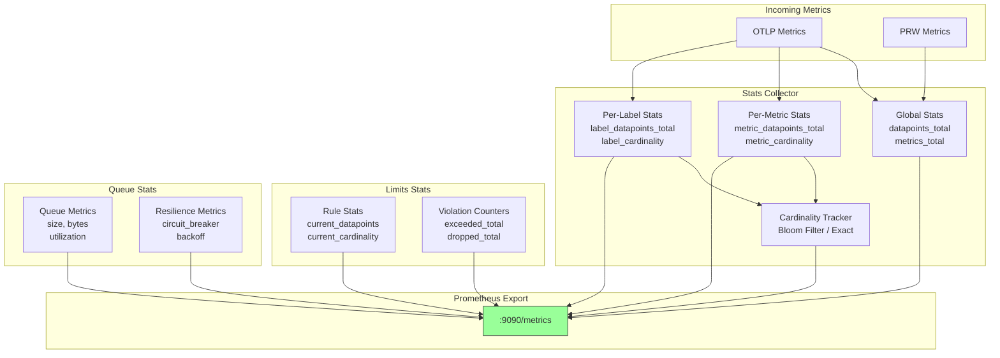
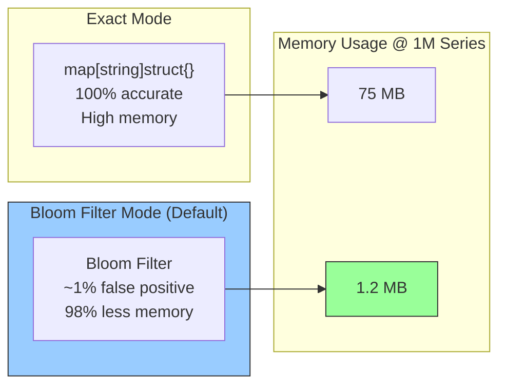

# Statistics & Observability

> **Dual Pipeline Support**: Statistics are collected separately for OTLP and PRW pipelines. OTLP metrics use the `metrics_governor_*` prefix, while PRW metrics use `metrics_governor_prw_*` prefix.

## Metrics Collection Flow



## Cardinality Tracking Modes



## Prometheus Metrics Endpoint

Stats are exposed on `:9090/metrics` (configurable via `-stats-addr`):

```bash
curl localhost:9090/metrics
```

## Exposed Metrics

### Core Metrics

| Metric | Type | Description |
|--------|------|-------------|
| `metrics_governor_datapoints_total` | counter | Total datapoints processed |
| `metrics_governor_metrics_total` | gauge | Total unique metric names |

### Per-Metric Statistics

| Metric | Type | Description |
|--------|------|-------------|
| `metrics_governor_metric_datapoints_total{metric_name="..."}` | counter | Datapoints per metric name |
| `metrics_governor_metric_cardinality{metric_name="..."}` | gauge | Cardinality (unique series) per metric name |

### Per-Label Statistics

| Metric | Type | Description |
|--------|------|-------------|
| `metrics_governor_label_datapoints_total{service="...",env="..."}` | counter | Datapoints per label combination |
| `metrics_governor_label_cardinality{service="...",env="..."}` | gauge | Cardinality per label combination |

### Limits Metrics

| Metric | Type | Description |
|--------|------|-------------|
| `metrics_governor_limit_datapoints_exceeded_total{rule="..."}` | counter | Times datapoints rate limit was exceeded |
| `metrics_governor_limit_cardinality_exceeded_total{rule="..."}` | counter | Times cardinality limit was exceeded |
| `metrics_governor_limit_datapoints_dropped_total{rule="..."}` | counter | Datapoints dropped due to limits |
| `metrics_governor_limit_datapoints_passed_total{rule="..."}` | counter | Datapoints passed through (within limits) |
| `metrics_governor_limit_groups_dropped_total{rule="..."}` | counter | Groups dropped by adaptive limiting |

### Rule Statistics

| Metric | Type | Description |
|--------|------|-------------|
| `metrics_governor_rule_current_datapoints{rule="..."}` | gauge | Current datapoints in window per rule |
| `metrics_governor_rule_current_cardinality{rule="..."}` | gauge | Current cardinality in window per rule |
| `metrics_governor_rule_groups_total{rule="..."}` | gauge | Number of tracked groups per rule |
| `metrics_governor_rule_dropped_groups_total{rule="..."}` | gauge | Currently dropped groups per rule |

### PRW Pipeline Statistics

These metrics track the Prometheus Remote Write (PRW) pipeline:

| Metric | Type | Description |
|--------|------|-------------|
| `metrics_governor_prw_datapoints_received_total` | counter | Total PRW datapoints received |
| `metrics_governor_prw_timeseries_received_total` | counter | Total PRW timeseries received |
| `metrics_governor_prw_datapoints_sent_total` | counter | Total PRW datapoints sent to backend |
| `metrics_governor_prw_timeseries_sent_total` | counter | Total PRW timeseries sent to backend |
| `metrics_governor_prw_batches_sent_total` | counter | Total PRW batches exported |
| `metrics_governor_prw_export_errors_total` | counter | Total PRW export errors |

### Config Reload Metrics

These metrics track dynamic configuration reloads via SIGHUP (see [reload.md](reload.md)):

| Metric | Type | Description |
|--------|------|-------------|
| `metrics_governor_config_reloads_total` | counter | Successful limits config reloads via SIGHUP |
| `metrics_governor_config_reload_last_success_timestamp_seconds` | gauge | Unix timestamp of last successful config reload |

## Configuring Label Tracking

Track specific labels for detailed statistics:

```bash
metrics-governor -stats-labels service,env,cluster
```

This enables per-label-combination metrics like:
```
metrics_governor_label_datapoints_total{service="api",env="prod",cluster="us-east-1"} 12345
metrics_governor_label_cardinality{service="api",env="prod",cluster="us-east-1"} 500
```

## Periodic Logging

Global stats are logged every 30 seconds in JSON format:

```json
{
  "timestamp": "2024-01-26T12:00:00Z",
  "level": "info",
  "message": "stats",
  "fields": {
    "datapoints_total": 1234567,
    "unique_metrics": 42,
    "total_cardinality": 8901
  }
}
```

This includes:
- **datapoints_total**: Cumulative count of all datapoints processed
- **unique_metrics**: Number of unique metric names seen
- **total_cardinality**: Sum of unique series across all metrics

## Example Prometheus Queries

### Throughput

```promql
# Datapoints per second
rate(metrics_governor_datapoints_total[5m])

# Top 10 metrics by datapoints
topk(10, rate(metrics_governor_metric_datapoints_total[5m]))
```

### Cardinality

```promql
# Total cardinality across all metrics
sum(metrics_governor_metric_cardinality)

# Top 10 metrics by cardinality
topk(10, metrics_governor_metric_cardinality)

# Cardinality by service
sum by (service) (metrics_governor_label_cardinality)
```

### Limits

```promql
# Limit violations per minute
rate(metrics_governor_limit_cardinality_exceeded_total[1m]) * 60

# Drop rate by rule
rate(metrics_governor_limit_datapoints_dropped_total[5m])
  / rate(metrics_governor_datapoints_total[5m])

# Pass rate by rule
rate(metrics_governor_limit_datapoints_passed_total[5m])
  / (rate(metrics_governor_limit_datapoints_passed_total[5m])
     + rate(metrics_governor_limit_datapoints_dropped_total[5m]))
```

## YAML Configuration

```yaml
stats:
  address: ":9090"
  labels:
    - service
    - env
    - cluster
```
