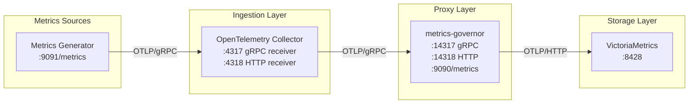

# Testing

A comprehensive test suite with 490+ tests across unit, functional, e2e, and performance testing ensures reliability and correctness.

## Test Coverage Summary

| Component | Unit Tests | Functional Tests | E2E Tests | Benchmarks | Coverage |
|-----------|:----------:|:----------------:|:---------:|:----------:|:--------:|
| **Buffer** | 13 | 6 | ✓ | 8 | 95% |
| **Exporter** | 31 | 5 | ✓ | 12 | 90% |
| **Receiver** | 16 | 9 | ✓ | 10 | 90% |
| **Limits** | 37 | 10 | ✓ | 8 | 92% |
| **Queue** | 29 | 8 | ✓ | 10 | 88% |
| **Sharding** | 98 | 8 | ✓ | 6 | 95% |
| **Stats** | 19 | 12 | ✓ | 8 | 90% |
| **Config** | 29 | - | - | - | 85% |
| **Auth** | 27 | - | ✓ | 6 | 88% |
| **TLS** | 12 | - | ✓ | - | 85% |
| **Compression** | 10 | - | ✓ | 8 | 90% |
| **Logging** | 12 | - | - | - | 80% |
| **Total** | **345** | **64** | **8** | **76** | **~85%** |

**Test Categories:**
- **Unit Tests** (`internal/*/`): Component-level tests with mocks
- **Functional Tests** (`functional/`): Integration tests with real components
- **E2E Tests** (`e2e/`, `test/`): Full system tests with Docker Compose
- **Benchmarks**: Performance tests measuring throughput and latency

## Running Tests

```bash
# Run all tests
go test ./...

# Run with coverage
go test -coverprofile=coverage.out ./...
go tool cover -func=coverage.out

# Run benchmarks
go test -bench=. -benchmem ./...

# Run functional tests only
go test ./functional/...

# Run e2e tests (requires Docker)
go test ./e2e/...
```

## Test Environment

A comprehensive test environment is provided using Docker Compose with full observability stack.

### Architecture



### Components

| Service | Ports | Description |
|---------|-------|-------------|
| **otel-collector** | 4317, 4318, 8888 | Receives metrics from generator |
| **metrics-governor** | 14317, 14318, 9090 | OTLP proxy with limits |
| **victoriametrics** | 8428 | Storage backend |
| **metrics-generator** | 9091 | Test traffic generator |
| **verifier** | 9092 | Automated verification |
| **grafana** | 3000 | Visualization |

### Quick Start

```bash
# Start the complete test environment
docker compose up --build -d

# Wait for services
sleep 30

# Open Grafana
open http://localhost:3000  # Login: admin/admin

# View metrics-governor stats
curl -s localhost:9090/metrics | grep metrics_governor

# Stop all services
docker compose down
```

### Test Configurations

| Config | Command | Datapoints/sec | Use Case |
|--------|---------|----------------|----------|
| **stable** | `docker compose -f docker-compose.yaml -f docker-compose.stable.yaml up -d` | ~1,300 | Rate verification |
| **light** | `docker compose -f docker-compose.yaml -f docker-compose.light.yaml up -d` | ~5,000-10,000 | CI/CD |
| **default** | `docker compose up -d` | ~10,000-20,000 | General testing |
| **perf** | `docker compose -f docker-compose.yaml -f docker-compose.perf.yaml up -d` | ~100,000+ | Stress testing |

### Available Endpoints

| Service | Endpoint | Description |
|---------|----------|-------------|
| OTel Collector gRPC | `localhost:4317` | OTLP gRPC receiver |
| OTel Collector HTTP | `localhost:4318` | OTLP HTTP receiver |
| metrics-governor gRPC | `localhost:14317` | Proxy gRPC receiver |
| metrics-governor HTTP | `localhost:14318` | Proxy HTTP receiver |
| metrics-governor stats | `http://localhost:9090/metrics` | Prometheus metrics |
| VictoriaMetrics | `http://localhost:8428` | Query API |
| Grafana | `http://localhost:3000` | Dashboard (admin/admin) |

### Test Scenarios

The metrics generator creates various test scenarios:

| Scenario | Description |
|----------|-------------|
| **Normal traffic** | HTTP request metrics for services |
| **High cardinality** | Unique user/session/request IDs |
| **Burst traffic** | Periodic traffic spikes |
| **Edge cases** | Extreme values (0, ±inf, π, e) |
| **Many datapoints** | Histograms with 15 buckets |
| **Diverse metrics** | ~200 unique metric names |

### Generator Environment Variables

| Variable | Default | Description |
|----------|---------|-------------|
| `OTLP_ENDPOINT` | `metrics-governor:4317` | Target endpoint |
| `METRICS_INTERVAL` | `100ms` | Generation interval |
| `SERVICES` | `payment-api,order-api,...` | Service names |
| `ENABLE_HIGH_CARDINALITY` | `true` | Generate high cardinality |
| `ENABLE_BURST_TRAFFIC` | `true` | Enable burst patterns |
| `TARGET_DATAPOINTS_PER_SEC` | `10000` | Target datapoints |

### Useful Commands

```bash
# View metrics-governor stats
curl -s localhost:9090/metrics | grep metrics_governor

# Check limit violations
curl -s localhost:9090/metrics | grep limit

# Query VictoriaMetrics for time series count
curl -s 'localhost:8428/api/v1/query?query=count({__name__=~".+"})'

# View verification results
docker compose logs -f verifier

# View metrics-governor logs
docker compose logs -f metrics-governor
```

### Verifier Output

```
========================================
  VERIFICATION RESULT - PASS
========================================
VICTORIAMETRICS:
  Total time series:      5000
  Unique metric names:    50

METRICS-GOVERNOR:
  Datapoints received:    100000
  Datapoints sent:        98000
  Export errors:          0

VERIFICATION:
  Ingestion rate:         98.00%
  Status:                 PASS
========================================
```

### Troubleshooting

| Issue | Solution |
|-------|----------|
| No metrics in VictoriaMetrics | Check otel-collector logs |
| High export errors | Check network connectivity |
| Verification failing | Check ingestion rate |
| Grafana no data | Wait 30s for metrics |
