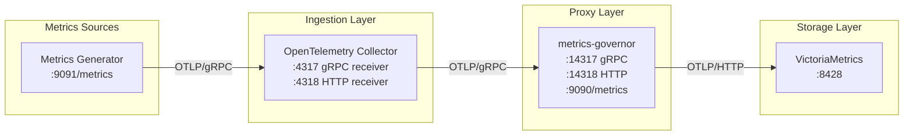

# Testing

A comprehensive test suite with **880+ tests** across unit, functional, e2e, and performance testing ensures reliability and correctness.

[](https://github.com/szibis/metrics-governor/actions/workflows/build.yml)
[](https://github.com/szibis/metrics-governor/actions/workflows/benchmark.yml)

## Live Test Status

View the latest test results and coverage reports:

| Status | Link |
|--------|------|
| **Build & Tests** | [GitHub Actions - Build](https://github.com/szibis/metrics-governor/actions/workflows/build.yml) |
| **Benchmarks** | [GitHub Actions - Benchmarks](https://github.com/szibis/metrics-governor/actions/workflows/benchmark.yml) |
| **Coverage Report** | [PR Coverage Comments](https://github.com/szibis/metrics-governor/pulls?q=is%3Apr+label%3Asize%2F) |

## Test Coverage by Component

| Component | Unit Tests | Functional | E2E | Benchmarks | Coverage |
|-----------|:----------:|:----------:|:---:|:----------:|:--------:|
| [**Auth**](../internal/auth/) | 27 | - | ✓ | 10 | ~88% |
| [**Buffer**](../internal/buffer/) | 28 | 6 | ✓ | 6 | ~95% |
| [**Compression**](../internal/compression/) | 19 | - | ✓ | 13 | ~90% |
| [**Config**](../internal/config/) | 50 | - | - | - | ~85% |
| [**Exporter**](../internal/exporter/) | 118 | 5 | ✓ | 14 | ~92% |
| [**Limits**](../internal/limits/) | 77 | 10 | ✓ | 9 | ~92% |
| [**Logging**](../internal/logging/) | 24 | - | - | - | ~80% |
| [**PRW**](../internal/prw/) | 82 | 8 | ✓ | 6 | ~89% |
| [**Queue**](../internal/queue/) | 78 | 8 | ✓ | 7 | ~88% |
| [**Receiver**](../internal/receiver/) | 45 | 9 | ✓ | 9 | ~90% |
| [**Sharding**](../internal/sharding/) | 98 | 8 | ✓ | 10 | ~95% |
| [**Stats**](../internal/stats/) | 65 | 12 | ✓ | 6 | ~90% |
| [**TLS**](../internal/tls/) | 12 | - | ✓ | - | ~85% |
| **Functional** | - | 73 | - | - | - |
| **E2E** | - | - | 8 | - | - |
| **Test Utils** | - | - | 72 | - | - |
| **Total** | **727** | **73** | **80** | **90** | **~86%** |

## Test Categories Detail

### Unit Tests (`internal/*/`)

Component-level tests with mocks. Each package tests its core functionality in isolation.

| Package | Tests | Key Test Areas |
|---------|:-----:|----------------|
| `auth` | 27 | Bearer token, basic auth, HTTP middleware, gRPC interceptors |
| `buffer` | 28 | Add/flush operations, batching, concurrent access, graceful shutdown, failover drain |
| `compression` | 19 | gzip/zstd/snappy compress/decompress, round-trips |
| `config` | 50 | CLI parsing, YAML loading, validation, defaults |
| `exporter` | 118 | gRPC/HTTP export, retries, sharded export, queued export, split-on-error, pipeline parity |
| `limits` | 77 | Rule matching, cardinality tracking, adaptive limiting, dry-run |
| `logging` | 24 | JSON output, log levels, field formatting |
| `prw` | 82 | PRW 1.0/2.0 encoding, buffer, limits, sharding, metadata bounds |
| `queue` | 187 | FastQueue operations, push/pop, persistence, recovery |
| `receiver` | 45 | gRPC/HTTP receivers, TLS, authentication |
| `sharding` | 98 | Hash ring, consistent hashing, DNS discovery, splitter |
| `stats` | 65 | Metrics collection, cardinality tracking, Prometheus output |
| `tls` | 12 | Certificate loading, mTLS, client/server config |

### Functional Tests (`functional/`)

Integration tests with real components working together.

| File | Tests | Description |
|------|:-----:|-------------|
| `buffer_test.go` | 6 | Buffer with real stats collector |
| `exporter_test.go` | 5 | Export to mock backends |
| `limits_test.go` | 10 | Limits enforcement with real metrics |
| `prw_test.go` | 8 | PRW pipeline end-to-end |
| `queue_test.go` | 8 | Queue persistence and recovery |
| `receiver_test.go` | 9 | Receiver with compression and auth |
| `sharding_test.go` | 8 | Sharding with multiple endpoints |
| `stats_test.go` | 12 | Stats with high cardinality |
| `verifier_test.go` | 7 | Verification functions |

### E2E Tests (`e2e/`)

Full system tests with complete pipeline.

| Test | Description |
|------|-------------|
| `TestE2E_GRPCFullPipeline` | Complete gRPC flow through all components |
| `TestE2E_HTTPFullPipeline` | Complete HTTP flow through all components |
| `TestE2E_BufferFlush` | Graceful shutdown and buffer flush |
| `TestE2E_ConcurrentClients` | Multiple concurrent clients |
| `TestE2E_HighCardinality` | High cardinality metric handling |
| `TestE2E_ManyDatapoints` | Large batch processing |
| `TestE2E_BurstTraffic` | Traffic burst handling |
| `TestE2E_EdgeCaseValues` | Extreme float values |

### Memory Leak Tests

Memory leak detection tests run automatically on every PR via the `memory-check.yml` workflow. They are organized into three categories:

#### Resource Tests (`*_resource_test.go`)

Verify that components release memory after shutdown. These tests measure `runtime.MemStats.HeapAlloc` before and after component lifecycle operations.

| File | Tests | What It Checks |
|------|:-----:|----------------|
| `buffer/buffer_resource_test.go` | 1 | Buffer memory released after flush and stop |
| `compression/compression_resource_test.go` | 1 | Compressor memory bounded across many operations |
| `limits/limits_resource_test.go` | 1 | Enforcer memory released after stop |

Run:
```bash
go test -run Resource -count=1 -timeout=5m ./internal/...
```

#### Goroutine Leak Tests (`*_leak_test.go`)

Use [`go.uber.org/goleak`](https://github.com/uber-go/goleak) to verify no goroutines are leaked after components are created, used, and shut down.

| File | Tests | What It Checks |
|------|:-----:|----------------|
| `buffer/leak_test.go` | 2 | `MetricsBuffer` and `MemoryQueue` goroutine cleanup |
| `exporter/leak_test.go` | 2 | `QueuedExporter` and `PRWQueuedExporter` goroutine cleanup |
| `queue/leak_test.go` | 2 | `SendQueue` and `FastQueue` goroutine cleanup |
| `stats/leak_test.go` | 1 | `StatsCollector` goroutine cleanup |

Pattern:
```go
func TestLeakCheck_Component(t *testing.T) {
    defer goleak.VerifyNone(t, goleak.IgnoreCurrent())
    // create component, use it, close/stop it
}
```

Run:
```bash
go test -run TestLeak -count=1 -timeout=5m ./internal/...
```

#### Memory Stress Tests (`*_stress_test.go`)

Sustained-load tests that verify memory growth stays bounded over many iterations. Each test measures `HeapAlloc` before and after a workload, asserts growth stays under a threshold (typically 50 MB).

| File | Tests | What It Checks |
|------|:-----:|----------------|
| `intern/stress_test.go` | 2 | Intern pool growth capped by `ResetIfLarge()` |
| `stats/stress_test.go` | 1 | Stats map growth bounded across window resets |
| `limits/stress_test.go` | 1 | Enforcer group/dropped maps bounded across windows |
| `exporter/stress_test.go` | 1 | PRW response body reads bounded by `io.LimitReader` |

Pattern:
```go
func TestStress_ComponentGrowth(t *testing.T) {
    var mBefore, mAfter runtime.MemStats
    runtime.GC()
    runtime.ReadMemStats(&mBefore)
    // ... sustained load ...
    runtime.GC()
    runtime.ReadMemStats(&mAfter)
    if mAfter.HeapAlloc > mBefore.HeapAlloc {
        growth := mAfter.HeapAlloc - mBefore.HeapAlloc
        if growth > 50*1024*1024 {
            t.Fatalf("memory growth too high: %d bytes", growth)
        }
    }
}
```

Run:
```bash
go test -run Stress -count=1 -timeout=10m ./internal/...
```

#### CI Workflow: Memory Check

The `.github/workflows/memory-check.yml` workflow runs on every PR to `main` with four parallel jobs:

| Job | Description | Timeout |
|-----|-------------|---------|
| `resource-tests` | Runs `*_resource_test.go` tests | 5m |
| `goroutine-leak-check` | Runs `*_leak_test.go` tests with goleak | 5m |
| `memory-stress-test` | Runs `*_stress_test.go` sustained-load tests | 10m |
| `benchmark-alloc-compare` | Compares `allocs/op` between PR and base branch using `benchstat`; posts a PR comment if regressions exceed 10% | 10m |

### Benchmarks

Performance tests measuring throughput, latency, and memory usage.

| Package | Benchmarks | Key Metrics |
|---------|:----------:|-------------|
| `auth` | 10 | Auth middleware overhead |
| `buffer` | 6 | Add throughput, flush latency |
| `compression` | 13 | Compression ratios and speeds |
| `exporter` | 14 | Export throughput per protocol |
| `limits` | 9 | Rule matching performance |
| `prw` | 6 | PRW encoding/decoding speed |
| `queue` | 7 | FastQueue push/pop performance |
| `receiver` | 9 | Request handling throughput |
| `sharding` | 10 | Hash ring operations |
| `stats` | 6 | Stats collection overhead |

Run benchmarks:
```bash
# All benchmarks
make bench

# Specific package
go test -bench=. -benchmem ./internal/buffer/...

# Compare against baseline
make bench-compare
```

## Running Tests

```bash
# Run all tests
go test ./...

# Run with coverage
go test -coverprofile=coverage.out ./...
go tool cover -func=coverage.out

# Run benchmarks
go test -bench=. -benchmem ./...

# Run functional tests only
go test ./functional/...

# Run e2e tests (requires Docker)
go test ./e2e/...
```

## Test Environment

A comprehensive test environment is provided using Docker Compose with full observability stack.

### Architecture



### Components

| Service | Ports | Description |
|---------|-------|-------------|
| **otel-collector** | 4317, 4318, 8888 | Receives metrics from generator |
| **metrics-governor** | 14317, 14318, 9090 | OTLP proxy with limits |
| **victoriametrics** | 8428 | Storage backend |
| **metrics-generator** | 9091 | Test traffic generator |
| **verifier** | 9092 | Automated verification |
| **grafana** | 3000 | Visualization |

### Quick Start

```bash
# Start the complete test environment
docker compose up --build -d

# Wait for services
sleep 30

# Open Grafana
open http://localhost:3000  # Login: admin/admin

# View metrics-governor stats
curl -s localhost:9090/metrics | grep metrics_governor

# Stop all services
docker compose down
```

### Test Configurations

| Config | Command | Datapoints/sec | Use Case |
|--------|---------|----------------|----------|
| **stable** | `docker compose -f docker-compose.yaml -f compose_overrides/stable.yaml up -d` | ~1,300 | Rate verification |
| **light** | `docker compose -f docker-compose.yaml -f compose_overrides/light.yaml up -d` | ~5,000-10,000 | CI/CD |
| **default** | `docker compose up -d` | ~10,000-20,000 | General testing |
| **perf** | `docker compose -f docker-compose.yaml -f compose_overrides/perf.yaml up -d` | ~100,000+ | Stress testing |
| **sharding** | `docker compose -f docker-compose.yaml -f compose_overrides/sharding.yaml up -d` | ~10,000 | Multi-endpoint sharding |

### Available Endpoints

| Service | Endpoint | Description |
|---------|----------|-------------|
| OTel Collector gRPC | `localhost:4317` | OTLP gRPC receiver |
| OTel Collector HTTP | `localhost:4318` | OTLP HTTP receiver |
| metrics-governor gRPC | `localhost:14317` | Proxy gRPC receiver |
| metrics-governor HTTP | `localhost:14318` | Proxy HTTP receiver |
| metrics-governor stats | `http://localhost:9090/metrics` | Prometheus metrics |
| VictoriaMetrics | `http://localhost:8428` | Query API |
| Grafana | `http://localhost:3000` | Dashboard (admin/admin) |

### Test Scenarios

The metrics generator creates various test scenarios:

| Scenario | Description |
|----------|-------------|
| **Normal traffic** | HTTP request metrics for services |
| **High cardinality** | Unique user/session/request IDs |
| **Burst traffic** | Periodic traffic spikes |
| **Edge cases** | Extreme values (0, ±inf, π, e) |
| **Many datapoints** | Histograms with 15 buckets |
| **Diverse metrics** | ~200 unique metric names |

### Generator Environment Variables

| Variable | Default | Description |
|----------|---------|-------------|
| `OTLP_ENDPOINT` | `metrics-governor:4317` | Target endpoint |
| `METRICS_INTERVAL` | `100ms` | Generation interval |
| `SERVICES` | `payment-api,order-api,...` | Service names |
| `ENABLE_HIGH_CARDINALITY` | `true` | Generate high cardinality |
| `ENABLE_BURST_TRAFFIC` | `true` | Enable burst patterns |
| `TARGET_DATAPOINTS_PER_SEC` | `10000` | Target datapoints |

### Useful Commands

```bash
# View metrics-governor stats
curl -s localhost:9090/metrics | grep metrics_governor

# Check limit violations
curl -s localhost:9090/metrics | grep limit

# Query VictoriaMetrics for time series count
curl -s 'localhost:8428/api/v1/query?query=count({__name__=~".+"})'

# View verification results
docker compose logs -f verifier

# View metrics-governor logs
docker compose logs -f metrics-governor
```

### Verifier Output

```
========================================
  VERIFICATION RESULT - PASS
========================================
VICTORIAMETRICS:
  Total time series:      5000
  Unique metric names:    50

METRICS-GOVERNOR:
  Datapoints received:    100000
  Datapoints sent:        98000
  Export errors:          0

VERIFICATION:
  Ingestion rate:         98.00%
  Status:                 PASS
========================================
```

### Troubleshooting

| Issue | Solution |
|-------|----------|
| No metrics in VictoriaMetrics | Check otel-collector logs |
| High export errors | Check network connectivity |
| Verification failing | Check ingestion rate |
| Grafana no data | Wait 30s for metrics |
