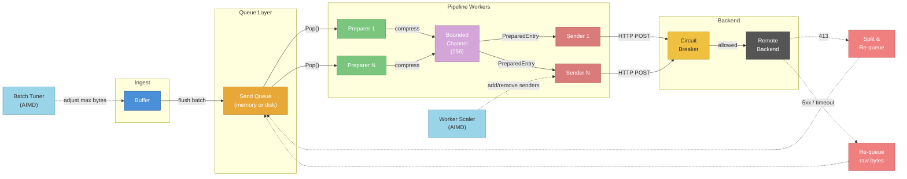
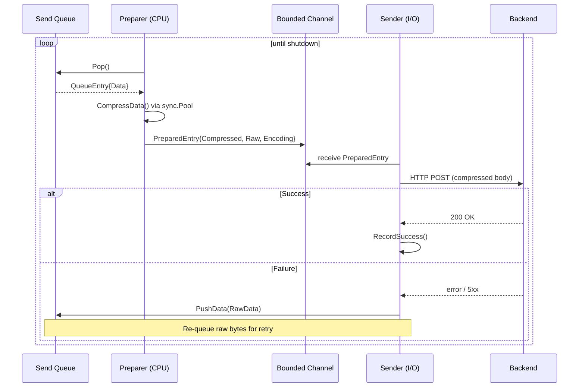
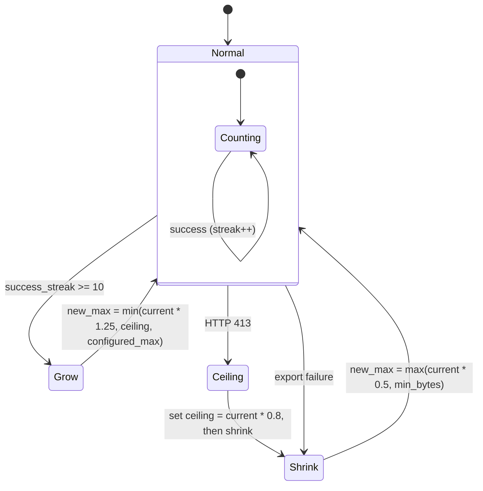
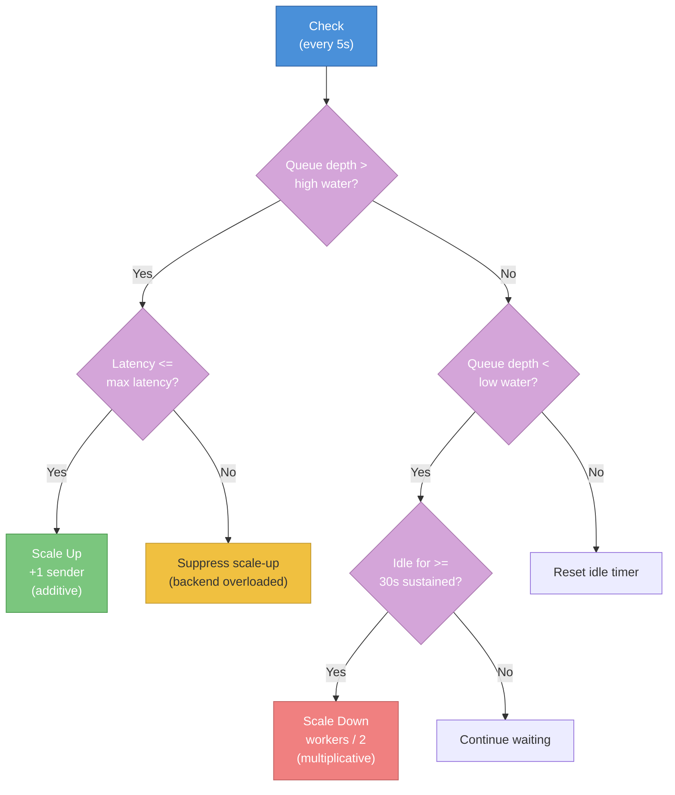
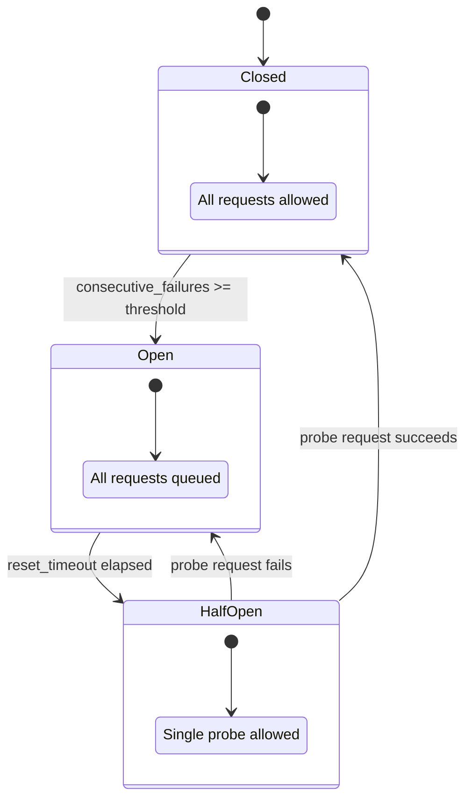

## Table of Contents

- [Architecture Overview](#architecture-overview)
- [Pipeline Modes](#pipeline-modes)
- [Pipeline Split](#pipeline-split)
  - [How It Works](#how-it-works)
  - [Preparers (CPU-bound)](#preparers-cpu-bound)
  - [Bounded Channel](#bounded-channel)
  - [Senders (I/O-bound)](#senders-io-bound)
  - [Graceful Shutdown](#graceful-shutdown)
- [Batch Size Auto-tuning (AIMD)](#batch-size-auto-tuning-aimd)
  - [Algorithm](#algorithm)
  - [Convergence Example](#convergence-example)
  - [Configuration](#configuration)
  - [Metrics](#metrics)
- [Adaptive Worker Scaling (AIMD)](#adaptive-worker-scaling-aimd)
  - [Scaling Algorithm](#scaling-algorithm)
  - [EWMA Latency Tracking](#ewma-latency-tracking)
  - [Configuration](#configuration-1)
  - [Metrics](#metrics-1)
- [Async Send](#async-send)
  - [Semaphore-bounded Concurrency](#semaphore-bounded-concurrency)
  - [Configuration](#configuration-2)
  - [Metrics](#metrics-2)
- [Connection Pre-warming](#connection-pre-warming)
  - [Configuration](#configuration-3)
  - [Metrics](#metrics-3)
- [Compression](#compression)
  - [Supported Algorithms](#supported-algorithms)
  - [Encoder Pooling](#encoder-pooling)
  - [Configuration](#configuration-4)
  - [Metrics](#metrics-4)
- [Circuit Breaker](#circuit-breaker)
  - [Configuration](#configuration-5)
  - [Metrics](#metrics-5)
- [Throughput Benchmarks](#throughput-benchmarks)
- [Configuration Reference](#configuration-reference)
  - [Complete YAML](#complete-yaml)
- [Monitoring and Alerting](#monitoring-and-alerting)
  - [Key Metrics Summary](#key-metrics-summary)
  - [Grafana Dashboard](#grafana-dashboard)
  - [Recommended Alert Rules](#recommended-alert-rules)
- [Troubleshooting](#troubleshooting)
  - [Low Throughput](#low-throughput)
  - [Batch Size Oscillating](#batch-size-oscillating)
  - [Workers Not Scaling Up](#workers-not-scaling-up)
  - [High Channel Backpressure](#high-channel-backpressure)
  - [Connection Warmup Failures](#connection-warmup-failures)

metrics-governor's export pipeline transforms incoming metrics into optimized, reliable outbound requests. Both the OTLP (gRPC/HTTP) and Prometheus Remote Write pipelines share the same queue-based architecture with identical resilience features: pipeline split, batch auto-tuning, adaptive scaling, async send, circuit breaker, connection pre-warming, and compression.

---

## Architecture Overview



**Data flow:** Buffer flushes batches into the Send Queue. Preparers pop entries, compress them using pooled encoders, and push `PreparedEntry` structs into a bounded channel. Senders pop from the channel, send HTTP requests through the circuit breaker, and re-queue raw bytes on failure. Two AIMD feedback loops -- the Batch Tuner and Worker Scaler -- continuously optimize throughput.

---

## Pipeline Modes

metrics-governor supports three pipeline modes, each building on the previous one:

| Mode | Workers | Queue Path | Best For |
|------|---------|------------|----------|
| **Unified** (legacy) | `NumCPU` single-phase workers | pop, compress, send | Simple deployments, low volume |
| **Pipeline Split** | `NumCPU` preparers + `NumCPU*2` senders | pop+compress \| send | High throughput, CPU/IO separation |
| **Pipeline Split + Async** | + concurrent sends per sender | pop+compress \| N sends/sender | Maximum throughput, high-latency backends |

Select the mode via configuration:

| Setting | Unified | Pipeline Split | Pipeline Split + Async |
|---------|---------|----------------|------------------------|
| `queue.always_queue` | `true` | `true` | `true` |
| `queue.pipeline_split.enabled` | `false` | `true` | `true` |
| `queue.max_concurrent_sends` | -- | 1 | 4 (default) |

---

## Pipeline Split

### How It Works

Pipeline Split separates CPU-bound work (serialization, compression) from I/O-bound work (HTTP sends) into distinct goroutine pools connected by a bounded channel. This prevents slow backends from starving the compression pipeline and allows each pool to be sized independently.



### Preparers (CPU-bound)

- **Count:** `runtime.NumCPU()` by default (configurable via `preparer_count`).
- **Work:** Pop a `QueueEntry` from the queue, compress via `CompressData()` using pooled encoders, produce a `PreparedEntry`.
- **Output:** `PreparedEntry{CompressedData, RawData, ContentEncoding, UncompressedSize}`.
- **Circuit breaker check:** Before compressing, the preparer checks the circuit breaker. If open, raw bytes are re-pushed and the preparer backs off.

### Bounded Channel

- **Size:** 256 entries by default (configurable via `channel_size`).
- **Backpressure:** When the channel is full, preparers block on the send. This naturally rate-limits the compression pipeline to match sender throughput.
- **Metric:** `metrics_governor_queue_prepared_channel_length` tracks current fill level.

### Senders (I/O-bound)

- **Count:** `runtime.NumCPU() * 2` by default (configurable via `sender_count`). I/O-bound goroutines benefit from exceeding the CPU count.
- **Work:** Pop a `PreparedEntry` from the channel, acquire the global send semaphore, send via `SendCompressed()` (fast path) or `ExportData()` (medium path).
- **Failure:** On export error, raw bytes (`PreparedEntry.RawData`) are re-pushed to the queue via `PushData()` -- no deserialization needed.
- **Fast paths:**
  - `SendCompressed()` -- sends pre-compressed bytes directly (eliminates double-compression).
  - `ExportData()` -- sends raw proto bytes (exporter handles compression).
  - Full unmarshal -- fallback only when the above interfaces are not implemented.

### Graceful Shutdown

On shutdown, the stop signal cascades: `close(retryStop)` causes preparers to finish and exit, which closes the prepared channel. Senders drain remaining channel entries, then exit. Finally, `drainQueue()` exports remaining queue entries best-effort within `drain_timeout`, re-pushing failures for recovery on restart.

---

## Batch Size Auto-tuning (AIMD)

The Batch Tuner uses the AIMD (Additive Increase / Multiplicative Decrease) algorithm -- the same algorithm that powers TCP congestion control -- to find the optimal batch size for the backend.

### Algorithm



**Behavior summary:**
- **Additive Increase:** After `success_streak` consecutive successes (default: 10), the max batch size grows by `grow_factor` (default: 1.25 = 25%).
- **Multiplicative Decrease:** On any export failure, the max batch size shrinks by `shrink_factor` (default: 0.5 = 50%) and the success streak resets.
- **HTTP 413 Handling:** When a 413 (Payload Too Large) response is detected, a hard ceiling is set at 80% of the current max. The batch size then shrinks. Subsequent growth is capped at this ceiling.

### Convergence Example

| Event | Current Max | Hard Ceiling | Action |
|-------|-------------|--------------|--------|
| Start | 16 MB | -- | Initial max |
| HTTP 413 | 16 MB | 12.8 MB | Set ceiling at 80%, shrink to 8 MB |
| 10 successes | 8 MB | 12.8 MB | Grow to 10 MB |
| 10 successes | 10 MB | 12.8 MB | Grow to 12.5 MB |
| 10 successes | 12.5 MB | 12.8 MB | Grow to 12.8 MB (capped at ceiling) |
| Steady state | 12.8 MB | 12.8 MB | Stable -- no further growth |
| Backend outage (5xx) | 12.8 MB | 12.8 MB | Shrink to 6.4 MB |
| 10 successes | 6.4 MB | 12.8 MB | Grow to 8 MB |

The system converges to the backend's actual limit and recovers gracefully from transient failures.

### Configuration

**YAML:**
```yaml
buffer:
  batch_auto_tune:
    enabled: true
    min_bytes: 512           # Floor (default: 512 B)
    max_bytes: 16777216      # Ceiling (default: 16 MB)
    success_streak: 10       # Successes before growth
    grow_factor: 1.25        # 25% growth per increase
    shrink_factor: 0.5       # 50% shrink per failure
```

### Metrics

| Metric | Type | Description |
|--------|------|-------------|
| `metrics_governor_batch_current_max_bytes` | Gauge | Current effective max batch size in bytes |
| `metrics_governor_batch_hard_ceiling_bytes` | Gauge | Hard ceiling discovered via HTTP 413 (0 = none) |
| `metrics_governor_batch_tuning_adjustments_total{direction}` | Counter | Adjustments by direction (`up` / `down`) |
| `metrics_governor_batch_success_streak` | Gauge | Current consecutive success count |

---

## Adaptive Worker Scaling (AIMD)

The Worker Scaler dynamically adjusts the number of sender goroutines based on queue depth and export latency, using the same AIMD pattern as the Batch Tuner.

### Scaling Algorithm



**Scale-up (additive increase):**
- Triggers when queue depth exceeds `high_water_mark` (default: 100).
- Adds one sender goroutine per decision interval.
- Suppressed when EWMA latency exceeds `max_latency` (default: 500ms) -- this prevents piling more requests onto an already-struggling backend.

**Scale-down (multiplicative decrease):**
- Triggers when queue depth stays below `low_water_mark` (default: 10) for `sustained_idle_secs` (default: 30s).
- Halves the worker count (floor at `min_workers`).
- Idle timer resets whenever queue depth rises above the low water mark.

### EWMA Latency Tracking

Export latency is tracked using an Exponentially Weighted Moving Average with `alpha = 0.3`:

```
new_ewma = 0.3 * observation + 0.7 * previous_ewma
```

This smooths out latency spikes while remaining responsive to sustained trends. The EWMA is used by the scaler to suppress scale-up when the backend is under pressure (latency > `max_latency`).

### Configuration

**YAML:**
```yaml
exporter:
  queue:
    adaptive_workers:
      enabled: true
      min_workers: 1           # Floor (default: 1)
      max_workers: 32          # Ceiling (default: NumCPU * 4)
```

| Parameter | Default | Description |
|-----------|---------|-------------|
| `enabled` | `false` | Activate adaptive scaling |
| `min_workers` | 1 | Minimum sender count |
| `max_workers` | `NumCPU * 4` | Maximum sender count |
| Scale interval | 5s | Time between scaling decisions |
| High water mark | 100 | Queue depth triggering scale-up |
| Low water mark | 10 | Queue depth for idle detection |
| Max latency | 500ms | Latency threshold suppressing scale-up |
| Sustained idle | 30s | Idle duration before scale-down |

### Metrics

| Metric | Type | Description |
|--------|------|-------------|
| `metrics_governor_queue_workers_desired` | Gauge | Target worker count from scaler |
| `metrics_governor_queue_senders_total` | Gauge | Current sender goroutine count |
| `metrics_governor_queue_scaler_adjustments_total{direction}` | Counter | Scaling events (`up` / `down`) |
| `metrics_governor_queue_export_latency_ewma_seconds` | Gauge | Current EWMA export latency |

---

## Async Send

### Semaphore-bounded Concurrency

Each sender goroutine can issue multiple concurrent HTTP requests, bounded by two levels of semaphore. This allows a single sender to saturate network bandwidth even when individual requests have high latency.

- **MaxConcurrentSends per sender:** default 4 in-flight requests per goroutine.
- **GlobalSendLimit:** default `NumCPU * 8` total in-flight sends across all senders, implemented as a weighted semaphore (`golang.org/x/sync/semaphore`).
- **Goroutine safety:** `PushData()` is mutex-protected, safe for concurrent re-queue on failure.

On failure, the sender records the error with the circuit breaker and batch tuner, classifies it for metrics, then: splits and re-queues on 413, drops non-retryable errors (auth, 4xx), or re-pushes raw bytes for retry.

### Configuration

**YAML:**
```yaml
exporter:
  queue:
    max_concurrent_sends: 4     # Per-sender concurrency (default: 4)
    global_send_limit: 64       # Total in-flight sends (default: NumCPU * 8)
```

### Metrics

| Metric | Type | Description |
|--------|------|-------------|
| `metrics_governor_queue_sends_inflight` | Gauge | Current in-flight HTTP sends |
| `metrics_governor_queue_sends_inflight_max` | Gauge | Configured max in-flight sends |

---

## Connection Pre-warming

On startup, metrics-governor sends HTTP HEAD requests to each export endpoint to establish TCP connections and populate the `http.Transport` pool, eliminating cold-start latency. Warmup is fire-and-forget (failures logged, never blocking), has a 5s timeout, and also triggers on dynamic endpoint changes (sharded exporters). Even failed HEAD requests warm the connection pool.

### Configuration

**YAML:**
```yaml
exporter:
  prewarm_connections: true    # default: true
```

### Metrics

| Metric | Type | Labels | Description |
|--------|------|--------|-------------|
| `metrics_governor_connection_warmup_total` | Counter | `status` (`success` / `failure`) | Total warmup attempts by outcome |

---

## Compression

### Supported Algorithms

| Algorithm | Compression Ratio | Speed | Pooled | Use Case |
|-----------|-------------------|-------|--------|----------|
| **gzip** | Best (~70%) | Slow | Yes | Bandwidth-constrained links |
| **zstd** | Good (~65%) | Fast | Yes | Balanced -- recommended default |
| **snappy** | OK (~50%) | Fastest | No (allocation-free) | CPU-constrained, same-datacenter |
| **zlib** | Good (~68%) | Moderate | Yes | Backend compatibility |
| **deflate** | Good (~68%) | Moderate | Yes | Backend compatibility |
| **none** | 0% | N/A | N/A | Debugging, localhost |

### Encoder Pooling

All encoder types except snappy use `sync.Pool` for reuse: Get a pooled encoder, `Reset()` it, compress, `Close()`, then return it to the pool. On error, the encoder is discarded. Buffer targets (`bytes.Buffer`) are also pooled. Result: ~80% reduction in encoder allocations under steady-state load.

### Configuration

**YAML:**
```yaml
exporter:
  compression:
    type: zstd             # none, gzip, zstd, snappy, zlib, deflate
    level: 3               # Algorithm-specific (zstd: 1=fastest, 11=best)
```

### Metrics

| Metric | Type | Description |
|--------|------|-------------|
| `metrics_governor_compression_pool_gets_total` | Counter | Encoder reuse (pool hit) |
| `metrics_governor_compression_pool_new_total` | Counter | New encoder allocations (pool miss) |
| `metrics_governor_compression_pool_discards_total` | Counter | Encoders discarded on error |
| `metrics_governor_otlp_export_bytes_total{compression}` | Counter | Bytes sent by compression type |

---

## Circuit Breaker

The export pipeline includes a circuit breaker to prevent cascading failures when backends are unhealthy.



- **Closed:** All requests pass through normally.
- **Open:** All requests are rejected and queued for retry. After `reset_timeout` (default: 30s), transitions to half-open.
- **Half-Open:** A single probe request is allowed. If it succeeds, the circuit closes. If it fails, the circuit reopens.

### Configuration

**YAML:**
```yaml
exporter:
  queue:
    circuit_breaker:
      enabled: true
      threshold: 5           # Consecutive failures before opening (default: 5)
      reset_timeout: 30s     # Time before half-open probe (default: 30s)
```

### Metrics

| Metric | Type | Labels | Description |
|--------|------|--------|-------------|
| `metrics_governor_circuit_breaker_state{state}` | Gauge | `closed`, `open`, `half_open` | Current state (1 = active) |
| `metrics_governor_circuit_breaker_open_total` | Counter | -- | Times circuit opened |
| `metrics_governor_circuit_breaker_rejected_total` | Counter | -- | Requests rejected by open circuit |
| `metrics_governor_direct_export_timeout_total` | Counter | -- | Direct exports that timed out |

---

## Throughput Benchmarks

Measured with a synthetic load generator pushing OTLP metrics to metrics-governor, forwarding to a backend over HTTP with zstd compression. Results on a 4-core host:

| Configuration | Throughput | Improvement |
|---------------|-----------|-------------|
| Unified workers (baseline) | ~250k dp/s | -- |
| + Connection Pre-warming | ~260k dp/s | +4% |
| + Pipeline Split | ~400-440k dp/s | +60-76% |
| + Batch Auto-tuning | ~420-460k dp/s | +5-10% |
| + Async Send (4 per sender) | ~450-500k dp/s | +7-10% |
| + Adaptive Scaling | ~460-520k dp/s | +3-5% |

Pipeline Split provides the largest single improvement by decoupling CPU-bound compression from I/O-bound sending.

---

## Configuration Reference

### Complete YAML

```yaml
exporter:
  endpoint: "https://mimir.example.com:443"
  protocol: http                       # grpc or http
  insecure: false
  timeout: 30s
  prewarm_connections: true            # HEAD requests on startup
  compression:
    type: zstd                         # none, gzip, zstd, snappy, zlib, deflate
    level: 3                           # Algorithm-specific level
  queue:
    enabled: true
    type: memory                       # memory or disk (FastQueue)
    max_bytes: 1Gi
    always_queue: true
    pipeline_split:
      enabled: true
      preparer_count: 0                # 0 = NumCPU
      sender_count: 0                  # 0 = NumCPU * 2
      channel_size: 256
    max_concurrent_sends: 4            # Per-sender concurrency
    global_send_limit: 0               # 0 = NumCPU * 8
    adaptive_workers:
      enabled: true
      min_workers: 1
      max_workers: 0                   # 0 = NumCPU * 4
    circuit_breaker:
      enabled: true
      threshold: 5
      reset_timeout: 30s
    backoff:
      enabled: true
      multiplier: 2.0

buffer:
  batch_auto_tune:
    enabled: true
    min_bytes: 512
    max_bytes: 16777216                # 16 MB
    success_streak: 10
    grow_factor: 1.25
    shrink_factor: 0.5
```

See `docs/configuration.md` for the full YAML schema and all CLI flags. Pipeline split, async send, adaptive workers, and batch auto-tuning are YAML-only settings.

---

## Monitoring and Alerting

### Key Metrics Summary

All export pipeline metrics use the `metrics_governor_` prefix. The most important ones for monitoring are:

| Metric | Type | What It Tells You |
|--------|------|-------------------|
| `otlp_export_datapoints_total` | Counter | Export throughput (rate = dp/s) |
| `otlp_export_errors_total{error_type}` | Counter | Error rate by category |
| `queue_utilization_ratio` | Gauge | Queue saturation (alert > 0.8) |
| `queue_retry_failure_total{error_type}` | Counter | Retry failures by cause |
| `queue_requeue_data_loss_total` | Counter | Data permanently lost (alert > 0) |
| `circuit_breaker_state{state}` | Gauge | Backend health (alert if "open") |
| `batch_current_max_bytes` | Gauge | AIMD tuner convergence |
| `queue_prepared_channel_length` | Gauge | Backpressure between stages |
| `queue_export_latency_ewma_seconds` | Gauge | Backend latency trend |
| `queue_workers_desired` | Gauge | Scaler target vs. actual |
| `queue_sends_inflight` | Gauge | Async concurrency utilization |
| `connection_warmup_total{status}` | Counter | Startup connection health |
| `compression_pool_gets_total` | Counter | Encoder reuse rate |

For the complete list of 40+ pipeline metrics, see the per-section tables above.

### Grafana Dashboard

The operations dashboard (`dashboards/operations.json`) includes a dedicated Export Pipeline section with panels for:
- Export throughput (datapoints/sec, bytes/sec)
- Queue depth and utilization
- Worker/preparer/sender active counts
- Batch tuner convergence (current max vs. ceiling)
- Circuit breaker state timeline
- Retry success/failure rates

### Recommended Alert Rules

```yaml
groups:
  - name: metrics-governor-export
    rules:
      - alert: ExportQueueBacklogHigh
        expr: metrics_governor_queue_utilization_ratio > 0.8
        for: 5m
        labels: { severity: warning }
        annotations:
          summary: "Export queue > 80% for 5m. Check backend health."

      - alert: CircuitBreakerOpen
        expr: metrics_governor_circuit_breaker_state{state="open"} == 1
        for: 2m
        labels: { severity: critical }
        annotations:
          summary: "Circuit breaker open -- backend unreachable."

      - alert: ExportDataLoss
        expr: rate(metrics_governor_queue_requeue_data_loss_total[5m]) > 0
        labels: { severity: critical }
        annotations:
          summary: "Data permanently lost due to failed re-queue."

      - alert: ExportErrorRateHigh
        expr: |
          rate(metrics_governor_otlp_export_errors_total[5m])
          / rate(metrics_governor_otlp_export_requests_total[5m]) > 0.05
        for: 5m
        labels: { severity: warning }
        annotations:
          summary: "Export error rate above 5%."

      - alert: PreparedChannelFull
        expr: metrics_governor_queue_prepared_channel_length > 200
        for: 5m
        labels: { severity: warning }
        annotations:
          summary: "Senders bottleneck -- channel near capacity."
```

---

## Troubleshooting

### Low Throughput

Check `queue_workers_active` (all busy = saturated), `queue_prepared_channel_length` (near 256 = sender bottleneck), and `queue_export_latency_ewma_seconds` (high = slow backend). Fix by enabling Pipeline Split, increasing `sender_count`, enabling Async Send, or switching to faster compression (zstd/snappy).

### Batch Size Oscillating

Check `batch_tuning_adjustments_total{direction="down"}` rate and `batch_hard_ceiling_bytes`. If a 413 was received, the tuner converges automatically. For transient server errors, fix backend health -- the tuner recovers once errors stop. Increase `success_streak` for more conservative convergence.

### Workers Not Scaling Up

Verify `adaptive_workers.enabled: true`. If `queue_export_latency_ewma_seconds` exceeds 500ms, scale-up is intentionally suppressed (backend overloaded). If `queue_size` is below `high_water_mark` (100), scaling does not trigger. Increase `max_workers` or lower `high_water_mark` as needed.

### High Channel Backpressure

If `queue_prepared_channel_length` stays near 256, senders are the bottleneck. Increase `sender_count`, `max_concurrent_sends`, or `global_send_limit`. Check if `queue_sends_inflight` is near the global limit.

### Connection Warmup Failures

Warmup failures (`connection_warmup_total{status="failure"}`) do not block startup. Some backends reject HEAD requests -- the TCP connection is still established. If the backend is truly unreachable, fix network/DNS. Set `prewarm_connections: false` to suppress log noise.
