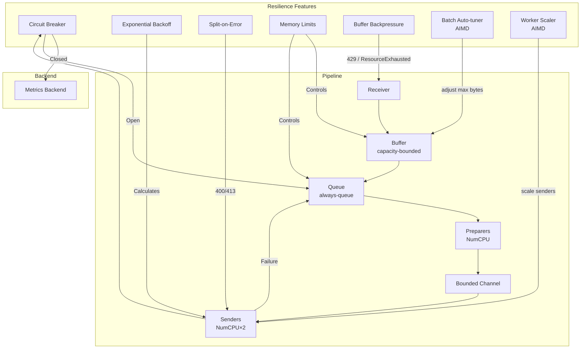
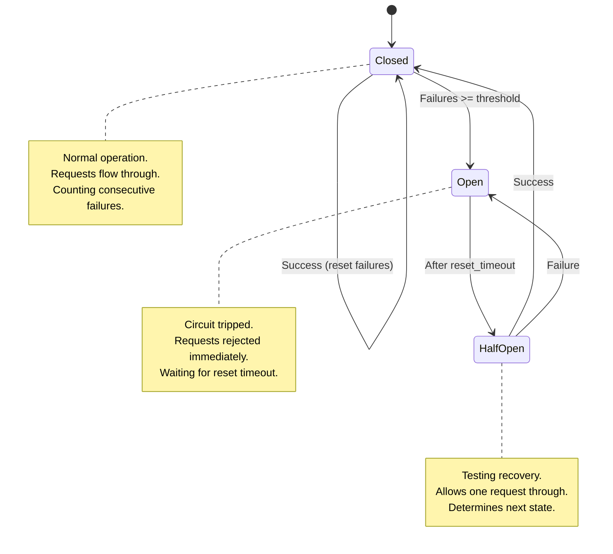
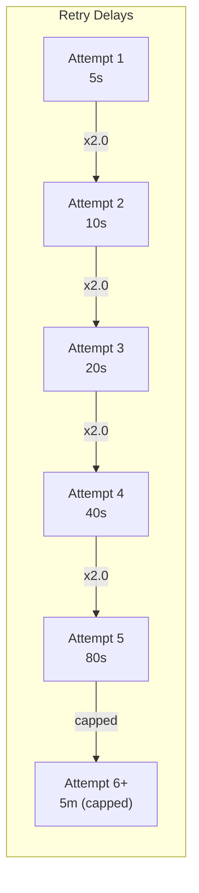
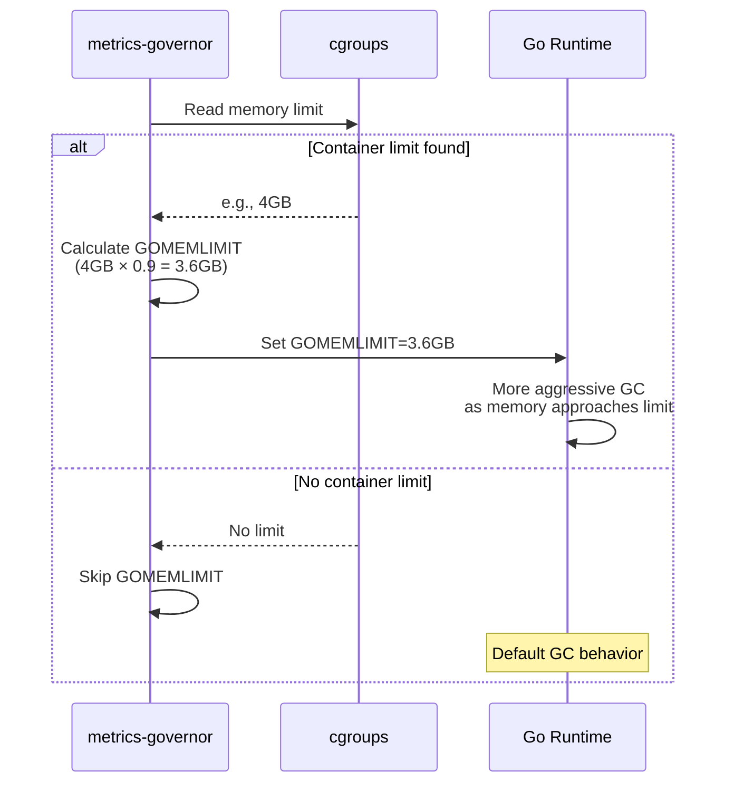
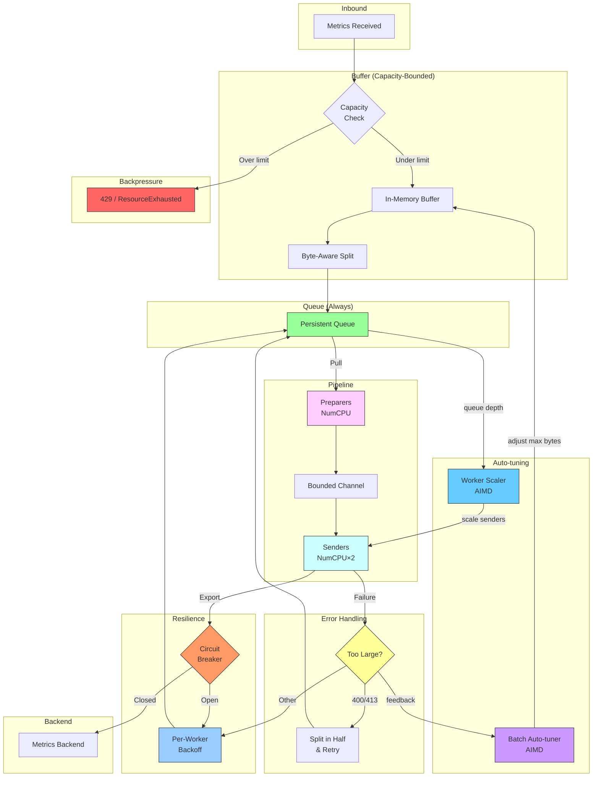

## Table of Contents

- [Overview](#overview)
- [Circuit Breaker](#circuit-breaker)
  - [State Machine](#state-machine)
  - [States Explained](#states-explained)
  - [Configuration](#configuration)
  - [Metrics](#metrics)
  - [Tuning Guidelines](#tuning-guidelines)
- [Exponential Backoff](#exponential-backoff)
  - [Backoff Calculation](#backoff-calculation)
  - [Example with Default Settings](#example-with-default-settings)
  - [Configuration](#configuration-1)
  - [Metrics](#metrics-1)
  - [Tuning Guidelines](#tuning-guidelines-1)
- [Memory Limits](#memory-limits)
  - [How It Works](#how-it-works)
  - [Benefits](#benefits)
  - [Configuration](#configuration-2)
  - [Recommended Ratios](#recommended-ratios)
- [Buffer Backpressure](#buffer-backpressure)
  - [Full Policies](#full-policies)
  - [Configuration](#configuration-3)
  - [Metrics](#metrics-2)
- [Percentage-Based Memory Sizing](#percentage-based-memory-sizing)
- [Combined Resilience Flow](#combined-resilience-flow)
  - [Timeline Example](#timeline-example)
- [Failover Queue](#failover-queue)
  - [Queue Types](#queue-types)
  - [Configuration](#configuration-4)
  - [Metrics](#metrics-3)
- [Failover Queue Drain Loop](#failover-queue-drain-loop)
  - [Drain Metrics](#drain-metrics)
- [Split-on-Error](#split-on-error)
  - [Metrics](#metrics-4)
- [Batch Auto-tuning](#batch-auto-tuning)
  - [AIMD Algorithm](#aimd-algorithm)
  - [Convergence Behavior](#convergence-behavior)
  - [Metrics](#metrics-5)
  - [Configuration](#configuration-5)
- [Adaptive Worker Scaling](#adaptive-worker-scaling)
  - [Scaling Rules](#scaling-rules)
  - [Latency Gate](#latency-gate)
  - [Metrics](#metrics-6)
  - [Configuration](#configuration-6)
- [Pipeline Parity](#pipeline-parity)
- [Monitoring and Alerting](#monitoring-and-alerting)
  - [Grafana Dashboard](#grafana-dashboard)
  - [Alerting Rules](#alerting-rules)
- [Best Practices](#best-practices)
  - [Production Recommendations](#production-recommendations)
  - [Development/Testing](#developmenttesting)
  - [High-Availability](#high-availability)
- [Troubleshooting](#troubleshooting)
  - [Circuit Breaker Keeps Opening](#circuit-breaker-keeps-opening)
  - [Backoff Delay Too Long](#backoff-delay-too-long)
  - [Backend Rejecting Batches as Too Large](#backend-rejecting-batches-as-too-large)
  - [OOM Kills Despite Memory Limits](#oom-kills-despite-memory-limits)
  - [Batch Size Oscillating (frequent grow/shrink)](#batch-size-oscillating-frequent-growshrink)

metrics-governor includes resilience features to handle backend failures gracefully. These features prevent resource exhaustion, reduce unnecessary load on struggling backends, and ensure reliable metrics delivery.

## Overview

The resilience system consists of multiple coordinated components:



## Circuit Breaker

The circuit breaker pattern prevents overwhelming an unavailable backend with retry attempts. It automatically detects failures and stops sending requests until the backend recovers.

### State Machine



### States Explained

| State | Behavior | Transition |
|-------|----------|------------|
| **Closed** | Normal operation - all requests pass through | Opens after `threshold` consecutive failures |
| **Open** | All requests immediately rejected | Transitions to Half-Open after `reset_timeout` |
| **Half-Open** | Single test request allowed | Closes on success, re-opens on failure |

### Configuration

```yaml
exporter:
  queue:
    circuit_breaker:
      enabled: true            # Enable circuit breaker (default: true)
      threshold: 5             # Consecutive failures to trip (default: 5)
      reset_timeout: 30s       # Time before testing recovery (default: 30s)
```

CLI flags:
```bash
-queue-circuit-breaker-enabled=true
-queue-circuit-breaker-threshold=5
-queue-circuit-breaker-reset-timeout=30s
```

### Metrics

| Metric | Type | Description |
|--------|------|-------------|
| `metrics_governor_queue_circuit_breaker_state` | Gauge | Current state (0=closed, 1=open, 2=half-open) |
| `metrics_governor_queue_circuit_breaker_opens_total` | Counter | Total times circuit opened |
| `metrics_governor_queue_circuit_breaker_rejections_total` | Counter | Requests rejected by open circuit |

### Tuning Guidelines

| Scenario | Threshold | Reset Timeout |
|----------|-----------|---------------|
| **Stable backend** | 5-10 | 30s-60s |
| **Flaky network** | 5-10 | 15s-30s |
| **High availability** | 3-5 | 10s-15s |
| **Batch processing** | 20-50 | 60s-120s |

## Exponential Backoff

Exponential backoff increases the delay between retry attempts after each failure. This prevents rapid-fire retries that can overwhelm a recovering backend.

### Backoff Calculation



The delay formula is:
```
delay = min(retry_interval * (multiplier ^ failures), max_retry_delay)
```

### Example with Default Settings

| Failures | Calculation | Actual Delay |
|----------|-------------|--------------|
| 0 | 5s | 5s |
| 1 | 5s × 2.0 = 10s | 10s |
| 2 | 5s × 4.0 = 20s | 20s |
| 3 | 5s × 8.0 = 40s | 40s |
| 4 | 5s × 16.0 = 80s | 80s |
| 5 | 5s × 32.0 = 160s | 160s |
| 6 | 5s × 64.0 = 320s | **300s (capped)** |

### Configuration

```yaml
exporter:
  queue:
    retry_interval: 5s         # Initial retry delay (default: 5s)
    max_retry_delay: 5m        # Maximum retry delay (default: 5m)
    backoff:
      enabled: true            # Enable exponential backoff (default: true)
      multiplier: 2.0          # Delay multiplier per failure (default: 2.0)
```

CLI flags:
```bash
-queue-retry-interval=5s
-queue-max-retry-delay=5m
-queue-backoff-enabled=true
-queue-backoff-multiplier=2.0
```

### Metrics

| Metric | Type | Description |
|--------|------|-------------|
| `metrics_governor_queue_current_backoff_seconds` | Gauge | Current calculated backoff delay |
| `metrics_governor_queue_retry_attempts_total` | Counter | Total retry attempts |

### Tuning Guidelines

| Scenario | Multiplier | Initial Interval | Max Delay |
|----------|------------|------------------|-----------|
| **Fast recovery** | 1.5 | 2s | 1m |
| **Standard** | 2.0 | 5s | 5m |
| **Conservative** | 2.5 | 10s | 10m |
| **Aggressive retry** | 1.2 | 1s | 30s |

## Memory Limits

metrics-governor automatically detects container memory limits and configures Go's garbage collector to prevent OOM kills.

### How It Works



### Benefits

1. **OOM Prevention**: GC becomes more aggressive as memory usage approaches the limit
2. **Better Headroom**: Leaves 10% (configurable) for non-heap memory (goroutine stacks, cgo, etc.)
3. **Auto-Detection**: Works with Docker, Kubernetes, and cgroups v1/v2

### Configuration

```yaml
memory:
  limit_ratio: 0.9             # Ratio of container limit for GOMEMLIMIT (default: 0.9)
                               # Set to 0 to disable auto-detection
```

CLI flags:
```bash
-memory-limit-ratio=0.9
```

### Recommended Ratios

| Memory Limit | Ratio | Effective GOMEMLIMIT | Headroom |
|--------------|-------|---------------------|----------|
| 1GB | 0.9 | 922MB | 102MB |
| 2GB | 0.9 | 1.8GB | 200MB |
| 4GB | 0.85 | 3.4GB | 600MB |
| 8GB+ | 0.85 | 6.8GB | 1.2GB |

> **Tip**: For large memory limits (8GB+), consider using 0.85 ratio to leave more headroom for spikes.

## Buffer Backpressure

When the buffer reaches its capacity limit, metrics-governor applies backpressure to prevent unbounded memory growth. This is a critical safety mechanism that was previously missing — without it, slow destinations cause heap spikes because data accumulates in memory faster than it can be exported.

### Full Policies

| Policy | Receiver Response | When to Use |
|--------|------------------|-------------|
| `reject` (default) | gRPC: `ResourceExhausted`, HTTP: `429 + Retry-After: 5` | Production: OTel SDKs handle retry automatically |
| `drop_oldest` | Accepted (oldest data evicted) | Best-effort pipelines preferring fresh data |
| `block` | Blocked until space available | True backpressure (like OTel Collector's `block_on_overflow`) |

### Configuration

```yaml
buffer:
  full_policy: "reject"       # reject | drop_oldest | block

memory:
  buffer_percent: 0.15         # Buffer capacity as % of detected memory
  queue_percent: 0.15          # Queue in-memory as % of detected memory
```

### Metrics

| Metric | Type | Description |
|--------|------|-------------|
| `metrics_governor_buffer_bytes` | Gauge | Current buffer memory usage |
| `metrics_governor_buffer_max_bytes` | Gauge | Configured buffer capacity limit |
| `metrics_governor_buffer_rejected_total` | Counter | Batches rejected by full policy |
| `metrics_governor_buffer_evictions_total` | Counter | Data evicted by drop_oldest policy |

## Percentage-Based Memory Sizing

Buffer and queue sizes are derived from the detected container memory limit using `debug.SetMemoryLimit(-1)`:

```
100% container memory
 └── 90% GOMEMLIMIT (existing -memory-limit-ratio)
      └── 15% buffer capacity (-buffer-memory-percent)
      └── 15% queue in-memory (-queue-memory-percent)
      └── 60% Go runtime, goroutines, processing overhead
```

Static byte values (e.g., `-buffer-max-bytes=157286400`) override percentage-based sizing when explicitly set.

## Combined Resilience Flow



### Timeline Example

```mermaid
gantt
    title Backend Outage Recovery Timeline (Always-Queue)
    dateFormat HH:mm:ss
    axisFormat %H:%M:%S

    section Backend
    Healthy           :done, b1, 00:00:00, 25s
    Outage            :crit, b2, after b1, 5m
    Recovered         :done, b3, after b2, 30s

    section Circuit
    Closed            :done, c1, 00:00:00, 30s
    Open              :crit, c2, after c1, 4m25s
    Half-Open Test    :active, c3, after c2, 5s
    Closed            :done, c4, after c3, 30s

    section Workers
    Normal export     :done, w1, 00:00:00, 25s
    Backing off       :active, w2, 00:00:25, 5m
    Draining queue    :done, w3, after w2, 30s

    section Queue
    Low utilization   :done, q1, 00:00:00, 25s
    Accumulating      :active, q2, 00:00:25, 5m
    Draining          :done, q3, after q2, 30s
```



## Failover Queue

The failover queue is a safety net that catches all export failures. Instead of silently dropping data when an export fails, the batch is pushed to the failover queue for later retry.

### Queue Types

| Type | Durability | Performance | Use Case |
|------|-----------|-------------|----------|
| `memory` (default) | Lost on restart | Fast, no disk I/O | Transient errors, low-latency |
| `disk` | Survives restarts | Slower, disk-backed | Critical data, long outages |

### Queue Modes and Crash Recovery

The `--queue-mode` flag controls how data is stored and what survives a process crash:

| Mode | Crash Recovery | Description |
|------|---------------|-------------|
| `memory` | None -- all in-flight data is lost on crash | Fastest option, suitable when data loss is acceptable |
| `disk` | Full -- all queued data survives crashes | Uses FastQueue for durable, disk-backed storage |
| `hybrid` | Partial -- L1 (memory) data is lost, L2 (disk spillover) survives | In-memory fast path with automatic disk spillover when L1 reaches the `--queue-hybrid-spillover-pct` threshold |

In `hybrid` mode, data flows through an in-memory L1 layer for low latency. When L1 utilization exceeds the spillover percentage (default: 80%), new entries spill to a disk-backed L2 layer. On crash, only L2 data is recovered.

For full details on queue architecture and configuration, see [queue.md](/docs/architecture/queue).

### Configuration

```bash
# Memory queue (default) — fast, bounded, data lost on restart
metrics-governor -queue-type=memory -queue-max-size=10000 -queue-max-bytes=1073741824

# Disk queue — durable, survives restarts
metrics-governor -queue-type=disk -queue-path=/data/queue
```

### Metrics

| Metric | Type | Description |
|--------|------|-------------|
| `metrics_governor_queue_size` | Gauge | Current entries in failover queue |
| `metrics_governor_queue_bytes` | Gauge | Current bytes in failover queue |
| `metrics_governor_queue_evictions_total` | Counter | Entries evicted when queue is full |
| `metrics_governor_failover_queue_push_total` | Counter | Batches saved to queue on export failure |

## Failover Queue Drain Loop

The failover queue is not just a passive store. A dedicated drain loop runs every 5 seconds and attempts to re-export entries from the failover queue back through the normal exporter. This means data pushed to the failover queue during an outage is automatically recovered when the backend comes back up.

- Pops up to 10 entries per tick
- On success: entry is removed and `failover_queue_drain_total` is incremented
- On failure: entry is pushed back to the failover queue, drain stops for this tick
- Safe to run concurrently with the normal flush path

### Drain Metrics

| Metric | Type | Description |
|--------|------|-------------|
| `metrics_governor_failover_queue_drain_total` | Counter | Batches successfully drained from failover queue |
| `metrics_governor_failover_queue_drain_errors_total` | Counter | Drain errors (entry re-queued) |

## Split-on-Error

When the backend returns HTTP 400 or 413 indicating the payload is too large, the batch is automatically split in half and both halves are retried. This works in both the OTLP and PRW pipelines, in the buffer's export path and in the QueuedExporter's retry loop.

Supported backends and error patterns:
- **HTTP 413** (Request Entity Too Large) - standard HTTP response
- **HTTP 400** with message containing: "too big", "too large", "exceeding", "maxrequestsize", "payload too large", "body too large"
- Compatible with **VictoriaMetrics**, **Thanos**, **Mimir**, **Cortex**, and other Prometheus-compatible backends

Split behavior:
- **OTLP**: splits at `ResourceMetrics` level (each half gets a subset of resource metrics)
- **PRW**: splits at `Timeseries` level (each half gets a subset of time series, metadata is copied to both)

Recursion stops when a batch has only a single element. Non-retryable errors (e.g., authentication failures) cause the entry to be dropped from the retry queue to prevent infinite retry loops.

### Metrics

| Metric | Type | Description |
|--------|------|-------------|
| `metrics_governor_export_retry_split_total` | Counter | Split-on-error retries |

## Batch Auto-tuning

The AIMD batch auto-tuner adjusts maximum batch bytes dynamically to find the optimal batch size for the current backend:

### AIMD Algorithm

- **Additive Increase**: After 10 consecutive successes, grow batch size by 25%
- **Multiplicative Decrease**: On any failure, shrink batch size by 50%
- **HTTP 413 Hard Ceiling**: When backend returns 413 Payload Too Large, set permanent ceiling at 80% of current max

This prevents repeated 413 rejections and Split-on-Error cycles by learning the backend's actual limit.

### Convergence Behavior

The auto-tuner converges to the optimal batch size within ~2-3 failure/recovery cycles:

1. Start at configured max (default: 16MB)
2. If 413 → shrink to 8MB, set ceiling at 12.8MB
3. Grow back slowly (25% per streak) up to ceiling
4. Steady state: operates just below backend limit

### Metrics

| Metric | Type | Description |
|--------|------|-------------|
| `metrics_governor_batch_tuning_adjustments_total` | Counter | Total batch size adjustments (labeled by direction: up/down) |
| `metrics_governor_batch_current_max_bytes` | Gauge | Current effective max batch bytes after auto-tuning |
| `metrics_governor_batch_hard_ceiling_bytes` | Gauge | Hard ceiling discovered from 413 responses (0 if none) |

### Configuration

```yaml
exporter:
  batch_tuning:
    enabled: true              # Enable AIMD batch auto-tuning (default: true)
    success_streak: 10         # Consecutive successes before growing (default: 10)
    increase_factor: 1.25      # Multiplicative growth on success streak (default: 1.25)
    decrease_factor: 0.5       # Multiplicative shrink on failure (default: 0.5)
    ceiling_factor: 0.8        # Fraction of current max to set as ceiling on 413 (default: 0.8)
```

## Adaptive Worker Scaling

The AIMD worker scaler adjusts the number of sender goroutines based on queue pressure and export latency:

### Scaling Rules

| Condition | Action | Rate |
|-----------|--------|------|
| Queue depth > HighWaterMark AND latency < MaxLatency | Scale up | +1 worker |
| Queue depth < LowWaterMark for SustainedIdleSecs | Scale down | Halve workers |
| Workers at MaxWorkers | No scale up | -- |
| Workers at MinWorkers | No scale down | -- |

### Latency Gate

Scale-up is suppressed when export latency EWMA exceeds MaxLatency (default: 500ms). This prevents adding workers when the backend is already struggling, which would make the problem worse.

### Metrics

| Metric | Type | Description |
|--------|------|-------------|
| `metrics_governor_worker_scaler_current_workers` | Gauge | Current number of active sender workers |
| `metrics_governor_worker_scaler_scale_ups_total` | Counter | Total scale-up events |
| `metrics_governor_worker_scaler_scale_downs_total` | Counter | Total scale-down events |
| `metrics_governor_worker_scaler_latency_ewma_seconds` | Gauge | Current export latency EWMA |

### Configuration

```yaml
exporter:
  worker_scaling:
    enabled: true              # Enable adaptive worker scaling (default: true)
    min_workers: 2             # Minimum sender goroutines (default: 2)
    max_workers: 64            # Maximum sender goroutines (default: NumCPU×4)
    high_water_mark: 0.8       # Queue fullness ratio to trigger scale-up (default: 0.8)
    low_water_mark: 0.2        # Queue fullness ratio to trigger scale-down (default: 0.2)
    sustained_idle_secs: 30    # Seconds below low water mark before scaling down (default: 30)
    max_latency: 500ms         # Latency EWMA threshold suppressing scale-up (default: 500ms)
```

## Load Shedding

When the pipeline is under sustained pressure, receivers actively reject incoming requests to prevent the system from being pushed past its recovery point.

### Pipeline Health Score

A unified health score (0.0 = healthy, 1.0 = overloaded) is computed from four weighted components:

| Component | Weight | Source |
|---|---|---|
| Queue pressure | 35% | Queue utilization ratio |
| Buffer pressure | 30% | Buffer utilization ratio |
| Export latency | 20% | EWMA export latency (normalized) |
| Circuit breaker | 15% | 1.0 if open, 0.0 if closed |

When the score exceeds the profile's load shedding threshold, receivers return backpressure signals:

- **gRPC**: `codes.ResourceExhausted` — standard OTLP retry signal
- **HTTP**: `429 Too Many Requests` with `Retry-After: 5` header
- **PRW**: `429 Too Many Requests` with `Retry-After: 5` header

### Recovery

Load shedding stops automatically when the health score drops below the threshold. There is no cooldown — recovery is immediate. Upstream senders should use retry with exponential backoff to handle shedding gracefully.

### Monitoring

- `metrics_governor_pipeline_health_score` — gauge: current health score
- `metrics_governor_receiver_load_shedding_total{protocol}` — counter by protocol

## Graceful Stats Degradation

Under memory pressure, the stats collector automatically downgrades its processing level to reduce overhead while keeping the core proxy functioning:

```
full → basic → none
```

| Level | CPU Cost | Memory | What's Tracked |
|---|---|---|---|
| `full` | ~35% at 100k dps | ~50 MB | Cardinality (Bloom filter), per-metric stats, label stats |
| `basic` | ~5% at 100k dps | ~10 MB | Aggregate counters only |
| `none` | 0% | 0 MB | Nothing — all stats collection disabled |

**Preservation guarantees**: Existing data is preserved (degradation never clears stats). The configured level is remembered. Data forwarding is unaffected.

**Recovery**: Stats auto-upgrade back to the configured level when memory pressure drops. Alternatively, restart to restore immediately.

### Monitoring

- `metrics_governor_stats_level_current` — gauge: 2=full, 1=basic, 0=none
- `metrics_governor_stats_degradation_total` — counter of degradation events

See [stability-guide.md](/docs/advanced/stability-guide) for full tuning details.

## Pipeline Parity

Both the OTLP and PRW pipelines now have identical resilience features:

| Feature | OTLP | PRW |
|---------|------|-----|
| Persistent disk queue | Yes | Yes |
| Split-on-error | Yes | Yes |
| Circuit breaker | Yes | Yes |
| Exponential backoff | Yes | Yes |
| Graceful drain on shutdown | Yes | Yes |
| Worker pool | Yes | Yes |
| Buffer backpressure | Yes | Yes |
| Pipeline split | Yes | Yes |
| Batch auto-tuning | Yes | Yes |
| Adaptive worker scaling | Yes | Yes |
| Async send | Yes | Yes |
| Connection pre-warming | Yes | Yes |

## Monitoring and Alerting

### Grafana Dashboard

The operations dashboard includes a "Circuit Breaker & Backoff" section with:

1. **Circuit State** - Current state indicator (Closed/Open/Half-Open)
2. **Current Backoff** - Current delay between retries
3. **Circuit Opens** - Rate of circuit breaker trips
4. **Rejected by Circuit** - Requests rejected by open circuit
5. **State Over Time** - Circuit state timeline
6. **Backoff Delay Over Time** - Backoff delay changes
7. **Circuit Events** - Opens and rejections correlation
8. **Retry Success Rate** - Success vs failure ratio

### Alerting Rules

For comprehensive Prometheus alerting rules (circuit breaker, cardinality spikes, drop rate, export errors, memory, health, config reload, queue), see **[Alerting](/docs/observability/alerting)**.

## Best Practices

### Production Recommendations

1. **Enable all resilience features** (they're enabled by default)
2. **Monitor circuit breaker state** - Frequent opens indicate backend issues
3. **Set appropriate thresholds** - Too low causes unnecessary circuit trips
4. **Configure memory limits** - Prevents OOM kills in containers
5. **Review backoff delays** - High delays indicate prolonged backend issues
6. **Use tiered escalation for graceful degradation** - Configure `tiers` on limits rules to progressively escalate from sampling to label stripping to dropping as utilization increases, rather than jumping directly to a hard drop. See [Tiered Escalation](/docs/getting-started/configuration#tiered-escalation) for configuration details.

### Development/Testing

For testing resilience behavior, use aggressive settings:

```yaml
exporter:
  queue:
    retry_interval: 2s
    max_retry_delay: 30s
    backoff:
      enabled: true
      multiplier: 1.5
    circuit_breaker:
      enabled: true
      threshold: 5
      reset_timeout: 10s
```

### High-Availability

For critical metrics pipelines requiring fast recovery:

```yaml
exporter:
  queue:
    retry_interval: 1s
    max_retry_delay: 1m
    backoff:
      enabled: true
      multiplier: 1.5
    circuit_breaker:
      enabled: true
      threshold: 3
      reset_timeout: 10s
```

## Troubleshooting

### Circuit Breaker Keeps Opening

**Symptoms**: Circuit trips frequently, metrics not being delivered

**Causes**:
- Backend truly unavailable
- Network connectivity issues
- Timeout too short for backend latency

**Solutions**:
1. Check backend health and logs
2. Increase `-exporter-timeout`
3. Increase `-queue-circuit-breaker-threshold`
4. Check network connectivity

### Backoff Delay Too Long

**Symptoms**: Queue draining slowly after backend recovery

**Causes**:
- High multiplier with many failures accumulated
- Circuit breaker not resetting

**Solutions**:
1. Reduce `-queue-backoff-multiplier` to 1.5
2. Reduce `-queue-max-retry-delay`
3. Ensure circuit breaker resets properly

### Backend Rejecting Batches as Too Large

**Symptoms**: HTTP 400 errors with "too big data size" or "exceeding maxRequestSize"

**Causes**:
- `max-batch-bytes` set higher than backend limit
- Single ResourceMetrics entry larger than backend limit (cannot split further)

**Solutions**:
1. Set `-max-batch-bytes` to 50% of backend limit (e.g., 8MB for 16MB VM limit)
2. Check `metrics_governor_batch_splits_total` and `metrics_governor_export_retry_split_total`
3. If split-on-error is frequent, reduce `-max-batch-bytes`
4. For single oversized entries, reduce the number of datapoints per ResourceMetrics at the source

### OOM Kills Despite Memory Limits

**Symptoms**: Container killed despite GOMEMLIMIT

**Causes**:
- Non-heap memory exceeding headroom
- Too high `limit_ratio`

**Solutions**:
1. Reduce `-memory-limit-ratio` to 0.8 or 0.85
2. Increase container memory limit
3. Profile application memory usage

### Batch Size Oscillating (frequent grow/shrink)

**Symptoms**: `metrics_governor_batch_tuning_adjustments_total` increasing rapidly for both up and down

**Causes**:
- SuccessStreak too low (growing too quickly)
- Backend limit close to current max (barely fitting)

**Solutions**:
1. Increase `SuccessStreak` to 20 (more conservative growth)
2. Set explicit `MaxBytes` just below known backend limit
3. Check `metrics_governor_batch_hard_ceiling_bytes` -- if non-zero, ceiling was discovered
