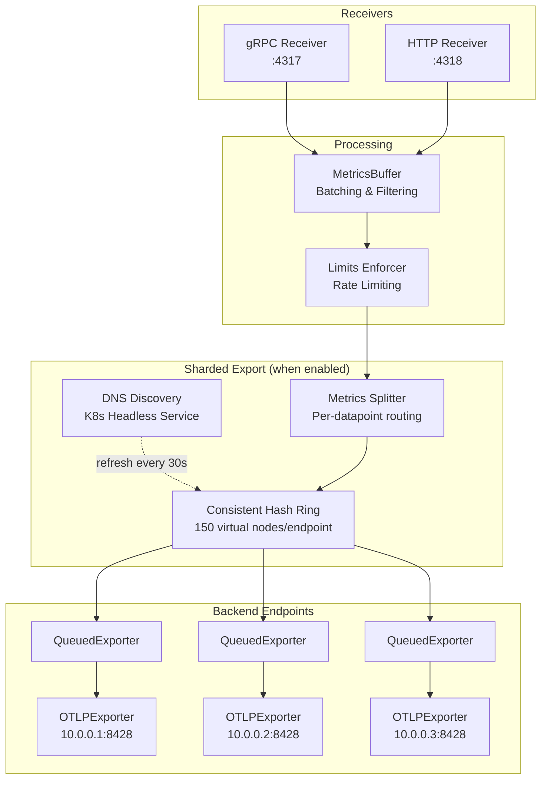

Metrics Governor supports consistent sharding to distribute metrics across multiple backend endpoints. This is useful for horizontal scaling of time-series databases like VictoriaMetrics vminsert.

> **Dual Pipeline Support**: Sharding works identically for both OTLP and PRW pipelines. The only difference is that they are completely separate - use `-sharding-*` flags for OTLP and `-prw-sharding-*` flags for PRW. See [PRW Sharding](/docs/protocols/prw#sharding) for PRW-specific flags.

## Sharding Architecture



## When to Use Sharding

- **Horizontal scaling** - Distribute write load across multiple VictoriaMetrics vminsert or similar backends
- **High throughput** - When a single backend endpoint cannot handle your metrics volume
- **Kubernetes deployments** - Automatically discover backend pods via headless service DNS

## Kubernetes Headless Service Setup

Create a headless service for your backend pods:

```yaml
apiVersion: v1
kind: Service
metadata:
  name: vminsert-headless
  namespace: monitoring
spec:
  clusterIP: None  # Headless service
  selector:
    app: vminsert
  ports:
    - port: 8480
      targetPort: 8480
      name: insert
```

## Configuration

### YAML Configuration

```yaml
exporter:
  endpoint: "victoriametrics:8428"  # Fallback when no DNS results
  protocol: "http"

  sharding:
    enabled: true
    headless_service: "vminsert-headless.monitoring.svc.cluster.local:8480"
    dns_refresh_interval: 30s
    dns_timeout: 5s

    # Labels for shard key (metric name is always included)
    labels:
      - service
      - env

    virtual_nodes: 150           # Virtual nodes per endpoint
    fallback_on_empty: true      # Use static endpoint if DNS empty

  # Queue (optional, applied per-endpoint when sharding enabled)
  queue:
    enabled: true
    path: "/var/lib/metrics-governor/queue"
```

### CLI Flags

```bash
metrics-governor \
  -sharding-enabled \
  -sharding-headless-service "vminsert-headless.monitoring.svc.cluster.local:8480" \
  -sharding-labels "service,env" \
  -sharding-dns-refresh-interval 30s \
  -sharding-virtual-nodes 150 \
  -queue-enabled
```

## How Sharding Works

1. **Endpoint Discovery**: Periodically resolves the headless service DNS to get current pod IPs
2. **Shard Key Construction**: Built from metric name + configured labels (sorted alphabetically)
3. **Consistent Hashing**: Uses a hash ring with virtual nodes for even distribution and minimal reshuffling when endpoints change
4. **Per-Datapoint Routing**: Each datapoint is routed independently to its target endpoint

### Shard Key Example

```
Metric name: http_requests_total
Attributes: {service: "api", env: "prod", method: "GET"}
Configured labels: ["service", "env"]

Shard key: "http_requests_total|env=prod|service=api"
           ↑ metric name      ↑ labels sorted alphabetically
```

All datapoints with the same shard key always go to the same endpoint, ensuring consistent routing for time-series queries.

## Sharding Metrics

When sharding is enabled, additional Prometheus metrics are exposed:

| Metric | Type | Description |
|--------|------|-------------|
| `metrics_governor_sharding_endpoints_total` | gauge | Current number of active endpoints |
| `metrics_governor_sharding_datapoints_total{endpoint}` | counter | Datapoints sent per endpoint |
| `metrics_governor_sharding_export_errors_total{endpoint}` | counter | Export errors per endpoint |
| `metrics_governor_sharding_rehash_total` | counter | Hash ring rehash events |
| `metrics_governor_sharding_dns_refresh_total` | counter | DNS refresh attempts |
| `metrics_governor_sharding_dns_errors_total` | counter | DNS lookup errors |
| `metrics_governor_sharding_dns_latency_seconds` | histogram | DNS lookup latency |
| `metrics_governor_sharding_export_latency_seconds{endpoint}` | histogram | Export latency per endpoint |

## Default Configuration

| Setting | Default | Description |
|---------|---------|-------------|
| `sharding.enabled` | `false` | Sharding disabled by default |
| `sharding.dns_refresh_interval` | `30s` | DNS refresh interval |
| `sharding.dns_timeout` | `5s` | DNS lookup timeout |
| `sharding.virtual_nodes` | `150` | Virtual nodes per endpoint |
| `sharding.fallback_on_empty` | `true` | Use static endpoint if DNS empty |

## Exporter Configuration with Sharding

| Sharding | Queue | Result |
|----------|-------|--------|
| off | off | Single OTLPExporter |
| off | on | QueuedExporter → OTLPExporter |
| on | off | ShardedExporter → multiple OTLPExporters |
| on | on | ShardedExporter → multiple (QueuedExporter → OTLPExporter) |

## CLI Flags Reference

| Flag | Default | Description |
|------|---------|-------------|
| `-sharding-enabled` | `false` | Enable consistent sharding |
| `-sharding-headless-service` | | Kubernetes headless service DNS name with port |
| `-sharding-labels` | | Comma-separated labels for shard key |
| `-sharding-dns-refresh-interval` | `30s` | DNS refresh interval |
| `-sharding-dns-timeout` | `5s` | DNS lookup timeout |
| `-sharding-virtual-nodes` | `150` | Virtual nodes per endpoint |
| `-sharding-fallback-on-empty` | `true` | Use static endpoint if DNS returns empty |
