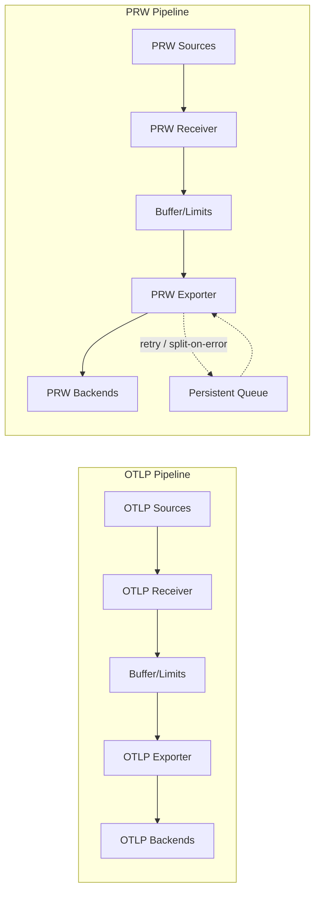

metrics-governor supports Prometheus Remote Write (PRW) protocol as a **separate pipeline** alongside the existing OTLP pipeline.

> **Dual Pipeline Architecture**: All components (receivers, buffers, exporters, limits, sharding, queues) work identically for both OTLP and PRW. They are completely separate pipelines with no cross-protocol conversion.

## Architecture



**Important: No Cross-Protocol Conversion**

- **OTLP → OTLP only**: Metrics received via OTLP are exported via OTLP
- **PRW → PRW only**: Metrics received via PRW are exported via PRW
- There is **no conversion** between OTLP and PRW formats
- Each pipeline is completely independent and can be enabled/disabled separately

This design ensures:
- Zero conversion overhead
- Protocol fidelity (no data loss from format translation)
- Native support for protocol-specific features (e.g., PRW 2.0 native histograms)

## Supported Protocol Versions

### PRW 1.0 (Original)

The original Prometheus remote write format with samples and labels:

- Content-Type: `application/x-protobuf`
- Content-Encoding: `snappy` (required)
- Version header: `X-Prometheus-Remote-Write-Version: 0.1.0`

### PRW 2.0 (Extended)

Extended format with additional features:

- Native histograms
- Exemplars
- Metric metadata
- Zstd compression support
- Version header: `X-Prometheus-Remote-Write-Version: 2.0.0`

## Configuration

### YAML Configuration

```yaml
prw:
  receiver:
    address: ":9090"                 # Empty = disabled
    version: "auto"                  # "1.0", "2.0", or "auto"
    tls:
      enabled: false
      cert_file: ""
      key_file: ""
    auth:
      enabled: false
      bearer_token: ""
    server:
      max_request_body_size: 0       # 0 = unlimited
      read_timeout: "1m"
      write_timeout: "30s"

  exporter:
    endpoint: ""                     # Empty = disabled
    version: "auto"
    timeout: "30s"
    tls:
      enabled: false
      cert_file: ""
      key_file: ""
      ca_file: ""
    auth:
      bearer_token: ""
    victoriametrics:
      enabled: false                 # Enable VM-specific features
      compression: "snappy"          # "snappy" or "zstd"
      use_short_endpoint: false      # Use /write instead of /api/v1/write
      extra_labels:                  # Added to all metrics
        env: "prod"

  buffer:
    size: 10000
    batch_size: 1000
    flush_interval: "5s"

  queue:
    enabled: false
    path: "./prw-queue"              # Persistent disk-backed queue
    max_size: 10000
    max_bytes: 1073741824            # 1GB
    retry_interval: "5s"
    max_retry_delay: "5m"
    backoff_enabled: true            # Exponential backoff for retries
    backoff_multiplier: 2.0          # Delay multiplier on each failure
    circuit_breaker_enabled: true    # Circuit breaker pattern
    circuit_failure_threshold: 10    # Failures before opening circuit
    circuit_reset_timeout: "30s"     # Time before half-open state
```

### CLI Flags

#### PRW Receiver

| Flag | Default | Description |
|------|---------|-------------|
| `-prw-listen` | | PRW receiver address (empty = disabled) |
| `-prw-receiver-version` | `auto` | Protocol version: "1.0", "2.0", or "auto" |
| `-prw-receiver-tls-enabled` | `false` | Enable TLS for PRW receiver |
| `-prw-receiver-tls-cert` | | Certificate file path |
| `-prw-receiver-tls-key` | | Private key file path |
| `-prw-receiver-auth-enabled` | `false` | Enable authentication |
| `-prw-receiver-auth-bearer-token` | | Expected bearer token |

#### PRW Exporter

| Flag | Default | Description |
|------|---------|-------------|
| `-prw-exporter-endpoint` | | PRW backend URL (empty = disabled) |
| `-prw-exporter-version` | `auto` | Protocol version: "1.0", "2.0", or "auto" |
| `-prw-exporter-timeout` | `30s` | Request timeout |
| `-prw-exporter-tls-enabled` | `false` | Enable TLS |
| `-prw-exporter-tls-cert` | | Client certificate (mTLS) |
| `-prw-exporter-tls-key` | | Client key (mTLS) |
| `-prw-exporter-tls-ca` | | CA certificate |
| `-prw-exporter-auth-bearer-token` | | Bearer token for auth |
| `-prw-exporter-vm-mode` | `false` | Enable VictoriaMetrics mode |
| `-prw-exporter-vm-compression` | `snappy` | Compression: "snappy" or "zstd" |

#### PRW Buffer

| Flag | Default | Description |
|------|---------|-------------|
| `-prw-buffer-size` | `10000` | Maximum requests in buffer |
| `-prw-flush-interval` | `5s` | Flush interval |
| `-prw-batch-size` | `1000` | Batch size for export |

#### PRW Queue

| Flag | Default | Description |
|------|---------|-------------|
| `-prw-queue-enabled` | `false` | Enable persistent retry queue |
| `-prw-queue-path` | `./prw-queue` | Queue directory (disk-backed) |
| `-prw-queue-max-size` | `10000` | Max queue entries |
| `-prw-queue-max-bytes` | `1073741824` | Max queue size in bytes (1GB) |
| `-prw-queue-retry-interval` | `5s` | Initial retry interval |
| `-prw-queue-max-retry-delay` | `5m` | Maximum retry backoff delay |
| `-prw-queue-backoff-enabled` | `true` | Enable exponential backoff |
| `-prw-queue-backoff-multiplier` | `2.0` | Backoff delay multiplier |
| `-prw-queue-circuit-breaker-enabled` | `true` | Enable circuit breaker |
| `-prw-queue-circuit-breaker-threshold` | `10` | Failures before opening circuit |
| `-prw-queue-circuit-breaker-reset-timeout` | `30s` | Time before half-open state |

## Endpoints

The PRW receiver exposes two endpoints:

- `POST /api/v1/write` - Standard Prometheus remote write endpoint
- `POST /write` - VictoriaMetrics shorthand endpoint

Both endpoints accept the same request format.

## Request Format

### Headers

| Header | Required | Description |
|--------|----------|-------------|
| `Content-Type` | Yes | Must be `application/x-protobuf` |
| `Content-Encoding` | Yes | `snappy` (required) or `zstd` (PRW 2.0 optional) |
| `X-Prometheus-Remote-Write-Version` | No | Protocol version hint |

### Response

- `204 No Content` - Success
- `400 Bad Request` - Invalid request (non-retryable)
- `5xx Server Error` - Retryable error

### Response Headers

| Header | Description |
|--------|-------------|
| `X-Prometheus-Remote-Write-Samples-Written` | Number of samples written |
| `X-Prometheus-Remote-Write-Histograms-Written` | Number of histograms written |
| `X-Prometheus-Remote-Write-Exemplars-Written` | Number of exemplars written |

## VictoriaMetrics Compatibility

Enable VictoriaMetrics mode for better compatibility with VictoriaMetrics:

```yaml
prw:
  exporter:
    endpoint: "http://victoriametrics:8428"
    victoriametrics:
      enabled: true
      compression: "zstd"          # Better compression than snappy
      use_short_endpoint: true     # Use /write
      extra_labels:
        cluster: "prod"
```

CLI equivalent:

```bash
metrics-governor \
  -prw-listen :9090 \
  -prw-exporter-endpoint http://victoriametrics:8428 \
  -prw-exporter-vm-mode \
  -prw-exporter-vm-compression zstd
```

## Usage Examples

### Basic PRW Proxy

Forward PRW metrics to a compatible backend:

```bash
metrics-governor \
  -prw-listen :9090 \
  -prw-exporter-endpoint http://prometheus:9090/api/v1/write
```

### PRW to VictoriaMetrics

Forward PRW metrics to VictoriaMetrics with zstd compression:

```bash
metrics-governor \
  -prw-listen :9090 \
  -prw-exporter-endpoint http://vmsingle:8428 \
  -prw-exporter-vm-mode \
  -prw-exporter-vm-compression zstd
```

### Prometheus Sender Configuration

Configure Prometheus to send to metrics-governor:

```yaml
# prometheus.yml
remote_write:
  - url: "http://metrics-governor:9090/api/v1/write"
    remote_timeout: 30s
    queue_config:
      capacity: 10000
      max_samples_per_send: 5000
```

### Dual Pipeline (OTLP + PRW)

Run both OTLP and PRW pipelines:

```bash
metrics-governor \
  -grpc-listen :4317 \
  -http-listen :4318 \
  -exporter-endpoint otel-collector:4317 \
  -prw-listen :9090 \
  -prw-exporter-endpoint http://victoriametrics:8428
```

## Compression

The PRW pipeline supports two compression algorithms:

| Algorithm | PRW 1.0 | PRW 2.0 | Description |
|-----------|---------|---------|-------------|
| Snappy | Required | Required | Default, fast compression |
| Zstd | N/A | Optional | Better compression ratio |

The receiver auto-detects compression based on the `Content-Encoding` header.

## Retry Behavior

When the exporter encounters errors:

- **4xx Client Errors**: Not retried, logged as error
- **HTTP 413 / "too big" errors**: Automatically split and retried (split-on-error)
- **5xx Server Errors**: Queued for retry with exponential backoff
- **Network Errors**: Queued for retry

### Persistent Disk Queue

The PRW queue uses the same high-performance disk-backed `SendQueue` as the OTLP pipeline, providing identical resilience:

- **Persistent storage** — queued entries survive process restarts
- **Circuit breaker** — stops retries when backend is consistently failing
- **Exponential backoff** — configurable delay multiplier with max delay cap
- **Split-on-error** — oversized batches are automatically split at the Timeseries level

Enable the retry queue for persistent retry storage:

```bash
-prw-queue-enabled \
-prw-queue-path /var/lib/metrics-governor/prw-queue \
-prw-queue-backoff-enabled \
-prw-queue-circuit-breaker-enabled
```

### Split-on-Error

When a backend returns HTTP 413 (Request Entity Too Large) or HTTP 400 with "too big"/"too large"/"exceeding" in the response body, the PRW queue automatically:

1. Splits the batch in half at the Timeseries level
2. Re-queues both halves for retry
3. Metadata is copied to both halves

This works with backends like VictoriaMetrics, Thanos, Mimir, and Cortex that enforce request size limits. See [resilience.md](/docs/operations/resilience) for details.

## Sharding

PRW supports consistent sharding to distribute metrics across multiple backends, using the same architecture as OTLP sharding.

### YAML Configuration

```yaml
prw:
  exporter:
    endpoint: "victoriametrics:8428"  # Fallback when no DNS results

    sharding:
      enabled: true
      headless_service: "vminsert-headless.monitoring.svc.cluster.local:8480"
      dns_refresh_interval: 30s
      dns_timeout: 5s

      # Labels for shard key (metric name is always included)
      labels:
        - service
        - env

      virtual_nodes: 150
      fallback_on_empty: true

    queue:
      enabled: true
      path: "/var/lib/metrics-governor/prw-queue"
```

### CLI Flags

```bash
metrics-governor \
  -prw-listen :9090 \
  -prw-sharding-enabled \
  -prw-sharding-headless-service "vminsert-headless.monitoring.svc.cluster.local:8480" \
  -prw-sharding-labels "service,env" \
  -prw-queue-enabled
```

### Shard Key Construction

The shard key is built from metric name + configured labels (sorted alphabetically):

```
Metric name: http_requests_total
Labels: {service: "api", env: "prod", method: "GET"}
Configured labels: ["service", "env"]

Shard key: "http_requests_total|env=prod|service=api"
           ↑ metric name      ↑ labels sorted alphabetically
```

All timeseries with the same shard key always route to the same endpoint, ensuring consistent routing for queries.

## Statistics

PRW pipeline metrics are exposed at the stats endpoint (`/metrics`):

| Metric | Type | Description |
|--------|------|-------------|
| `metrics_governor_prw_datapoints_received_total` | counter | Total PRW datapoints received |
| `metrics_governor_prw_timeseries_received_total` | counter | Total PRW timeseries received |
| `metrics_governor_prw_datapoints_sent_total` | counter | Total PRW datapoints sent to backend |
| `metrics_governor_prw_timeseries_sent_total` | counter | Total PRW timeseries sent to backend |
| `metrics_governor_prw_batches_sent_total` | counter | Total PRW batches exported |
| `metrics_governor_prw_export_errors_total` | counter | Total PRW export errors |
| `metrics_governor_prw_retry_total` | counter | Total PRW retry attempts |
| `metrics_governor_prw_retry_success_total` | counter | Successful PRW retries |
| `metrics_governor_prw_retry_failure_total` | counter | Failed PRW retries (by error type) |

### Example PromQL Queries

```promql
# PRW datapoints per second
rate(metrics_governor_prw_datapoints_received_total[5m])

# PRW export success rate
rate(metrics_governor_prw_batches_sent_total[5m]) /
(rate(metrics_governor_prw_batches_sent_total[5m]) + rate(metrics_governor_prw_export_errors_total[5m]))

# PRW timeseries throughput
rate(metrics_governor_prw_timeseries_sent_total[1m])
```

## Grafana Dashboard

A pre-built Grafana dashboard is available in `dashboards/operations.json` with a dedicated **PRW Throughput** section showing:

- PRW Datapoints Rate (received vs sent)
- PRW Timeseries & Batches
- Export errors

See [dashboards/README.md](https://github.com/szibis/metrics-governor/blob/main/dashboards/README.md) for installation instructions.
